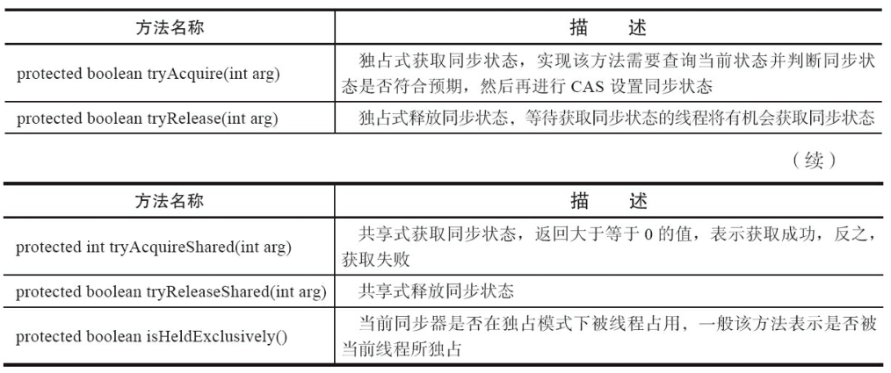

# 概览

## concurrent包的结构层次


* 子包主要包含:atomic和lock分别是原子类和锁,外部的是一些阻塞队列和Executors等。


# lock

* lock用来控制多个线程访问共享资源的方式，一个锁能够防止多个线程同时访问共享资源，没有lock接口之前主要靠synchronized关键字实现锁功能。

```java
Lock lock = new ReentrantLock();
lock.lock();
try{
	.......
}finally{
	lock.unlock();
}
```

* Lock API
  * lock:获取锁
  * lockInterruptibly:获取锁除非当前线程中断
  * tryLock:尝试获取锁
  * tryLock(long time,TimeUnit unit):尝试获取锁，存在超时时间
  * unlock:解锁
  * newCondition:获取与lock绑定的等待通知组件，当前线程必须获得了锁才能进行等待，进行等待时会先释放锁，当再次获取锁时才能从等待中返回
* ReentrantLock实现Lock接口，**基本上所有的方法的实现实际上都是调用了其静态内存类`Sync`中的方法，而Sync类继承了`AbstractQueuedSynchronizer（AQS）`**。可以看出要想理解ReentrantLock关键核心在于对队列同步器AbstractQueuedSynchronizer（简称同步器）的理解。

## AQS

* 同步器是用来构建锁和其他同步组件的基础框架，它的实现主要依赖一个int成员变量来表示同步状态以及通过一个FIFO队列构成等待队列。它的**子类必须重写AQS的几个protected修饰的用来改变同步状态的方法**，其他方法主要是实现了排队和阻塞机制。**状态的更新使用getState,setState以及compareAndSetState这三个方法**。
* 子类被**推荐定义为自定义同步组件的静态内部类**，同步器自身没有实现任何同步接口，它仅仅是定义了若干同步状态的获取和释放方法来供自定义同步组件的使用，同步器既支持独占式获取同步状态，也可以支持共享式获取同步状态，这样就可以方便的实现不同类型的同步组件。
* 同步器是实现锁（也可以是任意同步组件）的关键，在锁的实现中聚合同步器，利用同步器实现锁的语义。可以这样理解二者的关系：**锁是面向使用者，它定义了使用者与锁交互的接口，隐藏了实现细节；同步器是面向锁的实现者，它简化了锁的实现方式，屏蔽了同步状态的管理，线程的排队，等待和唤醒等底层操作**。锁和同步器很好的隔离了使用者和实现者所需关注的领域。

```java
 public final void acquire(int arg) {
        if (!tryAcquire(arg) &&
            acquireQueued(addWaiter(Node.EXCLUSIVE), arg))
            selfInterrupt();
 }
```

* 会调用tryAcquire方法，而此时当继承AQS的NonfairSync调用模板方法acquire时就会调用已经被NonfairSync重写的tryAcquire方法。这就是使用AQS的方式，在弄懂这点后会lock的实现理解有很大的提升。可以归纳总结为这么几点：
  * 同步组件（这里不仅仅值锁，还包括CountDownLatch等）的实现依赖于同步器AQS，在同步组件实现中，使用AQS的方式被推荐定义继承AQS的静态内存类；
  * AQS采用模板方法进行设计，AQS的protected修饰的方法需要由继承AQS的子类进行重写实现，当调用AQS的子类的方法时就会调用被重写的方法；
  * AQS负责同步状态的管理，线程的排队，等待和唤醒这些底层操作，而Lock等同步组件主要专注于实现同步语义；
  * 在重写AQS的方式时，使用AQS提供的`getState(),setState(),compareAndSetState()`方法进行修改同步状态



* AQS提供的模板方法可以分为3类：
  * 独占式获取与释放同步状态；
  * 共享式获取与释放同步状态；
  * 查询同步队列中等待线程情况；

```java
public class MutextDemo {
    private static Mutex mutex = new Mutex();

    public static void main(String[] args) {
        for (int i = 0; i < 10; i++) {
            Thread thread = new Thread(() -> {
                mutex.lock();
                try {
                    Thread.sleep(3000);
                } catch (InterruptedException e) {
                    e.printStackTrace();
                } finally {
                    mutex.unlock();
                }
            });
            thread.start();
        }
    }
}
```

* **同步组件实现者的角度：**
  * 通过可重写的方法：**独占式**： tryAcquire()(独占式获取同步状态），tryRelease()（独占式释放同步状态）；**共享式** ：tryAcquireShared()(共享式获取同步状态)，tryReleaseShared()(共享式释放同步状态)；**告诉AQS怎样判断当前同步状态是否成功获取或者是否成功释放**。同步组件专注于对当前同步状态的逻辑判断，从而实现自己的同步语义。这句话比较抽象，举例来说，上面的Mutex例子中通过tryAcquire方法实现自己的同步语义，在该方法中如果当前同步状态为0（即该同步组件没被任何线程获取），当前线程可以获取同时将状态更改为1返回true，否则，该组件已经被线程占用返回false。很显然，该同步组件只能在同一时刻被线程占用，Mutex专注于获取释放的逻辑来实现自己想要表达的同步语义。
* **AQS的角度**
  * 而对AQS来说，只需要同步组件返回的true和false即可，因为AQS会对true和false会有不同的操作，true会认为当前线程获取同步组件成功直接返回，而false的话就AQS也会将当前线程插入同步队列等一系列的方法。

## **ReentrantLock**

* ReentrantLock重入锁，是实现Lock接口的一个类，**支持重入性，表示能够对共享资源能够重复加锁，即当前线程获取该锁再次获取不会被阻塞**。在java关键字synchronized隐式支持重入性synchronized通过获取自增，释放自减的方式实现重入。与此同时，ReentrantLock还支持**公平锁和非公平锁**两种方式。

### 重入性的实现原理

* 想获取重入性就需要1.在线程获取锁的时候，如果已经获取锁的线程是当前线程的话则执行再次获取成功。2.由于锁会被获取n次，那么只有锁在被释放同样的n次之后，该锁才算是完全释放成功。

```java
// 获取锁 可重入 
final boolean nonfairTryAcquire(int acquires) {
            final Thread current = Thread.currentThread();
            int c = getState();
           // 没有占用锁的线程
            if (c == 0) {
                if (compareAndSetState(0, acquires)) {
                    setExclusiveOwnerThread(current);
                    return true;
                }
            }
           // 如果是当前线程
            else if (current == getExclusiveOwnerThread()) {
              // state++
                int nextc = c + acquires;
                if (nextc < 0) // overflow
                    throw new Error("Maximum lock count exceeded");
                setState(nextc);
                return true;
            }
            return false;
        }
// 释放锁
 protected final boolean tryRelease(int releases) {
            int c = getState() - releases;
            if (Thread.currentThread() != getExclusiveOwnerThread())
                throw new IllegalMonitorStateException();
            boolean free = false;
            if (c == 0) {
                free = true;
                setExclusiveOwnerThread(null);
            }
  				 // 修改状态
            setState(c);
            return free;
        }
```

### 公平锁和非公平锁

* **公平锁**和**非公平锁**。**何谓公平性，是针对获取锁而言的，如果一个锁是公平的，那么锁的获取顺序就应该符合请求上的绝对时间顺序，满足FIFO**。

```java
// 公平锁获取
protected final boolean tryAcquire(int acquires) {
    final Thread current = Thread.currentThread();
    int c = getState();
    if (c == 0) {
      // 需要考虑队列 查询是否有任何线程等待获取的时间比当前线程长。
        if (!hasQueuedPredecessors() &&
            compareAndSetState(0, acquires)) {
            setExclusiveOwnerThread(current);
            return true;
        }
    }
    else if (current == getExclusiveOwnerThread()) {
        int nextc = c + acquires;
        if (nextc < 0)
            throw new Error("Maximum lock count exceeded");
        setState(nextc);
        return true;
    }
    return false;
  }
}
   public final boolean hasQueuedPredecessors() {
        // The correctness of this depends on head being initialized
        // before tail and on head.next being accurate if the current
        // thread is first in queue.
        Node t = tail; // Read fields in reverse initialization order
        Node h = head;
        Node s;
     		// 判断队列是否为空。
        return h != t &&
            ((s = h.next) == null || s.thread != Thread.currentThread());
    }
// 非公平锁
final boolean nonfairTryAcquire(int acquires) {
            final Thread current = Thread.currentThread();
            int c = getState();
            if (c == 0) {
                if (compareAndSetState(0, acquires)) {
                    setExclusiveOwnerThread(current);
                    return true;
                }
            }
            else if (current == getExclusiveOwnerThread()) {
                int nextc = c + acquires;
                if (nextc < 0) // overflow
                    throw new Error("Maximum lock count exceeded");
                setState(nextc);
                return true;
            }
            return false;
        }
```

> **公平锁 VS 非公平锁**

1. 公平锁每次获取到锁为同步队列中的第一个节点，**保证请求资源时间上的绝对顺序**，而非公平锁有可能刚释放锁的线程下次继续获取该锁，则有可能导致其他线程永远无法获取到锁，**造成“饥饿”现象**。
2. 公平锁为了保证时间上的绝对顺序，需要频繁的上下文切换，而非公平锁会降低一定的上下文切换，降低性能开销。因此，ReentrantLock默认选择的是非公平锁，则是为了减少一部分上下文切换，**保证了系统更大的吞吐量**。

## **ReentrantReadWriteLock**

* **读写所允许同一时刻被多个读线程访问，但是在写线程访问时，所有的读线程和其他的写线程都会被阻塞**。

1. **公平性选择**：支持非公平性（默认）和公平的锁获取方式，吞吐量还是非公平优于公平；
2. **重入性**：支持重入，读锁获取后能再次获取，写锁获取之后能够再次获取写锁，同时也能够获取读锁；
3. **锁降级**：遵循获取写锁，获取读锁再释放写锁的次序，写锁能够降级成为读锁

### 写锁

#### 写锁的获取

```java
protected final boolean tryAcquire(int acquires) {
    /*
     * Walkthrough:
     * 1. If read count nonzero or write count nonzero
     *    and owner is a different thread, fail.
     * 2. If count would saturate, fail. (This can only
     *    happen if count is already nonzero.)
     * 3. Otherwise, this thread is eligible for lock if
     *    it is either a reentrant acquire or
     *    queue policy allows it. If so, update state
     *    and set owner.
     */
    Thread current = Thread.currentThread();
	// 1. 获取写锁当前的同步状态
    int c = getState();
	// 2. 获取写锁获取的次数
    int w = exclusiveCount(c);
    if (c != 0) {
        // (Note: if c != 0 and w == 0 then shared count != 0)
		// 3.1 当读锁已被读线程获取或者当前线程不是已经获取写锁的线程的话
		// 当前线程获取写锁失败
        if (w == 0 || current != getExclusiveOwnerThread())
            return false;
        if (w + exclusiveCount(acquires) > MAX_COUNT)
            throw new Error("Maximum lock count exceeded");
        // Reentrant acquire
		// 3.2 当前线程获取写锁，支持可重复加锁
        setState(c + acquires);
        return true;
    }
	// 3.3 写锁未被任何线程获取，当前线程可获取写锁
    if (writerShouldBlock() ||
        !compareAndSetState(c, c + acquires))
        return false;
    setExclusiveOwnerThread(current);
    return true;
}
```

