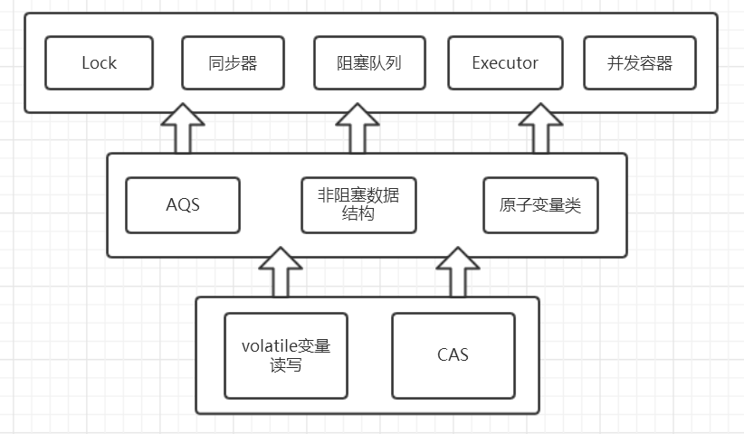

# 概览

## concurrent包的结构层次


* 子包主要包含:atomic和lock分别是原子类和锁,外部的是一些阻塞队列和Executors等。



# lock

* lock用来控制多个线程访问共享资源的方式，一个锁能够防止多个线程同时访问共享资源，没有lock接口之前主要靠synchronized关键字实现锁功能。

```java
Lock lock = new ReentrantLock();
lock.lock();
try{
	.......
}finally{
	lock.unlock();
}
```

* Lock API
  * lock:获取锁
  * lockInterruptibly:获取锁除非当前线程中断
  * tryLock:尝试获取锁
  * tryLock(long time,TimeUnit unit):尝试获取锁，存在超时时间
  * unlock:解锁
  * newCondition:获取与lock绑定的等待通知组件，当前线程必须获得了锁才能进行等待，进行等待时会先释放锁，当再次获取锁时才能从等待中返回
* ReentrantLock实现Lock接口，**基本上所有的方法的实现实际上都是调用了其静态内存类`Sync`中的方法，而Sync类继承了`AbstractQueuedSynchronizer（AQS）`**。可以看出要想理解ReentrantLock关键核心在于对队列同步器AbstractQueuedSynchronizer（简称同步器）的理解。

## AQS

* 同步器是用来构建锁和其他同步组件的基础框架，它的实现主要依赖一个int成员变量来表示同步状态以及通过一个FIFO队列构成等待队列。它的**子类必须重写AQS的几个protected修饰的用来改变同步状态的方法**，其他方法主要是实现了排队和阻塞机制。**状态的更新使用getState,setState以及compareAndSetState这三个方法**。
* 子类被**推荐定义为自定义同步组件的静态内部类**，同步器自身没有实现任何同步接口，它仅仅是定义了若干同步状态的获取和释放方法来供自定义同步组件的使用，同步器既支持独占式获取同步状态，也可以支持共享式获取同步状态，这样就可以方便的实现不同类型的同步组件。
* 同步器是实现锁（也可以是任意同步组件）的关键，在锁的实现中聚合同步器，利用同步器实现锁的语义。可以这样理解二者的关系：**锁是面向使用者，它定义了使用者与锁交互的接口，隐藏了实现细节；同步器是面向锁的实现者，它简化了锁的实现方式，屏蔽了同步状态的管理，线程的排队，等待和唤醒等底层操作**。锁和同步器很好的隔离了使用者和实现者所需关注的领域。

