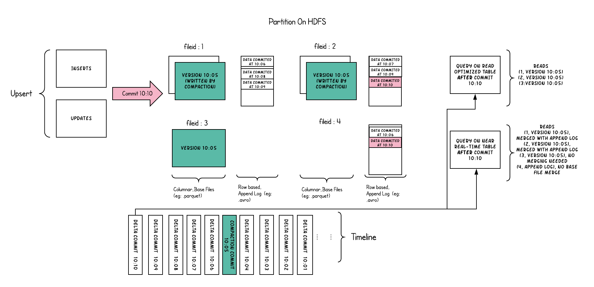

>这一章节简单讲解下hudi的table type，并且从它支持的query table和对应table的存储细节来讲解，后续也会带一些核心代码类的描述，感兴趣的可以从这些类出发进一步学习hudi table type。

# Doc

## Query Table

| Table Type    | Supported Query types                                        |
| ------------- | ------------------------------------------------------------ |
| Copy On Write | Snapshot Queries + Incremental Queries                       |
| Merge On Read | Snapshot Queries + Incremental Queries + Read Optimized Queries |

* Snapshot Queries: COW表表示查询底层全部的commit/compaction的base file文件，MOR表表示查询期间合并已经commit/compaction的底层Base File和Delta Log File。
* Incremental Queries:支持从指定instant time(commit time)开始读取数据,增量的读取commit/compaction action的文件
* Read Optimized Queries: 对于MOR表本质是只读取已经commit/compaction的base file

| Trade-off     | Snapshot                                                     | Read Optimized                               |
| ------------- | ------------------------------------------------------------ | -------------------------------------------- |
| Data Latency  | Lower                                                        | Higher                                       |
| Query Latency | Higher (merge base / columnar file + row based delta / log files) | Lower (raw base / columnar file performance) |

## Table Type

* Copy On Write:使用专用的列式文件格式存储数据如parquet，通过在写入期间执行同步合并，更新简单的版本和重写文件。
* Merge On Read:使用列式文件和增量日志组合存储数据，更新被记录到增量文件中，然后进行压缩，以同步或异步地生成新版本的列式文件。

| Trade-off           | CopyOnWrite                     | MergeOnRead                              |
| ------------------- | ------------------------------- | ---------------------------------------- |
| Data Latency        | Higher                          | Lower                                    |
| Query Latency       | Lower                           | Higher                                   |
| Update cost (I/O)   | Higher (rewrite entire parquet) | Lower (append to delta log)              |
| Parquet File Size   | Smaller (high update(I/0) cost) | Larger (low update cost)                 |
| Write Amplification | Higher                          | Lower (depending on compaction strategy) |

### Copy On Write Table


* COW表中的File Slices仅包含base file，每个提交都会生成一个新版本的base file。换句话说，我们隐式地对每个提交进行压缩，这样就只存在base file。因此，写入放大(为1字节传入数据写入的字节数)要高得多，而读取放大为零。
* 在写入数据时，对现有file group的更新会为该file group生成一个带有commit instant time的新file slice(类似一个新的file版本),而插入操作会新分配一个file group并且会创建一个新的file slice。这些file slices和对应的提交时间用上图的颜色和version来标识。对这样一个表运行的SQL查询(例如:select count(*)统计该分区中的记录总数)，首先检查timeline并找到最近提交的文件，并过滤每个file group中除最近提交的file slice外的所有file slice（过滤旧版本数据）。如上图所见旧的查询不会看到当前state为inflight的粉色文件，但是在它提交后新的查询可以立刻查询到。因此，查询不会发生任何写失败/部分写操作，只在已提交的数据上运行。
* copy on write表的特性
  * 支持在文件级自动更新数据，而不是重写整个表/分区
  * 能够增量消费变化数据，而不是全量的扫描或者通过特定过滤。
  * 严格控制文件大小以保持良好的查询性能(小文件会大大损害查询性能)。


### Merge On Read Table



* mor表是cow表的一个超集，从这个意义上说，它仍然通过只在最新的file slice中提供base file来支持表的**read optimized queries** 。因外它将每个file group传入的upsert操作存储在一个基于行的delta log中，在**snapshot queries**下动态合并base file和一些delta log,在查询期间动态更改每个文件id的最新版本。因此，这种表类型试图智能地平衡读和写放大，以提供接近实时的数据。这里最重要的变化是压缩器，它现在仔细地选择需要将哪些delta log文件压缩到它们的base file中，以保持查询性能处于正常状态(较大的delta log文件在查询端合并数据时将花费更长的合并时间)。
* merge on read表特性
  * 支持每个一分钟左右提交一次数据，达到近实时能力。
  * 在每个file id group中，现在有一个delta log文件，用于保存对base file中的记录的传入更新。在本例中，delta log文件保存10:05到10:10之间的所有数据。与以前一样，提交时仍然对base file进行了版本控制。因此，如果只看base file，那么表布局看起来就像copy on write。
    定期的压缩过程将协调delta log中的这些更改，并生成新版本的base file，就像示例中10:05所发生的那样。
  * 定期的压缩将delta log file合并成对应的base file，就像示例中10:05所发生的那样。
  * 支持Read Optimized query和Snapshot query,取决于想要数据查询性能还是数据时效性。
  * 对于Read Optimized query何时可以查询已经commit的数据发生了变化，它只能读取compaction/commit后的base file。注意，这样的查询在10:10运行，不会看到10:05之后的数据，而Snapshot query总是看到最新的数据。
  * 当我们触发compaction和去区分压缩那些key是一个困难的问题。通过实现压缩策略，与旧分区相比，我们积极地紧凑了最新分区的地方，我们可以确保以一致的方式看到Read Optimized query在X分钟内发布的数据。

# Code

## Hudi Table Type

### HoodieTable

* 所有HoodieTable的基础类，其子类包含Spark\Flink\Java Cow和Mor表。根据对应配置初始化metaclient、metadata表、根据不同计算引擎和配置创建index等能力。
* 封装通用的insert/upsert/bulkinsert/delete/deletePartitions/upsertPrepped/insertPrepped/bulkInsertPrepped/insertOverwrite/insertOverwriteTable等操作。
* 不同引擎实现的能力也不一致，本质上为一个个的executor，底层去执行对应的操作。

## Hudi Query Type

### DefaultSource

* 根据不同的QUERY_TYPE和对应的Table Type解析不同的base file、delta file
* 核心数据处理逻辑

```scala
 if (metaClient.getCommitsTimeline.filterCompletedInstants.countInstants() == 0) {
      new EmptyRelation(sqlContext, metaClient)
    } else {
      (tableType, queryType, isBootstrappedTable) match {
        case (COPY_ON_WRITE, QUERY_TYPE_SNAPSHOT_OPT_VAL, false) |
             (COPY_ON_WRITE, QUERY_TYPE_READ_OPTIMIZED_OPT_VAL, false) |
             (MERGE_ON_READ, QUERY_TYPE_READ_OPTIMIZED_OPT_VAL, false) =>
          resolveBaseFileOnlyRelation(sqlContext, globPaths, userSchema, metaClient, parameters)
        case (COPY_ON_WRITE, QUERY_TYPE_INCREMENTAL_OPT_VAL, _) =>
          new IncrementalRelation(sqlContext, parameters, userSchema, metaClient)

        case (MERGE_ON_READ, QUERY_TYPE_SNAPSHOT_OPT_VAL, false) =>
          new MergeOnReadSnapshotRelation(sqlContext, parameters, userSchema, globPaths, metaClient)

        case (MERGE_ON_READ, QUERY_TYPE_INCREMENTAL_OPT_VAL, _) =>
          new MergeOnReadIncrementalRelation(sqlContext, parameters, userSchema, metaClient)

        case (_, _, true) =>
          new HoodieBootstrapRelation(sqlContext, userSchema, globPaths, metaClient, parameters)

        case (_, _, _) =>
          throw new HoodieException(s"Invalid query type : $queryType for tableType: $tableType," +
            s"isBootstrappedTable: $isBootstrappedTable ")
      }
    }
  }
```

* 想了解读取具体细节，查看对应Relation类即可。