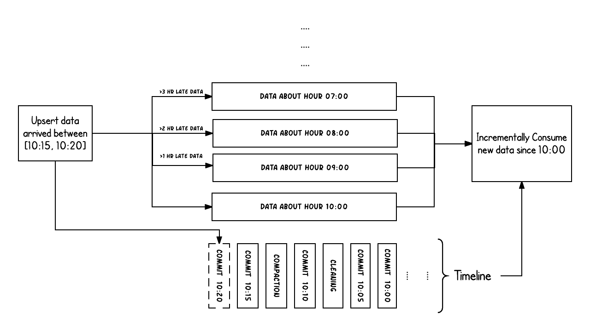
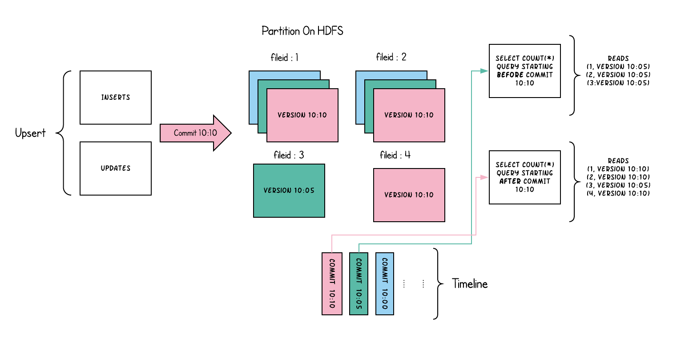
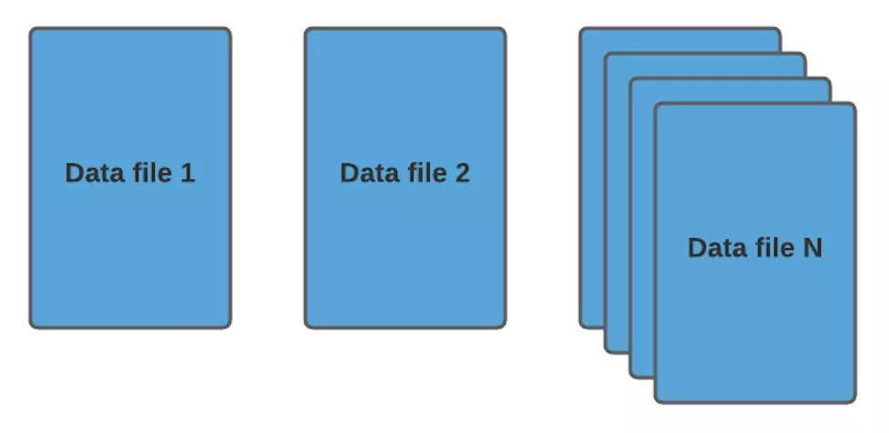
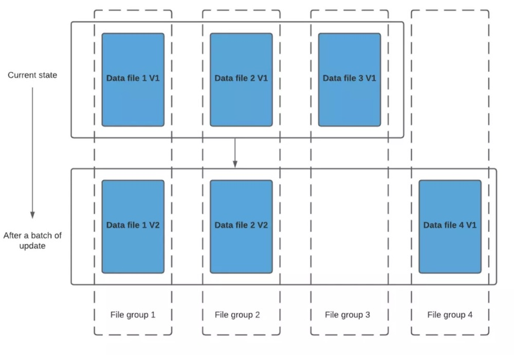
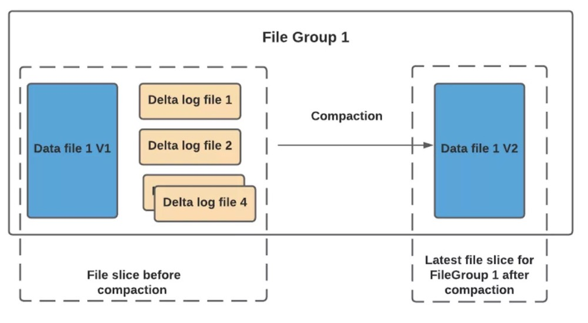

# 对比传统数据湖

* 传统数据湖方案通过Hive来完成`T+1`级别的数据仓库，海量数据存储在HDFS上，通过Hive的元数据管理及SQL化查询来完成数据分析。

## 传统数据湖存在的问题

### 不支持事务

* 不支持事务导致下游任务可能会`读取到未写完的数据`造成数据统计错误。为了规避该问题，通常`控制读写任务顺序调用`，在保证写任务完成后才能启动读任务。但并不是所有读任务都能够被调度系统约束住，在读取时仍存在该问题。

### 数据更新效率低

* 还有很多状态类数据表需要更新操作（例如：账户余额表，客户状态表，设备状态表等），而传统大数据方案无法满足增量更新，常采用拉链方式，先进行join操作再进行insert overwrite操作，通过覆盖写的方式完成更新操作，该操作往往需要T+1的批处理模式 ，从而导致端到端数据时延T+1，存在效率低、成本高等问题。

### 无法及时应对业务表变化

* 上游业务系统对数据schema发生变更后，会导致数据无法入湖，需要数据湖的表schema进行同步调整。从技术实现上采用数据表重建的方式来满足该场景，导致数据湖的数据表的管理与维护方案复杂，实现成本高。另外该种场景通常需要业务部门与数据团队相配合，通过管理流程来实现表结构的同步。

### 历史快照表数据冗余

* 传统数据湖方案需要对历史的快照表进行存储，采用全量历史存储的方式实现，例如：天级历史快照表，每天都会全量存储全表数据。这样就造成了大量的数据存储冗余，占用大量的存储资源。

### 小批量增量数据处理成本高

* 传统数据湖为了实现增量ETL，通常将`增量数据按照分区的方式进行存储`，若为了实现T+0的数据处理，增量数据需要按照小时级或者分钟级的分区粒度。该种实现形式会导致小文件问题，大量分区也会导致元数据服务(namenode)压力增大。

# Hudi概览

* Hudi(hadoop update delete increment)通过hadoop提供流式处理能力
  * Update/Delete操作记录
  * change流能力

## 支持的能力

* 支持ACID
  * 支持`Snapshot`数据隔离，保证数据读取完整性，实现读写并发能力
  * 数据commit，数据入湖秒级可见
* 快速Upsert能力
  * 支持`可插拔索引机制`实现新增更新数据快速入湖
  * 扩展Merge操作，实现新增、更新、删除混合数据同时入湖
  * 支持写入同步小文件合并能力，写入数据自动按照预设文件大小进行文件合并(clustering service)
* Schema Evolution
  * 支持湖内数据schema的同步演进
  * 支持多种常见schema变更操作
* 多种视图读取接口
  * 支持实时快照数据读取方式
  * 支持历史快照数据读取方式
  * 支持当前增量和历史增量数据读取方式
  * 支持快速数据分析
* 多版本
  * 数据按照提交版本存储，保留历史操作记录，方便数据回溯
  * 数据回退操作简单，速度快

## Timeline

* 在其核心，Hudi维护了在不同时刻对表执行的所有操作的时间轴，这有助于提供表的`瞬时视图`，同时也有效地支持按到达顺序检索数据。一个Hudi instant由以下组件组成
  * `Instant action` : 表中执行的动作类型
  * `Instant time` :瞬时时间通常是一个时间戳(例如:20190117010349)，它按动作开始时间的顺序单调增加。
  * `state` :瞬时的当前状态
  
* 主要操作包括以下：
  * `COMMIT`:将一批记录`原子`方式写入库
  * `CLEANS`:删除表中不再需要的`旧版本文件`的后台线程。
  * `DELTA_COMMIT`:`增量提交`指的是将一批记录原子写入`MergeOnRead`类型的表中，其中一些/所有的数据可以只写入增量日志。
  * `COMPACTION`:后台进行`COMPACTION`操作合并数据，例如基于log文件移动修改的行列格式等
  * `ROLLBACK`:表示提交/增量提交不成功并回滚，删除在此期间产生的任何部分文件
  * `SAVEPOINT`:将某些文件组标记为“已保存”，以便清洁器不会删除它们。在灾难/数据恢复方案的情况下，它有助于将表恢复到时间轴上的点。
  * `CLUSTERING`:clustering操作将hudi底层数据文件重新分布，防止小文件问题。
  
* 任何给定的瞬间都可能处于以下状态之一:
  * `REQUESTED`:表示已安排的操作，但尚未启动,在`.hoodie`目录下是个空文件
  * `INFLIGHT`:表示当前正在执行操作，文件格式和commit中一致
  
  * `COMPLETED`:表示执行完成的操作
  
  ```json
  {
    // 分区和写入的状态
    "partitionToWriteStats" : {
      "1" : [ {
        "fileId" : "be3c777e-7ac8-4c35-bde5-0e2fa6f17914",
        "path" : "1/be3c777e-7ac8-4c35-bde5-0e2fa6f17914_1-4-0_20211030185417.parquet",
        "prevCommit" : "null",
        "numWrites" : 1,
        "numDeletes" : 0,
        "numUpdateWrites" : 0,
        "numInserts" : 1,
        "totalWriteBytes" : 434228,
        "totalWriteErrors" : 0,
        "tempPath" : null,
        "partitionPath" : "1",
        "totalLogRecords" : 0,
        "totalLogFilesCompacted" : 0,
        "totalLogSizeCompacted" : 0,
        "totalUpdatedRecordsCompacted" : 0,
        "totalLogBlocks" : 0,
        "totalCorruptLogBlock" : 0,
        "totalRollbackBlocks" : 0,
        "fileSizeInBytes" : 434228,
        "minEventTime" : null,
        "maxEventTime" : null
      } ],
      "2" : [ {
        "fileId" : "5abfd9c0-b584-4ca3-8aca-794b8c52b776",
        "path" : "2/5abfd9c0-b584-4ca3-8aca-794b8c52b776_0-4-0_20211030185417.parquet",
        "prevCommit" : "null",
        "numWrites" : 1,
        "numDeletes" : 0,
        "numUpdateWrites" : 0,
        "numInserts" : 1,
        "totalWriteBytes" : 434218,
        "totalWriteErrors" : 0,
        "tempPath" : null,
        "partitionPath" : "2",
        "totalLogRecords" : 0,
        "totalLogFilesCompacted" : 0,
        "totalLogSizeCompacted" : 0,
        "totalUpdatedRecordsCompacted" : 0,
        "totalLogBlocks" : 0,
        "totalCorruptLogBlock" : 0,
        "totalRollbackBlocks" : 0,
        "fileSizeInBytes" : 434218,
        "minEventTime" : null,
        "maxEventTime" : null
      } ],
      "3" : [ {
        "fileId" : "0188cd13-c596-46cb-b59a-e08ff90b4b3d",
        "path" : "3/0188cd13-c596-46cb-b59a-e08ff90b4b3d_1-4-0_20211030185417.parquet",
        "prevCommit" : "null",
        "numWrites" : 1,
        "numDeletes" : 0,
        "numUpdateWrites" : 0,
        "numInserts" : 1,
        "totalWriteBytes" : 434222,
        "totalWriteErrors" : 0,
        "tempPath" : null,
        "partitionPath" : "3",
        "totalLogRecords" : 0,
        "totalLogFilesCompacted" : 0,
        "totalLogSizeCompacted" : 0,
        "totalUpdatedRecordsCompacted" : 0,
        "totalLogBlocks" : 0,
        "totalCorruptLogBlock" : 0,
        "totalRollbackBlocks" : 0,
        "fileSizeInBytes" : 434222,
        "minEventTime" : null,
        "maxEventTime" : null
      } ],
      "4" : [ {
        "fileId" : "c6387730-ec0e-4d14-89c0-ab1a8a77b8a0",
        "path" : "4/c6387730-ec0e-4d14-89c0-ab1a8a77b8a0_0-4-0_20211030185417.parquet",
        "prevCommit" : "null",
        "numWrites" : 1,
        "numDeletes" : 0,
        "numUpdateWrites" : 0,
        "numInserts" : 1,
        "totalWriteBytes" : 434218,
        "totalWriteErrors" : 0,
        "tempPath" : null,
        "partitionPath" : "4",
        "totalLogRecords" : 0,
        "totalLogFilesCompacted" : 0,
        "totalLogSizeCompacted" : 0,
        "totalUpdatedRecordsCompacted" : 0,
        "totalLogBlocks" : 0,
        "totalCorruptLogBlock" : 0,
        "totalRollbackBlocks" : 0,
        "fileSizeInBytes" : 434218,
        "minEventTime" : null,
        "maxEventTime" : null
      } ],
      "5" : [ {
        "fileId" : "c09376d8-2b70-4058-9fbe-51ab67d304a9",
        "path" : "5/c09376d8-2b70-4058-9fbe-51ab67d304a9_2-4-0_20211030185417.parquet",
        "prevCommit" : "null",
        "numWrites" : 1,
        "numDeletes" : 0,
        "numUpdateWrites" : 0,
        "numInserts" : 1,
        "totalWriteBytes" : 434220,
        "totalWriteErrors" : 0,
        "tempPath" : null,
        "partitionPath" : "5",
        "totalLogRecords" : 0,
        "totalLogFilesCompacted" : 0,
        "totalLogSizeCompacted" : 0,
        "totalUpdatedRecordsCompacted" : 0,
        "totalLogBlocks" : 0,
        "totalCorruptLogBlock" : 0,
        "totalRollbackBlocks" : 0,
        "fileSizeInBytes" : 434220,
        "minEventTime" : null,
        "maxEventTime" : null
      } ]
    },
    "compacted" : false,
    // 元数据 avro 映射data数据的配置
    "extraMetadata" : {
      "schema" : "{\"type\":\"record\",\"name\":\"record\",\"fields\":[{\"name\":\"id\",\"type\":[\"null\",\"int\"],\"default\":null},{\"name\":\"name\",\"type\":[\"null\",\"string\"],\"default\":null}]}"
    },
    "operationType" : null,
    "totalUpsertTime" : 0,
    "totalScanTime" : 0,
    "totalCompactedRecordsUpdated" : 0,
    "totalLogFilesCompacted" : 0,
    "totalLogFilesSize" : 0,
    "minAndMaxEventTime" : {
      "Optional.empty" : {
        "val" : null,
        "present" : false
      }
    },
    // 文件绝对路径映射
    "fileIdAndRelativePaths" : {
      "c6387730-ec0e-4d14-89c0-ab1a8a77b8a0" : "4/c6387730-ec0e-4d14-89c0-ab1a8a77b8a0_0-4-0_20211030185417.parquet",
      "be3c777e-7ac8-4c35-bde5-0e2fa6f17914" : "1/be3c777e-7ac8-4c35-bde5-0e2fa6f17914_1-4-0_20211030185417.parquet",
      "c09376d8-2b70-4058-9fbe-51ab67d304a9" : "5/c09376d8-2b70-4058-9fbe-51ab67d304a9_2-4-0_20211030185417.parquet",
      "5abfd9c0-b584-4ca3-8aca-794b8c52b776" : "2/5abfd9c0-b584-4ca3-8aca-794b8c52b776_0-4-0_20211030185417.parquet",
      "0188cd13-c596-46cb-b59a-e08ff90b4b3d" : "3/0188cd13-c596-46cb-b59a-e08ff90b4b3d_1-4-0_20211030185417.parquet"
    },
    "totalRecordsDeleted" : 0,
    "totalLogRecordsCompacted" : 0,
    // 写入分区
    "writePartitionPaths" : [ "1", "2", "3", "4", "5" ],
    "totalCreateTime" : 3598
  }
  ```

**Arrival time**: 数据到达 Hudi 的时间，`commit time`

**Event time**: record 中记录的时间



* 在10:00到10:20之间在Hudi表上发生的upserts，大约每5分钟，在Hudi时间轴上留下提交元数据，以及其他后台清理/压缩。需要做的一个关键观察是，提交时间指示数据的到达时间`(commit time)`(10:20AM)，而实际数据组织反映实际时间或事件时间，数据的目的是(从07:00开始的每小时桶)。在权衡延迟和数据完整性时，这是两个关键概念。
* 当有延迟到达的数据(原定为9:00到达>的数据在10:20晚了1小时)时，我们可以看到upsert将新数据生成到更旧的时间桶/文件夹中。在时间轴的帮助下，尝试获取从10:00以来成功提交的所有新数据的增量查询，能够非常有效地只使用更改的文件，而不必扫描所有时间桶> 07:00。这里主要是延迟的时间虽然10点20才commit但是他的数据增量逻辑9点的分区中，根据commit time增量读取仍然能读取到延迟的数据。

## 文件布局

* Hudi将表组织到DFS的`basepath`的目录结构中。表被分成多个分区，分区是包含该分区数据文件的文件夹，非常类似于Hive表。每个分区由它的`partitionpath`唯一标识，`partitionpath`相对于基本路径。
* 在每个分区中，文件被组织成`file group`，由`file id`唯一标识。每个`file group`包含一系列`file slices`,其中，每个`slice`包含在某个提交/压缩瞬间生成的基本文件(`*.parquet`)，以及一组日志文件(`*.log.*`)，这些日志文件包含自base file生成以来对base file的插入/更新。

### index

* hudi提供高性能的upsert能力，通过索引机制将给定的`hoodie键(记录键+分区路径)`一致地映射到一个`文件id`。记录键和文件组/文件id之间的映射，在记录的第一个版本被写入文件后不会改变。简言之，映射文件组包含一组记录的所有版本。

## Table Types&Queries

* hudi表类型定义数据如何被索引和布局在DFS上并且如何在这样的组织之上实现上面的原语和时间轴活动（数据如何被写入），反过来，查询类型定义底层数据是如何暴露于查询的（即如何读取数据）。

| Table Type    | Supported Query types                  |
| ------------- | -------------------------------------- |
| Copy On Write | 快照读+增量读                          |
| Merge On Read | 快照读+增量读 + Read Optimized Queries |

### Table Type

* Copy On Write:使用专用的columnar文件格式存在数据(例如parquet)，通过在`写入期间执行同步合并`，简单地更新版本和重写文件。
  * 寻找一种简单的替换现有的parquet表的方法，而无需实时数据。
  * 当前Hive的写入流程是重写整个表/分区以处理更新，而每个分区中实际上只有几个文件发生更改。
  * 想使操作更为简单（无需compact等），并且摄取/写入性能仅受parquet文件大小以及受更新影响文件数量限制
  * 数据流很简单，并且不会突然爆发大量更新或插入到较旧的分区。COW写入时付出了合并成本，因此，这些突然的更改可能会阻塞摄取，并干扰正常摄取延迟目标。
* Merge On Read:使用混合的columnar(例如parquet)+row based(例如avro)文件格式来存储数据。更新被记录到增量文件中，然后被compact以同步或异步地生成新版本的columnar文件。
  * 希望数据尽快被摄取并尽可能快地可被查询。
  * 适用于工作负载可能会突然出现模式的峰值/变化（例如，对上游数据库中较旧事务的批量更新导致对DFS上旧分区的大量更新）。异步压缩（Compaction）有助于缓解由这种情况引起的写放大，而正常的提取则需跟上上游流的变化。

#### 俩种表类型的对比

| Trade-off           | CopyOnWrite                     | MergeOnRead                                                  |
| ------------------- | ------------------------------- | ------------------------------------------------------------ |
| Data Latency        | Higher                          | Lower                                                        |
| Query Latency       | Lower                           | Higher                                                       |
| Update cost (I/O)   | Higher (rewrite entire parquet) | Lower (append to delta log)                                  |
| Parquet File Size   | Smaller (high update(I/0) cost) | Larger (low update cost)                                     |
| Write Amplification | Higher                          | Lower (depending on compaction strategy)主要存在读放大问题，需要配合合适的compaction策略 |

### Query types

* hudi支持以下查询类型：
  * `Snapshot Queries`：查询查看给定提交或压缩操作时表的最新快照。对于**MergeOnRead**，它通过动态合并最新文件片的base file和delte file来达到接近实时的数据(几分钟)。对于**CopyOnWrite**，它提供了现有parquet表的临时替代品，同时提供了插入/删除和其他写功能。
  * `Incremental Queries`:由于给定的commit/compaction，查询只能看到写入表的新数据。这有效地提供了更改流来支持增量数据管道。
  * `Read Optimized Queries`:查询查看给定commit/compaction操作时的表的最新快照。仅公开最新文件片中的base/columnar文件，并保证与非hudi columnar表相比具有相同的columnar查询性能，只读取最近期compaction的base file。只读取近期commit的base file。

#### 快照读和Read Optimized的对比

| Trade-off     | Snapshot                                                     | Read Optimized                               |
| ------------- | ------------------------------------------------------------ | -------------------------------------------- |
| Data Latency  | Lower                                                        | Higher                                       |
| Query Latency | Higher (merge base / columnar file + row based delta / log files) | Lower (raw base / columnar file performance) |

## Copy On Write Table

* Copy-On-Write的`File Slices`只包含base/columnar(底层数据parquet)文件并且每次提交都提供一个新版本的base文件。隐式地压缩了每个提交，这样只存在columnar数据。因此，写放大(输入数据的1个字节所写的字节数)要高得多（需要rewrite历史版本的数据），而读放大为零。这是分析负载所需要的属性，因为分析场景的压力在于读场景。
* 下面演示了从概念上讲，当数据写入copy-on-write表并在其上运行两个查询时，这是如何工作的。



* 当数据写入的时候，对现有file group的更新将为该file group生成一个带有`提交即时时间戳`的新file slice，插入时，分配一个新的file group，并为该file group写入第一个file slice。这些file slice和它们的提交时间在上面用颜色编码。针对这样一个表运行的SQL查询(例如:select count(*)计算该分区中的总记录)，首先检查最近提交的时间轴，然后过滤每个file group中除最近的file slice以外的所有file slices。如您所见，旧查询没有看到当前用粉红色编码的inflight提交文件，但在提交后开始的新查询将获得新数据。因此，查询不受任何写失败/部分写的影响，只在**已提交**的数据上运行。
* Copy On Write Table的目的，是从根本上改进目前表的管理方式
  * 第一类支持在文件级`原子更新数据，而不是重写整个表/分区`
  * 能够增量地消费更改，而不是浪费的扫描或摸索启发式
  * 严格控制文件大小以保持优异的查询性能(小文件会极大地影响查询性能)。

## Merge On Read Table

* Merge on Read Table是`copy on write`的一个超集，从某种意义上说，它仍然支持对表的Read Optimized查询，方法是只公开最新文件片中的base/columnar文件。另外，它将每个file group传入的upserts存储到基于行的delta log中，以便在查询期间动态地将delta log应用到每个文件id的最新版本中，从而支持快照查询。因此，这种表类型试图智能地平衡读和写放大，以提供接近实时的数据。这里最重要的变化是压缩(compact)器，它现在仔细选择需要将哪些增量日志文件压缩到它们的base file中，以保持查询性能(较多的增量日志文件在查询端合并数据时会导致更长的合并时间)


* 我们现在大约每1分钟提交一次，这在其他表类型中是做不到的。
* 在每个fileid组中，现在有一个delta log文件，它保存对base columnar文件中的记录的传入更新。在这个示例中，增量日志文件保存了从10:05到10:10的所有数据。与之前一样，base columnar文件仍然使用提交进行版本控制。因此，如果只看base文件，那么表布局看起来就像COW表的副本。
* 查询相同的底层表有两种方法: Read Optimized query 和 Snapshot query,这取决于我们选择的是查询性能还是数据的新鲜度。
* 对于Read Optimized query，何时提交的数据可用的语义会以一种微妙的方式改变。注意，这种在10:10运行的查询不会看到上面10:05之后的数据，而Snapshot query总是看到最新的数据。
* 当我们触发压缩时，决定压缩的是什么，这是解决这些难题的关键。通过实现压缩策略，将最新的分区与旧的分区进行比较，我们可以确保Read Optimized query以一致的方式查看X分钟内发布的数据。

> Merge on read的目的是直接在DFS上进行接近实时的处理，而不是将数据复制到可能无法处理数据量的专门系统。这个表还有一些次要的好处，比如通过避免数据的同步合并减少了写的放大，也就是说，在批处理中每1字节的数据写入的数据量

# Use Case

## 近实时数据采集

* Hudi对各类数据的采集都有很大好处，Hudi强制指定一个最小文件大小在DFS上。这个有助于解决HDFS和云存储存在的小文件问题，显著提高查询性能。Hudi增加了非常需要的原子提交新数据的能力，使查询永远看不到部分写入，并帮助采集从失败中优雅地恢复。
* 对于RDBMS的采集，Hudi通过Upserts提供更快的加载，而不是昂贵和低效的批量加载。使用类似Debezium或Kafka Connect或Sqoop增量导入的变更捕获解决方案并将它们应用到DFS上的等价Hudi表是非常常见的。对于像Cassandra / Voldemort / HBase这样的NoSQL数据存储，即使是中等规模的数据量也会存储数十亿行的数据。毫无疑问，完全批量加载是不可行的，如果摄入要跟上通常的高更新量，就需要更有效的方法。

## 数据删除

* Hudi提供了删除存储在数据湖数据的能力，更重要的是，它提供了处理大量写放大的有效方法，基于用户id(或任何辅助键)的随机删除，通过`Merge on Read`表类型产生。Hudi优雅的基于日志的并发控制，确保了摄取/写入可以持续触发，因为后台压缩作业分摊了重写数据/强制删除的成本。
* Hudi还解锁了数据集群等特殊功能，允许用户优化删除数据布局。具体来说，用户可以基于user_id聚类（clustering）旧的事件日志数据，这样，评估数据删除候选的查询就可以这样做，而最近的分区则针对查询性能进行优化，并根据时间戳进行聚类。

## 统一分析存储

* 统一了离线/实时数据分析，无需在采用不同的OLAP组件。
* Hudi支持分钟级别数据采集，这样保证了近实时数仓能力基础。

## 增量处理管道

* 以记录粒度(而不是文件夹/分区)从上游Hudi表HU消费新数据(包括后期数据)，应用处理逻辑，并有效地更新/协调下游Hudi表HD的后期数据。在这里，HU和HD可以以更频繁的时间表(比如15分钟)连续调度，并在HD上提供30分钟的端-端延迟。增量数据拉取能力。

# Writing Data

* Hudi表使用`DeltaStreamer`工具采集新的变化数据通过外部数据源，以及通过使用Hudi数据源的`upserts`加速大型Spark作业。然后可以使用各种查询引擎查询这些表。

## Write Operations

* `UPSERT`:这是默认操作，通过查找索引，输入记录首先被标记为插入或更新。这些记录最终在运行启发式算法后写入，以确定如何最好地将它们打包到存储上，以优化文件大小等事项。这个操作推荐用于`CDC`这样的用例，因为输入几乎肯定包含更新。目标表永远不会显示重复项。
* `INSERT`:这个操作在启发式/文件大小方面与upsert非常相似，`但完全跳过了索引查找步骤`。因此，对于日志重复删除之类的用例，它可能比upserts快得多(结合下面提到的过滤重复项的选项)。这也适用于表可以`容忍重复`，但只需要Hudi的事务性写/增量拉取/存储管理功能的用例。
* `BULK_INSERT`:upsert和insert操作都将输入记录保存在内存中，以加快存储启发式计算的速度(以及其他操作)，因此，在初始加载/引导Hudi表时可能会很麻烦。大容量插入提供了与插入相同的语义，同时实现了基于排序的数据写入算法，该算法可以很好地扩展到几百tb的初始负载。然而，与像insert /upserts那样保证文件大小相比，这只是在调整文件大小方面做了最大的努力。

## DeltaStreamer

* `HoodieDeltaStreamer`实用程序(hudi-utilities-bundle的一部分)提供了从不同来源(如DFS或Kafka)获取信息的方法，具有以下功能。
  * 从kafka exactly once方式采集新事件，sqoop增量导入或`HiveIncrementalPuller`的输出或者一个DFS的目录下的文件
  * 支持接收`json、avro或者一个自定义的数据类型`的数据
  * 管理checkpoints，rollback&recovery
  * 利用DFS或Confluent schema registry来管理Avro的schema
  * 支持transformations插件

```shell
[hoodie]$ spark-submit --class org.apache.hudi.utilities.deltastreamer.HoodieDeltaStreamer `ls packaging/hudi-utilities-bundle/target/hudi-utilities-bundle-*.jar` --help
Usage: <main class> [options]
Options:
    --checkpoint
      Resume Delta Streamer from this checkpoint.
    --commit-on-errors
      Commit even when some records failed to be written
      Default: false
    --compact-scheduling-minshare
      Minshare for compaction as defined in
      https://spark.apache.org/docs/latest/job-scheduling
      Default: 0
    --compact-scheduling-weight
      Scheduling weight for compaction as defined in
      https://spark.apache.org/docs/latest/job-scheduling
      Default: 1
    --continuous
      Delta Streamer runs in continuous mode running source-fetch -> Transform
      -> Hudi Write in loop
      Default: false
    --delta-sync-scheduling-minshare
      Minshare for delta sync as defined in
      https://spark.apache.org/docs/latest/job-scheduling
      Default: 0
    --delta-sync-scheduling-weight
      Scheduling weight for delta sync as defined in
      https://spark.apache.org/docs/latest/job-scheduling
      Default: 1
    --disable-compaction
      Compaction is enabled for MoR table by default. This flag disables it
      Default: false
    --enable-hive-sync
      Enable syncing to hive
      Default: false
    --filter-dupes
      Should duplicate records from source be dropped/filtered out before
      insert/bulk-insert
      Default: false
    --help, -h

    --hoodie-conf
      Any configuration that can be set in the properties file (using the CLI
      parameter "--propsFilePath") can also be passed command line using this
      parameter
      Default: []
    --max-pending-compactions
      Maximum number of outstanding inflight/requested compactions. Delta Sync
      will not happen unlessoutstanding compactions is less than this number
      Default: 5
    --min-sync-interval-seconds
      the min sync interval of each sync in continuous mode
      Default: 0
    --op
      Takes one of these values : UPSERT (default), INSERT (use when input is
      purely new data/inserts to gain speed)
      Default: UPSERT
      Possible Values: [UPSERT, INSERT, BULK_INSERT]
    --payload-class
      subclass of HoodieRecordPayload, that works off a GenericRecord.
      Implement your own, if you want to do something other than overwriting
      existing value
      Default: org.apache.hudi.common.model.OverwriteWithLatestAvroPayload
    --props
      path to properties file on localfs or dfs, with configurations for
      hoodie client, schema provider, key generator and data source. For
      hoodie client props, sane defaults are used, but recommend use to
      provide basic things like metrics endpoints, hive configs etc. For
      sources, referto individual classes, for supported properties.
      Default: file:///Users/vinoth/bin/hoodie/src/test/resources/delta-streamer-config/dfs-source.properties
    --schemaprovider-class
      subclass of org.apache.hudi.utilities.schema.SchemaProvider to attach
      schemas to input & target table data, built in options:
      org.apache.hudi.utilities.schema.FilebasedSchemaProvider.Source (See
      org.apache.hudi.utilities.sources.Source) implementation can implement
      their own SchemaProvider. For Sources that return Dataset<Row>, the
      schema is obtained implicitly. However, this CLI option allows
      overriding the schemaprovider returned by Source.
    --source-class
      Subclass of org.apache.hudi.utilities.sources to read data. Built-in
      options: org.apache.hudi.utilities.sources.{JsonDFSSource (default),
      AvroDFSSource, JsonKafkaSource, AvroKafkaSource, HiveIncrPullSource}
      Default: org.apache.hudi.utilities.sources.JsonDFSSource
    --source-limit
      Maximum amount of data to read from source. Default: No limit For e.g:
      DFS-Source => max bytes to read, Kafka-Source => max events to read
      Default: 9223372036854775807
    --source-ordering-field
      Field within source record to decide how to break ties between records
      with same key in input data. Default: 'ts' holding unix timestamp of
      record
      Default: ts
    --spark-master
      spark master to use.
      Default: local[2]
  * --table-type
      Type of table. COPY_ON_WRITE (or) MERGE_ON_READ
  * --target-base-path
      base path for the target hoodie table. (Will be created if did not exist
      first time around. If exists, expected to be a hoodie table)
  * --target-table
      name of the target table in Hive
    --transformer-class
      subclass of org.apache.hudi.utilities.transform.Transformer. Allows
      transforming raw source Dataset to a target Dataset (conforming to
      target schema) before writing. Default : Not set. E:g -
      org.apache.hudi.utilities.transform.SqlQueryBasedTransformer (which
      allows a SQL query templated to be passed as a transformation function)
```

* example

```shell
[hoodie]$ spark-submit --class org.apache.hudi.utilities.deltastreamer.HoodieDeltaStreamer `ls packaging/hudi-utilities-bundle/target/hudi-utilities-bundle-*.jar` \
  --props file://${PWD}/hudi-utilities/src/test/resources/delta-streamer-config/kafka-source.properties \
  --schemaprovider-class org.apache.hudi.utilities.schema.SchemaRegistryProvider \
  --source-class org.apache.hudi.utilities.sources.AvroKafkaSource \
  --source-ordering-field impresssiontime \
  --target-base-path file:\/\/\/tmp/hudi-deltastreamer-op \ 
  --target-table uber.impressions \
  --op BULK_INSERT
```

# Schema Evolution

1. Backwards compatible: 向后兼容，用新的schema可以读取旧数据，如果字段没值，就用default值，这也是Hudi提供的兼容方式。
2. Forwards compatible: 向前兼容，用旧schema可以读取新数据，Avro将忽略新加的字段，如果要向前兼容，删掉的字段必须要有默认值。
3. Full compatible: 支持向前兼容，向后兼容，如果要全兼容，那么就需要只添加有默认值的字段，并且只移除有默认值的字段。
4. No Compatibility Checking：这种情况一般来说就是需要强制改变某个字段的类型，此时就需要做全量的数据迁移，不推荐。

* Hudi支持常见的模式演化场景，比如添加一个可空的字段或提升字段的数据类型，开箱即用。此外，该模式可以跨引擎查询，如Presto、Hive和Spark SQL。下表总结了与不同Hudi表类型兼容的模式更改类型。

| Schema Change                                                | COW  | MOR  | Remarks                                                      |
| ------------------------------------------------------------ | ---- | ---- | ------------------------------------------------------------ |
| 在根级末尾添加一个新的可为空的列                             | Yes  | Yes  | `Yes` means that a write with evolved schema succeeds and a read following the write succeeds to read entire dataset. |
| 在内部结构中添加一个新的可空列(在末尾)                       | Yes  | Yes  |                                                              |
| 使用default (map和array)添加一个新的复杂类型字段             | Yes  | Yes  |                                                              |
| 添加一个新的可空列，并更改字段的顺序                         | No   | No   | Write succeeds but read fails if the write with evolved schema updated only some of the base files but not all. Currently, Hudi does not maintain a schema registry with history of changes across base files. Nevertheless, if the upsert touched all base files then the read will succeed. |
| 添加一个自定义可为空的Hudi元列，例如。“_hoodie_meta_col”     | Yes  | Yes  |                                                              |
| 将根级字段的数据类型从' int '提升为' long '                  | Yes  | Yes  | For other types, Hudi supports promotion as specified in [Avro schema resolution](http://avro.apache.org/docs/current/spec#Schema+Resolution). |
| 对于嵌套字段，将数据类型从' int '提升为' long '              | Yes  | Yes  |                                                              |
| 对于复杂类型(map或array的值)，将数据类型从' int '提升为' long ' | Yes  | Yes  |                                                              |
| 在末尾的根级添加一个新的非空列                               | No   | No   | In case of MOR table with Spark data source, write succeeds but read fails. As a **workaround**, you can make the field nullable. |
| 在内部结构中添加一个新的非空列(在末尾)                       | No   | No   |                                                              |
| 将嵌套字段的数据类型从' long '更改为' int '                  | No   | No   |                                                              |
| 将复杂类型的数据类型从' long '改为' int ' (map或array的值)   | No   | No   |                                                              |
|                                                              |      |      |                                                              |

# 并发控制

## 支持的并发控制

* **MVCC**:压缩、清理、clustering等Hudi表服务利用Multi Version Concurrency Control在多个表服务写入器和读取器之间提供快照隔离。此外，通过使用MVCC, Hudi提供了`单个摄取写入器和多个并发读取器`之间的快照隔离。通过这个模型，Hudi支持并发运行任意数量的表服务作业，而不存在任何并发冲突。这是通过确保此类表服务的调度计划总是在单个写入模式下发生，以确保没有冲突并避免竞争条件而实现的
*  **OPTIMISTIC CONCURRENCY**:上面描述的写操作(如UPSERT、INSERT)等，利用乐观并发控制来支持对同一个Hudi表的多个写入操作。Hudi支持`file level OCC`，也就是说，`对于发生在同一个表上的任何2次提交(或写入)`，如果它们没有对被更改的`重叠文件`进行写操作，则允许两个写入操作成功。这个功能目前还处于实验阶段，需要Zookeeper或hivemetstore来获取锁。

## Single Writer Guarantee

* `UPSERT Guarantee`:目标表将从不展示重复
* *INSERT Guarantee*:如果启用重复数据删除，目标表将永远不会有重复数据。
* *BULK_INSERT Guarantee*: 如果启用重复数据删除，目标表将永远不会有重复数据。
* *INCREMENTAL PULL Guarantee*:数据消费和检查点永远不会出现故障。

## Multi Writer Guarantees

* *UPSERT Guarantee*: 目标表将从不展示重复
* *INSERT Guarantee*:即使启用了dedup，目标表也可能有重复数据。
* *BULK_INSERT Guarantee*: 即使启用了dedup，目标表也可能有重复数据。
* *INCREMENTAL PULL Guarantee*: 由于多个写入作业在不同的时间完成，数据消费和检查点可能会发生故障。

## 开启多写入

```properties
# 具体查看HoodieWriteConfig类
hoodie.write.concurrency.mode=optimistic_concurrency_control
hoodie.cleaner.policy.failed.writes=LAZY
hoodie.write.lock.provider=<lock-provider-classname>

# lock config of zk
hoodie.write.lock.provider=org.apache.hudi.client.transaction.lock.ZookeeperBasedLockProvider
hoodie.write.lock.zookeeper.url
hoodie.write.lock.zookeeper.port
hoodie.write.lock.zookeeper.lock_key
hoodie.write.lock.zookeeper.base_path

# lock config of hiveMetaStore
hoodie.write.lock.provider=org.apache.hudi.hive.HiveMetastoreBasedLockProvider
hoodie.write.lock.hivemetastore.database
hoodie.write.lock.hivemetastore.table
```

# 查询数据

* 从概念上讲，Hudi在DFS上物理地存储数据一次，同时提供3种不同的查询方式，如前所述。一旦表被同步到`Hive metastore`，它提供了由Hudi的自定义输入格式支持的外部Hive表。一旦安装了合适的hudi bundle，就可以通过Hive、Spark SQL、Spark Datasource API和PrestoDB等流行的查询引擎查询该表。
* 如果表名是`test`,表类型是`COW`
  * 通过`HoodieParquetInputFormat`格式支持`snapshot query和incremental query`，暴露完整的`columnar data`。
* 如果表名是`test`,表类型是`MOR`
  * 支持对`HoodieParquetRealtimeInputFormat`支持的表进行快照查询和增量查询(提供近实时数据)，公开base数据和delta file数据的合并视图。
  * 支持对`HoodieParquetInputFormat`支持的表进行` read optimized query`，公开存储在base文件中的纯`columnar data`。

## 支持的能力

### Copy-On-Write tables

| Query Engine         | Snapshot Queries | Incremental Queries |
| -------------------- | ---------------- | ------------------- |
| **Hive**             | Y                | Y                   |
| **Spark SQL**        | Y                | Y                   |
| **Spark Datasource** | Y                | Y                   |
| **Flink SQL**        | Y                | N                   |
| **PrestoDB**         | Y                | N                   |
| **Trino**            | Y                | N                   |
| **Impala**           | Y                | N                   |

### Merge-On-Read tables

| Query Engine         | Snapshot Queries | Incremental Queries | Read Optimized Queries |
| -------------------- | ---------------- | ------------------- | ---------------------- |
| **Hive**             | Y                | Y                   | Y                      |
| **Spark SQL**        | Y                | Y                   | Y                      |
| **Spark Datasource** | Y                | Y                   | Y                      |
| **Flink SQL**        | Y                | Y                   | Y                      |
| **PrestoDB**         | Y                | N                   | Y                      |
| **Trino**            | N                | N                   | Y                      |
| **Impala**           | N                | N                   | Y                      |

## Hive

### Hive整合Hudi

1. HiveServer2需要在aux path下添加`hudi-hadoop-mr-bundle-x.y.z-SNAPSHOT.jar`
2. 对于`MERGE_ON_READ`表，此外，bundle需要跨集群安装hadoop/hive，这样查询也可以选择自定义RecordReader。

* 除了上面的设置，对于beeline cli访问，`hive.input.format`变量需要设置为inputformat的`org.apache.hudi.hadoop.HoodieParquetInputFormat`名。另外，对于Tez, `hive.tez.input.format`需要设置为`org.apache.hadoop.hive.ql.io.HiveInputFormat`。

### 增量查询

* `HiveIncrementalPuller允许通过HiveQL从大型`事实/维度表`中`增量提取更改，结合了Hive(可靠地处理复杂的SQL查询)和增量原语(以增量方式加快查询速度，而不是完全扫描)的优点。该工具使用`Hive JDBC`运行Hive查询，并将查询结果保存在临时表中。这可以在以后被upsert。Upsert程序`(HoodieDeltaStreamer)`拥有它需要的目录结构的所有状态，以知道在目标表上的提交时间。例如:`/app/incremental-hql/intermediate/{source_table_name}_temp/{last_commit_included}`。注册的Delta Hive表的形式为`{tmpdb}.{source_table}_{last_commit_included}`.

| **Config**     | **Description**                                              | **Default** |
| -------------- | ------------------------------------------------------------ | ----------- |
| hiveUrl        | Hive Server 2 URL to connect to                              |             |
| hiveUser       | Hive Server 2 Username                                       |             |
| hivePass       | Hive Server 2 Password                                       |             |
| queue          | YARN Queue name                                              |             |
| tmp            | Directory where the temporary delta data is stored in DFS. The directory structure will follow conventions. Please see the below section. |             |
| extractSQLFile | The SQL to execute on the source table to extract the data. The data extracted will be all the rows that changed since a particular point in time. |             |
| sourceTable    | Source Table Name. Needed to set hive environment properties. |             |
| sourceDb       | Source DB name. Needed to set hive environment properties.   |             |
| targetTable    | Target Table Name. Needed for the intermediate storage directory structure. |             |
| targetDb       | Target table's DB name.                                      |             |
| tmpdb          | The database to which the intermediate temp delta table will be created | hoodie_temp |
| fromCommitTime | This is the most important parameter. 这是查询已更改记录的时间点。 |             |
| maxCommits     | 要包含在查询中的提交数。将其设置为-1将包括来自fromCommitTime的所有提交。将这个值设置为> 0，将包括只在fromCommitTime之后的指定数量的提交中更改的记录。 | 3           |
| help           | Utility Help                                                 |             |

* 设置fromCommitTime=0和maxCommits=-1将获取整个源表

## Spark SQL

* 一旦Hudi表注册在hive的元数据说，它就可以通过Spark-Hive进行查询。它支持所有查询类型跨两种Hudi表类型，依赖于自定义Hudi输入格式。用户可以通过Spark-sql查询hudi表再启动的时候指定`--jars`或`--packages`为`hudi-spark-bundle`即可。

### MERGE_ON_READ

* 默认情况下，当Spark SQL读取Hive metastore parquet表时将会尝试使用它自带的parquet读取器去迭代Hive的SerDe。然而，对于`MERGE_ON_READ`表它拥有parquet和avro数据，这个默认设置需要调整设置`spark.sql.hive.convertMetastoreParquet=false`。这将迫使Spark回退到使用Hive Serde读取数据(planning/executions仍然是Spark)。

#### 注意

* 从0.9.0开始，hudi将把表同步到hive作为spark数据源表。因此不需要设置`spark.sql.hive.convertMetastoreParquet=false`

```shell
$ spark-shell --driver-class-path /etc/hive/conf  --packages org.apache.hudi:hudi-spark-bundle_2.11:0.5.3,org.apache.spark:spark-avro_2.11:2.4.4  --num-executors 10 --driver-memory 7g --executor-memory 2g  --master yarn-client
```

### COPY_ON_WRITE

* Hive SerDe可以通过关闭`spark.sql.hive.convertMetastoreParquet=false`或者可以利用Spark的内置支持。如果使用spark的内置支持，另外一个路径过滤器需要推入sparkContext，如下所示。这种方法保留了Spark用于读取parquet文件的内置优化，比如对Hudi Hive表的向量化读取。

```scala
spark.sparkContext.hadoopConfiguration.setClass("mapreduce.input.pathFilter.class", classOf[org.apache.hudi.hadoop.HoodieROTablePathFilter], classOf[org.apache.hadoop.fs.PathFilter]);
```

## Spark DataSource

* `MERGE_ON_READ`支持` snapshot querying`,`COPY_ON_WRITE`支持`snpshot`和`incremental`查询，添加依赖`org.apache.hudi:hudi-spark-bundle_2.11:0.5.3`

### Snapshot query

```scala
val hudiIncQueryDF = spark
     .read()
     .format("hudi")
     .option(DataSourceReadOptions.QUERY_TYPE.key(), DataSourceReadOptions.QUERY_TYPE_SNAPSHOT_OPT_VAL())
     .load(tablePath) 
```

### Incremental query

```scala
 Dataset<Row> hudiIncQueryDF = spark.read()
     .format("org.apache.hudi")
     .option(DataSourceReadOptions.QUERY_TYPE.key(), DataSourceReadOptions.QUERY_TYPE_INCREMENTAL_OPT_VAL())
     .option(DataSourceReadOptions.BEGIN_INSTANTTIME.key(), <beginInstantTime>)
     .option(DataSourceReadOptions.INCR_PATH_GLOB.key(), "/year=2020/month=*/day=*") // 如果查询确定的分区使用incr path glob
     .load(tablePath); // For incremental query, pass in the root/base path of table
     
hudiIncQueryDF.createOrReplaceTempView("hudi_trips_incremental")
spark.sql("select `_hoodie_commit_time`, fare, begin_lon, begin_lat, ts from  hudi_trips_incremental where fare > 20.0").show()
```

# MOR和COW

## 基本文件概念

### Data File/Base File

* Hudi将数据以列存格式(Parquet\ORC)存放，称为数据文件/基础文件。



### Delta log file

* 在MOR表类型中更新操作被写入到`Delta log file`中，该文件以avro格式存储。`delta log file`始终与`base file`相关联。假设有一个名为 data_file_1 的数据文件，对 data_file_1 中记录的任何更新都将写入到新的增量日志文件。在服务读取查询时，Hudi 将实时合并base data文件及其相应的delta log文件中的记录。


###  FileGroup

* 通常根据存储的数据量，可能会有很多数据文件。每个数据文件及其对应的增量日志文件形成一个file group。在 COW 的情况下，它要简单得多，因为只有基本文件。


### 文件版本

* 以 COW 格式表为例来解释文件版本。每当数据文件发生更新时，将创建数据文件的较新版本，其中包含来自较旧数据文件和较新传入记录的合并记录。


### FileSlice（一个切片是一个版本）

* 对于每个file group，可能有不同的文件版本。因此文件切片由特定版本的数据文件及其增量日志文件组成。对于 COW，最新的文件切片是指所有文件组的最新数据/基础文件。对于 MOR，最新文件切片是指所有文件组的最新数据/基础文件及其关联的增量日志文件。

## COW

* 对 Hudi 的每一个新批次写入都将创建相应数据文件的新版本，新版本文件包括旧版本文件的记录以及来自传入批次的记录。

1. 假设我们有 3 个文件组，其中包含如下数据文件。


2. 我们进行一批新的写入，在索引后，我们发现这些记录与File group 1 和File group 2 匹配，然后有新的插入，我们将为其创建一个新的文件组（File group 4）。



* 因此data_file1 和 data_file2 都将创建更新的版本，数据文件 1 V2 是数据文件 1 V1 的内容与数据文件 1 中传入批次匹配记录的记录合并。

  由于在写入期间进行合并，COW 会产生一些写入延迟。但是COW 的优势在于它的简单性，不需要其他表服务（如压缩）。

## MOR

* 合并成本从写入端转移到读取端。因此在写入期间我们不会合并或创建较新的数据文件版本。标记/索引完成后，对于具有要更新记录的现有数据文件，Hudi 创建增量日志文件并适当命名它们，以便它们都属于一个文件组。


* 读取端将实时合并基本文件及其各自的增量日志文件。你可能会想到这种方式，每次的读取延迟都比较高（因为查询时进行合并），所以 Hudi 使用压缩机制来将数据文件和日志文件合并在一起并创建更新版本的数据文件。



* 用户可以选择内联或异步模式运行压缩。Hudi也提供了不同的压缩策略供用户选择，最常用的一种是基于提交的数量。例如您可以将压缩的最大增量日志配置为 4。这意味着在进行 4 次增量写入后，将对数据文件进行压缩并创建更新版本的数据文件。压缩完成后，读取端只需要读取最新的数据文件，而不必关心旧版本文件。

## 对比

### 写入延迟

* COW延迟会比MOR相对高很多，因为COW写入的时候去合并不同版本的datafile

### 读取延迟

* 如果在MOR中进行实时合并所以相比与COW会存在更高的读取延迟，如果配置合适的压缩策略，异步压缩或者其他方式这块的影响会小很多。

### 更新代价

* 由于我们为每批写入创建更新的数据文件，因此 COW 的 I/O 成本将更高。由于更新进入增量日志文件，MOR 的 I/O 成本非常低。

### 写放大

* 同样当我们创建更新版本的数据文件时，COW 会更高。假设您有一个大小为 100Mb 的数据文件，并且每次更新 10% 的记录进行 4 批写入，4 次写入后，Hudi 将拥有 5 个大小为 100Mb 的 COW 数据文件。你可以配置你的清理器清理旧版本文件，但如果没有进行清理，最终会有 5 个版本的数据文件，总大小**约500Mb**。MOR 的情况并非如此，由于更新进入日志文件，写入放大保持在最低限度。对于上面的例子，假设压缩还没有开始，在 4 次写入后，我们将有 1x100Mb 的文件和 4 个增量日志文件（10Mb） 的大小**约140Mb**。
