# Upsert原理

## 执行流程

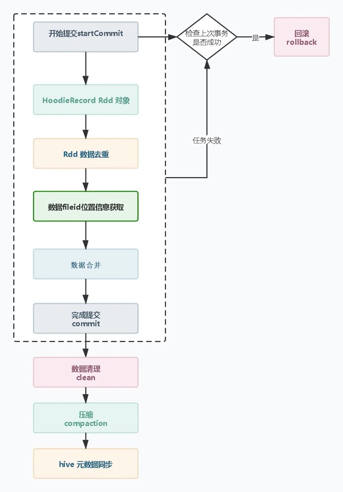

1. `开始提交`：判断上次任务是否失败，如果失败会`触发回滚`操作。然后会根据当前时间生成一个事务开始的请求标识元数据。
2. `构造HoodieRecord Rdd对象`：Hudi 会根据元数据信息构造HoodieRecord Rdd 对象，方便后续数据去重和数据合并。
3. `数据去重`:一批增量数据中可能会有重复的数据，Hudi会根据主键对数据进行去重避免重复数据写入Hudi 表。
4. `数据fileId位置信息获取`:在修改记录中可以根据索引获取当前记录所属文件的fileid，在数据合并时需要知道数据update操作向那个fileId文件写入新的快照文件。
5. `数据合并`：Hudi 有两种模式cow和mor。在cow模式中会`重写索引命中的fileId快照文件`；在mor 模式中根据fileId 追加到分区中的log 文件。
6. `完成提交`：在元数据中生成`xxxx.commit`文件，只有生成commit 元数据文件，查询引擎才能根据元数据查询到刚刚upsert 后的数据。
7. `compaction压缩`：主要是mor 模式中才会有，他会将mor模式中的xxx.log 数据合并到xxx.parquet 快照文件中去。
8. `hive元数据同步`：hive 的元素数据同步这个步骤需要配置非必需操作，主要是对于hive 和presto 等查询引擎，需要依赖hive 元数据才能进行查询，所以hive元数据同步就是构造外表提供查询。

**COW模式base data file文件生成过程**

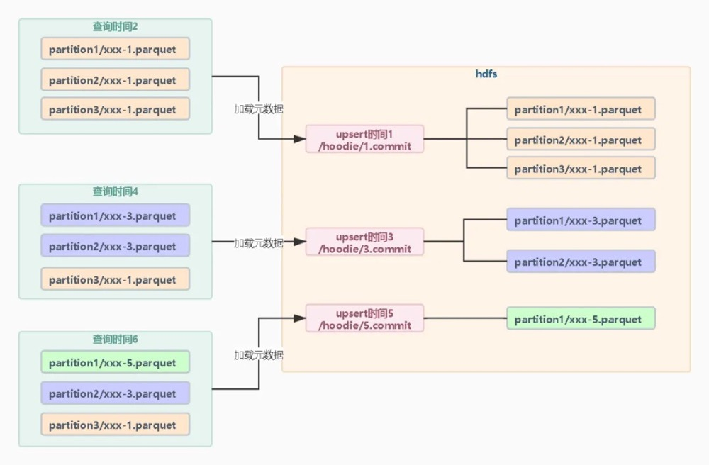

* 对于Hudi 每次修改都是会在文件级别重新写入数据快照。查询的时候就会根据最后一次快照元数据加载每个分区小于等于当前的元数据的parquet文件。Hudi事务的原理就是通过元数据mvcc多版本控制写入新的快照文件，在每个时间阶段根据最近的元数据查找快照文件。因为是重写数据所以同一时间只能保证一个事务去重写parquet 文件。不过当前Hudi版本加入了并发写机制(OCC)，原理是`Zookeeper分布锁控制或者HMS提供锁的方式`， 会保证同一个文件的修改只有一个事务会写入成功。

## 开始提交&数据回滚

* 在构造好spark 的rdd 后会调用 `df.write.format("hudi")` 方法执行数据的写入，实际会调用Hudi源码中的`HoodieSparkSqlWriter#write`方法实现。在执行任务前Hudi 会创建HoodieWriteClient 对象，并构造`HoodieTableMetaClient`调用`startCommitWithTime`方法开始一次事务。在开始提交前会获取hoodie 目录下的元数据信息，判断上一次写入操作是否成功，判断的标准是上次任务的快照元数据有xxx.commit后缀的元数据文件。如果不存在那么Hudi 会触发回滚机制，回滚是`将不完整的事务元数据文件删除，并新建xxx.rollback元数据文件。如果有数据写入到快照parquet 文件中也会一起删除`。

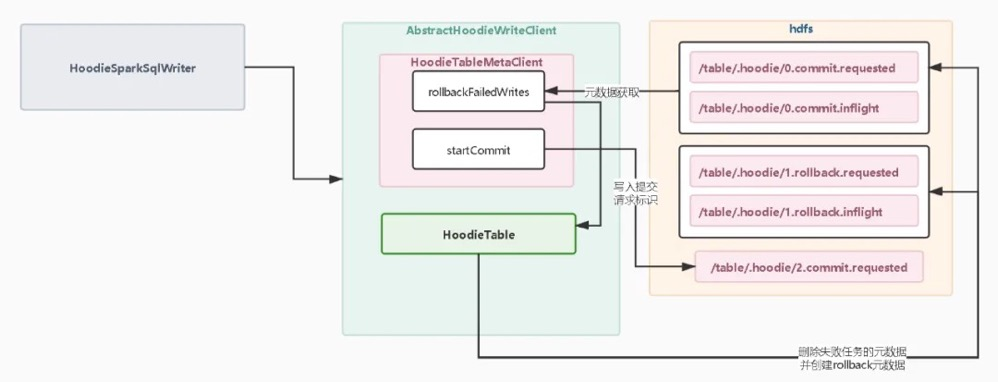

## 构造HoodieRecord Rdd对象

* `HoodieRecord Rdd`对象的构造先通过map算子提取`df中的scehma和数据`，构造avro的GenericRecords Rdd，然后Hudi会使用map算子封装为`HoodieRecord Rdd`。对于`HoodieRecord Rdd`主要由`currentLocation`,`newLocation`,`hoodieKey`,`data`组成。HoodileRecord数据结构是为后续数据去重和数据合并时提供基础。


* **currentLocation 当前数据位置信息**：只有数据在当前Hudi表中存在才会有，主要存放parquet文件的fileId，构造时默认为空，在查找索引位置信息时被赋予数据。
* **newLocation 数据新位置信息**：与currentLocation不同不管是否存在都会被赋值，newLocation是存放当前数据需要被写入到那个fileID文件中的位置信息，构造时默认为空，在merge阶段会被赋予位置信息。
* **HoodieKey 主键信息**：主要包含recordKey 和patitionPath 。recordkey 是由`hoodie.datasource.write.recordkey.field` 配置项根据列名从记录中获取的主键值。patitionPath 是分区路径。Hudi 会根据`hoodie.datasource.write.partitionpath.field` 配置项的列名从记录中获取的值作为分区路径。
* **data 数据**：data是一个泛型对象，泛型对象需要实现HoodieRecordPayload类，主要是实现合并方法和比较方法。默认实现OverwriteWithLatestAvroPayload类，需要配置`hoodie.datasource.write.precombine.field`配置项获取记录中列的值用于比较数据大小，去重和合并都是需要保留值最大的数据。

## 数据去重

* 如果upsert操作的数据没有重复数据可以关闭去重操作,`hoodie.combine.before.upsert`，默认为true开启。


* 在Spark client调用upsert 操作是Hudi会创建HoodieTable对象，并且调用upsert 方法。对于HooideTable 的实现分别有COW和MOR两种模式的实现。但是在数据去重阶段和索引查找阶段的操作都是一样的。调用`HoodieTable#upsert`方法底层的实现都是`SparkWriteHelper`。
* 在去重操作中，会先使用map 算子提取`HoodieRecord中的HoodieatestAvroPayload的实现是保留时间戳最大的记录`。**这里要注意如果我们配置的是全局类型的索引，map 中的key 值是 HoodieKey 对象中的recordKey。**因为全局索引是需要保证所有分区中的主键都是唯一的，避免不同分区数据重复。当然如果是非分区表，没有必要使用全局索引。

## 数据位置信息索引查找

### 索引的类型

* **全局索引**:查找索引时会加载所有分区的索引，用于定位数据位置信息，即使发生分区值变更也能定位数据位置信息。这种方式因为要加载所有分区文件的索引，对查找性能会有影响(HBase索引除外)
* **非全局索引**:索引在查找数据位置信息时，只会检索当前分区的索引，索引只保证当前分区内数据做upsert。如果记录的分区值发生变化就会导致数据重复。

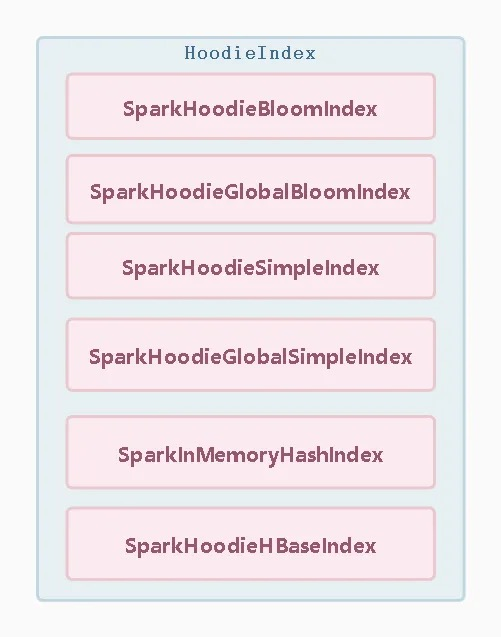

### Spark 索引实现

* 布隆索引（BloomIndex）


* 全局布隆索引（GlobalBloomIndex）

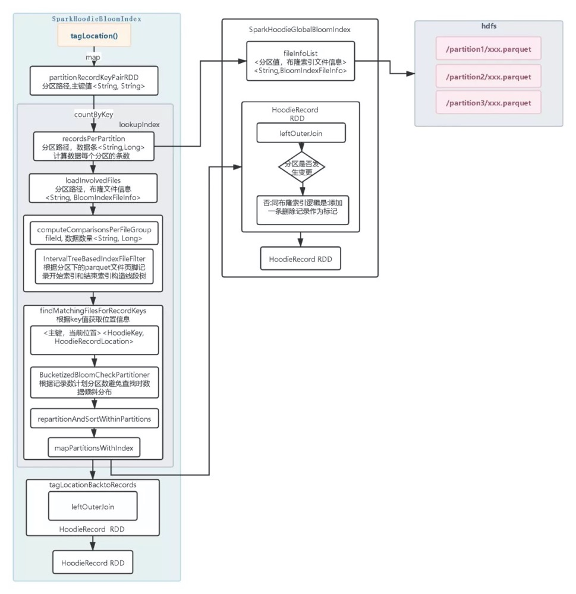

* 简易索引（SimpleIndex）:简易索引与布隆索引的不同是直接加载分区中所有的parquet数据然后在与当前的数据比较是否存在

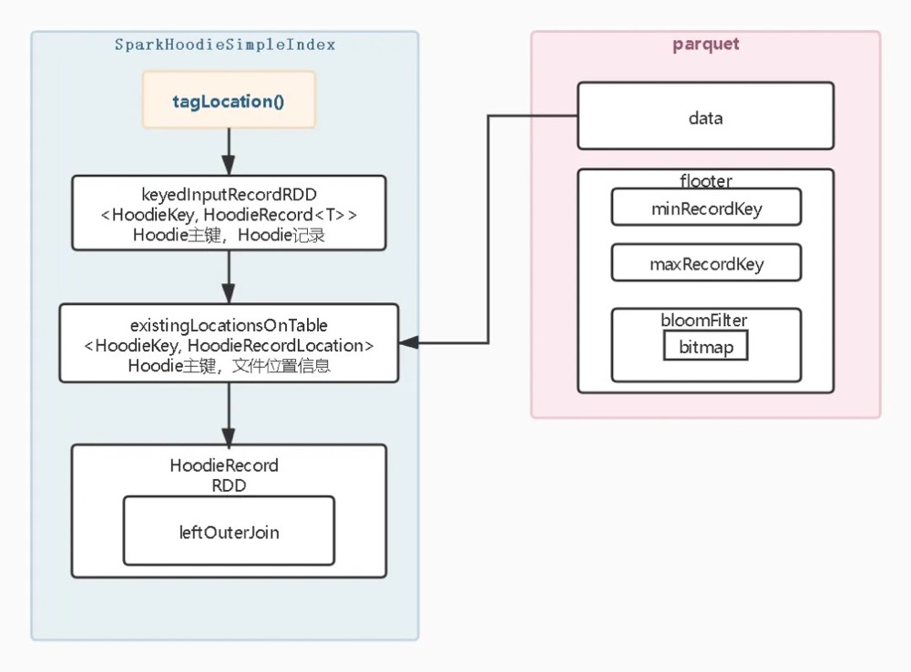

1. 提取所有的分区路径和主键值。
2. 根据分区路径加载所有涉及分区路径的parquet文件的数据主要是HooieKey和fileID两列的数据，构造<HoodieKey,HoodieRecordLocation> Rdd 对象。
3. 同布隆索引一样以 Rdd 为左表和<HoodieKey,HoodieRecordLocation>Rdd 做左关联，提取HoodieRecordLocation位置信息赋值到HoodieRecord 的currentLocation变量上,最后得到新的HoodieRecord Rdd

* 简易全局索引（GlobalSimpleIndex）
  * 简易全局索引同布隆全局索引一样，需要加载所有分区的parquet 文件数据，构造<HoodieKey,HoodieRecordLocation>Rdd然后后进行关联。在简易索引中`hoodie.simple.index.update.partition.path`配置项也是可以选择是否允许分区数据变更。数据文件比较多数据量很大，这个过程会很耗时。
* 全局HBase 索引(HbaseIndex)

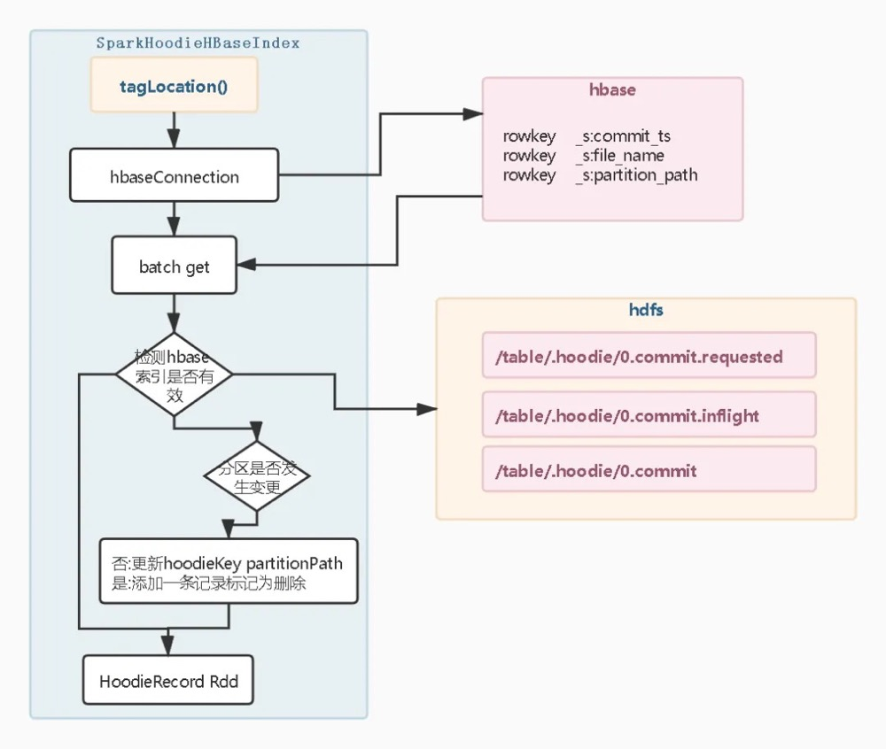

1. 连接hbase 数据库
2. 批量请求hbase 数据库
3. 检查get 获取的数据是否为有效索引，这时Hudi 会连接元数据检查commit时间是否有效，如果无效currentLocation将不会被赋值。检查是否为有效索引的目的是当索引更新一半hbase 宕机导致任务失败，保证不会加载过期索引。避免hbase 索引和数据不一致导致数据进入错误的分区。
4. 检查是否开启允许分区变更，这里的做法和全局布隆索引、全局简易索引的实现方式一样。

```properties
hoodie.index.hbase.zkquorum   必填项：zk连接地址
hoodie.index.hbase.zkport    必填项：zk连接端口
hoodie.index.hbase.zknode.path  必填项:zookeeper znode路径
hoodie.index.hbase.table  必填项：hbase中的表名
hoodie.index.hbase.get.batch.size   默认值100 ：每批量请求大小
hoodie.hbase.index.update.partition.path  默认值false： 是否允许分区变更 
hoodie.index.hbase.put.batch.size.autocompute  默认值false ：是否开启自动计算每个批次大小
hoodie.index.hbase.rollback.sync   默认值false：rollback阶段是否开启同步索引。如果设置为true在写入hbase索引导致hbase 宕机或者jvm oom任务失败，在触发rollback 阶段 会删除失败任务的索引保证索引和数据一致。在上次任务失败且数据分区字段值反复变更时可以避免数据重复。
```

* 内存索引(InMemoryHashIndex)
  * 内存索引目前Spark 的实现只是构造的一个ConcurrentMap在内存中，不会加载parquet 文件中的索引，当调用tagLocation方法会在map 中判断key值是否存在。Spark 内存索引当前是用来测试的索引。

### 索引选择

* **普通索引**：主要用于非分区表和分区不会发生分区列值变更的表。当然如果你不关心多分区主键重复的情况也是可以使用。他的优势是只会加载upsert数据中的分区下的每个文件中的索引，相对于全局索引需要扫描的文件少。并且索引只会命中当前分区的fileid 文件，需要重写的快照也少相对全局索引高效。但是某些情况下我们的设置的分区列的值就是会变那么必须要使用全局索引保证数据不重复，这样upsert 写入速度就会慢一些。其实对于非分区表他就是个分区列值不会变且只有一个分区的表，很适合普通索引，如果非分区表硬要用全局索引其实和普通索引性能和效果是一样的。
* **全局索引**：分区表场景要考虑分区值变更，需要加载所有分区文件的索引比普通索引慢。
* **布隆索引**：加载fileid 文件页脚布隆过滤器，加载少量数据数据就能判断数据是否在文件存在。缺点是有一定的误判，但是merge机制可以避免重复数据写入。parquet文件多会影响索引加载速度。适合没有分区变更和非分区表。主键如果是类似自增的主键布隆索引可以提供更高的性能，因为布隆索引记录的有最大key和最小key加速索引查找。Hudi支持动态布隆过滤器（设置`hoodie.bloom.index.filter.type=DYNAMIC_V0`）。它可以根据文件里存放的记录数量来调整大小从而达到设定的伪正率。
* **全局布隆索引**：解决分区变更场景，原理和布隆索引一样，在分区表中比普通布隆索引慢。
* **简易索引**：直接加载文件里的数据不会像布隆索引一样误判，但是加载的数据要比布隆索引要多，left join 关联的条数也要比布隆索引多。大多数场景没布隆索引高效，但是极端情况命中所有的parquet文件，那么此时还不如使用简易索引加载所有文件里的数据进行判断。
* **全局简易索引**：解决分区变更场景，原理和简易索引一样，在分区表中比普通简易索引慢。建议优先使用全局布隆索引。
* **HBase索引**：不受分区变跟场景的影响，操作算子要比布隆索引少，在大量的分区和文件的场景中比布隆全局索引高效。因为每条数据都要查询hbase ，upsert数据量很大会对hbase有负载的压力需要考虑hbase集群承受压力，适合微批分区表的写入场景 。在非分区表中数量不大文件也少，速度和布隆索引差不多，这种情况建议用布隆索引。
* **内存索引**：用于测试不适合生产环境

## 数据合并

* COW会根据`位置信息中fileId` 重写parquet文件，在重写中如果数据是更新会`比较parquet文件的数据和当前的数据的大小`进行更新，完成更新数据和插入数据。而MOR模式会根据`fileId 生成一个log 文件`，将数据直接写入到log文件中，如果fileID的log文件已经存在，追加数据写入到log 文件中。与COW 模式相比少了数据比较的工作所以性能要好，但是在log 文件中可能保存多次写有重复数据在读log数据时候就不如cow模式了。还有在mor模式中log文件和parquet 文件都是存在的，log 文件的数据会达到一定条件和parqeut 文件合并。所以mor有`两个视图，ro后缀的视图是读优化视图（read-optimized）只查询parquet 文件的数据。rt后缀的视图是实时视图（real-time）查询parquet 和log 日志中的内容`。

### Copy On Write模式

* COW模式数据合并实现逻辑调用`BaseSparkCommitActionExecutor#excute`方法

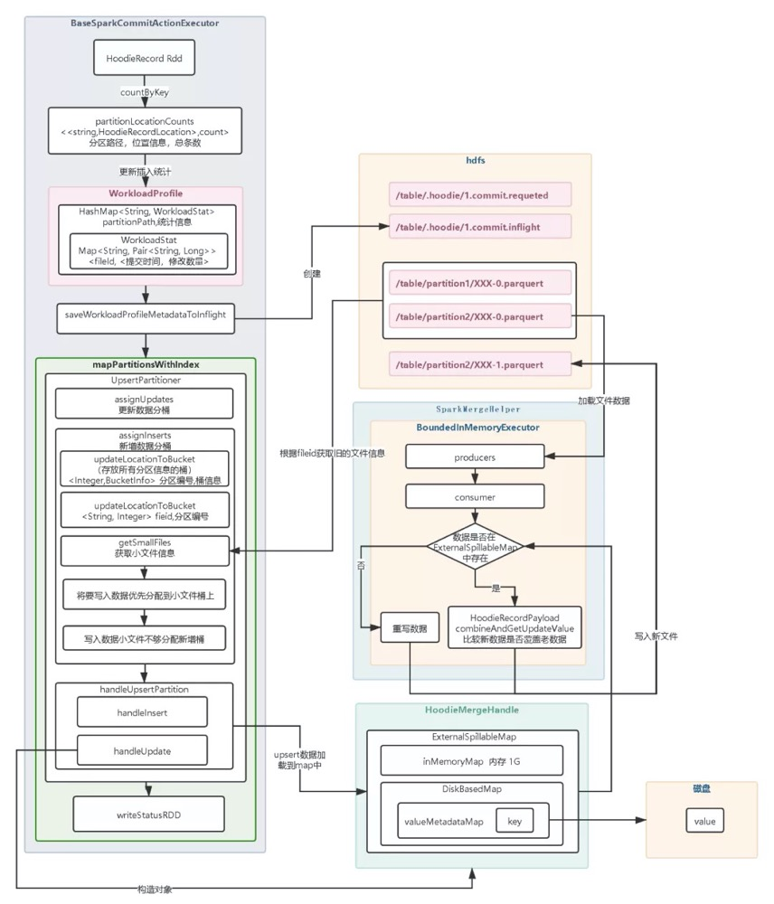

1. 通过`countByKey` 算子提取分区路径和文件位置信息并统计条数，用于后续根据分区文件写入的数据量大小评估如何分桶。

2. 统计完成后会将结果写入到workLoadProfile 对象的map 中，这个时候已经完成合并数据的前置条件。Hudi会调用saveWorkloadProfileMetadataToInfilght 方法写入infight标识文件到.hoodie元数据目录中。在workLoadProfile的统计信息中套用的是类似双层map数据结构， 统计是到fileid 文件级别。

3. 根据workLoadProfile统计信息生成自定义分区 ，这个步骤就是分桶的过程。首先会对更新的数据做分桶，因为是更新数据在合并时要么覆盖老数据要么丢弃，所以不存在parquet文件过于膨胀，这个过程会给将要发生修改的fileId都会添加一个桶。然后会对新增数据分配桶，新增数据分桶先获取分区路径下所有的fileid 文件， 判断数据是否小于100兆。小于100兆会被认为是小文件后续新增数据会被分配到这个文件桶中，大于100兆的文件将不会被分配桶。获取到小文件后会计算每个fileid 文件还能存少数据然后分配一个桶。如果小文件fileId 的桶都分配完了还不够会根据数据量大小分配n个新增桶。最后分好桶后会将桶信息存入一个map 集合中，当调用自定义实现`getpartition`方法时直接向map 中获取。所以spark在运行的时候一个桶会对应一个分区的合并计算。

   **分桶参数**

```
hoodie.parquet.small.file.limit   默认104857600（100兆）：小于100兆的文件会被认为小文件，有新增数据时会被分配数据插入。
hoodie.copyonwrite.record.size.estimate   默认1024 （1kb）： 预估一条数据大小多大，用来计算一个桶可以放多少条数据。
hoodie.record.size.estimation.threshold   默认为1： 数据最开始的时候parquet文件没有数据会去用默认的1kb预估一条数据的大小，如果有fileid的文件大小大于 (hoodie.record.size.estimation.threshold*hoodie.parquet.small.file.limit) 一条记录的大小将会根据（fileid文件大小/文件的总条数）来计算，所以这里是一个权重值。
hoodie.parquet.max.file.size   默认120 * 1024 * 1024（120兆）：文件的最大大小，在分桶时会根据这个大小减去当前fileId文件大小除以预估每条数据大小来计算当前文件还能插入多少数据。因为每条数据大小是预估计算平均值的，所以这里最大文件的大小控制只能接近与你所配置的大小。
hoodie.copyonwrite.insert.split.size   默认500000 ：精确控制一个fileid文件存放多少条数据，前提必须关闭hoodie.copyonwrite.insert.auto.split 自动分桶。
hoodie.copyonwrite.insert.auto.split   默认true : 是否开启自动分桶。
```

4.分桶结束后调用handleUpsertPartition合并数据。首先会获取map 集合中的桶信息，桶类型有两种`新增和修改`两种。如果桶fileid文件只有新增数据操作，直接追加文件或新建parquet文件写入就好，这里会调用`handleInsert`方法。如果桶fileid文件既`有新增又有修改或只有修改一定会走handUpdate方法`。这里设计的非常的巧妙`对于新增多修改改少的场景大部分的数据直接可以走新增的逻辑可以很好的提升性能`。对于handUpdate方法的处理会先构造HoodieMergeHandle对象初始化一个map集合，这个map集合很特殊拥有存在内存的map集合和存在磁盘的map 集合，这个map集合是用来存放所有需要update数据的集合用来遍历fileid旧文件时查询文件是否存在要不要覆盖旧数据。这里使用内存加磁盘为了避免update桶中数据特别大情况可以将一部分存磁盘避免jvm oom。update 数据会优先存放到内存map如果内存map不够才会存在磁盘map，而内存Map默认大小是1g 。DiskBasedMap 存储是key信息存放的还是record key ,value 信息存放value 的值存放到那个文件上，偏移量是多少、存放大小和时间。这样如果命中了磁盘上map就可以根据value存放的信息去获取hoodieRecord了。

```
hoodie.memory.spillable.map.path   默认值 /tmp/ ： 存放DiskBasedMap的路径
hoodie.memory.merge.max.size       默认值 1024*1024*1024（1g）：内存map的最大容量
```

5.构造sparkMergHelper 开始合并数据写入到新的快照文件。在SparkMergHelper 内部会构造一个BoundedInMemoryExecutor 的队列，在这个队列中会构造多个生产者和一个消费者（file 文件一般情况只有一个文件所以生产者也会是一个）。producers 会加载老数据的fileId文件里的数据构造一个迭代器，执行的时候先调用producers 完成初始化后调用consumer。而consumer被调用后会比较数据是否存在ExternalSpillableMap 中如果不存在重新写入数据到新的快照文件，如果存在调用当前的HoodileRecordPayload 实现类combineAndGetUpdateValue 方法进行比较来确定是写入老数据还是新数据，默认比较那个数据时间大。这里有个特别的场景就是硬删除，对于硬删除里面的数据是空的，比较后会直接忽略写入达到数据删除的目的。

### Merge On Read模式

* 在MOR模式中的实现和前面COW模式分桶阶段逻辑相同，这里主要说下最后的合并和COW模式不一样的操作。在MOR合并是调用`AbstarctSparkDeltaCommitActionExecutor#execute`方法，会构造HoodieAppaendHandle对象。在写入时调用append向log日志文件追加数据，如果日志文件不存在或不可追加将新建log文件。

```
hoodie.logfile.max.size   默认值：1024 * 1024 * 1024（1g） 日志文件最大大小
hoodie.logfile.data.block.max.size  默认值：256 * 1024 * 1024（256兆） 写入多少数据后刷一次磁盘
```

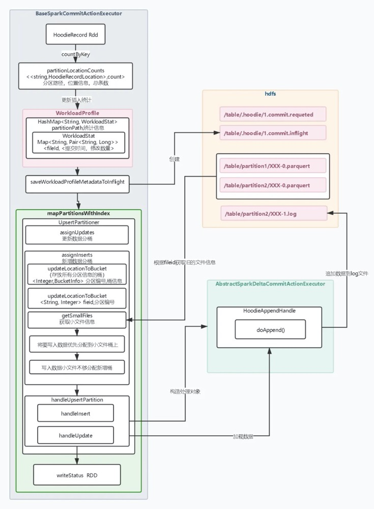

## 索引更新


* 数据写入到log文件或者是parquet 文件，这个时候需要更新索引。简易索引和布隆索引对于他们来说索引在parquet文件中是不需要去更新索引的。这里索引更新只有HBase索引和内存索引需要更新。内存索引是更新通过map 算子写入到内存map上，HBase索引通过map算子put到HBase上。

## 完成提交

### 提交&元数据归档

* 上述操作如果都成功且写入时writeStatus中没有任何错误记录，Hudi 会进行完成事务的提交和元数据归档操作，步骤如下

1. sparkRddWriteClient 调用commit 方法，首先会向Hdfs 上提交一个.commit 后缀的文件，里面记录的是writeStatus的信息包括写入多少条数据、fileID快照的信息、Schema结构等等。当commit 文件写入成功就意味着一次upsert 已经成功，Hudi 内的数据就可以查询到。
2. 为了不让元数据一直增长下去需要对元数据做归档操作。元数据归档会先创建HoodieTimelineArchiveLog对象，通过HoodieTableMetaClient 获取.hoodie目录下所有的元数据信息，根据这些元数据信息来判断是否达到归档条件。如果达到条件构造HooieLogFormatWrite对象对archived文件进行追加。每个元数据文件会封装成 HoodieLogBlock 对象批量写入。**归档参数**

```
hoodie.keep.max.commits   默认30：最多保留多少个commit元数据，默认会在第31个commit的时候会触发一次元数据归档操作，由这个参数来控制元数据归档时机。
hoodie.keep.min.commits   默认20： 最少保留多少个commit元数据，默认会将当前所有的commimt提交的个数减去20，剩下的11个元数据被归档，这个参数间接控制每次回收元数据个数。
hoodie.commits.archival.batch  默认10 ：每多少个元数据写入一次到archived文件里，这里就是一个刷盘的间隔。
```


### 数据清理

* 元数据清理后parquet文件也需要清理，在Hudi中有专门的spark任务去清理文件。因为是通过spark任务去清理文件也有对应XXX.clean.request、xxx.clean.infight、xxx.clean元数据来标识任务的每个任务阶段。数据清理步骤如下：
  * 构造baseCleanPanActionExecutor 执行器，并调用requestClean方法获取元数据生成清理计划对象HoodieCleanPlan。判断HoodieCleanPlan对象满足触发条件会向元数据写入xxx.request 标识，表示可以开始清理计划。
  * 生成执行计划后调用baseCleanPanActionExecutor 的继承类clean方法完成执行spark任务前的准备操作，然后向hdfs写入xxx.clean.inflight对象准备执行spark任务。
  * spark任务获取HoodieCleanPlan中所有分区序列化成为Rdd并调用flatMap迭代每个分区的文件。然后在mapPartitions算子中调用deleteFilesFunc方法删除每一个分区的过期的文件。最后reduceBykey汇总删除文件的结果构造成HoodieCleanStat对象，将结果元数据写入xxx.clean中完成数据清理。

```
hoodie.clean.automatic  默认true :是否开启自动数据清理，如果关闭upsert 不会执行清理任务。
hoodie.clean.async   默认false: 是否异步清理文件。开启异步清理文件的原理是开启一个后台线程，在client执行upsert时就会被调用。
hoodie.cleaner.policy  默认 HoodieCleaningPolicy.KEEP_LATEST_COMMITS ：数据清理策略参数，清理策略参数有两个配置KEEP_LATEST_FILE_VERSIONS和KEEP_LATEST_COMMITS。
hoodie.cleaner.commits.retained 默认10 ：在KEEP_LATEST_COMMITS策略中配置生效，根据commit提交次数计算保留多少个fileID版本文件。因为是根据commit提交次数来计算，参数不能大于hoodie.keep.min.commits（最少保留多少次commmit元数据）。
hoodie.cleaner.fileversions.retained  默认3 :在KEEP_LATEST_FILE_VERSIONS策略中配置生效,根据文件版本数计算保留多少个fileId版本文件。 
```

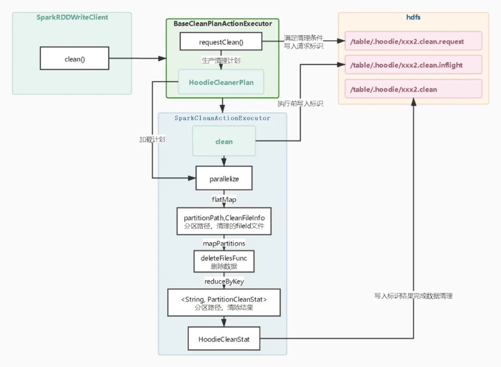

### 数据压缩

* 数据压缩是mor模式才会有的操作，目的是让log文件合并到新的field快照文件中。因为数据压缩也是spark 任务完成的，所以在运行时也对应的`xxx.compaction.requet`、`xxx.compaction.clean`、`xxx.compaction`元数据生成记录每个阶段。数据压缩实现步骤如下：
  * sparkRDDwirteClient 调用compaction方法构造BaseScheduleCompationActionExecutor对象并调用scheduleCompaction方法，计算是否满足数据压缩条件生成HoodieCompactionPlan执行计划元数据。如果满足条件会向hdfs 写入xxx.compation.request元数据标识请求提交spark任务。
  * BaseScheduleCompationActionExecutor会调用继承类SparkRunCompactionExecutor类并调用compact方法构造HoodieSparkMergeOnReadTableCompactor 对象来实现压缩逻辑，完成一切准备操作后向hdfs写入xxx.compation.inflight标识。
  * spark任务执行parallelize加载HooideCompactionPlan 的执行计划,然后调用compact迭代执行每个分区中log的合并逻辑。在 compact会构造HoodieMergelogRecordScanner 扫描文件对象，加载分区中的log构造迭代器遍历log中的数据写入ExtemalSpillableMap。这个ExtemalSpillableMap和cow 模式中内存加载磁盘的map 是一样的。至于合并逻辑是和cow模式的合并逻辑是一样的，这里不重复阐述都是调用cow模式的handleUpdate方法。
  * 完成合并操作会构造writeStatus结果信息，并写入xxx.compaction标识到hdfs中完成合并操作。

```
hoodie.compact.inline  默认false：是否在一个事务完成后内联执行压缩操作，这里开启并不一定每次都会触发索引操作后面还有策略判断。
hoodie.compact.inline.trigger.strategy  默认CompactionTriggerStrategy.NUM_COMMITS: 压缩策略参数。该参数有NUM_COMMITS、TIME_ELAPSED、NUM_AND_TIME、NUM_OR_TIME。NUM_COMMITS根据提交次数来判断是否进行压缩;TIME_ELAPSED根据实际来判断是否进行压缩;NUM_AND_TIME 根据提交次数和时间来判断是否进行压缩；NUM_OR_TIME根据提交次数或时间来判断是否进行压缩。
hoodie.compact.inline.max.delta.commits  默认5 ：设置提交多少次后触发压缩策略。在NUM_COMMITS、NUM_AND_TIME和NUM_OR_TIME策略中生效。
hoodie.compact.inline.max.delta.seconds  默认60 * 60（1小时）：设置在经过多长时间后触发压缩策略。在TIME_ELAPSED、NUM_AND_TIME和NUM_OR_TIME策略中生效。
```


## Hive元数据同步

* 实现原理比较简单就是根据Hive外表和Hudi表当前表结构和分区做比较，是否有新增字段和新增分区如果有会添加字段和分区到Hive外表。如果不同步Hudi新写入的分区无法查询。在COW模式中只会有ro表（读优化视图，而在mor模式中有ro表（读优化视图）和rt表（实时视图）。

## 提交成功通知回调

* 当事务提交成功后向外部系统发送通知消息，通知方式有俩种，一种是发送http服务消息，一种是发送kafka消息。这个通知过程我们可以把清理操作、压缩操作、hive元数据操作都交给外部系统异步处理或者做其他扩展，也可以自己实现`HoodieWriteCommitCallback`

```
hoodie.write.commit.callback.on   默认false：是否开启提交成功后向外部系统发送回调指令。
hoodie.write.commit.callback.class   默认org.apache.Hudi.callback.impl.HoodieWriteCommitHttpCallback： 配置回调实现类，默认通过Http的方式发送消息到外部系统
http实现类配置参数
hoodie.write.commit.callback.http.url   无默认配置项：外部服务http url地址。
hoodie.write.commit.callback.http.api.key  默认Hudi_write_commit_http_callback：外部服务http请求头Hudi-CALLBACK-KEY的值，可用于服务请求验签使用。
hoodie.write.commit.callback.http.timeout.seconds  默认3秒：请求超时时间。
kafka实现类配置参数
hoodie.write.commit.callback.kafka.bootstrap.servers      无默认值：配置kafka broker 服务地址。
hoodie.write.commit.callback.kafka.topic   无默认值：配置kafka topic名称。
hoodie.write.commit.callback.kafka.partition  无默认值：配置发送到那个kafka broker分区。
hoodie.write.commit.callback.kafka.acks    默认值all：配置kafka ack。
hoodie.write.commit.callback.kafka.retries  默认值值3：配置kafka 失败重试次数。
```

# Clustering架构

* Hudi通过其写入客户端API提供了不同的操作，如`insert/upsert/bulk_insert`来将数据写入Hudi表。为了能够在文件大小和摄取速度之间进行权衡，Hudi提供了一个`hoodie.parquet.small.file.limit`配置来设置最小文件大小。用户可以将该配置设置为`0`以强制新数据写入新的文件组，或设置为更高的值以确保新数据被"填充"到现有小的文件组中，直到达到指定大小为止，但其会增加摄取延迟。

* 为能够支持快速摄取的同时不影响查询性能，我们引入了Clustering服务来重写数据以优化Hudi数据湖文件的布局。

  Clustering服务可以异步或同步运行，Clustering会添加了一种新的`REPLACE`操作类型，该操作类型将在Hudi元数据时间轴中标记Clustering操作。总体而言Clustering分为两个部分：

  * 调度Clustering：使用可插拔的Clustering策略创建Clustering计划。
  * 执行Clustering：使用执行策略处理计划以创建新文件并替换旧文件。

## 调度Clustering

**具体执行步骤：**

* 识别符合Clustering条件的文件：根据所选的Clustering策略，调度逻辑将识别符合Clustering条件的文件。
* 根据特定条件对符合Clustering条件的文件进行分组。每个组的数据大小应为`targetFileSize`的倍数。分组是计划中定义的"策略"的一部分。此外还有一个选项可以限制组大小，以改善并行性并避免混排大量数据。
* 最后将Clustering计划以avro元数据格式保存到时间线。

## 执行Clustering

* 读取Clustering计划，并获得`clusteringGroups`，其标记了需要进行Clustering的文件组。
* 对于每个组使用strategyParams实例化适当的策略类（例如：sortColumns），然后应用该策略重写数据。
* 创建一个`REPLACE`提交，并更新HoodieReplaceCommitMetadata中的元数据。

Clustering服务基于Hudi的`MVCC设计`，允许继续插入新数据，而Clustering操作在后台运行以重新格式化数据布局，从而确保并发读写者之间的快照隔离。

**现在对表进行Clustering时还不支持更新，将来会支持并发更新。**

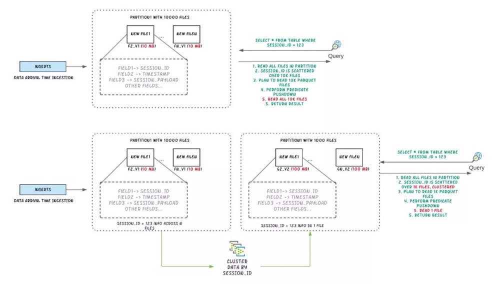

## Clustering配置

```scala
 Map(  
   // 在没hudi每次写入完成后触发inline clustering操作
    HoodieClusteringConfig.INLINE_CLUSTERING.key()-> "true",
    HoodieClusteringConfig.INLINE_CLUSTERING_MAX_COMMITS.key() -> "4",
    HoodieClusteringConfig.PLAN_STRATEGY_TARGET_FILE_MAX_BYTES.key() -> String.valueOf(1024 * 1024 * 1024L),
    HoodieClusteringConfig.PLAN_STRATEGY_SMALL_FILE_LIMIT.key() -> String.valueOf(600 * 1024 * 1024L),
    HoodieClusteringConfig.PLAN_STRATEGY_SORT_COLUMNS.key() -> "update_time",
    HoodieClusteringConfig.PLAN_STRATEGY_SKIP_PARTITIONS_FROM_LATEST.key() -> "0",
    HoodieClusteringConfig.PLAN_STRATEGY_MAX_GROUPS.key() -> "30",
    HoodieClusteringConfig.ASYNC_CLUSTERING_ENABLE.key() -> "true",
    HoodieClusteringConfig.ASYNC_CLUSTERING_MAX_COMMITS.key() -> "4")
```

## 总结

* 使用Clustering，我们可以通过以下方式提高查询性能：
  * 利用空间填充曲线之类的概念来适应数据湖布局并减少查询读取的数据量。
  * 将小文件合并成较大的文件以减少查询引擎需要扫描的文件总数。
* Clustering使得大数据进行流处理，摄取可以写入小文件以满足流处理的延迟要求，可以在后台使用Clustering将这些小文件重写成较大的文件并减少文件数。
* 除此之外，Clustering框架还提供了根据特定要求异步重写数据的灵活性，我们预见到许多其他用例将采用带有自定义可插拔策略的Clustering框架来按需管理数据湖数据，如可以通过Clustering解决如下一些用例：
  * 重写数据并加密数据。
  * 从表中修剪未使用的列并减少存储空间。

