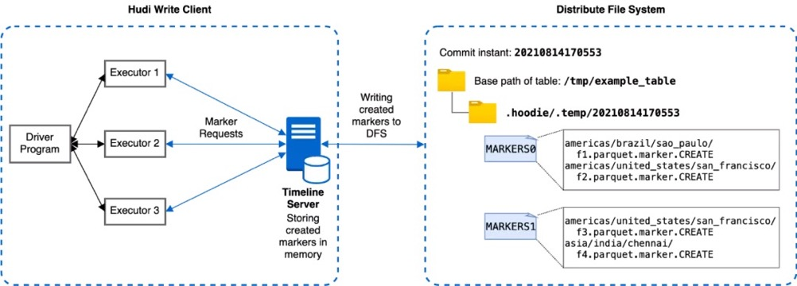
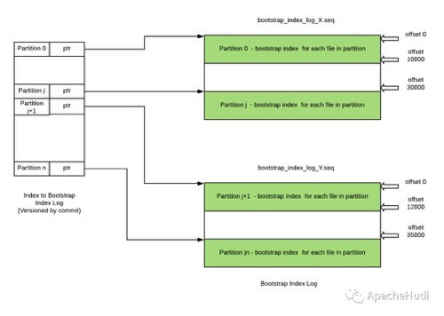

# Spark

## hudi配置

* **`hoodie.[insert|upsert|bulkinsert].shuffle.parallelism`** :hudi对输入进行分区的并行度默认为1500，大小为inputdatasize/500MB
* **Off-heap（堆外）内存：** Hudi写入parquet文件，需要使用一定的堆外内存，如果遇到此类故障，请考虑设置类似 `spark.yarn.executor.memoryOverhead`或 `spark.yarn.driver.memoryOverhead`的值。
* **Spark 内存：** 通常Hudi需要能够将单个文件读入内存以执行合并或压缩操作，因此执行程序的内存应足以容纳此文件。另外，Hudi会缓存输入数据以便能够智能地放置数据，因此预留一些 `spark.memory.storageFraction`通常有助于提高性能。

# Markers机制

## markers机制的作用

Hudi中的`marker`是一个表示存储中存在对应的数据文件的标签，Hudi使用它在故障和回滚场景中自动清理未提交的数据。

每个标记条目由**三部分**组成：

* 数据文件名
* 标记扩展名 (.marker)
* 创建文件的 I/O 操作（CREATE - 插入、MERGE - 更新/删除或 APPEND - 两者之一）。

例如标记`91245ce3-bb82-4f9f-969e-343364159174-0_140-579-0_20210820173605.parquet.marker.CREATE`指示相应的数据文件是`91245ce3-bb82-4f9f-969e-343364159174-0_140-579-0_20210820173605.parquet` 并且 I/O类型是CREATE。

在写入每个数据文件之前，`Hudi 写入客户端首先在存储中创建一个标记`，该标记`会被持久化`，在提交成功后会被写入客户端显式删除。

标记对于写客户端有效地执行不同的操作很有用，标记主要有如下**两个**作用：

* **删除重复/部分数据文件**：通过 Spark 写入 Hudi 时会有多个 Executor 进行并发写入。一个 Executor 可能失败，留下部分数据文件写入，在这种情况下 Spark 会重试 Task ，当启用`speculative execution`时，可以有多次`attempts`成功将相同的数据写入不同的文件，但最终只有一次`attempt`会交给 Spark Driver程序进程进行提交。标记有助于有效识别写入的部分数据文件，其中包含与后来成功写入的数据文件相比的重复数据，并在写入和提交完成之前清理这些重复的数据文件。
* **回滚失败的提交**：写入时可能在中间失败，留下部分写入的数据文件。在这种情况下，标记条目会在提交失败时保留在存储中。在接下来的写操作中，写客户端首先回滚失败的提交，通过标记识别这些提交中写入的数据文件并删除它们。

## 局限

* 现有的`标记机制简单地创建与每个数据文件相对应的新标记文件`，标记文件名如前面所述。每个 marker 文件被写入在相同的目录层次结构中，即`提交即时`和`分区路径`，在Hudi表的基本路径下的临时文件夹`.hoodie/.temp`下。例如，下图显示了向 Hudi 表写入数据时创建的标记文件和相应数据文件的示例。在获取或删除所有marker文件路径时，该机制首先列出临时文件夹`.hoodie/.temp/<commit_instant>`下的所有路径，然后进行操作。


* `虽然扫描整个表以查找未提交的数据文件效率更高，但随着要写入的数据文件数量的增加，要创建的标记文件的数量也会增加`。这可能会为 AWS S3 等云存储带来性能瓶颈。在 AWS S3 中，每个文件创建和删除调用都会触发一个 HTTP 请求，并且对存储桶中每个前缀每秒可以处理的请求数有速率限制。当并发写入的数据文件数量和 marker 文件数量巨大时，marker 文件的操作会成为`写入性能的显着性能瓶颈`。而在像 HDFS 这样的存储上，用户可能几乎不会注意到这一点，其中文件系统元数据被有效地缓存在内存中。

## 基于timer_server的markers机制提高写入性能

* 为解决上述 AWS S3 速率限制导致的性能瓶颈，我们引入了**一种利用时间线服务器的新标记机制**，该机制优化了存储标记的相关延迟。Hudi 中的时间线服务器用作提供文件系统和时间线视图。如下图所示，新的基于时间线服务器的`标记机制将标记创建和其他标记相关操作从各个执行器委托给时间线服务器进行集中处理`。时间线服务器在内存中为相应的标记请求维护创建的标记，时间线服务器通过定期将内存标记刷新到存储中有限数量的底层文件来实现一致性。通过这种方式，即使数据文件数量庞大，也可以显着减少与标记相关的实际文件操作次数和延迟，从而提高写入性能。



* 为了提高处理标记创建请求的效率，我们设计了在时间线服务器上批量处理标记请求。每个标记创建请求在 Javalin 时间线服务器中`异步处理`，并在处理前排队。对于每个批处理间隔，例如 20 毫秒，调度线程从队列中拉出待处理的请求并将它们发送到工作线程进行处理。每个工作线程处理标记创建请求，并通过重写存储标记的底层文件。有多个工作线程并发运行，考虑到文件覆盖的时间比批处理时间长，每个工作线程写入一个不被其他线程触及的独占文件以保证一致性和正确性。批处理间隔和工作线程数都可以通过写入选项进行配置。


* 请注意工作线程始终通过将请求中的标记名称与时间线服务器上维护的所有标记的内存副本进行比较来检查标记是否已经创建。存储标记的底层文件仅在第一个标记请求（延迟加载）时读取。请求的响应只有在新标记刷新到文件后才会返回，以便在时间线服务器故障的情况下，时间线服务器可以恢复已经创建的标记。这些确保存储和内存中副本之间的一致性，并提高处理标记请求的性能。

## markers机制配置

* `hoodie.write.markers.type`，要使用的标记类型。支持两种模式： `direct`，每个数据文件对应的单独标记文件由编写器直接创建； `timeline_server_based`，标记操作全部在时间线服务中处理作为代理。为了提高效率新的标记条目被批处理并存储在有限数量的基础文件中。默认值为`direct`
* `hoodie.markers.timeline_server_based.batch.num_threads`，用于在时间轴服务器上批处理标记创建请求的线程数。默认值为20。
* `hoodie.markers.timeline_server_based.batch.interval_ms`，标记创建批处理的批处理间隔（以毫秒为单位）。默认值为50。

# 虚拟键

## 元数据键作用

* Apache Hudi 可帮助您构建和管理具有不同表类型的数据湖，以满足每个人的需求。Hudi 为每条记录添加了元数据字段，例如 `_hoodie_record_key`、`_hoodie_partition_path`、`_hoodie_commit_time`，这些字段有多种用途。
  * 它们有助于避免在合并、压缩和其他表操作期间重新计算记录键、分区路径
  * 还有助于支持记录级增量查询（与仅跟踪文件的其他表格式相比）
  * 另外即使给定表的键字段在其生命周期内发生更改，它也可以通过确保唯一键约束被强制执行来确保数据质量

## 记录级别元数据

- **_hoodie_commit_time** : 最新记录提交时间
- **_hoodie_commit_seqno** : 在增量拉取中用于在单次摄取中创建多个窗口。
- **_hoodie_record_key** : Hudi记录主键，用来处理更新和删除
- **_hoodie_partition_path** : 分区路径
- **_hoodie_file_name** : 存储记录的文件名

## 关闭元数据键

* 可以使用以下配置为给定表启用虚拟键。当设置为 `hoodie.populate.meta.fields=false` 时，Hudi 将使用对应表的虚拟键。此配置的默认值为 `true`，意味着默认情况下将添加所有元数据字段。虚拟键有如下`限制`：
  * 一旦启用虚拟键，就不能禁用它，因为已经存储的记录可能没有填充元字段。但是如果旧版 Hudi 中的表（包含元数据字段），则可以启用虚拟键。
  * 表的`KeyGenerator`属性在 Hudi 表的生命周期过程中不能更改。在此模型中，用户需要确保表中键的唯一性。例如，如果您将记录键配置为指向 `field_5` 进行几批写入，然后切换到 `field_10`，则 Hudi 无法保证键的唯一性，因为较早的写入可能有 `field_10` 的重复项。

* 使用虚拟键，每次需要时都必须重新计算键（合并、压缩、MOR 快照读取），有一定的代价。因此我们支持 Copy-On-Write 表上所有内置`KeyGenerator`的虚拟键，支持 Merge-On-Read 表上的所有`KeyGenerator`将需要从基本和增量日志中读取所有字段，这会牺牲列式存储的查询性能，这对用户来说成本过高。因此我们现在只支持简单的`SimpleKeyGenerator`（默认的`KeyGenerator`，其中记录键和分区路径都使用已有字段）。

**COW支持的KeyGenerator如下**

* SimpleKeyGenerator
* ComplexKeyGenerator
* CustomKeyGenerator
* TimestampBasedKeyGenerator
* NonPartitionedKeyGenerator

**MOR支持的KeyGenerator如下**

* SimpleKeyGenerator

**支持索引类型如下**

* SIMPLE
* GLOBAL_SIMPLE

## 虚拟键和hudi记录的区别

* 具有虚拟键的 Hudi 表除了不支持增量查询外，支持所有现有功能。这意味着，可以为启用了虚拟键的 Hudi 表启用清理、归档、元数据表、聚簇等。因此，您可以仅将 Hudi 用作具有所有出色表服务运行时和平台服务的事务表格式，而不会产生与支持增量数据处理相关的任何开销。

* 以下是常规 hudi 表的一些示例记录（禁用虚拟键）

```
+--------------------+--------------------------------------+--------------------------------------+---------+---------+-------------------+
|_hoodie_commit_time |           _hoodie_record_key         |        _hoodie_partition_path        |  rider  | driver  |        fare       |
+--------------------+--------------------------------------+--------------------------------------+---------+---------+-------------------+
|   20210825154123   | eb7819f1-6f04-429d-8371-df77620b9527 | americas/united_states/san_francisco |rider-284|driver-284|98.3428192817987  |
|   20210825154123   | 37ea44f1-fda7-4ec4-84de-f43f5b5a4d84 | americas/united_states/san_francisco |rider-213|driver-213|19.179139106643607|
|   20210825154123   | aa601d6b-7cc5-4b82-9687-675d0081616e | americas/united_states/san_francisco |rider-213|driver-213|93.56018115236618 |
|   20210825154123   | 494bc080-881c-48be-8f8a-8f1739781816 | americas/united_states/san_francisco |rider-284|driver-284|90.9053809533154  |
|   20210825154123   | 09573277-e1c1-4cdd-9b45-57176f184d4d | americas/united_states/san_francisco |rider-284|driver-284|49.527694252432056|
|   20210825154123   | c9b055ed-cd28-4397-9704-93da8b2e601f | americas/brazil/sao_paulo            |rider-213|driver-213|43.4923811219014  |
|   20210825154123   | e707355a-b8c0-432d-a80f-723b93dc13a8 | americas/brazil/sao_paulo            |rider-284|driver-284|63.72504913279929 |
|   20210825154123   | d3c39c9e-d128-497a-bf3e-368882f45c28 | americas/brazil/sao_paulo            |rider-284|driver-284|91.99515909032544 |
|   20210825154123   | 159441b0-545b-460a-b671-7cc2d509f47b | asia/india/chennai                   |rider-284|driver-284|9.384124531808036 |
|   20210825154123   | 16031faf-ad8d-4968-90ff-16cead211d3c | asia/india/chennai                   |rider-284|driver-284|90.25710109008239 |
+--------------------+--------------------------------------+--------------------------------------+---------+----------+------------------+
```

* 以下是启用了虚拟键的 Hudi 表的一些示例记录

```
+--------------------+------------------------+-------------------------+---------+---------+-------------------+
|_hoodie_commit_time |    _hoodie_record_key  |  _hoodie_partition_path |  rider  | driver  |        fare       |
+--------------------+------------------------+-------------------------+---------+---------+-------------------+
|        null        |            null        |          null           |rider-284|driver-284|98.3428192817987  |
|        null        |            null        |          null           |rider-213|driver-213|19.179139106643607|
|        null        |            null        |          null           |rider-213|driver-213|93.56018115236618 |
|        null        |            null        |          null           |rider-284|driver-284|90.9053809533154  |
|        null        |            null        |          null           |rider-284|driver-284|49.527694252432056|
|        null        |            null        |          null           |rider-213|driver-213|43.4923811219014  |
|        null        |            null        |          null           |rider-284|driver-284|63.72504913279929 |
|        null        |            null        |          null           |rider-284|driver-284|91.99515909032544 |
|        null        |            null        |          null           |rider-284|driver-284|9.384124531808036 |
|        null        |            null        |          null           |rider-284|driver-284|90.25710109008239 |
+--------------------+------------------------+-------------------------+---------+----------+------------------+
```

> 上述所有元字段在存储中都为空，但所有用户字段都保持不变，类似于常规表。

# Hudi清理服务

## 清理服务的作用

### 回收空间控制存储成本

* 对于每次更新，Hudi会生成一个新版本的数据文件用于保存更新后的记录(COPY_ON_WRITE) 或将这些增量更新写入日志文件以避免重写更新版本的数据文件 (MERGE_ON_READ)。在这种情况下，根据更新频率，文件版本数可能会无限增长，但如果不需要保留无限的历史记录，则必须有一个流程（服务）来回收旧版本的数据，这就是 Hudi 的清理服务。
* `Hudi基础文件(HoodieBaseFile)`:由压缩后的最终数据组成的列式文件，基本文件的名称遵循以下命名约定：`<fileId>_<writeToken>_<instantTime>.parquet`。在此文件的后续写入中文件 ID 保持不变，并且提交时间会更新以显示最新版本。这也意味着记录的任何特定版本，给定其分区路径，都可以使用文件 ID 和 instantTime进行唯一定位。
* `文件切片(FileSlice)`:在`MERGE_ON_READ`表类型的情况下，文件切片由基本文件和多个增量日志文件组成。
* `Hudi文件组(FileGroup):`Hudi 中的任何文件组都由分区路径和文件ID 唯一标识，该组中的文件作为其名称的一部分。文件组由特定分区路径中的所有文件片组成。此外任何分区路径都可以有多个文件组。

## 清理服务策略

* **KEEP_LATEST_COMMITS**：这是默认策略。该清理策略可确保回溯前X次提交中发生的所有更改。假设每 30 分钟将数据摄取到 Hudi 数据集，并且最长的运行查询可能需要 5 小时才能完成，那么用户应该至少保留最后 10 次提交。通过这样的配置，我们确保文件的最旧版本在磁盘上保留至少 5 小时，从而防止运行时间最长的查询在任何时间点失败，使用此策略也可以进行增量清理。
* **KEEP_LATEST_FILE_VERSIONS**：此策略具有保持 N 个文件版本而不受时间限制的效果。当知道在任何给定时间想要保留多少个 MAX 版本的文件时，此策略很有用，为了实现与以前相同的防止长时间运行的查询失败的行为，应该根据数据模式进行计算，或者如果用户只想维护文件的 1 个最新版本，此策略也很有用。

```properties
hoodie.cleaner.policy=KEEP_LATEST_COMMITS
hoodie.cleaner.commits.retained=2
```

## 后台运行清理服务

* Hudi 的清理表服务可以作为单独的进程运行，可以与数据摄取一起运行。

```shell
spark-submit --class org.apache.hudi.utilities.HoodieCleaner \
  --props s3:///temp/hudi-ingestion-config/config.properties \
  --target-base-path s3:///temp/hudi \
  --spark-master yarn-cluster
```

* config.properties

```properties
hoodie.clean.automatic=true
hoodie.clean.async=true
```

# Hudi主键和分区配置

* Hudi中每个记录都由HoodieKey唯一标识，HoodieKey由`记录键`和记录所属的`分区路径`组成。hudi也是基于HoodieKey快速删除和更新记录，hudi使用`分区路径`字段对数据集进行分区，并且分区的记录有唯一的`记录键`。

## KeyGenerators

* Hudi提供了一些开箱即用的键生成器，用户可以基于此满足大部分业务需求，或者自定义实现KeyGenerator。

| 配置                                              | 解释                                                         |
| ------------------------------------------------- | ------------------------------------------------------------ |
| `hoodie.datasource.write.recordkey.field`         | 指定record key字段                                           |
| `hoodie.datasource.write.partitionpath.field`     | 指定分区字段                                                 |
| `hoodie.datasource.write.keygenerator.class`      | 指定KeyGenerator类全路径名                                   |
| `hoodie.datasource.write.partitionpath.urlencode` | 当设置为true，partitionPath将会使用url编码，默认值为false    |
| `hoodie.datasource.write.hive_style_partitioning` | 当设置为true，使用hive风格的分区，分区将为key=value格式，默认值为false |

* 如果使用`TimestampBasedKeyGenerator`，还会有其他额外的配置

### SimpleKeyGenerator

* 指定一个字段为`record key`,分区字段也指定一个字段，从数据解析出来转换为string。

### ComplexKeyGenerator

* 可以指定`一个或多个字段`为record key或者分区字段，多个字段使用逗号分割，如 `hoodie.datasource.write.recordkey.field` :`col1,col4`

### GlobalDeleteKeyGenerator

* 基于全局索引的删除不需要分区值，所以该生成器不需要使用分区值来生成HoodieKey。

### TimestampBasedKeyGenerator

* 该键生成器依赖timestamp分区字段，字段值将会被转化为timestamp，而不是string类型。Record key设置和前面一样，使用该键生成器时需要一些额外的配置项如下

  | 配置                                                      | 说明                                                         |
  | --------------------------------------------------------- | ------------------------------------------------------------ |
  | `hoodie.deltastreamer.keygen.timebased.timestamp.type`    | 支持如下Timestamp类型(UNIX_TIMESTAMP, DATE_STRING, MIXED, EPOCHMILLISECONDS, SCALAR) |
  | `hoodie.deltastreamer.keygen.timebased.output.dateformat` | 输出日期类型                                                 |
  | `hoodie.deltastreamer.keygen.timebased.timezone`          | 数据格式的时区                                               |
  | `hoodie.deltastreamer.keygen.timebased.input.dateformat`  | 输入日期类型                                                 |

* #### Timestamp类型为GMT

| 配置                                                      | 值                  |
| --------------------------------------------------------- | ------------------- |
| `hoodie.deltastreamer.keygen.timebased.timestamp.type`    | “EPOCHMILLISECONDS” |
| `hoodie.deltastreamer.keygen.timebased.output.dateformat` | “yyyy-MM-dd hh”     |
| `hoodie.deltastreamer.keygen.timebased.timezone`          | “GMT+8:00”          |

```
输入字段值为1578283932000L
分区字段将为2020-01-06 12
如果一些行输入字段只为null
分区字段将为1970-01-01 08
```

* #### Timestamp类型为DATE_STRING

| Config field                                              | 值                    |
| --------------------------------------------------------- | --------------------- |
| `hoodie.deltastreamer.keygen.timebased.timestamp.type`    | “DATE_STRING”         |
| `hoodie.deltastreamer.keygen.timebased.output.dateformat` | “yyyy-MM-dd hh”       |
| `hoodie.deltastreamer.keygen.timebased.timezone`          | “GMT+8:00”            |
| `hoodie.deltastreamer.keygen.timebased.input.dateformat`  | “yyyy-MM-dd hh:mm:ss” |

```
输入字段值为2020-01-06 12:12:12
分区字段将为2020-01-06 12
如果一些行输入字段只为null
分区字段将为1970-01-01 12:00:00
```

* #### 标量实例

| Config field                                                 | Value           |
| ------------------------------------------------------------ | --------------- |
| `hoodie.deltastreamer.keygen.timebased.timestamp.type`       | “SCALAR”        |
| `hoodie.deltastreamer.keygen.timebased.output.dateformat`    | “yyyy-MM-dd hh” |
| `hoodie.deltastreamer.keygen.timebased.timezone`             | “GMT”           |
| `hoodie.deltastreamer.keygen.timebased.timestamp.scalar.time.unit` | “days”          |

```
输入字段值为20000L
分区字段将为2024-10-04 12
如果一些行输入字段只为null
分区字段将为1970-01-01 12
```

* #### ISO8601 Z单输入格式

| Config field                                                 | Value                        |
| ------------------------------------------------------------ | ---------------------------- |
| `hoodie.deltastreamer.keygen.timebased.timestamp.type`       | “DATE_STRING”                |
| `hoodie.deltastreamer.keygen.timebased.input.dateformat`     | “yyyy-MM-dd’T’HH:mm:ss.SSSZ” |
| `hoodie.deltastreamer.keygen.timebased.input.dateformat.list.delimiter.regex` | ””                           |
| `hoodie.deltastreamer.keygen.timebased.input.timezone`       | ””                           |
| `hoodie.deltastreamer.keygen.timebased.output.dateformat`    | “yyyyMMddHH”                 |
| `hoodie.deltastreamer.keygen.timebased.output.timezone`      | “GMT”                        |

```
输入字段值为2020-04-01T13:01:33.428Z
分区字段将为2020040113
```

* #### ISO8601 Z多输入格式

| Config field                                                 | Value                                               |
| ------------------------------------------------------------ | --------------------------------------------------- |
| `hoodie.deltastreamer.keygen.timebased.timestamp.type`       | “DATE_STRING”                                       |
| `hoodie.deltastreamer.keygen.timebased.input.dateformat`     | “yyyy-MM-dd’T’HH:mm:ssZ,yyyy-MM-dd’T’HH:mm:ss.SSSZ” |
| `hoodie.deltastreamer.keygen.timebased.input.dateformat.list.delimiter.regex` | ””                                                  |
| `hoodie.deltastreamer.keygen.timebased.input.timezone`       | ””                                                  |
| `hoodie.deltastreamer.keygen.timebased.output.dateformat`    | “yyyyMMddHH”                                        |
| `hoodie.deltastreamer.keygen.timebased.output.timezone`      | “UTC”                                               |

```
输入字段值为2020-04-01T13:01:33.428Z
分区字段将为2020040113
```

* #### ISO8601多输入格式

| Config field                                                 | Value                                               |
| ------------------------------------------------------------ | --------------------------------------------------- |
| `hoodie.deltastreamer.keygen.timebased.timestamp.type`       | “DATE_STRING”                                       |
| `hoodie.deltastreamer.keygen.timebased.input.dateformat`     | “yyyy-MM-dd’T’HH:mm:ssZ,yyyy-MM-dd’T’HH:mm:ss.SSSZ” |
| `hoodie.deltastreamer.keygen.timebased.input.dateformat.list.delimiter.regex` | ””                                                  |
| `hoodie.deltastreamer.keygen.timebased.input.timezone`       | ””                                                  |
| `hoodie.deltastreamer.keygen.timebased.output.dateformat`    | “yyyyMMddHH”                                        |
| `hoodie.deltastreamer.keygen.timebased.output.timezone`      | “UTC”                                               |

```
输入字段值为2020-04-01T13:01:33-05:00
分区字段将为2020-04-01T13:01:33-05:00
```

* #### 日期类型

| Config field                                                 | Value                                                        |
| ------------------------------------------------------------ | ------------------------------------------------------------ |
| `hoodie.deltastreamer.keygen.timebased.timestamp.type`       | “DATE_STRING”                                                |
| `hoodie.deltastreamer.keygen.timebased.input.dateformat`     | “yyyy-MM-dd’T’HH:mm:ssZ,yyyy-MM-dd’T’HH:mm:ss.SSSZ,yyyyMMdd” |
| `hoodie.deltastreamer.keygen.timebased.input.dateformat.list.delimiter.regex` | ””                                                           |
| `hoodie.deltastreamer.keygen.timebased.input.timezone`       | “UTC”                                                        |
| `hoodie.deltastreamer.keygen.timebased.output.dateformat`    | “MM/dd/yyyy”                                                 |
| `hoodie.deltastreamer.keygen.timebased.output.timezone`      | “UTC”                                                        |

```
输入字段只为220200401
分区字段将为04/01/2020
```

### CustomKeyGenerator

* CustomKeyGenerator是一种通用的KeyGenerator，综合了SimpleKeyGenerator、ComplexKeyGenerator和TImestampBasedKeyGenerator的特性，可以配置键和分区路径为单字段或组合字段，如果要定义基于常规字段和基于时间戳的字段的复杂分区路径，此keyGenerator非常有用，配置项`hoodie.datasource.write.partitionpath.field`的值对应格式应为`field1:PartitionKeyType1,field2:PartitionKeyType2…`

### NonPartitionedKeyGenerator

* `NonPartitionedKeyGenerator`不对数据集分区，所有记录返回到一个空分区中。

## Hive分区配置

```properties
# 开启hive元数据同步
hoodie.datasource.hive_sync.enable=true
hoodie.datasource.hive_sync.table=tableName
# 元数据库用户名
hoodie.datasource.hive_sync.username=username
hoodie.datasource.hive_sync.password=password
# hive库
hoodie.datasource.hive_sync.jdbcurl=jdbc:hive2://localhost:10000
hoodie.datasource.hive_sync.partition_fields=分区字段
hoodie.datasource.hive_sync.partition_extractor_class=hive分区提取类
```

### **`MultiPartKeysValueExtractor`**

* 支持1至多个hive分区字段

### **`SlashEncodedDayPartitionValueExtractor`**

* 日期格式，将yyyy/MM/dd转换为yyyy-MM-dd

### **`NonPartitionedExtractor`**

* 无hive分区

# Hudi频繁更新历史数据场景优化

## 频繁的更新历史导致的问题

* 写放大问题
* 更高的采集数据延迟
* 影响HDFS（相同文件的48个版本+过多的IO）

## 优化手段

* 采用mor表类型，更新合并并重写parquet文件
* 将更新写入增量文件中，将需要在读取端做额外的工作以便能够读取增量文件中记录
* 采用异步Compaction，减少因实时快照读取合并base和delta log文件导致的延迟

# 历史数据入Hudi

## 使用Bootstrap方式

1. 用户在原始数据集上停止所有写操作。

2. 用户使用DeltaStreamer或者独立工具开始启动引导，用户需要提供如下引导参数

3. - 原始（非Hudi）数据集位置。
   - 生成Hudi键的列。
   - 迁移的并发度。
   - 新的Hudi数据集位置。

4. 引导时Hudi会扫描原始表位置（`/user/hive/warehouse/fact_events`）的分区和文件，进行如下操作 :

5. - 在新数据集位置创建Hudi分区，在上述示例中，将会在`/user/hive/warehouse/fact_events_hudi`路径创建日期分区。
   - 生成唯一的文件ID并以此为每个原始parquet文件生成Hudi骨架文件，同时会使用一个特殊的commit，称为`BOOTSTRAP_COMMIT`。下面我们假设`BOOTSTRAP_COMMIT`对应的timestamp为`000000000`，例如一个原始parquet文件为`/user/hive/warehouse/fact_events/year=2015/month=12/day=31/file1.parquet`，假设新生成的文件ID为`h1`，所以相应的骨架文件为`/user/hive/warehouse/fact_events_hudi/year=2015/month=12/day=31/h1_1-0-1_000000000.parquet.`。
   - 生成一个特殊的bootstrap索引，该索引将生成的骨架文件映射到对应的原始parquet文件。
   - 使用Hudi timeline状态变更进行原子性提交，也支持回滚操作。

6. 如果开启了Hive同步，那么会创建一张Hudi类型的Hive外表，并指向`/user/hive/warehouse/fact_events_hudi`路径。

7. 随后的写操作将作用在Hudi数据集上。

### boostrap索引

* 索引用于映射Hudi骨架文件和原始包含数据的parquet文件。该信息会作为Hudi file-system view并用于生成FileSlice，Bootstrap索引和CompactionPlan类似，但与CompactionPlan不同的是引导索引可能更大，因此需要一种高效读写的文件格式。
* Hudi的file-system view是物理文件名到FileGroup和FileSlice的抽象，可以支持到分区级别的API，因此Bootstrap索引一定需要提供快速查找单个分区索引信息的能力。
  * 引导日志：顺序文件，每一个条目包含单个分区内索引信息，对于分区下引导索引的变更只需要在日志文件中顺序添加新的条目即可。
  * 索引引导日志：包含Hudi分区、文件名和offset的顺序文件，offset表示引导索引日志条目对应Hudi分区的位置。



