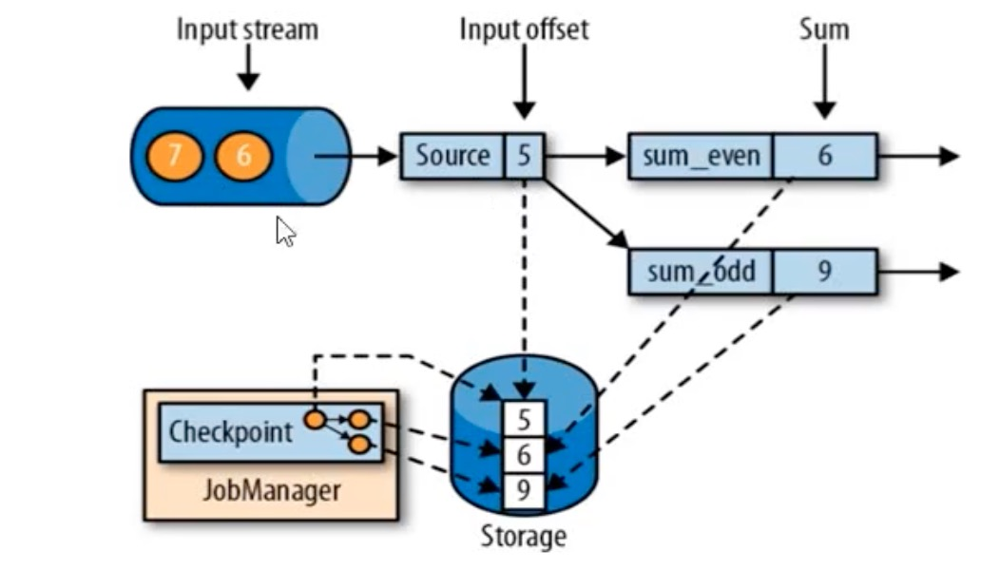
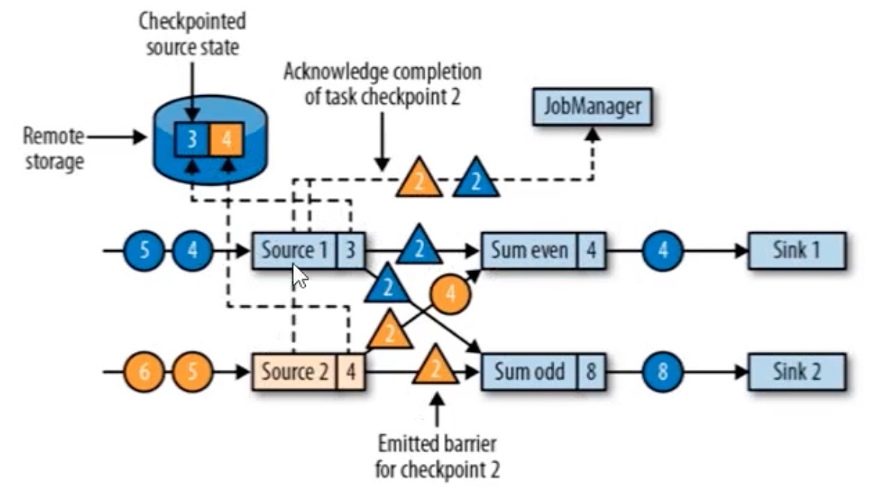
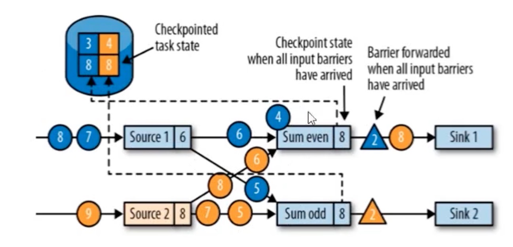

# Checkpoint机制剖析
## 容错与状态

### Checkpoint

#### 一致性检查点



* Flink故障恢复机制的核心，就是应用状态的一致性检查点
* 有状态流应用的一致检查点，其实就是所有任务的状态，在某个时间点的一份拷贝；这个时间点，`应该是所有任务恰好处理完一个相同的输入数据的时候,如果各个算子单独处理对应的offset，`就会存在source端和算子端checkpoint的offset存在异常，导致数据无法恢复。

#### 从检查点恢复

* 重启应用程序，从上次保存的checkpoint恢复，当所有checkpoint恢复到各个算子中，然后开始消费并处理checkpoint到发生故障之间的所有数据，这种checkpoint的保存和恢复机制可以为程序提供"exactly-once"的一致性，所有算子都会保存checkpoint并恢复其所有状态，这样就保证了状态的最终一致性。

#### 检查点算法

* 一种简单的想法

    * 暂停应用，保存状态到检查点，再重新恢复应用。

* Flink实现方式

    * 基于`Chandy-Lamport`算法的分布式快照
    * 将检查点的保存和数据处理分离开，不暂停整个应用，对Source进行`checkpoint barrier`控制

* 检查点屏障(Checkpoint Barrier)

    * Flink的检查点算法用到一种称为屏障(barrier)的特殊数据形式，用来把一条流上数据按照不同的检查点分开。
    * Barrier之前到来的数据导致的状态更改，都会被包含在当前分界线所属的检查点中；基于barrier之后的数据导致的所有更改，就会被包含在之后的检查点中。

* **检查点barrier流程**

    * 有两个输入流的应用程序，并行的两个Source任务来读取，JobManager会向每个Source任务发送一个带有新checkpoint ID的消息，通过这种方式来启动checkpoint。
    * 数据源将它们的状态写入checkpoint，并发出一个`checkpointbarrier`，状态后端在状态存入checkpoint之后，会返回通知给source任务，source任务就会向JobManager确认checkpoint完成。
    * **barrier对齐**：barrier向下游传递，sum任务会等待所有输入分区的barrier达到，对于barrier已经到达的分区，继续到达的数据会`被缓存`，而barrier尚未到达的分区，数据会被正常处理。
    * 当收到所有输入分区的barrier时，任务就将其状态保存到`状态后端的checkpoint中`，然后将barrier继续向下游转发，下游继续正常处理数据。
    * Sink任务向JobManager确认状态保存到checkpoint完毕，当所有任务都确认已成功将状态保存到checkpoint时，checkpoint完毕。

  

  

  

#### checkpoint配置

* checkpoint默认情况下`仅用于恢复失败的作业，并不保留，当程序取消时checkpoint就会被删除`。可以通过配置来保留checkpoint，保留的checkpoint在作业失败或取消时不会被清除。

* **`ExternalizedCheckpointCleanup.RETAIN_ON_CANCELLATION`**：当作业取消时，保留作业的 checkpoint。注意，这种情况下，需要手动清除该作业保留的 checkpoint。
* **`ExternalizedCheckpointCleanup.DELETE_ON_CANCELLATION`**：当作业取消时，删除作业的 checkpoint。仅当作业失败时，作业的 checkpoint 才会被保留。

```java
StreamExecutionEnvironment env = StreamExecutionEnvironment.getExecutionEnvironment();

// 每 1000ms 开始一次 checkpoint
env.enableCheckpointing(1000);

// 高级选项：

// 设置模式为精确一次 (这是默认值)
env.getCheckpointConfig().setCheckpointingMode(CheckpointingMode.EXACTLY_ONCE);

// 确认 checkpoints 之间的时间会进行 500 ms
env.getCheckpointConfig().setMinPauseBetweenCheckpoints(500);

// Checkpoint 必须在一分钟内完成，否则就会被抛弃
env.getCheckpointConfig().setCheckpointTimeout(60000);

// 同一时间只允许一个 checkpoint 进行
env.getCheckpointConfig().setMaxConcurrentCheckpoints(1);

// 开启在 job 中止后仍然保留的 externalized checkpoints
env.getCheckpointConfig().enableExternalizedCheckpoints(ExternalizedCheckpointCleanup.RETAIN_ON_CANCELLATION);

// 允许在有更近 savepoint 时回退到 checkpoint
env.getCheckpointConfig().setPreferCheckpointForRecovery(true);
```

* **设置重启策略**
    * noRestart
    * fallBackRestart:回滚
    * fixedDelayRestart: 固定延迟时间重启策略，在固定时间间隔内重启
    * failureRateRestart: 失败率重启

##### checkpoint存储目录

* checkpoint由元数据文件、数据文件组成。通过`state.checkpoints.dir`配置元数据文件和数据文件存储路径，也可以在代码中设置。

```
/user-defined-checkpoint-dir
    /{job-id}
        |
        + --shared/
        + --taskowned/
        + --chk-1/
        + --chk-2/
        + --chk-3/
        ...
```

* 其中 **SHARED** 目录保存了可能被多个 checkpoint 引用的文件，**TASKOWNED** 保存了不会被 JobManager 删除的文件，**EXCLUSIVE** 则保存那些仅被单个 checkpoint 引用的文件。

* 从保留的checkpoint中恢复状态

```shell
$ bin/flink run -s :checkpointMetaDataPath [:runArgs]
```

##### flink-conf容错配置

```yaml
state.backend: rocksdb
# 异步checkpoint
state.backend.async: true
state.checkpoints.dir: hdfs://hadoop:8020/flink1.11.1/checkpoints
state.savepoints.dir: hdfs://hadoop:8020/flink1.11.1/savepoints
state.backend.incremental: true
# 故障转移策略，默认为region，按照区域恢复
jobmanager.execution.failover-strategy: region
# checkpoint文件最小值
state.backend.fs.memory-threshold: 20kb
# 写到文件系统的检查点流的写缓冲区的默认大小。实际的写缓冲区大小被确定为这个选项和选项'state.backend.fs.memory-threshold'的最大值。
state.backend.fs.write-buffer-size: 4096
# 本地恢复当前仅涵盖键控状态后端。 当前，MemoryStateBackend不支持本地恢复，请忽略此选项。
state.backend.local-recovery: true
# 要保留的已完成检查点的最大数量。
state.checkpoints.num-retained: 1
# 定义根目录的配置参数，用于存储用于本地恢复的基于文件的状态。本地恢复目前只覆盖键控状态后端。目前，MemoryStateBackend不支持本地恢复并忽略此选项
taskmanager.state.local.root-dirs: hdfs://hadoop:8020/flink1.11.1/tm/checkpoints
```

### savepoint

* Savepoint 由俩部分组成：稳定存储上包含二进制文件的目录（通常很大），和元数据文件（相对较小）。 稳定存储上的文件表示作业执行状态的数据镜像。 Savepoint 的`元数据文件以（绝对路径）的形式包含（主要）指向作为 Savepoint 一部分的稳定存储上的所有文件的指针`。

#### 与checkpoint的区别

* **checkpoint**类似于恢复日志的概念(redolog), Checkpoint 的主要目的是`为意外失败的作业提供恢复机制`。 Checkpoint 的生命周期由 Flink 管理，即 Flink 创建，管理和删除 Checkpoint - 无需用户交互。 作为一种恢复和定期触发的方法，Checkpoint 实现有两个设计目标：`i）轻量级创建和 ii）尽可能快地恢复`。
* Savepoint 由用户创建，拥有和删除。 他们的用例是计划的，手动备份和恢复,恢复成本相对于checkpoint会更高一些，相对checkpoint更重量一些。

#### 分配算子ID

* 通过`uid(String)`方法手动指定算子ID，算子ID用于恢复每个算子的状态。

```java
datasource.uid("network-source").map(new WordCountMapFunction())
                .uid("map-id")
                .keyBy((KeySelector<Tuple2<String, Integer>, Object>) stringIntegerTuple2 -> stringIntegerTuple2.f0)
                .timeWindow(Time.seconds(30))
                .reduce(new SumReduceFunction())
                .uid("reduce-id")
                .print().setParallelism(1);
```

#### savepoint操作

* 触发savepoint,`flink savepoint :jobId [:targetDirctory]`
* 使用YARN触发Savepoint,`flink savepoint :jobId [:targetDirctory] -yid :yarnAppId`
* 使用savepoint取消作业,`flink cancel -s [:targetDirectory] :jobId`
* 从savepoint恢复,`flink run -s :savepointPath [:runArgs]`
    * --allowNoRestoredState 跳过无法映射到新程序的状态
* 删除savepoint,`flink savepoint -d :savepointPath`

### 状态快照

#### 概念

- *快照* – 是 Flink 作业状态全局一致镜像的通用术语。快照包括指向每个数据源的指针（例如，到文件或 Kafka 分区的偏移量）以及每个作业的有状态运算符的状态副本，该状态副本是处理了 sources 偏移位置之前所有的事件后而生成的状态。
- *Checkpoint* – 一种由 Flink 自动执行的快照，其目的是能够从故障中恢复。Checkpoints 可以是增量的，并为快速恢复进行了优化。
- *外部化的 Checkpoint* – 通常 checkpoints 不会被用户操纵。Flink 只保留作业运行时的最近的 *n* 个 checkpoints（*n* 可配置），并在作业取消时删除它们。但你可以将它们配置为保留，在这种情况下，你可以手动从中恢复。
- *Savepoint* – 用户出于某种操作目的（例如有状态的重新部署/升级/缩放操作）手动（或 API 调用）触发的快照。Savepoints 始终是完整的，并且已针对操作灵活性进行了优化

#### 原理

* 基于异步barrier快照(asynchronous barrier snapshotting),当 checkpoint coordinator（job manager 的一部分）指示 task manager 开始 checkpoint 时，它会让所有 sources 记录它们的偏移量，并将编号的 *checkpoint barriers* 插入到它们的流中。这些 barriers 流经 job graph，标注每个 checkpoint 前后的流部分。


* barrier对齐机制


* Flink 的 state backends 利用写时复制（copy-on-write）机制允许当异步生成旧版本的状态快照时，能够不受影响地继续流处理。只有当快照被持久保存后，这些旧版本的状态才会被当做垃圾回收。

### 大状态与Checkpoint优化

* checkpoint时间过长导致反压问题

```shell
# checkpoint开始的延迟时间
checkpoint_start_delay = end_to_end_duration - synchronous_duration - asynchronous_duration
```

* 在对齐期间缓冲的数据量，对于exactly-once语义，Flink将接收多个输入流的操作符中的流进行对齐，并缓冲一些数据以实现对齐。理想情况下，缓冲的数据量较低——较高的缓冲量意味着不同的输入流在不同的时间接收检查点屏障。

#### 优化Chckpoint

* checkpoint触发的正常间隔可以在程序配置，当一个检查点完成的时间长于检查点间隔时，下一个检查点在进程中的检查点完成之前不会被触发。默认情况下，下一个checkpoint点将在当前checkpoint完成后立即触发。
* 当检查点花费的时间经常超过基本间隔时(例如，由于状态增长超过了计划，或者检查点存储的存储空间暂时变慢)，系统就会不断地接受检查点(一旦进行，一旦完成，就会立即启动新的检查点)。这可能意味着太多的资源被持续地占用在检查点上，而算子的进展太少。此行为对使用异步检查点状态的流应用程序影响较小，但仍可能对总体应用程序性能产生影响。

```
# 为了防止这种情况，应用程序可以定义检查点之间的最小持续时间，这个持续时间是最近的检查点结束到下一个检查点开始之间必须经过的最小时间间隔。
StreamExecutionEnvironment.getCheckpointConfig().setMinPauseBetweenCheckpoints(milliseconds)
```


#### 优化RocksDB

##### 增量checkpoint

* 开启rocksDB增量checkpoint可以减少checkpoint的时间。

##### 定时器存储在RocksDB或JVM堆

* 默认情况下timers存储在rocksDB中，这是更健壮和可扩展的选择。当性能调优只有少量计时器(没有窗口，在ProcessFunction中不使用计时器)的任务时，将这些计时器放在堆中可以提高性能。要小心使用此特性，因为基于堆的计时器可能会增加检查点时间，而且自然不能扩展到内存之外。

##### 优化RocksDB内存

* 默认情况下RocksDB状态后端使用Flink管理的RocksDBs缓冲区和缓存的内存预算`state.backend.rocksdb.memory.managed: true`
* 修改`state.backend.rocksdb.memory.write-buffer-ratio`比率

## 状态一致性剖析

### 什么是状态一致性

* 有状态的流处理，内部每个算子任务都可以有自己的状态，对于流处理器内部来说，所谓的状态一致性，就是计算结果要保证准确。
* 一条数据不应该丢失也不应该重复计算，再遇到故障时可以恢复状态，恢复以后可以重新计算，结果应该也是完全正确的。

### 一致性分类

* AT-MOST-ONCE 最多一次
    * 当任务故障时，最简单的做法是什么都不敢，即不恢复丢失的状态，也不重播丢失的数据。
* AT-LEAST-ONCE 至少一次
* EXACTLY-ONCE 精准一次

### 一致性检查点(Checkpoints)

* Flink使用轻量级快照机制-检查点(checkpoint)来保证exactly-once语义
* 有状态流应用的一致检查点，其实就是所有任务的状态，在某个时间点的一份拷贝，这个时间点，应该是所有任务都恰好处理完一个相同的输入数据的时候，应用状态的一致检查点是flink故障恢复机制的核心。

### 端到端状态一致性

* 前提条件Source端可以重置偏移量
* 目前flink保证了状态的一致性，但是外部的数据源和输出到持久化系统也需要保证一致性
* 端到端的一致性保证，意味着结果的正确性贯穿了整个流处理应用的始终，每个组件都需要保证自己的一致性
* 整个端到端一致性级别取决于所有组件中一致性最弱的组件

### source端

* 可重设数据的读取位置

### 内部保证

* checkpoint机制保证

### sink端

* 从故障恢复时，数据不会重复写入外部系统
* 幂等写入
* 事务写入
    * Write-Ahead-Log WAL
        * 把结果数据先当成状态保存，然后在收到checkpoint完成的通知时，一次性写入sink系统
        * 简单已于实现，由于数据提前在状态后端中做了缓存，所以无论什么sink系统，都能一批搞定
        * DataStream API提供一个模版类:`GenericWriteAheadSink`来实现。
        * 存在的问题，延迟性大，如果存在批量写入失败时需要考虑回滚重放。
    * 2PAC（Two-Phase-Commit）
        * 对于每个checkpoint，sink任务会启动一个事务，并将接下来所有接收的数据添加到事务里。
        * 然后将这些数据写入外部sink系统，但不提交它们--这时只是"预提交"
        * 当它收到checkpoint完成的通知时，它才正式提交事务，实现结果真正写入（参考checkpoint barrier sink端写入完成后的ack checkpoint通知）
        * Flink提供`TwoPhaseCommitSinkFunction`接口,参考`FlinkKafkaProducer`
        * 对外部sink系统的要求
            * 外部sink系统提供事务支持，或者sink任务必须能够模拟外部系统上的事务
            * 在checkpoint的间隔期间，必须能够开启一个事务并接收数据写入
            * 在收到checkpoint完成的通知之前，事务必须时“等待提交”的状态。在故障恢复情况下，可能需要一些时间。如果这个时候sink系统关闭了事务，那么未提交的数据就丢失了。
            * sink任务必须能在进程失败后恢复事务，提交事务时幂等操作。

### Flink+Kafka端到端一致性保证

* 内部--利用checkpoint机制，把状态存盘，故障时可以恢复，保证内部状态一致性
* Source端---提供source端offset可以重置，checkpoint存储kafka consumer offset
* sink端---基于Flink提供的2PC机制，保证Exactly-Once

### Exactly-once两阶段提交

* JobManager协调各个TaskManager进行checkpoint存储
* checkpoint保存在StateBackend中，默认StateBackend时内存级，可以修改为文件级别的持久化保存。

#### 预提交阶段

* 当checkpoint启动时，jobmanager会将checkpoint barrier注入数据流，经过barrier对齐然后barrier会在算子间传递到下游。
* 每个算子会对当前的状态做个快照，保存到状态后端，barrier最终sink后会给JobManger一个ack checkpoint完成。
* 每个内部的transform任务遇到barrier时，都会把状态存到checkpoint里，sink任务首先把数据写入到外部kafka，这些数据都属于预提交的事务；遇到barrier时，把状态保存到状态后端，并开启新的预提交事务。
* 当所有算子任务的快照完成，也就是checkpoint完成时，jobmanager会向所有任务发送通知，确认这次checkpoint完成，sink任务收到确认通知，正式提交事务，kafka中未确认数据改为"已确认"

