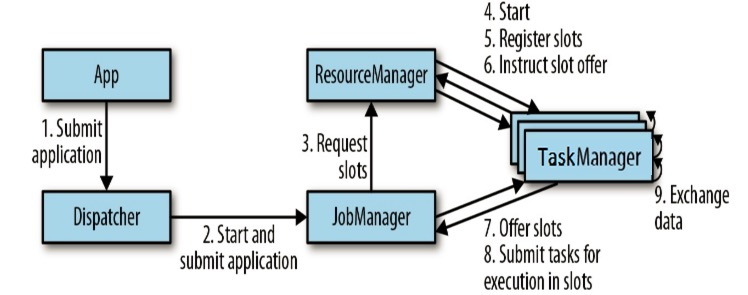
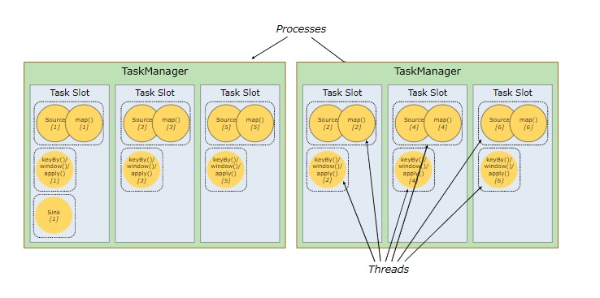

#   概述

## Flink的优势

* Apache Flink 是一个分布式大数据处理引擎，可对有限数据流和无限数据流进行有状态或无状态的计算，能够部署在各种集群环境，对各种规模大小的数据进行快速计算。
* 有状态的计算，状态容错性依赖于checkpoint机制做状态持久化存储。
* 多层API(Table/SQL API、DataStream/DataSet API、ProcessFunction API)
* exactly-once语义，状态一致性保证
* 低延迟，每秒处理数百万个事件，毫秒级别延迟。

## 流处理演变

### lambda架构

* 俩套系统，同时保证低延迟和结果准确。


* 开发维护、迭代比较麻烦，涉及到离线数仓和实时数仓的异构架构，难度偏大。

## Flink和SparkStreaming区别

* stream and micro-batching(流和微批)


* 数据模型
  * spark采用RDD模型，spark Streaming的DStream相当于对RDD序列的操作，是一小批一小批的RDD集合统称为DStream(离散流)
  * flink基本数据模型是数据流，以及事件序列。
* 运行时架构
  * spark是批计算，将DAG划分为不同的stage，一个stage完成后才可以计算下一个，通过BFS（宽度优先搜索）方式进行调度。
  * flink是标准的流执行模式，一个事件在一个节点处理完后可以直接发往下一个节点进行处理，operator粒度

# Flink集群架构

## 核心组件

按照上面的介绍，Flink 核心架构的第二层是 Runtime 层， 该层采用标准的 **Master - Slave** 结构， 其中，Master 部分又包含了三个核心组件：**Dispatcher、ResourceManager 和 JobManager**，而 Slave 则主要是 **TaskManager** 进程。它们的功能分别如下：

- **JobManagers** (也称为 *masters*) ：JobManagers 接收由 Dispatcher 传递过来的执行程序，该执行程序包含了作业图 (JobGraph)，逻辑数据流图 (logical dataflow graph) 及其所有的 classes 文件以及第三方类库 (libraries) 等等 。紧接着 JobManagers 会将 JobGraph 转换为执行图 (ExecutionGraph)，然后向 ResourceManager 申请资源来执行该任务，一旦申请到资源，就将执行图分发给对应的 TaskManagers 。因此每个作业 (Job) 至少有一个 JobManager；高可用部署下可以有多个 JobManagers，其中一个作为 *leader*，其余的则处于 *standby* 状态。
- **TaskManagers** (也称为 *workers*) : TaskManagers 负责实际的子任务 (subtasks) 的执行，每个 TaskManagers 都拥有一定数量的 slots。Slot 是一组固定大小的资源的合集 (如计算能力，存储空间)。TaskManagers 启动后，会将其所拥有的 slots 注册到 ResourceManager 上，由 ResourceManager 进行统一管理。
- **Dispatcher**：负责接收客户端提交的执行程序，并传递给 JobManager 。除此之外，它还提供了一个 WEB UI 界面，用于监控作业的执行情况。
- **ResourceManager** ：负责管理 slots 并协调集群资源。ResourceManager 接收来自 JobManager 的资源请求，并将存在空闲 slots 的 TaskManagers 分配给 JobManager 执行任务。Flink 基于不同的部署平台，如 YARN , Mesos，K8s 等提供了不同的资源管理器，当 TaskManagers 没有足够的 slots 来执行任务时，它会向第三方平台发起会话来请求额外的资源。



## Task & SubTask

上面我们提到：TaskManagers 实际执行的是 `SubTask`，而不是` Task`，这里解释一下两者的区别：

* 在执行分布式计算时，Flink 将可以链接的算子 (operators) 链接到一起，这就是 Task。之所以这样做， 是为了减少线程间切换和缓冲而导致的开销，在降低延迟的同时可以提高整体的吞吐量。 但不是所有的 operator 都可以被链接，如下 keyBy 等操作会导致网络 shuffle 和重分区（类似于Spark根据宽窄依赖区分Stage），因此其就不能被链接(operator chain)，只能被单独作为一个 Task。  简单来说，一个 Task 就是一个可以链接的最小的算子链 (Operator Chains) 。如下图，source 和 map 算子被链接到一块，因此整个作业就只有三个 Task：

  

* 解释完 Task ，我们在解释一下什么是 SubTask，其准确的翻译是： *A subtask is one parallel slice of a task*，即一个 Task 可以按照其并行度拆分为多个 SubTask。如上图，source & map 具有两个并行度，KeyBy 具有两个并行度，Sink 具有一个并行度，因此整个虽然只有 3 个 Task，但是却有 5 个 SubTask。Jobmanager 负责定义和拆分这些 SubTask，并将其交给 Taskmanagers 来执行，每个 SubTask 都是一个**单独的线程**。

## 资源管理

理解了 SubTasks ，我们再来看看其与 Slots 的对应情况。一种可能的分配情况如下：


* 这时每个 SubTask 线程运行在一个独立的 TaskSlot， 它们共享所属的 TaskManager 进程的TCP 连接（通过多路复用技术）和心跳信息 (heartbeat messages)，从而可以降低整体的性能开销。此时看似是最好的情况，但是每个操作需要的资源都是不尽相同的，这里假设该作业 keyBy 操作所需资源的数量比 Sink 多很多 ，那么此时 Sink 所在 Slot 的资源就没有得到有效的利用。
* 基于这个原因，Flink 允许多个 subtasks 共享 slots，即使它们是不同 tasks 的 subtasks，但只要它们来自同一个 Job 就可以。假设上面 souce & map 和 keyBy 的并行度调整为 6，而 Slot 的数量不变，此时情况如下：



* 可以看到一个 Task Slot 中运行了多个 SubTask ，此时每个subtask仍然在一个独立的线程中执行，只不过共享一组 Sot 资源而已。那么 Flink 到底如何确定一个 Job 至少需要多少个 Slot 呢？Flink 对于这个问题的处理很简单，默认情况一个 Job 所需要的 Slot 的数量就等于其 Operation 操作的最高并行度。如下， A，B，D 操作的并行度为 4，而 C，E 操作的并行度为 2，那么此时整个 Job 就需要至少四个 Slots 来完成。通过这个机制，Flink 就可以不必去关心一个 Job 到底会被拆分为多少个 Tasks 和 SubTasks。


* 资源比例：1 task: n subtask, 1 subtask: 1 slot,但是可以存在slot共享的情况，如果subtask对应的并行度一直不存在shuffle情况则可以共享一个slot。

## 组件通讯

* Flink 的所有组件都基于 Actor System 来进行通讯。Actor system是多种角色的 actor 的容器，它提供调度，配置，日志记录等多种服务，并包含一个可以启动所有 actor 的线程池，如果 actor 是本地的，则消息通过共享内存进行共享，但如果 actor 是远程的，则通过 RPC 的调用来传递消息。


# Flink安装

* 基于Flink1.10.x之前，Flink1.10.x之后请参考官方文档

## Local部署模式

* 安装JDK
* 下载flink对应版本压缩包
* 进入flink/bin目录下，运行start-cluster.sh命令
* 访问localhost:8081启动集群

## Standalone模式

* 配置ssh免密登录

### flink-conf.yaml

```yaml
# 配置javahome
env.java.home: /Library/Java/JavaVirtualMachines/jdk1.8.0_221.jdk/Contents/Home
# 配置master节点
jobmanager.rpc.address: hadoop
# 配置每个节点运行申请的最大的jobmanager内存和taskmanager内存
jobmanager.memory.process.size: 8096mb
taskmanager.memory.process.size: 2048mb
```

### workes配置

```shell
# 将worker节点ip地址配置在此文件中
hadoop1
hadoop2
```

### 集群命令

```shell
# 启动集群
bin/start-cluster.sh和bin/stop-cluster.sh
## 添加jm
bin/jobmanager.sh ((start|start-foreground) [host] [webui-port])|stop|stop-all
## 添加tm
bin/taskmanager.sh start|start-foreground|stop|stop-all
```

## Yarn模式

### 前置条件

```shell
# 环境变量中配置HADOOP_CLASSPATH
export HADOOP_CLASSPATH=/Users/babywang/Documents/reserch/studySummary/module/hadoop-2.8.5/etc/hadoop:/Users/babywang/Documents/reserch/studySummary/module/hadoop-2.8.5/share/hadoop/common/lib/*:/Users/babywang/Documents/reserch/studySummary/module/hadoop-2.8.5/share/hadoop/common/*:/Users/babywang/Documents/reserch/studySummary/module/hadoop-2.8.5/share/hadoop/hdfs:/Users/babywang/Documents/reserch/studySummary/module/hadoop-2.8.5/share/hadoop/hdfs/lib/*:/Users/babywang/Documents/reserch/studySummary/module/hadoop-2.8.5/share/hadoop/hdfs/*:/Users/babywang/Documents/reserch/studySummary/module/hadoop-2.8.5/share/hadoop/yarn/lib/*:/Users/babywang/Documents/reserch/studySummary/module/hadoop-2.8.5/share/hadoop/yarn/*:/Users/babywang/Documents/reserch/studySummary/module/hadoop-2.8.5/share/hadoop/mapreduce/lib/*:/Users/babywang/Documents/reserch/studySummary/module/hadoop-2.8.5/share/hadoop/mapreduce/*:/Users/babywang/Documents/reserch/studySummary/module/hadoop-2.8.5/contrib/capacity-scheduler/*.jar:/Users/babywang/Documents/reserch/studySummary/module/hbase/hbase-1.6.0/lib
```

* 下载`flink-shaded-hadoop-2-uber-2.8.3-10.0.jar`放在lib下，1.10.x版本之后无需再将hadoop相关jar防止flinkHome的lib下

### Session模式

* Session-Cluster模式需要先启动集群，然后再提交作业，接着会向yarn申请一块空间后，资源永远保持不变。如果资源满了，下个作业就无法提交类似于standalone模式。
* 所有作业共享**Dispatcher和RM**，共享资源，适合小规模执行时间短的作业。

```shell
yarn-session.sh
Usage:
   Optional
     -D <arg>                        Dynamic properties 动态参数
     -d,--detached                   Start detached # 后台进程
     -jm,--jobManagerMemory <arg>    Memory for JobManager Container with optional unit (default: MB) 
     -nm,--name                      Set a custom name for the application on YARN 自定义applicationName
     -at,--applicationType           Set a custom application type on YARN 自定义Yarn的应用类型
     -q,--query                      Display available YARN resources (memory, cores) 查看可用YARN的资源
     -qu,--queue <arg>               Specify YARN queue. 指定YARN队列
     -s,--slots <arg>                Number of slots per TaskManager 指定TaskManager可用的slot数
     -tm,--taskManagerMemory <arg>   Memory per TaskManager Container with optional unit (default: MB)
     -z,--zookeeperNamespace <arg>   Namespace to create the Zookeeper sub-paths for HA mode 高可用zookeeper的ZNODE名称
     
# 通过—D动态参数方式覆盖flink-conf.yaml中的默认值
yarn-session.sh -Dfs.overwrite-files=true -Dtaskmanager.memory.network.min=536346624.
```

* 提交任务

```shell
flink run 
	-c classname 启动的driver主类
	-C url 
	-d 指定运行job的模式为后台模式
	-n 不能重新执行savepoint的时候允许跳过
	-p 程序执行并行度
	-s 指定从某个savepoint路径恢复
	-t 执行模式， "collection", "remote", "local","kubernetes-session", "yarn-per-job", "yarn-session","yarn-application" and "kubernetes-application"
```

* `yarn.per-job-cluster.include-user-jar` 用户jar包

### Pre-Job-Cluster模式

* 整个Job会对应一个集群，每提交一个作业会根据自身的情况，都会单独向yarn申请资源，直到作业执行完成，一个作业的失败与否不会影响下一个作业的正常提交和运行。
* 独享Dispatcher和RM，按需接受资源申请，适合规模大长时间运行的作业。

```shell
flink run -t yarn-per-job -c dev.learn.flink.base.StreamingJob -d -yat flink -yjm 1024m -ytm 2048m -ynm test -ys 10 -p 2 -n flink-learn-1.0-SNAPSHOT.jar 
```

### application模式

```shell
# 运行WordCount
flink run-application -t yarn-application -Djobmanager.memory.process.size=2048m -Dtaskmanager.memory.process.size=4096m  ./examples/batch/WordCount.jar
```

* `yarn.provided.lib.dirs`提前在应用运行前提交的jar包

```shell
flink run-application -t yarn-application \
-Dyarn.provided.lib.dirs="hdfs://myhdfs/my-remote-flink-dist-dir" \
hdfs://myhdfs/jars/my-application.jar
```

* `yarn.application.priority`:设置提交顺序

## HA配置

### Standalone Cluster模式

* masters配置

```
hadoop:8081
hadoop:8082
```

* flink-conf.yaml配置

```yaml
# 高可用配置，默认是随机选择的
high-availability.jobmanager.port: 50000-50025
# 高可用模式配置
high-availability: zookeeper
# zookeeper配置
high-availability.zookeeper.quorum: hadoop:2181
# 高可用flink jobmanager存储zk ZNODE配置
high-availability.zookeeper.path.root: /flink
# jobManager元数据将保留在文件系统storageDir中，并且只有指向此状态的指针存储在ZooKeeper中。
high-availability.storageDir: hdfs:///flink1.11.1/ha/
```

* start-cluster.sh启动集群

### Yarn Cluster高可用

* yarn-site.xml

```xml
# 配置am的最大重试时间
<property>
  <name>yarn.resourcemanager.am.max-attempts</name>
  <value>4</value>
  <description>
    The maximum number of application master execution attempts.
  </description>
</property>
```

* flink-conf.yaml

```yaml
# application最大重试时间
yarn.application-attempts: 10
```

* 启动yarn cluster

```shell
yarn-session.sh -tm 2048m -jm 1024m -s 4 -d -nm test
```

# 原理剖析

## 运行时架构

### 运行时组件

* JobManager
  * 控制应用程序的主进程，每个应用程序会被一个不同的JobManager所控制执行。
  * JobManger会先接收到执行的应用程序，这个应用程序包含：作业图(JobGrap)、逻辑数据流图(logic dataflow graph)和打包了所有的类、库和其他资源的jar包。
  * jobManager会把JobGraph转换成一个物理层面的数据流图，这个图被叫做“执行图”（ExecutionGraph），包含了所有可以并行执行的任务。
  * JobManager会向RM请求执行任务必要的资源，就是tm所需的slot。一旦获取足够的资源，就会将执行图分发到真正运行它们的tm上。运行过程中，Jm负责所需要中央协调的操作，比如checkpoint、savepoint的元数据存储等。
* TaskManager
  * 任务管理器中资源调度的最小单元是taskSlot。taskManager中的taskSlot数表示并发处理任务的数量。
  * flink的工作进程存在多个，每个存在多个slot，slot的个数限制了tm执行任务的数量。
  * 启动后tm向rm注册它的slot，收到rm的指令后，tm会将一个或多个slot提供给jm调用。jm可以向slot分配tasks来执行。
  * 执行的过程中，一个tm可以跟其他运行同一个应用程序的tm交换数据。
* ResourceManager
  * ResourceManager负责Flink集群中的资源取消/分配和供应-它管理任务插槽，这些任务插槽是Flink集群中资源调度的单位（请参阅TaskManagers）。 Flink为不同的环境和资源提供者（例如YARN，Mesos，Kubernetes和独立部署）实现了多个ResourceManager。 在独立设置中，ResourceManager只能分配可用TaskManager的插槽，而不能自行启动新的TaskManager。
* Dispatcher
  * 可以跨作业运行，它为应用提交提供了REST接口。
  * 当一个应用被提交执行时，分发器就会启动并将应用移交给一个JM。
  * Dispatcher会启动一个Web UI，用来方便的展示和监听作业执行的信息。

### 作业提交流程

* 运行机制


* 任务调度


* Yarn提交流程

.jpg)

### 任务和算子调用链

* 对于分布式执行，Flink将操作符subtask连接到一起，形成多个task。每个task由一个线程执行。将操作符链接到任务中是一种有用的优化:它减少了线程到线程的切换和缓冲开销，提高了总体吞吐量，同时减少了延迟。
* 一个特定算子的子任务(subtask)的个数被称之为其并行度(parallelism)。一般情况下，一个stream的并行度，可以任务就是其所有算子中的最大并行度（`因为slot共享的原因`）。


### TaskManger和Slots

#### task和slot的关系

* Flink中每一个TaskManager都是一个JVM进程，它会在独立的线程上运行一个或多个subtask
* 为了控制一个taskmanager能接收多个task，TaskManager通过task slot来进行控制(一个TaskManager至少有一个slot)


#### slot共享

* 默认情况下，flink允许subtask共享slot，即使是不同task的subtask，这样的结果是一个slot可以保存作业的整个管道。
* 如果是同一步操作的并行subtask需要放到不同的slot，如果是先后发生的不同的subtask可以放在同一个slot中，实现slot的共享。
* 自定义slot共享组

```java
# 该算子之后的操作都放到一个共享的slot组里
.slotSharingGroup("a")
```


### 并行子任务的分配


## Flink执行分析

### 数据流(DataFlow)

* 运行时Flink上运行的程序会被映射成"逻辑数据流"(dataflows)，它包含了三个部分，sources、sink以及transformations。

### 执行图(ExecutionGraph)

* Flink的执行度分为4层:`StreamGraph->JobGraph->ExecutionGraph->物理执行图`
* **StreamGraph**:是根据用户通过 Stream API 编写的代码生成的最初的图。用来表示程序的拓扑结构。
* **JobGraph**：StreamGraph经过优化后生成了 JobGraph，提交给 JobManager 的数据结构。主要的优化为，将多个符合条件的节点 **chain 在一起作为一个节点**，这样可以减少数据在节点之间流动所需要的`序列化/反序列化/传输消耗`。
* **ExecutionGraph**：JobManager 根据 JobGraph 生成ExecutionGraph。**ExecutionGraph是JobGraph的并行化版本**，是调度层最核心的数据结构。
* **物理执行图**：JobManager 根据 ExecutionGraph 对 Job 进行调度后，在各个TaskManager 上部署 Task 后形成的“图”，并不是一个具体的数据结构。


### 数据传输形式

* 一个程序中，不同的算子可能具有不同的并行度。
* 算子之间传输数据的形式可以是`one-to-one(forwarding)的模式`也可以是`redistributing`的模式，具体是哪种形式取决于算子的种类。
  * one-to-one:stream维护着分区以及元素的顺序(比如source和map之间)。这意味着map算子的子任务看到的元素的个数以顺序跟source算子的subtask产生的元素的个数、顺序相同。map、filter、flatMap等算子都是one-to-one的对应关系，类似于Spark的map、flatmap、filter等同样类似于窄依赖。
  * redistributing:stream的分区会发生改变。每个算子的subtask根据所选择的trasnsformation发送数据到不同的目标任务。例如keyBy基于hashCode重分区、而broadcast和rebalance会随机重新分区，这些算子都会引起redistributing过程，而redistribute过程就类似于spark中的shuffle过程。

### 任务链(operator chains)

* Flink采用一种称为任务链的优化技术，可以在特定条件下减少本地通信的开销。为了满足任务链的要求，必须将两个或多个算子设为**相同的并行度，并通过本地转发(local forward)的方式**进行连接。
* `相同的并行度`的one-to-one操作，flink这样**相连的算子链接在一起形成一个task**，原来的算子成为里面的subtask。
* `并行度相同，并且是one-to-one`操作，可以将俩个task合并。


* 禁止合并任务链优化

```java
# 全局任务链切段
env.disableOperatorChaining()
# 切断算子任务链
datasource.uid("network-source").map(new WordCountMapFunction())
                .uid("map-id")
                .keyBy((KeySelector<Tuple2<String, Integer>, Object>) stringIntegerTuple2 -> stringIntegerTuple2.f0)
                .timeWindow(Time.seconds(30))
                .reduce(new SumReduceFunction()).disableChaining()
```

