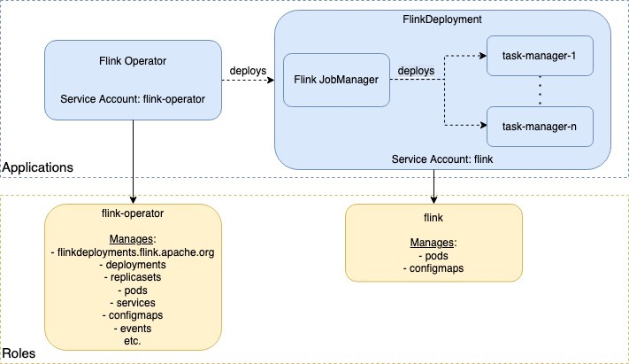

# Helm

## Helm installation

```shell
# 安装operator helm chart
helm install flink-kubernetes-operator helm/flink-kubernetes-operator
# 安装到指定k8s namespace，没有则新建
helm install flink-kubernetes-operator helm/flink-kubernetes-operator --namespace flink --create-namespace
```

## 重写配置进行helm install

```shell
helm install --set image.repository=apache/flink-kubernetes-operator --set image.tag=1.1.0 flink-kubernetes-operator helm/flink-kubernetes-operator
```

## Operator webhooks

* 为了在operator中使用webhooks，需要在k8s上安装cert-manager。

```shell
kubectl apply -f https://github.com/jetstack/cert-manager/releases/download/v1.8.2/cert-manager.yaml
```

## Watching only specific namespaces

* Operator支持监视FlinkDeployment资源的特定namespace列表。可以通过设置--set watchNamespaces={flink-test}参数启用它。当启用此功能时，基于角色的访问控制只针对operator和作业管理器的这些namespace创建，否则默认为集群作用域。
* 为k8s集群打标签

```shell
kubectl label namespace <target namespace name> kubernetes.io/metadata.name=<target namespace name>
```

* 根据自定义namespaceSelector，监听对应的namespace,key-value表示{定制的命名空间键:<目标命名空间名称>}

```yaml
namespaceSelector:
  matchExpressions:
    - key: customized_namespace_key
    operator: In
    values: [{{- range .Values.watchNamespaces }}{{ . | quote }},{{- end}}]
```

## 通过kustomize自定义K8s集群配置

* 使用`kustomize`定义a [fluent-bit](https://docs.fluentbit.io/manual) sidecar容器配置，使用value.yaml覆盖helm chart默认日志配置

```yaml
# value.yaml
defaultConfiguration:
  ...
  log4j-operator.properties: |+
    rootLogger.appenderRef.file.ref = LogFile
    appender.file.name = LogFile
    appender.file.type = File
    appender.file.append = false
    appender.file.fileName = ${sys:log.file}
    appender.file.layout.type = PatternLayout
    appender.file.layout.pattern = %d{yyyy-MM-dd HH:mm:ss,SSS} %-5p %-60c %x - %m%n    

jvmArgs:
  webhook: "-Dlog.file=/opt/flink/log/webhook.log -Xms256m -Xmx256m"
  operator: "-Dlog.file=/opt/flink/log/operator.log -Xms2048m -Xmx2048m"
```

* 以上配置不能够定义fluent-bit sidecar，需要通过`kustomize`来自定义sidecar配置

```yaml
# kustomize.yaml
################################################################################
#  Licensed to the Apache Software Foundation (ASF) under one
#  or more contributor license agreements.  See the NOTICE file
#  distributed with this work for additional information
#  regarding copyright ownership.  The ASF licenses this file
#  to you under the Apache License, Version 2.0 (the
#  "License"); you may not use this file except in compliance
#  with the License.  You may obtain a copy of the License at
#
#      http://www.apache.org/licenses/LICENSE-2.0
#
#  Unless required by applicable law or agreed to in writing, software
#  distributed under the License is distributed on an "AS IS" BASIS,
#  WITHOUT WARRANTIES OR CONDITIONS OF ANY KIND, either express or implied.
#  See the License for the specific language governing permissions and
# limitations under the License.
################################################################################

apiVersion: apps/v1
kind: Deployment
metadata:
  name: not-important
spec:
  template:
    spec:
      containers:
        - name: flink-kubernetes-operator
          volumeMounts:
            - name: flink-log
              mountPath: /opt/flink/log
          resources:
            requests:
              memory: "2.5Gi"
              cpu: "1000m"
            limits:
              memory: "2.5Gi"
              cpu: "2000m"
        - name: flink-webhook
          volumeMounts:
            - name: flink-log
              mountPath: /opt/flink/log
          resources:
            requests:
              memory: "0.5Gi"
              cpu: "200m"
            limits:
              memory: "0.5Gi"
              cpu: "500m"
        - name: fluentbit
          image: fluent/fluent-bit:1.8.12
          command: [ 'sh','-c','/fluent-bit/bin/fluent-bit -i tail -p path=/opt/flink/log/*.log -p multiline.parser=java -o stdout' ]
          volumeMounts:
            - name: flink-log
              mountPath: /opt/flink/log
      volumes:
        - name: flink-log
          emptyDir: { }
```

* 安装自定义配置k8s operator

```shell
helm install flink-kubernetes-operator flink-operator-repo/flink-kubernetes-operator -f examples/kustomize/sidecar/values.yaml --post-renderer examples/kustomize/sidecar/render
```

* 具体kustomize使用方式可以查看https://github.com/kubernetes-sigs/kustomize

# Configuration

## 指定Operator Configuration

* Operator允许用户指定由Flink Operator本身和Flink部署共享的默认配置。这个配置文件可以挂在到外部的ConfigMaps中，使用value.yaml配置自定义的配置通过`helm install flink-kubernetes-operator helm/flink-kubernetes-operator -f value.yaml`进行生效

```yaml
defaultConfiguration:
  create: true
  # flase表示会替换底层配置文件，true为append
  append: true
  flink-conf.yaml: |+
    # Flink Config Overrides
    kubernetes.operator.metrics.reporter.slf4j.factory.class: org.apache.flink.metrics.slf4j.Slf4jReporterFactory
    kubernetes.operator.metrics.reporter.slf4j.interval: 5 MINUTE

    kubernetes.operator.reconcile.interval: 15 s
    kubernetes.operator.observer.progress-check.interval: 5 s
```

## Dynamic Operator Configuration

* k8s operator支持通过operator ConfigMaps动态改变配置。动态operator配置默认是开启的，可以通过`kubernetes.operator.dynamic.config.enabled`设置为false关闭。时间线定期会校验动态配置是否改变，通过`kubernetes.operator.dynamic.config.check.interval`设置check间隔，默认为5分钟。
* 通过`kubectl edit cm`或者`kubectl patch`修改configmap配置。

# RBAC模型

## Role-Based Access Control Model

* 为了能够部署operator本身和Flink作业，我们定义了两个独立的Kubernetes角色。前者称为`flink-operator` 角色，用于管理flinkdeployment，为每个Flink作业和其他资源(如服务)创建和管理JobManager deployment。后者称为`flink`角色，作业的JobManagers使用它来创建和管理作业的TaskManagers和ConfigMaps。



* 这些service account和roles可以通过helm chart创建，默认情况下`flink-operator`角色是集群作用域(创建为`clusterrole`)，因此运行单个operator实例负责k8s的全部Flink deployments(jobs)，而不管它们部署到哪个`namespace`。某些环境的限制更严格，只允许使用namespace的角色，因此我们还通过`watchNamespaces`支持这个选项。
* `flink`角色总是有namespace的，默认情况下它是在operator的namespace中创建的。当`watchNamespaces`被启用时，它将分别为所有被监视的namespace创建。

## 在其他namesapce中运行作业的集群作用域Flink Operator

* 切换运行是的namespace

```shell
kubectl config set-context --current --namespace=flink
```

* 创建service account、role和role binding

```yaml
kubectl apply -f - <<EOF
apiVersion: v1
kind: ServiceAccount
metadata:
  labels:
    app.kubernetes.io/name: flink-kubernetes-operator
    app.kubernetes.io/version: 1.0.1
  name: flink
---
apiVersion: rbac.authorization.k8s.io/v1
kind: Role
metadata:
  labels:
    app.kubernetes.io/name: flink-kubernetes-operator
    app.kubernetes.io/version: 1.0.1
  name: flink
rules:
- apiGroups:
  - ""
  resources:
  - pods
  - configmaps
  verbs:
  - '*'
- apiGroups:
  - apps
  resources:
  - deployments
  verbs:
  - '*'
---
apiVersion: rbac.authorization.k8s.io/v1
kind: RoleBinding
metadata:
  labels:
    app.kubernetes.io/name: flink-kubernetes-operator
    app.kubernetes.io/version: 1.0.1
  name: flink-role-binding
roleRef:
  apiGroup: rbac.authorization.k8s.io
  kind: Role
  name: flink
subjects:
- kind: ServiceAccount
  name: flink
EOF
```

* 运行对应任务

```shell
kubectl apply -f author_namespace_job.yaml
```

# Ingress

## 基础环境

* 安装ingress-controller

```shell
helm upgrade --install ingress-nginx ingress-nginx \
  --repo https://kubernetes.github.io/ingress-nginx \
  --namespace ingress-nginx --create-namespace
```

## 访问Flink WebUI

* 除了原生选项外，operator还支持创建ingress entries来使得外部访问UI，通过在`FlinkDeployment`的`ingress`字段可以定义相关配置

## 配置ingress

* 定义ingress class，通过配置`annotations`和`ingressClassName`可以通过`https://flink.k8s.io/flink/advanced-ingress/`来访问flink web ui。

```yaml
apiVersion: networking.k8s.io/v1
kind: Ingress
metadata:
  name: advanced-ingress
  annotations:
    nginx.ingress.kubernetes.io/rewrite-target: /$2
  namespace: flink
spec:
  ingressClassName: nginx
  rules:
  - host: localhost
  - http:
      paths:
      - path: /flink/advanced-ingress(/|$)(.*)
        pathType: ImplementationSpecific
        backend:
          service:
            name: advanced-ingress-rest
            port:
              number: 8081
```

* 配置nginx相关配置支持访问基本的url没有跟踪/可以重定向。当使用NGINX作为Ingress-controller时，这可以通过在Ingress定义中添加一个额外的annotations来实现:

```yaml
nginx.ingress.kubernetes.io/configuration-snippet: |
if ($uri = "/default/advanced-ingress") {rewrite .* $1/default/advanced-ingress/ permanent;}
```

* 在`FlinkDeployment`中添加ingress配置

```yaml
metadata:
  namespace: default
  name: advanced-ingress
spec:
  image: flink:1.15
  flinkVersion: v1_15
  ingress:
    template: "flink.k8s.io/{{namespace}}/{{name}}(/|$)(.*)"
    className: "nginx"
    annotations:
      nginx.ingress.kubernetes.io/rewrite-target: "/$2"
```

# Operator升级

## 正常的升级流程

* 升级自定义资源Deployments(CRD)
* 升级helm deployment

### 升级CRD

* 升级用于`FlinkDeployment和FlinkSessionJob`资源的crd

```shell
kubectl replace -f helm/flink-kubernetes-operator/crds/flinkdeployments.flink.apache.org-v1.yml
kubectl replace -f helm/flink-kubernetes-operator/crds/flinksessionjobs.flink.apache.org-v1.yml
```

### 升级helm deployment

```shell
# Uninstall running Helm deployment
helm uninstall flink-kubernetes-operator
helm install ...
```

## 升级版本v1alpha1 -> v1beta1

### 升级没有创建的FlinkDeployments

```shell
helm uninstall flink-kubernetes-operator
kubectl delete crd flinkdeployments.flink.apache.org
```

### 升级已经存在的FlinkDeployments

* 停止job并创建savepoint，前提任务配置要指定savepoint location

```shell
kubectl patch flinkdeployment/savepoint-job --type=merge -p '{"spec": {"job": {"state": "suspended", "upgradeMode": "savepoint"}}}'
```

* 删除job

```shell
kubectl delete flinkdeployment/savepoint-job
```

* 卸载旧的operator和crd

```shell
helm uninstall flink-kubernetes-operator
kubectl delete crd flinkdeployments.flink.apache.org
```

* 安装新的operator和crd

```shell
helm repo update flink-operator-repo
helm install flink-kubernetes-operator flink-operator-repo/flink-kubernetes-operator
```

* 重启任务,指定初始化savepoint路径

```yaml
spec:
  ...
  job:
    initialSavepointPath: /flink-data/savepoints/savepoint-000000-aec3dd08e76d/_metadata
  ...
```

