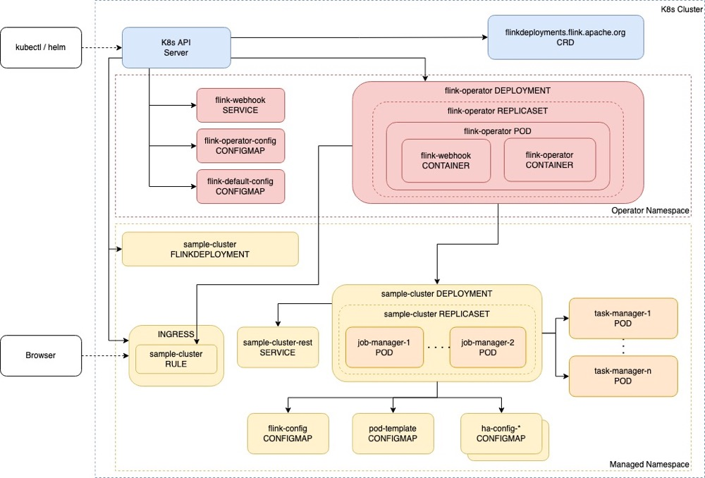
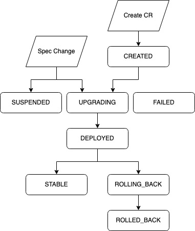

# OverView

* Flink On K8s Operator是Flink 1.15大版本推出的Flink On K8s方案，之前Flink社区提供的Flink Native K8s方式相对来说使用繁琐并且没有统一的容器管理方案，整体任务管理起来比较复杂。因此社区基于flink-kubernetes底层sdk开发基于operator的flink k8s方案，其提供更加成熟的容器管理方案。

## 核心特点

* **全自动作业生命周期管理**
  * 运行、挂起和删除应用
  * 有状态和无状态的应用程序升级
  * 触发和管理savepoints
  * 处理错误，回滚异常的升级
* **支持多版本flink:v1.13，v1.14，v1.15**
* **多种部署模式支持**
  * Application Cluster
  * Session Cluster
  * Session Job
* **支持高可用**
* **可扩展的架构**
  * 自定义校验器
  * 自定义资源监听器
* **更先进的配置管理**
  * 默认配置动态更新
  * 预配置job
  * 环境变量
* **支持pod template增强pod**
  * native kubernetes pod定义
  * 分层 (Base/JobManager/TaskManager overrides)

## Operations

* **Operator Mertrics**
  * 采用flink指标系统
  * 插件化指标上报器
  * 详细资源和Kubernetes API访问指标
* 完全自定义log
  * 默认log配置
  * per job log配置
  * 基于Sidecar的日志转发器
* Flink web ui和rest入口访问
  * 支持flink native k8s的全部expose type
  * Dynamic [Ingress templates](https://nightlies.apache.org/flink/flink-kubernetes-operator-docs-main/docs/operations/ingress/)
* Helm based installation
  - Automated [RBAC configuration](https://nightlies.apache.org/flink/flink-kubernetes-operator-docs-main/docs/operations/rbac/)
  - Advanced customization techniques
* 最新的公共存储库
  - GitHub Container Registry [ghcr.io/apache/flink-kubernetes-operator](http://ghcr.io/apache/flink-kubernetes-operator)
  - DockerHub https://hub.docker.com/r/apache/flink-kubernetes-operator

# Architecture

* Flink Kubernetes Operator (Operator)作为一个**控制平台**，管理Apache Flink应用的整个**部署生命周期**。**Operator**可以通过**Helm**安装在**Kubernetes**集群上。在大多数生产环境中，它通常部署在指定的**namespace**中，并在一个或多个托管**namespace**中控制Flink的部署。

## 控制流程

* 用户可以使用Kubernetes命令行工具kubectl与operator进行交互。operator持续跟踪**FlinkDeployment**/**FlinkSessionJob**自定义资源相关的集群事件。当operator收到新的资源更新时，它将采取行动将Kubernetes集群调整到所需的状态，作为和解循环的一部分。初始循环由以下高级步骤组成:
  * 用户通过`kubectl`提交一个`FlinkDeployment/FlinkSessionJob`的自定义资源。
  * Operator观察flink资源(如果先前部署)的当前状态
  * Operator校验提交资源的改变
  * Operator协调任何需要的更改并执行升级
* 自定义资源能够在任何时间应用于集群中。Operator不断地根据期望状态进行调整，直到当前状态变为期望状态。在Operator中，所有生命周期管理操作都使用这个非常简单的原则来实现。

## Flink资源生命周期

* Operator管理者flink资源的生命周期，Flink资源的生命周期各个阶段如下图：

- CREATED : The resource was created in Kubernetes but not yet handled by the operator
- SUSPENDED : The (job) resource has been suspended
- UPGRADING : The resource is suspended before upgrading to a new spec
- DEPLOYED : The resource is deployed/submitted to Kubernetes, but it’s not yet considered to be stable and might be rolled back in the future
- STABLE : The resource deployment is considered to be stable and won’t be rolled back
- ROLLING_BACK : The resource is being rolled back to the last stable spec
- ROLLED_BACK : The resource is deployed with the last stable spec
- FAILED : The job terminally failed

