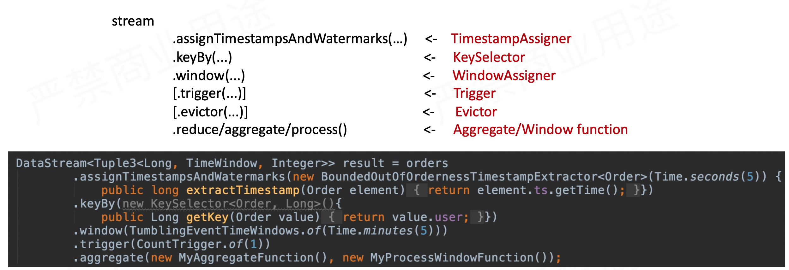
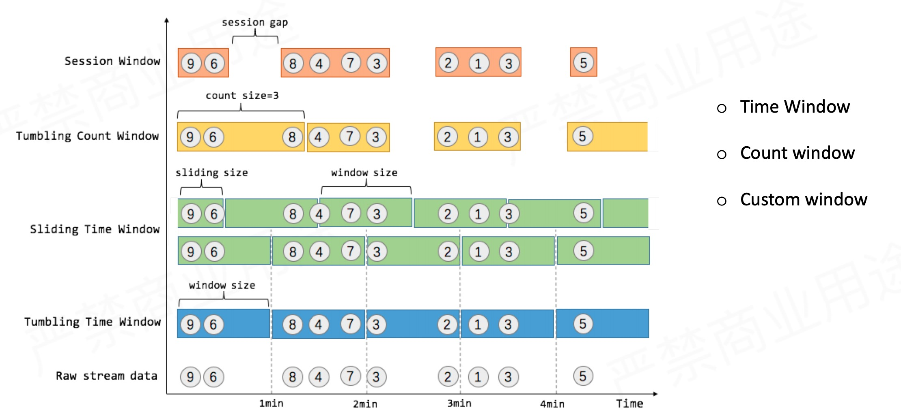
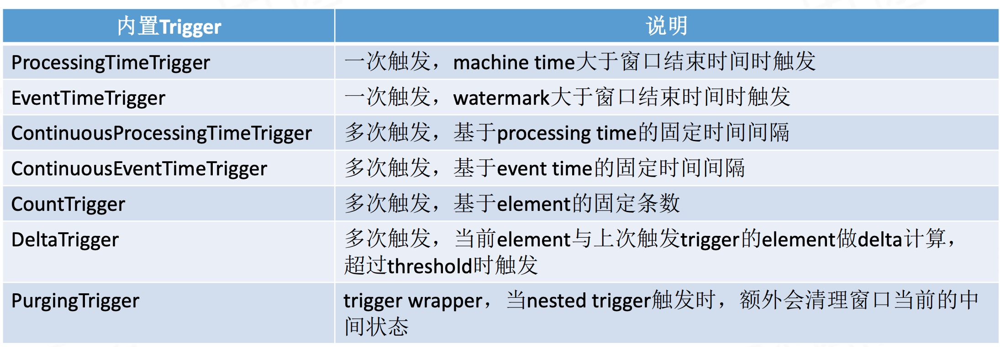

# 概念

## 使用场景

* 聚合统计相关，统计小时、天等级别的聚合数据
* 记录合并操作
* 双流join，通过interval join方式去join一个时间窗口类的记录

## Window抽象概念


* TimestampAsasigner:指定记录中作为记录eventtime的字段
* keySelector:选择记录中的列作为key的键
* WindowAssigner:将记录划分一个个的窗口
* State:存储的中间状态，状态可以调用增量集合函数，增量的方式计算状态
* Trigger:  决定什么时候触发window的计算
* Evictor: 过滤不需要的记录
* WindowFunction: 窗口计算记录然后输出

## Window编程接口



## Window Assigner

* 时间窗口
* 记录窗口
* 自定义窗口



## Window Trigger



### 默认Triggers

* 对于Eventtime window asigners的triggers是EventTimeTrigger
* GlobalWindow的是NeverTrigger

### Fire and Purge

* 一旦触发器确定好一个窗口已经准备处理，它触发计算，它返回FIRE或者FIRE_AND_PURGE。这是窗口操作符发出当前窗口结果的信号。给定一个带有ProcessWindowFunction的窗口，所有元素都被传递给ProcessWindowFunction(可能在将它们传递给驱逐器之后)。使用ReduceFunction、AggregateFunction或FoldFunction的窗口只会发出它们急切地聚合的结果。
* 当触发器触发时，它既可以触发也可以触发并清除。FIRE保留窗口的内容，而FIRE_AND_PURGE则删除其内容。默认情况下，预先实现的触发器只是在不清除窗口状态的情况下触发。

### DeltaTrigger

* 计算当前窗口的记录和上次触发窗口计算的记录进行计算，如果超过指定的阈值则触发窗口

```java
  public void deltaTrigger() {
        StreamExecutionEnvironment env = StreamExecutionEnvironment.getExecutionEnvironment();

        env.fromElements(1, 2, 3, 4, 5)
                .keyBy(new KeySelector<Integer, Integer>() {
                    @Override
                    public Integer getKey(Integer value) throws Exception {
                        return value;
                    }
                }).window(GlobalWindows.create())
                .trigger(DeltaTrigger.of(10000, (oldDataPoint, newDataPoint) -> {
                    return newDataPoint - oldDataPoint;
                }, IntSerializer.INSTANCE)).max(1);
    }
```

## Window Evictor

### 内置Evictor

* CountEvictor:窗口计算时，只保留最近N条element
* TimeEvictor:窗口计算时，只保留最近N段时间范围的element
* DeltaEvictor:窗口计算时，最新的一条element与其他element做delta计算，保留delta在threshold内的element

### TimeEvictor

```java
    public void timeEvictor() {
        StreamExecutionEnvironment env = StreamExecutionEnvironment.getExecutionEnvironment();
        env.fromElements(1, 23, 4, 5, 6)
                .keyBy((KeySelector<Integer, Integer>) value -> value)
                .window(GlobalWindows.create())
                // 只看最近5分钟的记录
                .evictor(TimeEvictor.of(Time.minutes(5)))
                .trigger(PurgingTrigger.of(CountTrigger.of(5)))
                .max(1);
    }
```

## WindowFunction

### AggregateFunction

* 高度抽象的增量聚合函数

### ProcessWindowFunction

* 低级别抽象的全量聚合函数

### ReduceFunction

* 聚合函数，指定俩个元素如何去聚合并且输出相同类型的元素

### FoldFunction

* FoldFunction指定窗口的输入元素如何与输出类型的元素组合。对于添加到窗口的每个元素和当前输出值，将递增地调用FoldFunction。第一个元素与输出类型的预定义初始值组合在一起。

```java
input
    .keyBy(<key selector>)
    .window(<window assigner>)
    .fold("", new FoldFunction<Tuple2<String, Long>, String>> {
       public String fold(String acc, Tuple2<String, Long> value) {
         return acc + value.f1;
       }
    });
```

# 工作流程和实现机制

## WindowOperator工作流程

```java
public void processElement(StreamRecord<IN> element) throws Exception {
  // 获取元素规则的windows，windowAssigner来分配
		final Collection<W> elementWindows = windowAssigner.assignWindows(
			element.getValue(), element.getTimestamp(), windowAssignerContext);

		//if element is handled by none of assigned elementWindows
		boolean isSkippedElement = true;

		final K key = this.<K>getKeyedStateBackend().getCurrentKey();

		if (windowAssigner instanceof MergingWindowAssigner) {
			MergingWindowSet<W> mergingWindows = getMergingWindowSet();

			for (W window: elementWindows) {

				// adding the new window might result in a merge, in that case the actualWindow
				// is the merged window and we work with that. If we don't merge then
				// actualWindow == window
				W actualWindow = mergingWindows.addWindow(window, new MergingWindowSet.MergeFunction<W>() {
					@Override
					public void merge(W mergeResult,
							Collection<W> mergedWindows, W stateWindowResult,
							Collection<W> mergedStateWindows) throws Exception {

						if ((windowAssigner.isEventTime() && mergeResult.maxTimestamp() + allowedLateness <= internalTimerService.currentWatermark())) {
							throw new UnsupportedOperationException("The end timestamp of an " +
									"event-time window cannot become earlier than the current watermark " +
									"by merging. Current watermark: " + internalTimerService.currentWatermark() +
									" window: " + mergeResult);
						} else if (!windowAssigner.isEventTime()) {
							long currentProcessingTime = internalTimerService.currentProcessingTime();
							if (mergeResult.maxTimestamp() <= currentProcessingTime) {
								throw new UnsupportedOperationException("The end timestamp of a " +
									"processing-time window cannot become earlier than the current processing time " +
									"by merging. Current processing time: " + currentProcessingTime +
									" window: " + mergeResult);
							}
						}

						triggerContext.key = key;
						triggerContext.window = mergeResult;

						triggerContext.onMerge(mergedWindows);

						for (W m: mergedWindows) {
							triggerContext.window = m;
							triggerContext.clear();
							deleteCleanupTimer(m);
						}

						// merge the merged state windows into the newly resulting state window
						windowMergingState.mergeNamespaces(stateWindowResult, mergedStateWindows);
					}
				});

				// drop if the window is already late
				if (isWindowLate(actualWindow)) {
					mergingWindows.retireWindow(actualWindow);
					continue;
				}
				isSkippedElement = false;

				W stateWindow = mergingWindows.getStateWindow(actualWindow);
				if (stateWindow == null) {
					throw new IllegalStateException("Window " + window + " is not in in-flight window set.");
				}

				windowState.setCurrentNamespace(stateWindow);
				windowState.add(element.getValue());

				triggerContext.key = key;
				triggerContext.window = actualWindow;

				TriggerResult triggerResult = triggerContext.onElement(element);

				if (triggerResult.isFire()) {
					ACC contents = windowState.get();
					if (contents == null) {
						continue;
					}
					emitWindowContents(actualWindow, contents);
				}

				if (triggerResult.isPurge()) {
					windowState.clear();
				}
				registerCleanupTimer(actualWindow);
			}

			// need to make sure to update the merging state in state
			mergingWindows.persist();
		} else {
			for (W window: elementWindows) {

				// drop if the window is already late
				if (isWindowLate(window)) {
					continue;
				}
				isSkippedElement = false;

				windowState.setCurrentNamespace(window);
				windowState.add(element.getValue());

				triggerContext.key = key;
				triggerContext.window = window;

				TriggerResult triggerResult = triggerContext.onElement(element);

				if (triggerResult.isFire()) {
					ACC contents = windowState.get();
					if (contents == null) {
						continue;
					}
					emitWindowContents(window, contents);
				}

				if (triggerResult.isPurge()) {
					windowState.clear();
				}
				registerCleanupTimer(window);
			}
		}

		// side output input event if
		// element not handled by any window
		// late arriving tag has been set
		// windowAssigner is event time and current timestamp + allowed lateness no less than element timestamp
		if (isSkippedElement && isElementLate(element)) {
			if (lateDataOutputTag != null){
				sideOutput(element);
			} else {
				this.numLateRecordsDropped.inc();
			}
		}
	}
```

1. 获取element归属的windows
2. 获取element对应的key
3. 如果late data，跳过
4. 将element存入window state
5. 判断element是否触发trigger
6. 获取window state，注入window function
7. 清除window state
8. 注册timer，到窗口结束时间清理window

## Window State

### ListState

* process()/evitor()
* 全量状态计算

### AggregatingState

* Reduce()/aggregate()
* 增量状态计算

```java
public void add(IN value) throws IOException {
        N namespace = this.currentNamespace;
        if (value == null) {
            this.clear();
        } else {
            try {
                this.stateTable.transform(namespace, value, this.aggregateTransformation);
            } catch (Exception var4) {
                throw new IOException("Exception while applying AggregateFunction in aggregating state", var4);
            }
        }
    }
```

## Window Function

* 根据指定的`window function`，将window的记录放入prcoess中

```java
private void emitWindowContents(W window, ACC contents) throws Exception {
		timestampedCollector.setAbsoluteTimestamp(window.maxTimestamp());
		processContext.window = window;
		userFunction.process(triggerContext.key, window, processContext, contents, timestampedCollector);
	}
```

# 源码分析

## timeWindow

* timeWindow(Time size)指定滚动窗口的窗口大小

```java
public WindowedStream<T, KEY, TimeWindow> timeWindow(Time size) {
		// 根据不同的时间语义生成不同的WindowAssigner
		if (environment.getStreamTimeCharacteristic() == TimeCharacteristic.ProcessingTime) {
			return window(TumblingProcessingTimeWindows.of(size));
		} else {
			return window(TumblingEventTimeWindows.of(size));
		}
	}
```

* timeWindow(Time size, Time slide)指定滑动窗口大小和步长

```java
public WindowedStream<T, KEY, TimeWindow> timeWindow(Time size, Time slide) {
		if (environment.getStreamTimeCharacteristic() == TimeCharacteristic.ProcessingTime) {
			return window(SlidingProcessingTimeWindows.of(size, slide));
		} else {
			return window(SlidingEventTimeWindows.of(size, slide));
		}
	}
```

## countWindow

```java
public WindowedStream<T, KEY, GlobalWindow> countWindow(long size) {
		// 指定全局窗口，数据满size时触发窗口，并且每触发后清空窗口记录
		return window(GlobalWindows.create()).trigger(PurgingTrigger.of(CountTrigger.of(size)));
	}

public WindowedStream<T, KEY, GlobalWindow> countWindow(long size, long slide) {
		// 全局窗口，取前size中取slide数据
		return window(GlobalWindows.create())
				.evictor(CountEvictor.of(size))
				.trigger(CountTrigger.of(slide));
	}
```

## WindowStream

### reduce

```java
public <R> SingleOutputStreamOperator<R> reduce(
			ReduceFunction<T> reduceFunction,
			WindowFunction<T, R, K, W> function,
			TypeInformation<R> resultType) {

		if (reduceFunction instanceof RichFunction) {
			throw new UnsupportedOperationException("ReduceFunction of reduce can not be a RichFunction.");
		}

		//clean the closures
		function = input.getExecutionEnvironment().clean(function);
		reduceFunction = input.getExecutionEnvironment().clean(reduceFunction);
		// 生成算子名称
		final String opName = generateOperatorName(windowAssigner, trigger, evictor, reduceFunction, function);
		KeySelector<T, K> keySel = input.getKeySelector();

		OneInputStreamOperator<T, R> operator;
		// 判断是否指定evictor创建不同的窗口算子
		if (evictor != null) {
			@SuppressWarnings({"unchecked", "rawtypes"})
				// 获取streamRecord序列化器
			TypeSerializer<StreamRecord<T>> streamRecordSerializer =
				(TypeSerializer<StreamRecord<T>>) new StreamElementSerializer(input.getType().createSerializer(getExecutionEnvironment().getConfig()));

			// 创建ListState，用于存储窗口内容
			ListStateDescriptor<StreamRecord<T>> stateDesc =
				new ListStateDescriptor<>("window-contents", streamRecordSerializer);

			// 创建EvictingWindowOperator
			operator =
				new EvictingWindowOperator<>(windowAssigner,
					windowAssigner.getWindowSerializer(getExecutionEnvironment().getConfig()),
					keySel,
					input.getKeyType().createSerializer(getExecutionEnvironment().getConfig()),
					stateDesc,
					new InternalIterableWindowFunction<>(new ReduceApplyWindowFunction<>(reduceFunction, function)),
					trigger,
					evictor,
					allowedLateness,
					lateDataOutputTag);

		} else {
			// 创建Reducing状态，将reduce函数传入
			ReducingStateDescriptor<T> stateDesc = new ReducingStateDescriptor<>("window-contents",
				reduceFunction,
				input.getType().createSerializer(getExecutionEnvironment().getConfig()));

			operator =
				new WindowOperator<>(windowAssigner,
					windowAssigner.getWindowSerializer(getExecutionEnvironment().getConfig()),
					keySel,
					input.getKeyType().createSerializer(getExecutionEnvironment().getConfig()),
					stateDesc,
					new InternalSingleValueWindowFunction<>(function),
					trigger,
					allowedLateness,
					lateDataOutputTag);
		}

		// 算子加入算子链条
		return input.transform(opName, resultType, operator);
	}
```

### EvictingWindowOperator

#### processElement

```java
public void processElement(StreamRecord<IN> element) throws Exception {
		// 获取元素窗口集合
		final Collection<W> elementWindows = windowAssigner.assignWindows(
			element.getValue(), element.getTimestamp(), windowAssignerContext);

		//if element is handled by none of assigned elementWindows
		boolean isSkippedElement = true;

		final K key = this.<K>getKeyedStateBackend().getCurrentKey();
		// 如果为合并窗口
		if (windowAssigner instanceof MergingWindowAssigner) {
			// 获取
			MergingWindowSet<W> mergingWindows = getMergingWindowSet();
			// 遍历窗口
			for (W window: elementWindows) {

				// adding the new window might result in a merge, in that case the actualWindow
				// is the merged window and we work with that. If we don't merge then
				// actualWindow == window
				// 添加窗口
				W actualWindow = mergingWindows.addWindow(window, new MergingWindowSet.MergeFunction<W>() {
					/**
					 * merge函数
					 * @param mergeResult The newly resulting merged {@code Window}.
					 * @param mergedWindows The merged {@code Window Windows}.
					 * @param stateWindowResult The state window of the merge result.
					 * @param mergedStateWindows The merged state windows.
					 * @throws Exception
					 */
					@Override
					public void merge(W mergeResult,
							Collection<W> mergedWindows, W stateWindowResult,
							Collection<W> mergedStateWindows) throws Exception {
						// 如果是事件时间，获取最大时间+延迟时间如果小于等于watermark则抛出一次，窗口的最新时间不能低于当前watermark在合并的时候
						if ((windowAssigner.isEventTime() && mergeResult.maxTimestamp() + allowedLateness <= internalTimerService.currentWatermark())) {
							throw new UnsupportedOperationException("The end timestamp of an " +
									"event-time window cannot become earlier than the current watermark " +
									"by merging. Current watermark: " + internalTimerService.currentWatermark() +
									" window: " + mergeResult);
						} else if (!windowAssigner.isEventTime()) {
							// 时间时间，判断最大窗口是否能超过watermark
							long currentProcessingTime = internalTimerService.currentProcessingTime();
							if (mergeResult.maxTimestamp() <= currentProcessingTime) {
								throw new UnsupportedOperationException("The end timestamp of a " +
									"processing-time window cannot become earlier than the current processing time " +
									"by merging. Current processing time: " + currentProcessingTime +
									" window: " + mergeResult);
							}
						}

						triggerContext.key = key;
						triggerContext.window = mergeResult;

						triggerContext.onMerge(mergedWindows);

						for (W m: mergedWindows) {
							triggerContext.window = m;
							triggerContext.clear();
              // 合并窗口，删除需要输出和清空的窗口
							deleteCleanupTimer(m);
						}

						// merge the merged state windows into the newly resulting state window
						windowMergingState.mergeNamespaces(stateWindowResult, mergedStateWindows);
					}
				});

				// drop if the window is already late
				// 移除合并窗口
				if (isWindowLate(actualWindow)) {
					mergingWindows.retireWindow(actualWindow);
					continue;
				}
				isSkippedElement = false;

				W stateWindow = mergingWindows.getStateWindow(actualWindow);
				if (stateWindow == null) {
					throw new IllegalStateException("Window " + window + " is not in in-flight window set.");
				}

				windowState.setCurrentNamespace(stateWindow);
				windowState.add(element.getValue());

				triggerContext.key = key;
				triggerContext.window = actualWindow;

				// 处理元素
				TriggerResult triggerResult = triggerContext.onElement(element);

				// 如果结果为输出
				if (triggerResult.isFire()) {
					// 获取最窗口内容
					ACC contents = windowState.get();
					if (contents == null) {
						continue;
					}
					// 输出窗口，数据放入udf，收集时间戳
					emitWindowContents(actualWindow, contents);
				}

				// 清空窗口
				if (triggerResult.isPurge()) {
					windowState.clear();
				}
				// 注册清空时间器，用于清空窗口内容
				registerCleanupTimer(actualWindow);
			}

			// need to make sure to update the merging state in state
			mergingWindows.persist();
		} else {
			for (W window: elementWindows) {

				// drop if the window is already late
				if (isWindowLate(window)) {
					continue;
				}
				isSkippedElement = false;

				windowState.setCurrentNamespace(window);
				windowState.add(element.getValue());

				triggerContext.key = key;
				triggerContext.window = window;

				TriggerResult triggerResult = triggerContext.onElement(element);

				if (triggerResult.isFire()) {
					ACC contents = windowState.get();
					if (contents == null) {
						continue;
					}
					emitWindowContents(window, contents);
				}

				if (triggerResult.isPurge()) {
					windowState.clear();
				}
        				// 输出并清空
				registerCleanupTimer(window);
			}
		}

		// side output input event if
		// element not handled by any window
		// late arriving tag has been set
		// windowAssigner is event time and current timestamp + allowed lateness no less than element timestamp
		if (isSkippedElement && isElementLate(element)) {
			if (lateDataOutputTag != null){
				sideOutput(element);
			} else {
				this.numLateRecordsDropped.inc();
			}
		}
	}
```

####  registerCleanupTimer注册的定时器

```java
public void onEventTime(InternalTimer<K, W> timer) throws Exception {
		triggerContext.key = timer.getKey();
		triggerContext.window = timer.getNamespace();

		MergingWindowSet<W> mergingWindows;

		if (windowAssigner instanceof MergingWindowAssigner) {
			mergingWindows = getMergingWindowSet();
			W stateWindow = mergingWindows.getStateWindow(triggerContext.window);
			if (stateWindow == null) {
				// Timer firing for non-existent window, this can only happen if a
				// trigger did not clean up timers. We have already cleared the merging
				// window and therefore the Trigger state, however, so nothing to do.
				return;
			} else {
				windowState.setCurrentNamespace(stateWindow);
			}
		} else {
			windowState.setCurrentNamespace(triggerContext.window);
			mergingWindows = null;
		}

		TriggerResult triggerResult = triggerContext.onEventTime(timer.getTimestamp());

		if (triggerResult.isFire()) {
			ACC contents = windowState.get();
			if (contents != null) {
				emitWindowContents(triggerContext.window, contents);
			}
		}

		if (triggerResult.isPurge()) {
			windowState.clear();
		}

		if (windowAssigner.isEventTime() && isCleanupTime(triggerContext.window, timer.getTimestamp())) {
			clearAllState(triggerContext.window, windowState, mergingWindows);
		}

		if (mergingWindows != null) {
			// need to make sure to update the merging state in state
			mergingWindows.persist();
		}
	}

	@Override
	public void onProcessingTime(InternalTimer<K, W> timer) throws Exception {
		triggerContext.key = timer.getKey();
		triggerContext.window = timer.getNamespace();

		MergingWindowSet<W> mergingWindows;

		if (windowAssigner instanceof MergingWindowAssigner) {
			mergingWindows = getMergingWindowSet();
			W stateWindow = mergingWindows.getStateWindow(triggerContext.window);
			if (stateWindow == null) {
				// Timer firing for non-existent window, this can only happen if a
				// trigger did not clean up timers. We have already cleared the merging
				// window and therefore the Trigger state, however, so nothing to do.
				return;
			} else {
				windowState.setCurrentNamespace(stateWindow);
			}
		} else {
			windowState.setCurrentNamespace(triggerContext.window);
			mergingWindows = null;
		}

		TriggerResult triggerResult = triggerContext.onProcessingTime(timer.getTimestamp());

		if (triggerResult.isFire()) {
			ACC contents = windowState.get();
			if (contents != null) {
				emitWindowContents(triggerContext.window, contents);
			}
		}

		if (triggerResult.isPurge()) {
			windowState.clear();
		}

		if (!windowAssigner.isEventTime() && isCleanupTime(triggerContext.window, timer.getTimestamp())) {
			clearAllState(triggerContext.window, windowState, mergingWindows);
		}

		if (mergingWindows != null) {
			// need to make sure to update the merging state in state
			mergingWindows.persist();
		}
	}
```

### aggregate

#### AggregateFunction

```java
public interface AggregateFunction<IN, ACC, OUT> extends Function, Serializable {

	/**
	 * 创建新的计数器，开始一个新的聚合
	 */
	ACC createAccumulator();

	/**
	 * 添加给定输入到给定计数器，返回新的计数器值
	 */
	ACC add(IN value, ACC accumulator);

	/**
	 * 得到计算器结果
	 */
	OUT getResult(ACC accumulator);

	/**
	 * 合并两个计数器
	 */
	ACC merge(ACC a, ACC b);
}
```

#### aggregate方法

```java
public <ACC, R> SingleOutputStreamOperator<R> aggregate(AggregateFunction<T, ACC, R> function) {
		checkNotNull(function, "function");
		// agg不支持RichFunction
		if (function instanceof RichFunction) {
			throw new UnsupportedOperationException("This aggregation function cannot be a RichFunction.");
		}
		// 获取acc类型
		TypeInformation<ACC> accumulatorType = TypeExtractor.getAggregateFunctionAccumulatorType(
				function, input.getType(), null, false);

		// 获取结果类型
		TypeInformation<R> resultType = TypeExtractor.getAggregateFunctionReturnType(
				function, input.getType(), null, false);

		return aggregate(function, accumulatorType, resultType);
	}

	public <ACC, R> SingleOutputStreamOperator<R> aggregate(
			AggregateFunction<T, ACC, R> function,
			TypeInformation<ACC> accumulatorType,
			TypeInformation<R> resultType) {

		checkNotNull(function, "function");
		checkNotNull(accumulatorType, "accumulatorType");
		checkNotNull(resultType, "resultType");

		if (function instanceof RichFunction) {
			throw new UnsupportedOperationException("This aggregation function cannot be a RichFunction.");
		}

		// 传递默认窗口函数，只负责将窗口的数据输出
		return aggregate(function, new PassThroughWindowFunction<K, W, R>(),
			accumulatorType, resultType);
	}
```

### apply

```java
private <R> SingleOutputStreamOperator<R> apply(InternalWindowFunction<Iterable<T>, R, K, W> function, TypeInformation<R> resultType, Function originalFunction) {

		final String opName = generateOperatorName(windowAssigner, trigger, evictor, originalFunction, null);
		KeySelector<T, K> keySel = input.getKeySelector();

		WindowOperator<K, T, Iterable<T>, R, W> operator;

		// 传入listState用了存储window内容
		if (evictor != null) {
			@SuppressWarnings({"unchecked", "rawtypes"})
			TypeSerializer<StreamRecord<T>> streamRecordSerializer =
					(TypeSerializer<StreamRecord<T>>) new StreamElementSerializer(input.getType().createSerializer(getExecutionEnvironment().getConfig()));

			ListStateDescriptor<StreamRecord<T>> stateDesc =
					new ListStateDescriptor<>("window-contents", streamRecordSerializer);

			operator =
				new EvictingWindowOperator<>(windowAssigner,
					windowAssigner.getWindowSerializer(getExecutionEnvironment().getConfig()),
					keySel,
					input.getKeyType().createSerializer(getExecutionEnvironment().getConfig()),
					stateDesc,
					function,
					trigger,
					evictor,
					allowedLateness,
					lateDataOutputTag);

		} else {
			ListStateDescriptor<T> stateDesc = new ListStateDescriptor<>("window-contents",
				input.getType().createSerializer(getExecutionEnvironment().getConfig()));

			operator =
				new WindowOperator<>(windowAssigner,
					windowAssigner.getWindowSerializer(getExecutionEnvironment().getConfig()),
					keySel,
					input.getKeyType().createSerializer(getExecutionEnvironment().getConfig()),
					stateDesc,
					function,
					trigger,
					allowedLateness,
					lateDataOutputTag);
		}

		return input.transform(opName, resultType, operator);
	}
```

