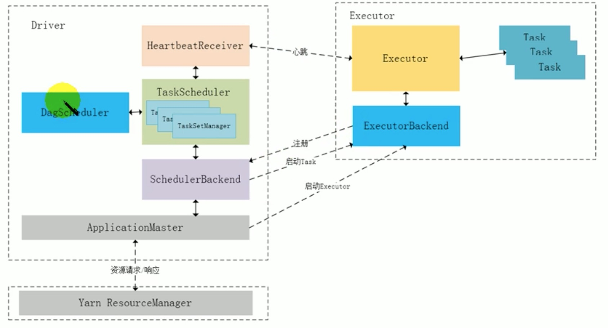
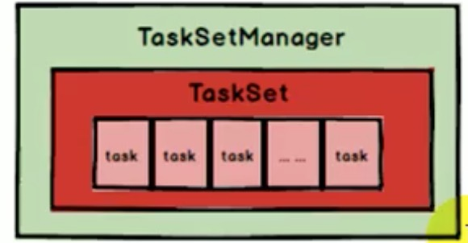
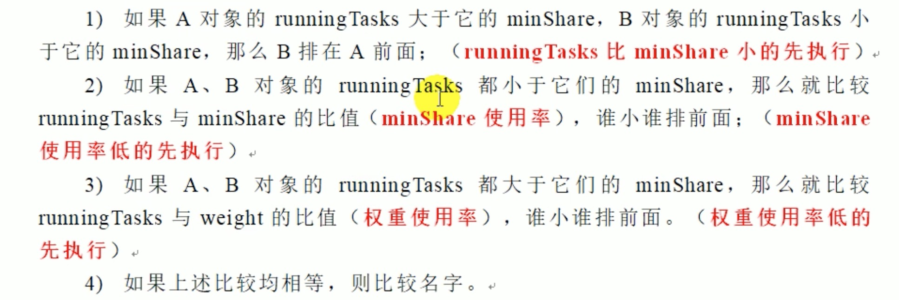
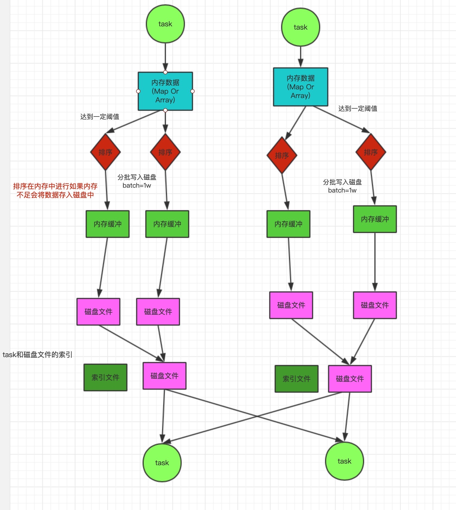

# Spark任务的调度

## Spark任务调度概述

`当Driver起来后，Driver则会根据用户程序逻辑准备任务，并根据Executor资源情况逐步分发任务。`

### 基础概念

* Job是以Action算子为界，遇到一个Action则触发一个Job
* Stage是Job的子集，以RDD宽依赖为界，遇到Shuffle做一次划分。
* Task是Stage的子集，以并行度(分区数)来衡量，分区数是多少，则有多少个task。



## Spark Stage级别调度

### DAGScheduler负责Stage级的调度。

* 一个Stage是否被提交需要看他的parent的stage是否被提交，如果被提交则提交该stage，否则提交parent stage。DAGScheduler提交Stage会将stage中的task打包成一个TaskSet集，并且序列化传递给TaskScheduler。

## Spark Task级别调度

* `TaskScheduler负责Task级的调度，将DAGScheduler给过来的TaskSet按照指定的调度策略分发到Executor上执行，调度过程中SchedulerBackend负责提供可用资源。`
  * TaskScheduler会将TaskSet封装为TaskSetManager加入到调度队列中。 



* ​	TaskSetManager负责监控管理同一个Stage中的Tasks，TaskScheduler就是以TaskSetManager为单元来调度任务。


* TaskSetManager加入rootPool调度池之后，调用SchedulerBackend的riviveOffsets方法给driverEndpoint发送ReviveOffsets消息；DriverEndpoint收到ReviveOffset消息后调用makeOffset方法，过滤出活跃状态的Executor，然后将Executor封装成WorkerOffer对象；准备好计算资源后，taskScheduler基于这些资源调用resourceOffer在Executor上分配task。

## 调度策略

## FIFO策略

* FIFO策略就是将TaskSetManager按照先进先出的方式入队出队。

``` scala
# 任务加入队列
override def addTaskSetManager(manager: Schedulable, properties: Properties) {
    rootPool.addSchedulable(manager)
  }
override def addSchedulable(schedulable: Schedulable) {
    require(schedulable != null)
    schedulableQueue.add(schedulable)
    schedulableNameToSchedulable.put(schedulable.name, schedulable)
    schedulable.parent = this
  }
# 队列构造
val schedulableQueue = new ConcurrentLinkedQueue[Schedulable]
```

### 公平调度

* Fair模式有一个rootPool和多个子Pool，各个子Pool存储着所有待分配的TaskSetManager。
* 在Fair模式中，需要先对子Pool进行排序，再对Pool里面TaskSetManager进行排序，因为Pool和TaskSetManager都继承了Schedulable特质，使用相同的排序算法。
* 排序过程基于Fair-shar比较，需要考虑对象的runningTasks值、minShare值、weight值，来决定谁先执行。



## 本地化调度

* DAGScheduler切割Job，划分Stage，通过调用submitStage来提交一个Stage对应的taskSet，subStage会调用submitMissingTasks，submitMissingTasks确定每个需要计算的task的preferredLocations(数据本地化调度)，通过调用getPreferrdeLocations()得到partition的优先位置，**partition对应一个task，此partition的优先位置就是task的优先位置**，对于要提交到TaskScheduler的TaskSet中的每一个task,该task优先位置与其parittion对应的优先位置一致。

## 失败重试与黑名单机制

### 失败重试机制

* Executor会将执行状态上报给SchedulerBackend,SchedulerBackend则告诉TaskScheduler，TaskScheduler找到该Task对应的失败与成功状态，**对于失败的Task，会记录它失败的次数，如果失败次数没超过最大重试次数，那么就把它放回待调度的TaskPool中，否则整个Application失败**

### 黑名单机制

* 如果多次失败后仍然失败，就将其task放入黑名单，下次再进行执行时直接跳过该task。

# Shuffle解析

## ShuffleMapStage与ResultStage


* **ShuffleMapStage**的结束伴随着**shuffle文件的写磁盘**。
* **ResultStage**基本上对应代码中的action算子，即将一个函数应用在RDD的各个partition的数据集上，意味着一个Job的运行结束。

## Shuffle中的任务个数

* SparkShuffle**分为map和reduce阶段**，或者称为**ShuffleRead阶段和ShuffleWrite阶段**，map过程和reduce都会由若干个task来执行。
* 例如，spark任务从HDFS中读取数据，初始**RDD分区个数由该文件split个数决定**，也就是一个split对应生成的RDD的一个partition，假设为N。初始RDD经过一系列算子计算后，假设分区个数布标，当执行到Shuffle操作时，**map端的task个数和partition个数一致**，即map task为N个。
* reduce端的stage默认取`spark.default.parallelism`这个配置项作为分区数，如果没有配置，**则以map端的最后一个RDD的分区数作为其分区数(也就是N)，那么分区数就决定reduce端的task的个数**。

### 源码分析

```
ExecutorBackend
--receive
	--case LaunchTask(data)
	  -- executor.launchTask(this, taskDesc) 执行任务
	     -- threadPool.execute(tr)
	     -- TaskRunner.run()
```

### reduce端数据读取

* **map端task和reduce端task不在同一个stage中**,map task位于ShuffleMapStage，reduce task位于ResultStage，map task会先执行，后执行的reduce端需要去读取map端刷新到磁盘的数据。

* reduce端的数据拉取过程:

  1. map task执行完毕后会将计算状态及磁盘小文件位置等信息封装到MapStatus对象中，然后由本进程中的MapOutPutTrackerWorker对象将mapStatus对象发送给Driver进程的MapOutPutTrackerMaster对象；
  2. **在reduce task开始执行之前会让本进程中的MapOutPutTrackerWorker向Driver进程中的MapOutPutTrackerMaster发请求，请求磁盘小文件信息；**
  3. **当所有的Map task执行完毕后，Driver进程中的MapOutPutTrackerMaster就拿到了所有map端输出的磁盘小文件信息**，此时就会将消息发送给请求过来的MapOutPutTrackerWorker。
  4. 完成之前的操作之后，由BlockTransforService去Executor所在的节点拉数据，默认启动5个子线程。每次拉取的数据量不能超过48M(reduce task每次最多拉取48M数据，将拉取来的数据存储到Executor内存的20%内存中)。

  ```
  --BlockStoreShuffleReader
     -- read方法，reduce端数据拉取源码
  ```

  ## HashShuffle

  ```scala
  private[spark] trait ShuffleManager {
  
    /**
     * Register a shuffle with the manager and obtain a handle for it to pass to tasks.
     */
    def registerShuffle[K, V, C](
        shuffleId: Int,
        numMaps: Int,
        dependency: ShuffleDependency[K, V, C]): ShuffleHandle
  
    /** Get a writer for a given partition. Called on executors by map tasks. */
    def getWriter[K, V](handle: ShuffleHandle, mapId: Int, context: TaskContext): ShuffleWriter[K, V]
  
    /**
     * Get a reader for a range of reduce partitions (startPartition to endPartition-1, inclusive).
     * Called on executors by reduce tasks.
     */
    def getReader[K, C](
        handle: ShuffleHandle,
        startPartition: Int,
        endPartition: Int,
        context: TaskContext): ShuffleReader[K, C]
  
    /**
     * Remove a shuffle's metadata from the ShuffleManager.
     * @return true if the metadata removed successfully, otherwise false.
     */
    def unregisterShuffle(shuffleId: Int): Boolean
  
    /**
     * Return a resolver capable of retrieving shuffle block data based on block coordinates.
     */
    def shuffleBlockResolver: ShuffleBlockResolver
  
    /** Shut down this ShuffleManager. */
    def stop(): Unit
  }
  ```

  

  ### HashShuffleManager

  ### 未优化

  * 早期HashShuffleManager，未经优化前。

    

    * 根据hash算法去读各自的文件，但是每个任务都会根据reduce的个数参数对应的文件，这样就会导致太多小文件，效率就会低下。

    ### 优化方案

    

* 核数如果过多就会导致文件过多，这样也会导致文件过多的问题。

## SortShuffleManager

### 原理流程



### bypass运行机制

* bypass运行机制的触发条件：
  * **shuffle map task**数量小于**spark.shuffle.sort.bypassMergeThreshold**不需要进行排序，直接使用hash即可。
  * 不是聚合类的shuffle算子。


### bypass机制源码剖析

```scala
--SortShuffleManager
	-- getWriter 拿到Writer根据ShuffleHandle区分
    handle match {
          // 不同模式numMapsForShuffle
        case unsafeShuffleHandle: SerializedShuffleHandle[K @unchecked, V @unchecked] =>
          new UnsafeShuffleWriter(
            env.blockManager,
            shuffleBlockResolver.asInstanceOf[IndexShuffleBlockResolver],
            context.taskMemoryManager(),
            unsafeShuffleHandle,
            mapId,
            context,
            env.conf)
          // bypass运行机制
        case bypassMergeSortHandle: BypassMergeSortShuffleHandle[K @unchecked, V @unchecked] =>
          new BypassMergeSortShuffleWriter(
            env.blockManager,
            shuffleBlockResolver.asInstanceOf[IndexShuffleBlockResolver],
            bypassMergeSortHandle,
            mapId,
            context,
            env.conf)
        case other: BaseShuffleHandle[K @unchecked, V @unchecked, _] =>
          new SortShuffleWriter(shuffleBlockResolver, other, mapId, context)
      }
-- registerShuffle  注册Shuffle
	-- SortShuffleWriter.shouldBypassMergeSort(conf, dependency)
     def shouldBypassMergeSort(conf: SparkConf, dep: ShuffleDependency[_, _, _]): Boolean = {
    // We cannot bypass sorting if we need to do map-side aggregation.
    // 如果shuffle依赖存在map端聚合，理解执行reduceByKey算子
    if (dep.mapSideCombine) {
      false
    } else {
      // 拿到spark.shuffle.sort.bypassMergeThreshold配置
      val bypassMergeThreshold: Int = conf.getInt("spark.shuffle.sort.bypassMergeThreshold", 200)
      // 如果分区数小于等于bypassMergeThreshold则进行bypass机制
      dep.partitioner.numPartitions <= bypassMergeThreshold
    }
  }
-- SortShuffleManager.canUseSerializedShuffle(dependency)
	
```

