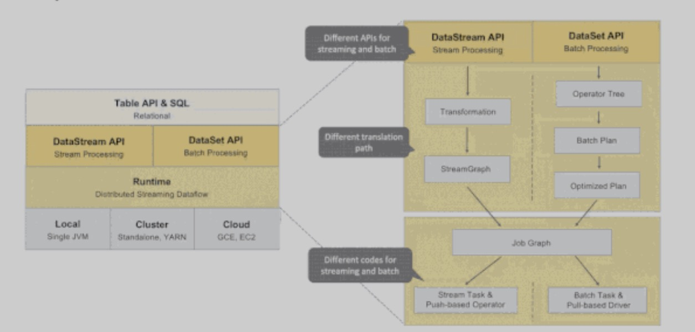
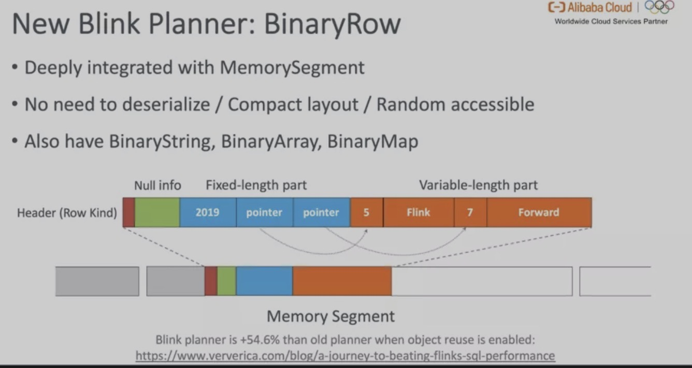

#  概览

## 基本程序结构

* Table API和SQL的程序结构，与流式处理的程序结构十分类似

```java
StreamExecutionEnvironment env = StreamExecutionEnvironment.getExecutionEnvironment();
        EnvironmentSettings settings = EnvironmentSettings.newInstance()
                .inStreamingMode()
                .useBlinkPlanner()
                .build();
        StreamTableEnvironment tableEnvironment = StreamTableEnvironment.create(env,settings);
tableEnvironment.createTemporaryView();
Table table=tableEnvironment.from("tableName").select($("id"));
table.executeInsert()
```

## 创建TableEnvironment

* 创建表执行环境

```java
    public static TableEnvironment getEnv() {
        StreamExecutionEnvironment env = StreamExecutionEnvironment.getExecutionEnvironment();
        env.setParallelism(1);

        EnvironmentSettings settings = EnvironmentSettings.newInstance()
                .inStreamingMode().useBlinkPlanner().build();
        return StreamTableEnvironment.create(env, settings);
    }

    public static TableEnvironment getBatchEnv() {
        EnvironmentSettings settings = EnvironmentSettings.newInstance()
                .useBlinkPlanner().inBatchMode().build();
        return TableEnvironment.create(settings);
    }
```


* 基于TableEnvironment做操作
  * 注册Catalog
  * 在Catalog中注册表
  * 执行SQL查询
  * 注册UDF

## 表（Table）

* TableEnvironment可以注册Catalog，并可以基于Catalog注册表
* 表是由一个标识符来指定，由catalog名、数据库名和对象名组成。
* 表可以是常规的，也可以是虚拟表（视图）
* 常规表一般可以用来描述外部数据，比如文件、数据库或消息队列数据，也可以从DataStream转换而来
* 视图可以从现有的表中创建，通常是table API或SQL查询的一个结果集。

## 动态表(Dynamic Tables)


* 动态表是Flink对流数据的Table API和SQL支持的核心概念。
* 与表示批处理数据的静态表不同，动态表随时间变化的。

### 持续查询（Continuous Query）

* 动态表可以像静态的批处理表一样进行查询，查询一个动态表产生持续查询(Continuous Query)
* 连续查询永远不会终止，并会生成另一个动态表。
* 查询会不断更新其动态结果表，以反映动态输入表上的更改。


### 流式表查询的处理过程

* 将流转换为动态表。
* 在动态表上计算一个连续查询，生成一个新的动态表。
* 生成的动态表被转换回流。

### 表到流的转换

动态表可以像普通数据库表一样通过 `INSERT`、`UPDATE` 和 `DELETE` 来不断修改。它可能是一个只有一行、不断更新的表，也可能是一个 insert-only 的表，没有 `UPDATE` 和 `DELETE` 修改，或者介于两者之间的其他表。

在将动态表转换为流或将其写入外部系统时，需要对这些更改进行编码。Flink的 Table API 和 SQL 支持三种方式来编码一个动态表的变化:

- **Append-only 流：** 仅通过 `INSERT` 操作修改的动态表可以通过输出插入的行转换为流。
- **Retract 流：** retract 流包含两种类型的 message： *add messages* 和 *retract messages* 。通过将`INSERT` 操作编码为 add message、将 `DELETE` 操作编码为 retract message、将 `UPDATE` 操作编码为更新(先前)行的 retract message 和更新(新)行的 add message，将动态表转换为 retract 流。下图显示了将动态表转换为 retract 流的过程。


- **Upsert 流:** upsert 流包含两种类型的 message： *upsert messages* 和*delete messages*。转换为 upsert 流的动态表需要(可能是组合的)唯一键。通过将 `INSERT` 和 `UPDATE` 操作编码为 upsert message，将 `DELETE` 操作编码为 delete message ，将具有唯一键的动态表转换为流。消费流的算子需要知道唯一键的属性，以便正确地应用 message。与 retract 流的主要区别在于 `UPDATE` 操作是用单个 message 编码的，因此效率更高。下图显示了将动态表转换为 upsert 流的过程。


# Flink SQL架构

## Old Planner架构



* 存在的问题:虽然面向用户的 Table API & SQL 是统一的，但是流式和批式任务在翻译层分别对应了 DataStreamAPI 和 DataSetAPI，在 Runtime 层面也要根据不同的 API 获取执行计划，两层的设计使得整个架构能够复用的模块有限，不易扩展。

## Blink Planner架构

* Blink Planner将批 SQL 处理作为流 SQL 处理的特例，尽量对通用的处理和优化逻辑进行抽象和复用，通过 Flink 内部的 Stream Transformation API 实现流 & 批的统一处理，替代原 Flink Planner 将流 & 批区分处理的方式。


## Flink SQL工作流


* 将FLink SQL/Table API程序转换为可执行的JobGraph经历以下阶段
  * 将SQL文本/TableAPI代码转化为逻辑执行计划(Logical Plan)
  * Logical Plan通过优化器优化为物理执行计划(Physical Plan)
  * 通过代码生成技术生成Transformations后进一步编译为可执行的JobGraph提交运行

### Logical Planning

* Flink SQL 引擎使用 Apache Calcite SQL Parser 将 SQL 文本解析为词法树，SQL Validator 获取 Catalog 中元数据的信息进行语法分析和验证，转化为关系代数表达式（RelNode），再由 Optimizer 将关系代数表达式转换为初始状态的逻辑执行计划。


#### Flink SQL优化器优化方式

##### Expression Reduce

* 表达式（Expression） 是 SQL 中最常见的语法。比如 t1.id 是一个表达式， 1 + 2 + t1.value 也是一个表达式。优化器在优化过程中会递归遍历树上节点，尽可能预计算出每个表达式的值，这个过程就称为表达式折叠。这种转换在逻辑上等价，通过优化后，真正执行时不再需要为每一条记录都计算一遍 1 + 2。

##### PushDown Optimization

* 下推优化是指在保持关系代数语义不变的前提下将 SQL 语句中的变换操作尽可能下推到靠近数据源的位置以获得更优的性能，常见的下推优化有谓词下推（Predicate Pushdown），投影下推（Projection Pushdown，有时也译作列裁剪）等。
* Predicate Pushdown（谓词下推）
  * WHERE 条件表达式中 t2.id < 1000 这个过滤条件描述的是对表 t2 的约束，跟表 t1 无关，完全可以下推到 JOIN 操作之前完成。假设表 t2 中有一百万行数据，但是满足 id < 1000 的数据只有 1,000 条，则通过谓词下推优化后到达 JOIN 节点的数据量降低了1,000 倍，极大地节省了 I / O 开销，提升了 JOIN 性能。
  * 谓词下推（Predicate Pushdown）是优化 SQL 查询的一项基本技术，谓词一词来源于数学，指能推导出一个布尔返回值（TRUE / FALSE）的函数或表达式，通过判断布尔值可以进行数据过滤。谓词下推是指保持关系代数语义不变的前提下将 Filter 尽可能移至靠近数据源的位置（比如读取数据的 SCAN 阶段）来降低查询和传递的数据量（记录数）。
* Projection Pushdown（列裁剪）
  * 列裁剪是 Projection Pushdown 更直观的描述方式，指在优化过程中去掉没有使用的列来降低 I / O 开销，提升性能。但与谓词下推只移动节点位置不同，投影下推可能会增加节点个数。比如最后计算出的投影组合应该放在 TableScan 操作之上，而 TableScan 节点之上没有 Projection 节点，优化器就会显式地新增 Projection 节点来完成优化。另外如果输入表是基于列式存储的（如 Parquet 或 ORC 等），优化还会继续下推到 Scan 操作中进行。

### Physical Planning on Batch

* 逻辑执行计划描述了执行步骤和每一步需要完成的操作，但没有描述操作的具体实现方式。而物理执行计划会考虑物理实现的特性，生成每一个操作的具体实现方式。比如 Join 是使用 SortMergeJoin、HashJoin 或 BroadcastHashJoin 等。优化器在生成逻辑执行计划时会计算整棵树上每一个节点的 Cost，对于有多种实现方式的节点（比如 Join 节点），优化器会展开所有可能的 Join 方式分别计算。最终整条路径上 Cost 最小的实现方式就被选中成为 Final Physical Plan。

### Translation&Code Generation

* 从 Physical Plan 到生成 Transformation Tree 过程中就使用了 Code Generation，将各种优化后的物理执行计划动态生成Transformations，最终在转换为StreamGraph-》VerxtGraph-》JobGraph

### Physical Planning on Stream

#### **Retraction Mechanism**（撤回流）

* Retraction 是流式数据处理中撤回过早下发（Early Firing）数据的一种机制，类似于传统数据库的 Update 操作。级联的聚合等复杂 SQL 中如果没有 Retraction 机制，就会导致最终的计算结果与批处理不同，这也是目前业界很多流计算引擎的缺陷。
* Flink SQL 在流计算领域中的一个重大贡献就是首次提出了这个机制的具体实现方案。Retraction 机制又名 Changelog 机制，因为某种程度上 Flink 将输入的流数据看作是数据库的 Changelog，每条输入数据都可以看作是对数据库的一次变更操作，比如 Insert，Delete 或者 Update。以 MySQL 数据库为例，其Binlog 信息以二进制形式存储，其中 Update_rows_log_event 会对应 2 条标记 Before Image （BI） 和 After Image （AI），分别表示某一行在更新前后的信息。
* 在 Flink SQL 优化器生成流作业的 Physical Plan 时会判断当前节点是否是更新操作，如果是则会同时发出 2 条消息 update_before 和 update_after 到下游节点，update_before 表示之前“错误”下发的数据，需要被撤回，update_after 表示当前下发的“正确”数据。下游收到后，会在结果上先减去 update_before，再加上 update_after。
* update_before 是一条非常关键的信息，相当于标记出了导致当前结果不正确的那个“元凶”。不过额外操作会带来额外的开销，有些情况下不需要发送 update_before 也可以获得正确的结果，比如下游节点接的是 UpsertSink（MySQL 或者 HBase的情况下，数据库可以按主键用 update_after 消息覆盖结果）。是否发送 update_before 由优化器决定，用户不需要关心。

####  **Update_before Decision**

1. 确定每个节点对应的changelog变更类型
   * 数据库中最常见的三种操作类型分别是 Insert （记为 [I]），Delete（记为 [D]），Update（记为 [U]）。优化器首先会自底向上检查每个节点，判断它属于哪（几）种类型，分别打上对应标记。
2. **确定每个节点发送的消息类型**
   * 在 Flink 中 Update 由两条 update_before（简称 UB）和 update_after （简称 UA）来表示，其中 UB 消息在某些情况下可以不发送，从而提高性能。
   * 在1 中优化器自底向上推导出了每个节点对应的 Changelog 变更操作，这一步里会先自顶向下推断当前节点需要父节点提供的消息类型，直到遇到第一个不需要父节点提供任何消息类型的节点，再往上回推每个节点最终的实现方式和需要的消息类型。

## Flink SQL内部优化

### BinaryRow

* Flink1.9.x前，Flink Runtime层各算子间传递的数据结构是Row，其内部实现是 Object[]，因此需要维护额外的Object Metadata，计算过程中还涉及到大量序列化/反序列化（特别是只需要处理某几个字段时需要反序列化整个 Row），primitive 类型的拆 / 装箱等，都会带来大量额外的性能开销。 
* Blink Planner使用二进制数据结构的BinaryRow来表示Record。BinaryRow 作用于默认大小为 32K 的 Memory Segment，直接映射到内存。BinaryRow 内部分为 Header，定长区和变长区。Header 用于存储 Retraction 消息的标识，定长区使用 8 个 bytes 来记录字段的 Nullable 信息及所有 primitive 和可以在 8 个 bytes 内表示的类型。其它类型会按照基于起始位置的 offset 存放在变长区。
* 首先存储上更为紧凑，去掉了额外开销；其次在序列化和反序列化上带来的显著性能提升，可根据 offset 只反序列化需要的字段，在开启 Object Reuse 后，序列化可以直接通过内存拷贝完成。



### Mini-batch Processing

* 在内存中 buffer 一定量的数据，预先做一次聚合后再更新 State，则不但会降低操作 State 的开销，还会有效减少发送到下游的数据量，提升吞吐量，降低两层聚合时由 Retraction 引起的数据抖动, 这就是 Mini-batch 攒批优化的核心思想。
* 把所有的数据先聚合一次，类似一个微批处理，然后再把这个数据写到 State 里面，或者在从 State 里面查出来，这样可以大大的减轻对 State 查询的压力。


### 数据倾斜处理

* 对于数据倾斜的优化，主要分为是否带 DISTINCT 去重语义的两种方式。对于普通聚合的数据倾斜，Flink 引入了 Local-Global 两阶段优化，类似于 MapReduce 增加 Local Combiner 的处理模式。而对于带有去重的聚合，Flink 则会将用户的 SQL 按原有聚合的 key 组合再加上 DISTINCT key 做 Hash 取模后改写为两层聚合来进行打散。


### Top-N重写

```sql
SELECT*
FROM(
  SELECT *, -- you can get like shopId or other information from this
    ROW_NUMBER() OVER (PARTITION BY category ORDER BY sales DESC) AS rowNum
  FROM shop_sales ) 
WHERE rowNum <= 3
```

* 在生成 Plan 方面，ROW_NUMBER 语义对应 OverAggregate 窗口节点和一个过滤行数的 Calc 节点，而这个窗口节点在实现层面需要为每一个到达的数据重新将 State 中的历史数据拿出来排序，这显然不是最优解。
* 我们知道流式场景求解极大 / 小值的最优操作是通过维护一个 size 为 N 的 minHeap / maxHeap。由实现反推出我们需要在优化器上新增一条规则，在遇到 ROW_NUMBER 生成的逻辑节点后，将其优化为一个特殊的 Rank 节点，对应上述的最优实现方式（当然这只是特殊 Rank 对应的其中一种实现）。这便是 Top-N Rewrite 的核心思想。

# Catalogs

* Catalog 提供了元数据信息，例如数据库、表、分区、视图以及数据库或其他外部系统中存储的函数和信息。

## Catalog类型

### GenericInMemoryCatalog

* `GenericInMemoryCatalog` 是基于内存实现的 Catalog，所有元数据只在 session 的生命周期内可用。

### JdbcCatalog

* `JdbcCatalog` 使得用户可以将 Flink 通过 JDBC 协议连接到关系数据库。`PostgresCatalog` 是当前实现的唯一一种 JDBC Catalog。

### HiveCatalog

* `HiveCatalog` 有两个用途：作为原生 Flink 元数据的持久化存储，以及作为读写现有 Hive 元数据的接口。

### 用户自定义 Catalog

* Catalog 是可扩展的，用户可以通过实现 `Catalog` 接口来开发自定义 Catalog。 想要在 SQL CLI 中使用自定义 Catalog，用户除了需要实现自定义的 Catalog 之外，还需要为这个 Catalog 实现对应的 `CatalogFactory` 接口。
* `CatalogFactory` 定义了一组属性，用于 SQL CLI 启动时配置 Catalog。 这组属性集将传递给发现服务，在该服务中，服务会尝试将属性关联到 `CatalogFactory` 并初始化相应的 Catalog 实例。

## 创建Flink表注册到Catalog中

### 使用SQL DDL

```java
// Create a HiveCatalog 
Catalog catalog = new HiveCatalog("myhive", null, "<path_of_hive_conf>");

// Register the catalog
tableEnv.registerCatalog("myhive", catalog);

// Create a catalog database
tableEnv.executeSql("CREATE DATABASE mydb WITH (...)");

// Create a catalog table
tableEnv.executeSql("CREATE TABLE mytable (name STRING, age INT) WITH (...)");

tableEnv.listTables(); 
```

### 使用Java

```java
// Create a catalog database
catalog.createDatabase("mydb", new CatalogDatabaseImpl(...));

// Create a catalog table
TableSchema schema = TableSchema.builder()
    .field("name", DataTypes.STRING())
    .field("age", DataTypes.INT())
    .build();

catalog.createTable(
        new ObjectPath("mydb", "mytable"),
        new CatalogTableImpl(
            schema,
            new Kafka()
                .version("0.11")
                ....
                .startFromEarlist()
                .toProperties(),
            "my comment"
        ),
        false
    );

List<String> tables = catalog.listTables("mydb");
```

## Catalog API

### 数据库操作

```java
/ create database
catalog.createDatabase("mydb", new CatalogDatabaseImpl(...), false);

// drop database
catalog.dropDatabase("mydb", false);

// alter database
catalog.alterDatabase("mydb", new CatalogDatabaseImpl(...), false);

// get databse
catalog.getDatabase("mydb");

// check if a database exist
catalog.databaseExists("mydb");

// list databases in a catalog
catalog.listDatabases("mycatalog");
```

### 表操作

```java
// create table
catalog.createTable(new ObjectPath("mydb", "mytable"), new CatalogTableImpl(...), false);

// drop table
catalog.dropTable(new ObjectPath("mydb", "mytable"), false);

// alter table
catalog.alterTable(new ObjectPath("mydb", "mytable"), new CatalogTableImpl(...), false);

// rename table
catalog.renameTable(new ObjectPath("mydb", "mytable"), "my_new_table");

// get table
catalog.getTable("mytable");

// check if a table exist or not
catalog.tableExists("mytable");

// list tables in a database
catalog.listTables("mydb");
```

### 视图操作

```java
// create view
catalog.createTable(new ObjectPath("mydb", "myview"), new CatalogViewImpl(...), false);

// drop view
catalog.dropTable(new ObjectPath("mydb", "myview"), false);

// alter view
catalog.alterTable(new ObjectPath("mydb", "mytable"), new CatalogViewImpl(...), false);

// rename view
catalog.renameTable(new ObjectPath("mydb", "myview"), "my_new_view", false);

// get view
catalog.getTable("myview");

// check if a view exist or not
catalog.tableExists("mytable");

// list views in a database
catalog.listViews("mydb");
```

### 分区操作

```java
// create view
catalog.createPartition(
    new ObjectPath("mydb", "mytable"),
    new CatalogPartitionSpec(...),
    new CatalogPartitionImpl(...),
    false);

// drop partition
catalog.dropPartition(new ObjectPath("mydb", "mytable"), new CatalogPartitionSpec(...), false);

// alter partition
catalog.alterPartition(
    new ObjectPath("mydb", "mytable"),
    new CatalogPartitionSpec(...),
    new CatalogPartitionImpl(...),
    false);

// get partition
catalog.getPartition(new ObjectPath("mydb", "mytable"), new CatalogPartitionSpec(...));

// check if a partition exist or not
catalog.partitionExists(new ObjectPath("mydb", "mytable"), new CatalogPartitionSpec(...));

// list partitions of a table
catalog.listPartitions(new ObjectPath("mydb", "mytable"));
  
// list partitions of a table under a give partition spec
catalog.listPartitions(new ObjectPath("mydb", "mytable"), new CatalogPartitionSpec(...));

// list partitions of a table by expression filter
catalog.listPartitions(new ObjectPath("mydb", "mytable"), Arrays.asList(epr1, ...));
```

### 函数操作

```java
// create function
catalog.createFunction(new ObjectPath("mydb", "myfunc"), new CatalogFunctionImpl(...), false);

// drop function
catalog.dropFunction(new ObjectPath("mydb", "myfunc"), false);

// alter function
catalog.alterFunction(new ObjectPath("mydb", "myfunc"), new CatalogFunctionImpl(...), false);

// get function
catalog.getFunction("myfunc");

// check if a function exist or not
catalog.functionExists("myfunc");

// list functions in a database
catalog.listFunctions("mydb");
```

# 流式聚合

* 存在的问题

```
默认情况下，无界聚合算子是逐条处理输入的记录，即：（1）从状态中读取累加器，（2）累加/撤回记录至累加器，（3）将累加器写回状态，（4）下一条记录将再次从（1）开始处理。这种处理模式可能会增加 StateBackend 开销（尤其是对于 RocksDB StateBackend ）。此外，生产中非常常见的数据倾斜会使这个问题恶化，并且容易导致 job 发生反压。
```

## MiniBatch 聚合

* `将一组输入的数据缓存在聚合算子内部的缓冲区中`，当输入的数据被触发处理时，每个key只需一个操作即可访问状态，这样可以大大减少状态开销并获得更好的吞吐量。
* 但是，这可能会增加一些延迟，因为它会缓冲一些记录而不是立即处理它们。这是吞吐量和延迟之间的权衡。


### 参数配置开启

```java
// access flink configuration
Configuration configuration = tEnv.getConfig().getConfiguration();
// set low-level key-value options
configuration.setString("table.exec.mini-batch.enabled", "true"); // enable mini-batch optimization
configuration.setString("table.exec.mini-batch.allow-latency", "5 s"); // use 5 seconds to buffer input records
configuration.setString("table.exec.mini-batch.size", "5000"); // the maximum number of records can be buffered by each aggregate operator task
```

## Local-Global 聚合

* Local-global聚合是为解决数据倾斜问题，通过将一组聚合氛围两个阶段，首先在上游进行本地聚合，然后在下游进行全局聚合，类似于MR中的Combine+Reduce模式。
* 每次本地聚合累积的输入数据量基于 mini-batch 间隔。


### 开启配置

```java
// access flink configuration
Configuration configuration = tEnv.getConfig().getConfiguration();
// set low-level key-value options
configuration.setString("table.exec.mini-batch.enabled", "true"); // local-global aggregation depends on mini-batch is enabled
configuration.setString("table.exec.mini-batch.allow-latency", "5 s");
configuration.setString("table.exec.mini-batch.size", "5000");
configuration.setString("table.optimizer.agg-phase-strategy", "TWO_PHASE"); // enable two-phase, i.e. local-global aggregation
```

## 在 distinct 聚合上使用 FILTER 修饰符

```sql
SELECT
 day,
 COUNT(DISTINCT user_id) AS total_uv,
 COUNT(DISTINCT user_id) FILTER (WHERE flag IN ('android', 'iphone')) AS app_uv,
 COUNT(DISTINCT user_id) FILTER (WHERE flag IN ('wap', 'other')) AS web_uv
FROM T
GROUP BY day
```

# 执行配置

## 获取配置

```java
 public static void main(String[] args) {
        StreamExecutionEnvironment env = StreamExecutionEnvironment.getExecutionEnvironment();

        // 获取执行配置
        ExecutionConfig config = env.getConfig();


        // 级别设置，
        // 默认为ClosureCleanerLevel.RECURSIVE 递归地清除所有字段。
        // TOP_LEVEL:只清理顶级类，不递归到字段中
        config.setClosureCleanerLevel(ExecutionConfig.ClosureCleanerLevel.TOP_LEVEL);
        // 设置并行度
        config.setParallelism(3);
        // 为作业设置默认的最大并行度。此设置确定最大并行度，并指定动态缩放的上限。
        config.setMaxParallelism(6);
        //设置失败任务重新执行的次数。值为零有效地禁用了容错。值-1表示应该使用系统默认值(如配置中定义的)。这个配置过期可以设置重启策略
        config.setNumberOfExecutionRetries(3);
        // 默认模式PIPELINED，设置执行模式执行程序，执行模式定义数据交换是以批处理方式执行还是以流水线方式执行。
        config.setExecutionMode(ExecutionMode.PIPELINED_FORCED);

        config.disableForceKryo();
        config.disableForceAvro();
        config.disableObjectReuse();

        // 开启JobManager状态system.out.print日志
        config.enableSysoutLogging();
        config.disableSysoutLogging();

        // 设置全局Job参数
//        config.setGlobalJobParameters();

        // 添加默认kryo序列化器
//        config.addDefaultKryoSerializer()
        //设置连续尝试取消正在运行的任务之间的等待间隔(以毫秒为单位)。当一个任务被取消时，会创建一个新线程，如果该任务线程在一定时间内没有终止，该线程会定期调用interrupt()。这个参数指的是连续调用interrupt()之间的时间，默认设置为30000毫秒，即30秒。
        config.setTaskCancellationInterval(1000);

    }
```

## 打印执行计划

```java
final ExecutionEnvironment env = ExecutionEnvironment.getExecutionEnvironment();

...

System.out.println(env.getExecutionPlan());
```

## Task故障恢复

### Restart Stragtegies

* none,off,disable:不设置重启策略
* fixeddelay,fixed-delay:固定延迟重启策略

```yaml
# 重试次数
restart-strategy.fixed-delay.attempts: 3
# 失败重试间隔
restart-strategy.fixed-delay.delay: 10 s

# Java
ExecutionEnvironment env = ExecutionEnvironment.getExecutionEnvironment();
env.setRestartStrategy(RestartStrategies.fixedDelayRestart(
  3, // 尝试重启的次数
  Time.of(10, TimeUnit.SECONDS) // 延时
));
```

* failurerate,failure-rate:失败比率重启策略

```yaml
# 最大失败次数
restart-strategy.failure-rate.max-failures-per-interval: 3
# 失败间隔
restart-strategy.failure-rate.failure-rate-interval: 5 min
# 
restart-strategy.failure-rate.delay: 10 s

# Java
ExecutionEnvironment env = ExecutionEnvironment.getExecutionEnvironment();
env.setRestartStrategy(RestartStrategies.failureRateRestart(
  3, // 每个时间间隔的最大故障次数
  Time.of(5, TimeUnit.MINUTES), // 测量故障率的时间间隔
  Time.of(10, TimeUnit.SECONDS) // 延时
));
```

