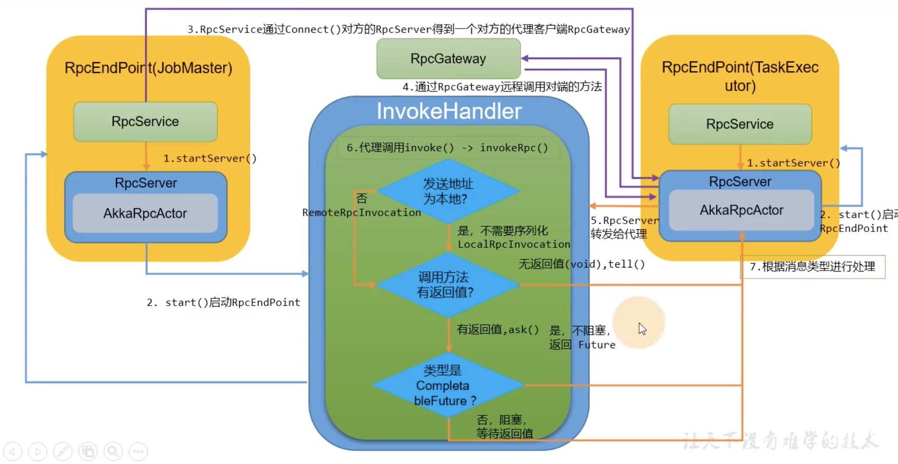

# 任务提交流程


* Flink run -t yarn-per-job -c xxxx xxx.jar

## CliFrontend

* `flink run`入口类`org.apache.flink.client.cli.CliFrontend `，通过`config.sh`读取Flink相关环境信息；
* 核心逻辑main方法，具体代码分析可以跟进`CliFrontend#run`方法

```java
public static void main(final String[] args) {
		EnvironmentInformation.logEnvironmentInfo(LOG, "Command Line Client", args);

		// 1. find the configuration directory
		// 获取flink-conf.yaml路径
		final String configurationDirectory = getConfigurationDirectoryFromEnv();

		// 2. load the global configuration
		// 根据路径加载配置
		final Configuration configuration = GlobalConfiguration.loadConfiguration(configurationDirectory);

		// 3. load the custom command lines
		// 加载自定义命令行，依次添加generic、yarn、default三种命令行客户端
		final List<CustomCommandLine> customCommandLines = loadCustomCommandLines(
			configuration,
			configurationDirectory);

		try {
			// 创建CliFrontend
			final CliFrontend cli = new CliFrontend(
				configuration,
				customCommandLines);

			SecurityUtils.install(new SecurityConfiguration(cli.configuration));
			int retCode = SecurityUtils.getInstalledContext()
					.runSecured(() -> cli.parseParameters(args));
			System.exit(retCode);
		}
		catch (Throwable t) {
			final Throwable strippedThrowable = ExceptionUtils.stripException(t, UndeclaredThrowableException.class);
			LOG.error("Fatal error while running command line interface.", strippedThrowable);
			strippedThrowable.printStackTrace();
			System.exit(31);
		}
	}
```

* 参数解析、封装CommandLine：三个执行对应命令、配置封装、执行用户代码、生成StreamGraph、Executor生成JobGraph、集群描述符：上传jar包、配置，封装提交给yarn、yarnClient提交应用

## ClusterEntrypoint

* applicationMaster执行入口类

* Dispatcher的创建和启动
* ResourceManager的创建、启动：里面有slotmanager（管理slot资源，向yarn申请资源）
* Dispatcher启动JobManager（里面有一个slotpool，发送真正的请求）
* slootpool向slotmanager申请资源，slotmanager向yarn申请资源（启动新节点）

## TaskExecutorRunner

* TaskManager的入口类
* 启动TaskExecutor
* 向RM注册slot，RM分配Slot，taskExecutor接收到分配的指令，提供offset给JobMaster（slotpool）
* JobMaster提交任务给TaskExecutor执行任务

# 组件通信

* Flink内部节点之间的通信是用的Akka，数据的网络传输是通过Netty。0.9版本开始使用Akka，主要影响的组件是JobManager、TaskManager、Dispatcher、ResourceManager等。

## Flink RPC过程



### RpcGateway

* 定义通信行为，用于调用RpcEndpoint的某些方法，相当于ActorRef。
* JobMaster、ResourcceManager、Dispatcher、TaskExecutor都有对应的网关接口。

### RpcEndpoint

* 通信终端，提供RPC服务组件的生命周期管理(start、stop)，每个RpcEndpoint对应了一个路径(endpointId和actorSystem确定)，每个路径对应一个Actpr，其实现了RpcGateway接口。

### RpcService和RpcServer

* RpcEndpoint的成员变量

#### RpcService

* 根据提供的RpcEndpoint来启动和停止RpcServer(Actor)
* 根据提供的地址链接对方的RpcServer，并返回一个RpcGateway
* 延迟/立刻调度Runnable、Callable

Flink中实现类为AkkaRpcService，是Akka的ActorSystem的封装，基本可以理解为ActorSystem的一个适配器。

#### RpcServer

* 组件自身的代理，A组件通过B组件Gateway调用自身的rpcServer。
* AkkaInvocationHandler，封装ActorRef
* FencedAkkaInvocationHandler，封装ActorRef

### Rpc交互过程

#### 请求发送过程

* 在RpcService中调用connect方法与对端的RpcEndpoint(RpcServer)建立连接，connect方法根据给的地址返回InvocationHandler(AkkaInvacationHandler、FencedAkkaInvocationHanlder动态代理。)，核心查看invoke动态代理核心逻辑。

#### 响应过程

* AkkaRpcActor处理对应响应

# 任务调度

## Graph的概念


* Flink的执行图可以分成四层:StreamGraph->JobGraph->ExecutionGraph->物理执行图
* StreamGraph:是根据用户通过StreamAPI编写的代码生成的最初的图，表示程序的拓扑结构。
  * StreamNode:用来代表operator的类，并具有所有相关的属性，如并发度，入边和出边（表示算子的上游和下游）等。
  * StreamEdge:表示连续两个StreamNode的边。
* JobGraph:StreamGraph经过优化后生成了JobGraph，提交给JobManager的数据结构，会进行chain链优化，减少各个节点所需的序列化/反序列化/传输消耗。
  * JobVertex:经过优化后符合条件的多个StreamNode可能会chain在一起生成一个Vertext，即一个JobVertex包含一个或多个opeartor，JobVertext的输入是Jobedge，输出是IntermediateDataSet。
  * IntermediateDataSet:表示JobVertex的输出，即经过opeartor处理产生的数据集，producer是JobVertex，consumer是JobEdge。
  * JobEdge:代表了JobGraph中的一条数据传输通道。source是IntermediateDataSet，target是JobVertex。即数据通过JobEdge由IntermediateDataSet传递给目标的JobVertex。
* ExecutionGraph:JobManager根据JobGraph生成ExecutionGraph，是并行版本的JobGraph，是调度层最核心的数据结构。
  * ExecutionVertex:表示ExecutionJobVertex的其中一个并发子任务，输入是ExecutionEdge，输出是IntermediateResultPartition。
  * IntermediateResult:和JobGraph的IntermediateDataSet一一对应。一个IntermediateResult包含多个IntermediateResultPartition，其个数等于该operator的并行度。
  * IntermediateResultPartition:表示ExecutionVertex的一个输入分区，producer是ExecutionVertex，consumer是若干个Executionedge。
  * ExecutionEdge:表示ExecutionVertex的输入，source是IntermediateResultPartition，traget是ExecutionVertex，source和target都只能有一个。
  * Execution:是执行一个ExecutionVertex的一次尝试，当发生故障或者数据需要重算的情况下ExecutionVertex可能会有多个ExecutionAttemptID，一个Execution通过ExecutionAttemptID来唯一标识。JM和TM之间关于task的部署和task status的更新都是通过ExecutionAttemptID来确定消息接受者。
* 物理执行图:JobManager根据executionGraph对Job进行调度后，在各个TaskManager上部署Task后形成的"图"，并不是一个具体的数据结构。
  * Task:Execution被调度后分配的TaskManager中启动对应的Task。Task包裹来具有用户执行逻辑的operator。
  * ResultPartition:代表一个Task的生成的数据，和ExecutionGraph的IntermediateResultPartition一一对应。
  * ResultSubPartition:是ResultPartition的一个子分区。每个ResultPartition都多个ResultSubPartition，其数目要由下游消费Task数和DistributionPattern来决定。
  * InputGate:代表Task的输入封装，和JobGraph中JobEdge一一对应。每个InputGate消费一个或多个ResultPArtition。
  * InputChannel:每个InputGate会包含一个以上的InputChannel，和ExecutionGraph的ExecutionEdge一一对应，也和ResultSubPartition一对一地相连，即一个InputChannel接收一个ResultSubPartition的输出。

## StreamGraph在Client生成

* StreamExecutionEnvironment.execute()

```
-->execute(jobName):
		-->getStreamGraph(jobName);
			-->getStreamGraphGenerator()
			   -->最终通过StreamGraph streamGraph = getStreamGraphGenerator().setJobName(jobName).generate();生成流图
```

* 核心逻辑查看github flink源码的StreamGraph和StreamNode及StreamEdge相关源码。