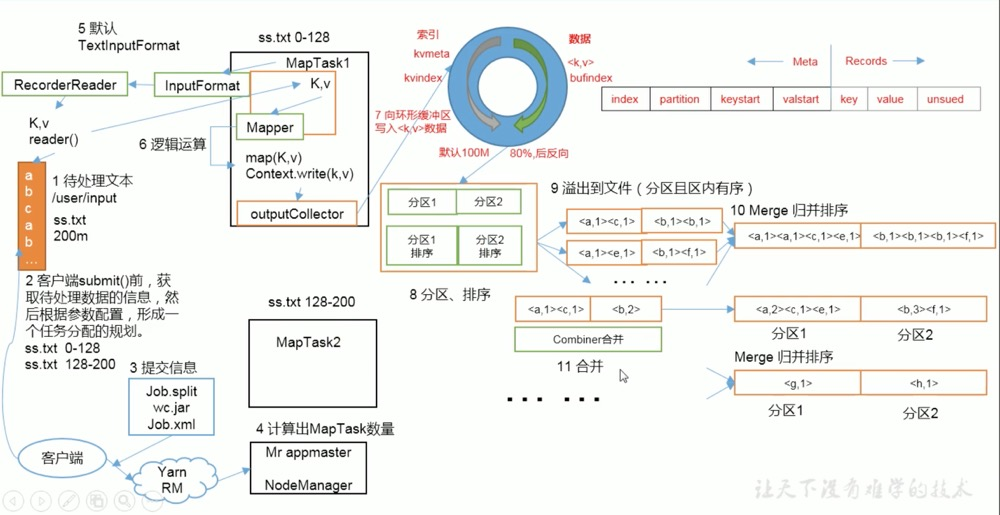
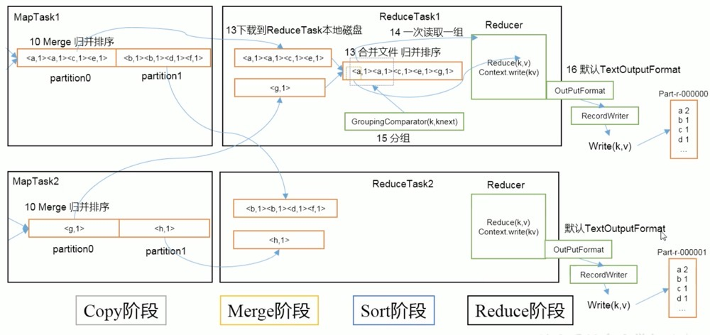

# MapReduce详细工作流程




## MapTask工作机制

* 源码参考

```
# main类 MapTask
--- NewOutputCollector#write方法
```


## ReduceTask工作机制



# Shuffle解析

```
MapReduce确保每个reducer的输入都是按键排序的。系统执行排序、将map输出作为输入传给reducer的过程称为shuffle。
```

## Shuffle机制

### MapTask的Shuffle过程


### ReduceTask的Shuffle过程


## 分区

### 默认分区器

```java
public class HashPartitioner<K2, V2> implements Partitioner<K2, V2> {

  public void configure(JobConf job) {}

  /** Use {@link Object#hashCode()} to partition. */
  public int getPartition(K2 key, V2 value,
                          int numReduceTasks) {
    return (key.hashCode() & Integer.MAX_VALUE) % numReduceTasks;
  }
}
```

* 默认分区是根据key的hashCode对numReduceTasks个数取模，可以通过设置numReduceTasks设置reduce个数，使用Hash分区器时reduce个数决定文件数。

### 自定义分区器

```java
public class MyPartitioner extends Partitioner<Text, LongWritable> {

    /**
     * 选择到对应的reducer-task上执行
     *
     * @param text
     * @param longWritable
     * @param numPartitions
     * @return
     */
    @Override
    public int getPartition(Text text, LongWritable longWritable, int numPartitions) {
        //这里规定的文本是iphone、xiaomi、huawei、nokia
        if ("xiaomi".equals(text.toString())) {
            return 0;
        }
        if ("iphone".equals(text.toString())) {
            return 1;
        }
        if ("huawei".equals(text.toString())) {
            return 2;
        }
        return 3;
    }
}
## driver设置分区器
job.setPartitionerClass(MyPartitioner.class);
 //设置4个reducer，每个分区一个
job.setNumReduceTasks(4);
```

* reduce的个数大于分区个数，会出现空的输出文件part-r-000xx;
* 如果reduce个数小于partition个数，会有部分分区数据无处存放，抛出异常
* 如果reduce个数为1，不管map端有多少个分区文件，最终结果都交给一个Reduce处理，最终只会产生一个文件。
* 分区号从0开始逐1累加。

## 排序

* MapTask和ReduceTask均会对数据`按照key`进行排序。该操作是Hadoop的默认行为。任何程序中的数据均会排序，会使用快排来对key排序，字典排序。

### map阶段

* 对于MapTask，会将处理的结果`暂时放到环形缓冲区中，当环形缓冲区使用率达到一定阈值时，再对缓冲区中的数据进行一次快速排序`，并将这些有序数据`溢写`到磁盘上，当数据处理完毕后，会对磁盘上的所有文件进行`归并排序`。

#### map阶段原理

```
map函数开始产生输出时并不是简单地将它写到磁盘，它利用缓冲的方式写到内存并出于效率的考虑进行`预排序`。
每个map任务都有一个环形内存缓冲区用于存储任务输出。在默认情况下，缓冲区大小为100MB，通过mapreduce.task.io.sort.mb`属性来调整，一旦缓冲内容达到阈值(mapreduce.map.sort.spill.percent,默认是0.80,百分之80)，一个后台线程便开始把内容溢出(spill)到磁盘。在溢出写磁盘过程中，map输出继续写到缓冲区，但如果在此期间缓冲区被填满，map会阻塞直到写磁盘过程完成。溢出写过程按轮询方式将缓冲区中的内容写到`mapreduce.cluster.local.dir`属性在作业特定子目录下指定的目录中。

在写磁盘之前，线程首先根据数据最终要传入的reducer把数据划分成相应的`分区(partition)`。在每个分区中，后台线程按照`键进行内存中排序，如果有一个combiner函数，它就在排序后的输出上运行`。运行combiner函数使得`map输出结果更紧凑，因此减少写到磁盘的数据和传递给reducer的数据`。
```


#### 内存缓冲区溢出文件

```
每次内存缓冲区达到溢出阈值，就会新建一个溢出文件(spill file),因此在map任务写完其最后一个输出记录之后，会有几个溢出文件。在任务完成之前，溢出文件被合并成一个已分区且已排序的输出文件。配置属性为mapreduce.task.io.sort.factor控制着一次最多能合并多少流，默认值是10.
`如果至少存在3个溢出文件(mapreduce.map.combine.minspills)时，则combiner就会在输出文件写到磁盘之前再次运行。`
```

#### map输出数据压缩

```
将map输出写到磁盘的过程对其进行压缩，这样会使写磁盘的速度更快，节约磁盘空间，并且减少传给reducer的数据量。默认情况下，输出是不压缩的，设置属性`mapreducer.map.output.compress`为true，指定的压缩库需要根据`mapreduce.map.output.compress.codec`指定。
```

### Reduce阶段

* 对于ReduceTask，它从每个MapTask上远程拷贝相应数据文件，如果文件大小超过阈值，则溢写磁盘上，否则存储到内存中。如果磁盘上文件数目达到一直阈值，则进行一次`归并排序`以生成一个更大的文件；如果内存中文件大小或数目超过一定阈值，则进行一次合并后将数据溢写到磁盘上。当所有数据拷贝完后，ReduceTask统一对内存和磁盘上的所有数据进行一次`归并排序`。
* reduce通过`Http`得到输出文件的分区然后拷贝这些文件，用于文件分区的工作线程数量由任务的`mapreduce.shuffle.max.threads`控制。此配置针对每一个NM而不是针对每个map任务，默认值0代表机器中处理器数量的俩倍。

#### 复制map分区文件阶段

* map输出文件位于运行`map任务的DataNode的本地磁盘`(尽管map输出经常写到map DataNode的本地磁盘，但reduce输出并不是这样)，DN需要为`分区文件运行reduce任务`。并且reduce任务需要集群若干个`map任务的map输出作为其特殊的分区文件`。每个map任务的完成时间不同，因此在每个任务完成时，`reduce就开始复制其输出文件，这是reduce的复制阶段`。reduce任务有少量的复制线程，可以并行取得map输出。`默认值是5个线程，可以通过mapreduce.reduce.shuffle.parallelcopies修改`。


#### 合并Reduce阶段

* 顺序的`合并map输出文件，这是循环进行的`，比如50个map输出，而合并因子是10(默认是10，通过mapreduce.task.io.sort.factor设置，和map合并类似)，合并将进行5次，每次将10个文件合并成一个文件，最后有5个中间文件。

* 直接把`数据输入reduce函数，从而省略了一次磁盘往返行程`，并没有将这5个文件合并成一个已排序的文件作为最后一趟，`最后的合并可以来自内存和磁盘片段`。

#### reducer如何直到从那台机器获取map输出文件？


#### reduce合并阶段优化


### 排序分类

#### 利用SequenceFileOutputFormat排序

```java
@Override
public int run(String[] args) throws Exception {
    Job job = Job.getInstance(getConf(), "sort-job");
    FileSystem fs = FileSystem.get(URI.create("/user/sort"), getConf());
    if (fs.exists(new Path("/user/sort"))) {
        fs.delete(new Path("/user/sort"), true);
    }

    job.setJarByClass(SortApp.class);
    job.setOutputFormatClass(SequenceFileOutputFormat.class);
    job.setMapperClass(SortMapper.class);
    job.setOutputKeyClass(LongWritable.class);
    job.setOutputValueClass(Text.class);

    FileInputFormat.addInputPath(job, new Path("/user/air.txt"));
    SequenceFileOutputFormat.setOutputPath(job, new Path("/user/sort"));
    return job.waitForCompletion(true) ? 0 : 1;
}
```


#### 部分排序

* 根据默认的Hash分区设置对应的reduce任务数，这样就可以根据键来分区排序。

#### 全排序

*  最终输出结果只有一个文件，且文件内部有序。实现方式是设置`一个ReduceTask`。

#### 辅助排序

* 在Reduce端对key进行`分组排序`。

* 添加排序对象

```java
   @Override
    public int compareTo(OrderDetail o) {
        int result;
        if (o.getId() > id) {
            result = -1;
        } else if (o.getId() < id) {
            result = 1;
        } else {
            if (o.getPrice() > price) {
                result = 1;
            } else {
                result = -1;
            }
        }
        return result;
    }
```

* 添加分区排序类

```java
/**
基于id分组排序
public class OrderGroupingComparator extends WritableComparator {

    public OrderGroupingComparator() {
        // 设置为true 会去创建key对象
        super(OrderDetail.class,true);
    }

    @Override
    public int compare(WritableComparable a, WritableComparable b) {
        OrderDetail aOrder = (OrderDetail) a;
        OrderDetail bOrder = (OrderDetail) b;
        return Integer.compare(aOrder.getId(), bOrder.getId());
    }
}
## driver设置分组排序类
 // 添加分组函数，基于某个id为key
job.setGroupingComparatorClass(OrderGroupingComparator.class);
```


#### 二次排序

* 在自定义排序过程中，如果compareTo中判断条件为两个即为`二次排序`。

### 自定义排序

* bean对象作为key传输，实现WritableComparable接口重写compareTo方法，可以实现排序。

```java
@Data
public class Phone implements WritableComparable<Phone> {
    private Integer id;
    private String phone;
    private String ip;
    private Integer upFlow;
    private Integer downFlow;
    private Integer sumFlow;
    private Integer status;
  
   @Override
    public int compareTo(Phone phone) {
        return phone.id.compareTo(this.id);
    }

    /**
     * 用于后续反序列化过程中反射使用
     */
    public Phone() {
    }

    public Phone(Integer upFlow, Integer downFlow) {
        this.upFlow = upFlow;
        this.downFlow = downFlow;
        sumFlow = upFlow + downFlow;
    }

    /**
     * 序列化方法
     *
     * @param dataOutput
     * @throws IOException
     */
    @Override
    public void write(DataOutput dataOutput) throws IOException {
        dataOutput.writeInt(this.id);
        dataOutput.writeUTF(this.phone);
        dataOutput.writeUTF(this.ip);
        dataOutput.writeInt(this.upFlow);
        dataOutput.writeInt(this.downFlow);
        dataOutput.writeInt(this.sumFlow);
        dataOutput.writeInt(this.status);
    }

    /**
     * 反序列化方法
     *
     * @param dataInput
     * @throws IOException
     */
    @Override
    public void readFields(DataInput dataInput) throws IOException {
        this.id = dataInput.readInt();
        this.phone = dataInput.readUTF();
        this.ip = dataInput.readUTF();
        this.upFlow = dataInput.readInt();
        this.downFlow = dataInput.readInt();
        this.status = dataInput.readInt();
    }
}
```

## Combine

* Combiner组件的父类是Reducer，Combiner是在每个MapTask所在的节点运行，Reducer是接收全局所有Mapper的输出结果。
* Combiner是对每个MapTask的输出进行局部汇总，减少网络传输量。

### 自定义Combine

```java
# 自定义
public class CustomCombiner extends Reducer<Text, LongWritable, Text, LongWritable> {
    /**
     * reduce方法
     *
     * @param key     键
     * @param values  值
     * @param context 上下文
     * @throws IOException
     * @throws InterruptedException
     */
    @Override
    protected void reduce(Text key, Iterable<LongWritable> values, Context context) throws IOException, InterruptedException {
        long sum = 0;
        for (LongWritable value : values) {
            //计算key出现的次数总和
            sum += value.get();
        }
        context.write(key, new LongWritable(sum));
    }
}

# driver类设置
  //通过job设置combiner处理类,其实逻辑上和reduce一摸一样
  job.setCombinerClass(CustomCombiner.class);
```

# Join

* MR能够执行大型数据集间的连接操作，但是原生的MR程序相对复杂，可以利用Spark、Hive来完成。
* 如果存在数据集A、B，如果A数据集不大，可以根据B关联的ID查询A数据集，从而将数据集合输出到一个表中。
  * 连接操作如果从mapper执行，则称为map端连接，从reducer端执行则称为reduce端连接

## Map Join

* 在两个大规模输入数据集之前的map端连接会在数据到达map函数之前就连接连接操作。为达到该目的，各map的输入数据必须先`分区`并且以特定方式排序。各个输入数据集被划分为相同数量的分区，并且均按`相同的键(连接键)排序`。`同一个键的所有记录均会放在同一个分区中`。
* Map端连接操作可以连接多个作业的输出，只要这些作业的`reducer数量相同、键相同并且输出文件是不可切分的`。
* 利用`CompositeInputFormat`类来运行一个map端连接。CompositeInputFormat的输入源和连接类型(内连接或外连接)可以通过一个连接表达式进行配置，连接表达式的语法简单。
* 在Reduce端处理过多的表，容易产生数据倾斜，在Map端缓存小表，提前处理业务逻辑，增加Map端业务，减少Reduce端数据压力，尽可能减少数据倾斜。

### 订单和产品Join

* 使用分布式缓存(DistributedCache)，在Mapper的setup阶段，将文件读取到缓存集合中
* 在Driver函数中加载缓存，job.addCacheFile(new URI(path))
* 将Reduce个数设置为0，无需走Reduce，直接在Map端处理逻辑。

#### Mapper

```java
# mapper处理缓存的文件
public class MapJoinMapper extends Mapper<LongWritable, Text, Text, NullWritable> {
    private Map<String, String> pdMap = Maps.newHashMap();
    private Text k = new Text();

    @Override
    protected void setup(Context context) throws IOException, InterruptedException {
        URI[] cacheFiles = context.getCacheFiles();
        String path = cacheFiles[0].getPath();
        BufferedReader reader = new BufferedReader(new InputStreamReader(new FileInputStream(path), Charsets.UTF_8));
        String line;
        while (StringUtils.isNotEmpty(line = reader.readLine())) {
            String[] pdArr = line.split(",");
            pdMap.put(pdArr[0], pdArr[1]);

        }
        IOUtils.closeStream(reader);
    }

    @Override
    protected void map(LongWritable key, Text value, Context context) throws IOException, InterruptedException {
        String[] orderArr = value.toString().split(",");
        String pdName = pdMap.getOrDefault(orderArr[1], "");
        String id = orderArr[0];
        String amount = orderArr[2];
        String line = id + "\t" + pdName + "\t" + amount;
        k.set(line);
        context.write(k, NullWritable.get());
    }
}
```

#### 添加缓存小表文件

```java
    job.addCacheFile(new URI("/Users/babywang/Desktop/input/pd.txt"));
        // mapper端处理，不经过reducer阶段
    job.setNumReduceTasks(0);
```

## Reduce Join

* reduce端连接并不要求`输入数据集符合特定结构`，reduce端连接比map端连接更为常用。但是俩个数据集都需要`shffle过程`(map端输出数据->copy->mrege->reduce过程)，所以reduce端连接效率会低一些。
* mapper为各个`记录标记源，并且使用连接键作为输出键，使键相同的记录放在同一个reducer中`。
* 数据集的`输入源往往存在多种格式`，因此可以使用`MultipleInputs`来方便地解析和标注各个源。

### 订单和产品Join

#### Mapper

```java
public class TableMapper extends Mapper<LongWritable, Text, Text, TableBean> {
    private String fileName;
    private TableBean tableBean = new TableBean();
    private Text k = new Text();

    @Override

    protected void setup(Context context) throws IOException, InterruptedException {
        // 获取文件信息
        FileSplit inputSplit = (FileSplit) context.getInputSplit();
        fileName = inputSplit.getPath().getName();

    }

    @Override
    protected void map(LongWritable key, Text value, Context context) throws IOException, InterruptedException {

        String line = value.toString();
        if (fileName.startsWith("order")) {
            String[] split = line.split(",");
            tableBean.setId(split[0]);
            tableBean.setPid(split[1]);
            tableBean.setAmount(Integer.parseInt(split[2]));
            tableBean.setPName("");
            tableBean.setFlag("order");
            k.set(split[1]);
        } else {
            String[] split = line.split(",");
            tableBean.setId("");
            tableBean.setAmount(0);
            tableBean.setPid(split[0]);
            tableBean.setPName(split[1]);
            tableBean.setFlag("pd");
            k.set(split[0]);
        }
        context.write(k, tableBean);
    }
}
```

#### Reducer

```java
public class TableReducer extends Reducer<Text, TableBean, TableBean, NullWritable> {
    @SneakyThrows
    @Override
    protected void reduce(Text key, Iterable<TableBean> values, Context context) throws IOException, InterruptedException {
        List<TableBean> orderList = Lists.newArrayList();
        TableBean pbBean = new TableBean();
        for (TableBean order : values) {
            if ("order".equals(order.getFlag())) {
                TableBean orderBean = new TableBean();
                copyProperties(orderBean, order);
                orderList.add(orderBean);
            } else {
                copyProperties(pbBean, order);
            }
        }
        for (TableBean tableBean : orderList) {
            tableBean.setPName(pbBean.getPName());
            context.write(tableBean, NullWritable.get());
        }
    }
}

```

* 缺点:`合并的操作是在Reduce`完成，Reduce端的`处理压力`太大，Map节点的`运算负载很低`，资源利用率低，且在Reduce端容易产生数据倾斜。

# 计数器

* 用于监控已处理的输入数据量和已产生的输出数据量，对处理的数据进行比对。


## 任务计数器

```
任务执行过程中，任务计数器采集task相关信息，并且关联任务维护，定期发送给AM，因此任务计数器能够被全局地聚集。任务计数器的值每次都是完整的传输的，而非传输自上次传输后的计数值，从而避免由于消息丢失而引发的错误，如果一个任务在作业执行期间失败，而相关计数器的值会减少。
```

### 内置MapReduce任务计数器


### 内置的文件系统任务计数器


### 内置的FileinputFormat任务计数器


### 内置的FileOutputFormat任务计数器


## 作业计数器

```
作业计数器由AM维护，因此无需在网络间传输数据，这一点与包括"用户定义的计数器"在内的其他计数器不同。这些计数器都是作业级别的统计量，其值不会随着任务运行而改变。
```

### 内置作业计数器


## 用户定义的Java计数器

```java
计数器的值可以在mapper或reducer中增加，计数器由一个Java枚举来定义，以便对有关的计数器分组。一个作业可以定义的枚举类型数量不限，各个枚举所包含的字段数量也不限。枚举类型的名称即为组的名称，枚举类型的字段就是计数器名称。计数器是全聚德。

/**
 * @fileName: CustomCounterMapper.java
 * @description: CustomCounterMapper.java类说明
 * @author: by echo huang
 * @date: 2020-03-26 17:29
 */
public class CustomCounterMapper extends Mapper<LongWritable, Text, Text, Text> {
    enum Counter {
        HELLO,
        WORLD;
    }

    @Override
    protected void map(LongWritable key, Text value, Context context) throws IOException, InterruptedException {
        context.getCounter(Enum.valueOf(Counter.class, Counter.HELLO.name())).increment(1);
        context.write(new Text(key.toString()), value);
    }
}
```

# 边数据分布

* "边数据"(side data)是作业所需的额外的只读数据，以辅助处理主数据集。

## 利用JobConf来配置作业

```
Configuration类(或者旧版MapReduce API的JobConf类)的各种setter方法能够方便地配置作业的任意键值对，如果仅需向任务传递少量元数据则非常有用。
在任务中，用户可以通过Context类的getConfiguration()方法获得配置信息。
复杂对象时，用户需要自定义处理序列化工作，或者使用Hadoop提供的Stringifier类。DefaultStringifier使用Hadoop的序列化框架来序列化对象。
```

### 存在的问题

* 这种方式使用的时MapReduce组件的JVM内存，所以回增大内存的开销，因此不适合传输几千字节的数据量。作业配置总是由客户端、AM和任务JVM读取，每次读取配置，所有项都被读取到内存，因此造成NM的内存开销。

## 分布式缓存

* 在任务运行过程中及时地将文件和存档复制到任务节点以供使用。
* 为了节约网络带宽，在每个作业中，各个文件通常只需要复制到一个节点一次。

### 用法

```
对于使用GenericOptionsParser的工具来说，用户可以使用-files选项指定待分发的文件，文件内包含以逗号隔开的URI列表。文件可以存放在本地文件系统、HDFS或其他Hadoop可读文件系统中，如果尚未指定文件系统，则这些文件被默认是本地的。即使默认文件并非本地文件系统。
用户可以使用-archives选项向自己的任务中复制存档文件(JAR文件、ZIP文件、tar文件和gzipped tar文件)，这些文件会被解档到任务节点。-libjars选项会把JAR文件添加到mapper和reducer任务的类路径中。
```

### 使用Reducer的setup方法

```
public class DistributedCacheDriver extends Configured implements Tool {

    static class StationTemperatureMapper extends Mapper<LongWritable, Text, Text, IntWritable> {
        @Override
        protected void map(LongWritable key, Text value, Context context) throws IOException, InterruptedException {
            String[] tokens = new String(value.getBytes(), Charsets.UTF_8).split(",");
            context.write(new Text(tokens[0]), new IntWritable(Integer.valueOf(tokens[1])));
        }
    }

    static class CacheReducer extends Reducer<Text, IntWritable, Text, IntWritable> {
        private Integer a;

        /**
         * 该方式缓存side data
         *
         * @param context
         * @throws IOException
         * @throws InterruptedException
         */
        @Override
        protected void setup(Context context) throws IOException, InterruptedException {
            a = 10;
        }

        @Override
        protected void reduce(Text key, Iterable<IntWritable> values, Context context) throws IOException, InterruptedException {
            int minTemp = a;
            for (IntWritable value : values) {
                minTemp = Math.max(value.get(), minTemp);
            }
            context.write(key, new IntWritable(minTemp));
        }
    }

    @Override
    public int run(String[] args) throws Exception {
        Job job = Job.getInstance(getConf());
        String outpath = "/user/cache";
        FileSystem fs = FileSystem.get(URI.create(outpath), getConf());
        if (fs.exists(new Path(outpath))) {
            fs.delete(new Path(outpath), true);
        }
        job.setOutputKeyClass(Text.class);
        job.setOutputValueClass(IntWritable.class);

        job.setMapperClass(StationTemperatureMapper.class);
        job.setReducerClass(CacheReducer.class);

        FileInputFormat.addInputPath(job, new Path("/cache/air.txt"));
        FileOutputFormat.setOutputPath(job, new Path(outpath));

        return job.waitForCompletion(true) ? 1 : 0;
    }

    public static void main(String[] args) throws Exception {
        int exit = ToolRunner.run(new DistributedCacheDriver(), args);
        System.exit(exit);
    }
}
```

### 工作机制

* 当用户启动一个作业，`Hadoop会把-files、-archives、libjars等选项所指定的文件复制到分布式文件系统之中`，在任务运行之前，NM`将文件从分布式文件系统拷贝到本地磁盘使任务能够文件`。此时这些文件就被视为“本地化”。
* 高性能原因，任务角度文件夹已经存在，以符号连接的方式指向任务的工作目录，-libjars指定的文件会在任务启动前添加到任务的classpath中
  * NM为`缓存中的文件各维护一个计数器来统计这些文件的被使用情况`。当任务即将运行时，该任务所使用的所有文件的对应计数器值增1；当任务执行完毕之后，这些计数器值减1。仅当文件不在使用时(此计数器达到0)，才有资格删除。当节点缓存的容量超过一定范围(默认10G)时，根据最少使用原则 删除文件以腾出空间来装在新文件。缓存大小阈值配置通过`yarn.nodemanager.localizer.cache.target-size-mb`来配置

### 分布式缓存API

* 通过GenericOptionsParser间接使用分布式缓存
* 通过Job中使用分布式缓存


```
在缓存汇总可以存放两类对象:文件和存档，文件被直接放置在任务的节点上，而存档则会被解档之后再将具体文件放置在任务节点上。每种对象类型都包含三种方法:addCachexxxx()、setCachexxxx()和addxxxxTOClassPath()。
addCacheXXX是将文件或者存档添加到分布式缓存，setCacheXXX将一次性向分布式缓存中添加一组文件或文档(之后调用生成的集合将被替换)，addXXXToClassPath将文件或存储添加到MapReduce任务下的类路径。
```

### 与GenericOptionsParser对比


# 配置调优

## Reduce端

### ReduceTask并行度设置

* 通过driver端`job.setNumReduceTasks()`设置reduceTask个数，ReduceTask个数和MapTask一致性能最高
* reduceTask=0，表示没有Reduce阶段，输出文件个数与Map个数一致
* reduceTask默认值为1，输出文件为1
* 如果数据分布不均匀，会导致数据倾斜，此时需要在`分区器中优化`。
* 如果reduceTask为1，分区个数不为1不执行分区过程。

### reduce端调优属性


## Map端

### map端调优属性


```
给shuffle过程尽量多提供内存空间，但是也要保证map函数和reduce函数由足够的内存运行。运行map和reduce的JVM大小由mapred.child.java.opts属性设置。
```

### map端避免多次溢出写磁盘

```
估算map输出大小，就可以合理设置mapreduce.task.io.sort.*属性来尽可能减少溢出写的次数。如果可以增加mapreduce.task.io.sort.mb的值，MapReduce计数器计算在作业运行整个阶段中溢出写磁盘的次数，包含map和reduce俩端的溢出写。
```

# 任务的执行

## 任务执行环境

### Mapper和Reducer能够获取的属性


## 推测执行

```
Mapreduce模型会将一个作业拆分成多个任务，当一个任务运行比预期慢时，它会尽量检测，并启动另一个相同的任务作为备份。这就是所谓的任务的推测执行。
```

### 推测执行存在的问题


### 推测执行的属性


## 关于OutputCommitters

```
MapReduce使用一个提交协议来确保作业和任务都完全成功或失败。这个行为通过该对作业使用OutputCommitte来实现。通过OutputFormat.getOutputCommitter获取，默认为FileOutputCommitter。
```

### setupJob方法

```
作业运行前调用，通常用于初始化操作，当OutputCommitter设置为FileOutputCommitter时，该方法创建最终的输出目录${mapreduce.output.fileoutputformat.outputdir},并且为任务创建一个临时的工作空间，_temporary,作为最终目录的子目录
```

### commitJob方法

```
默认基于文件的视线中，用于删除临时的工作空间并在输出目录中创建一个名为_SUCCESS的隐藏的标志文件，以此告知文件系统的客户端该作业成功完成，如果不成功，就通过状态对象调用abortJob，意味这该作业是否失败或者终止。默认实现中，将删除作业的临时空间。
```

### setupTask方法

```
默认不做任何事情，因为所需的临时文件在任务运行时已经创建
```

### 

### 任务附属文件


# MapReduce库类


# 作业提交

* Job对象的submit方法。
* waitForCompletion方法，用于提交以前没有提交过的作业，并等待它的完成，成功返回true，失败返回false
## 作业的提交


### 源码解析流程


## 作业的初始化

```
YARN的RM收到调用它的submitApplication()消息后,将请求传递给YARN调度器，调度器分配一个容器，然后RM在NM的管理下在容器中启动AM的进程。
MapReduce作业的AM是一个Java程序，主类是MRAppMaster。
AM决定如何构造MapReudce作业的各个任务，如果作业很小就选择和自己一个JVM上有哪些，与在一个节点上顺序运行这些任务相比，当AM判断在新的容器中分配和运行任务的开销大于并行运行它们的开销，就会发生这一情况。这样的作业称为uberized，或者uber任务运行。
```
### 设置多个reduce任务

* 通过-D mapreduce.job.reduces属性设置
* job.setNumReduceTasks()设置
### 那些作业是小作业

* 默认情况下，小作业是少于10个mapper且只有1个reducer且输入大小小于一个HDFS块的作业(通过设置mapreducer.job.ubertask.maxmaps、mapreduce.job.ubertask.maxreduces和mapreduce.job.ybertask.maxbytes来修改默认值)
* 启动Uber任务的具体方法是-D mapreduce.job.ubertask.enable设置为true
## 任务的管理

### 任务内存分配

```
map任务必须在reduce的排序节点能够启动前完成，当5%的map任务已经完成时，reduce任务的请求才会发出。
reduce任务能够在集群中任意位置运行，但是map任务的请求有着数据本地化局限，这是YARN所关注的，在理想情况下，任务是数据本地化的，意味着任务的分片驻留在同一个节点上运行。可选的情况下，任务可能是机架本地化的，即和分片同一个机架而非同一个节点上。有一任务既不是数据本地化也不是机架本地化，它们会从别的机架，而不是运行所在的机架上获取自己的数据。
默认情况下每个map和reduce任务都分配到1024MB的内存和一个虚拟的内核，这些纸可以在每个作业的基础上进行配置，分配通过4个属性来设置 mapreduce.map.memory.mb、mapreduce.reduce.memory.mb、mapreduce.map.cpu.vcores和mapreduce.reduce.cpu.vcoresp.memory.mb
```
### 任务的执行

```
一旦AM的ResourceScheduler为任务分配一个特定节点上的容器，AM就通过与NM通信来启动容器，该任务由主类为Yarnchild的一个Java程序执行。在它运行任务之前，首先将任务需要的资源本地化，包括作业的配置、JAR文件和所有来自分布式缓冲的文件。最后运行map和reduce任务。
YarnChild在指定的JVM中运行，因此用户定义的map或reduce函数中的任何缺陷不会影响到NM
每个任务都能够执行搭建(setup)或者提交(commit)动作，它们和任务本身在同一个jvm中运行，并由作业的OutputCommitter确定，对于基于文件的作业，提交动作将任务输出由临时位置搬到最终位置。
```
### 进度和状态更新


### 作业的完成

```
当AM收到作业的最后一个任务已完成通知后，便会把作业的状态设置为"成功"，然后在Job轮询状态时，能够知道任务已完成成功，于告知用户，然后从waitForCompletion方法返回。Job的统计信息和计数值也在此时输出到控制台。
如果AM有相应设置，也会发送一个HTTP作业通知，希望收到回调指令的客户端通过mapreduce.job.end-notification.url属性来进行这项设置。
最后作业完成时，AM和任务容器清理其工作状态，OutputCommitter的commitJob方法会被调用。作业信息由作业历史服务器存档，以便日后用户需要时可以查询。
```
# 作业运行失败

>实际情况中，用户代码错误问题，进程崩溃，机器过着，使用Hadoop的好处之一就是它可以处理此类故障并让你能够成功完成作业。我们需要考虑如下组件的失败：job、am、nm和rm
## 任务运行失败

### map和reduce任务错误

* 任务JVM会在退出之前向父am发送错误报告。错误报告最后被记入用户日志。am将此次任务尝试标记为failed，并释放容器以便资源可以为其他任务使用。
* 对于Streaming任务，如果Streaming进程以非零退出代码退出，则标记为fail，这种行为由stream.non.zero.exit.is.failure属性来控制
### 任务JVM突然退出

* 由于JVM软件缺陷而导致MapReduce用户代码由于特殊原因造成JVM退出，这种情况下，NM会注意到进程已经退出，并通知AM将此任务尝试标记为失败
### 任务挂起的处理方式

* AM注意到有一段时间没有收到进度的更新，便会将任务标记为失败，在此之后，任务JVM进程将被自动杀死。任务被认为失败的超时间隔通常为10分钟，可以以作业为基础(或以集群为基础)进行设置，对应的属性为mapreduce.task.timeout，单位为毫秒。
* 超时(timeout)设置为0将关闭超时判定，所以长时间运行的任务永远不会标记为失败，这种情况下，被挂起的任务永远不会释放它的容器并随时间的推移降低整个集群的效率。
* AM被告知一个任务尝试失败后，将重新调度该任务的执行，AM会试图避免以前失败过的NM上重新调度该任务，此外，如果一个任务失败4次，将不会再重试。这个阈值通过`mapreduce.map.maxattempts`或`mapreduce.reduce.maxattempts`来控制。
* 不触发作业失败的情况下运行任务失败的最大百分比，针对map任务和reduce任务设置`mapreduce.map.failures.maxpercent`和`mapreduce.reduce.failures.maxpercent`来设置
## AM运行失败

```
YARN中的应用程序在运行失败的时候会由几次重试机会，就像MapReduce的任务在硬件或网络故障时要进行几次重试一样。运行MRAppMaster的最多重试次数根据`mapreduce.am.max-attempts`属性控制，默认是2，即重试2次。
YARN对集群上运行的YARN application master的最大重试次数加了限制，单个应用程序不可以超过的这个限制，该限制由`yarn.resourcemanager.am.max-attempts`属性设置，默认为2.
```
### 恢复过程

```
AM向RM发送周期性的心跳，当AM失败时，RM将检测到该失败并在一个新的容器(由NM)中开始一个新的master实例。对于MapreduceAM，它将使用作业历史来恢复失败的应用程序所运行任务的状态，使其不必重新运行。默认情况下恢复功能是开启的，但是可以通过设置`yarn.app.mapreduce.am.job.recovery.enable`为false来关闭。
```
### 轮询进度报告过程

```
Mapreduce客户端向AM轮询进度报告，但是如果它的AM运行失败，客户端就需要定位新的实例。在作业初始化期间，客户端向RM询问并缓存AM的地址，使其每次需要向AM查询时不必重载RM。如果AM运行失败，客户端就会在发出状态更新请求时经历超时，这时客户端会折回RM请求新的AM的地址。这个过程对用户透明。
```
## 节点管理器运行失败

```
如果NM由于崩溃或运行非常缓慢而失败，就会停止向RM发送心跳信息(或发送频率很低)。如果10分钟内(通过属性`yarn.resourcemanager.nm.liveness-monitor.expiry-interval-ms`设置，以毫秒为单位)没有收到一条心跳信息，RM将会通知停止发送心跳的NM，并且将其从自己的节点池中移除以调度启用容器。
在失败的的NM上运行的所有任务或者AM都将以上述方式进行恢复，对于曾经在失败的NM上运行且成功的任务，如果属于未完成的作业，那么AM会安排它们重新运行。因为这些任务中间输出可能会存在失败的NM的本地文件系统中，可能无法被reduce任务访问。
```
### NM失败次数过高

* 该NM将可能被拉黑，即使NM自己并没有失败过。
* AM管理黑名单，对MapReduce，如果一个NM上有超过是那个任务失败，AM就尽量将任务调度到不同的节点上。
* 用户可以通过作业属性mapreduce.job.maxtaskfailures.per.tracker设置该阈值
## 资源管理器运行失败

* RM失败是严重的问题，没有RM，作业和任务容器将无法启动。在默认的配置中，RM存在单点故障，这是由于机器失败的情况下，所有运行的任务都失败且不能被恢复。
### HA方案

* 双机热备配置，运行一对RM，所有运行中的应用程序的信息存储在一个高可用的状态存储区中(由Zookeeper或HDFS备份)，这样备份机可以恢复出失败的主RM的关键状态。NM信息没有存储在状态存储区中，因为当NM方法它们的一个心跳信息时，NM的信息就能以相当快的速度被新的RM重构。


* 当RM启动后，它从状态存储区中读取应用程序的信息，然后集群中运行的所有应用程序重启AM，这个行为不被计为失败的应用程序重试(所以不会计入yarn.resourcemanager.am.max-attempts)，这是因为应用程序并不是因为程序的错误代码而失败，而是系统强行终止的。实际情况中，AM重启不是MR程序的问题，因为它们是恢复已完成的任务的工作。
* RM从备机到主机的切换是由故障转移控制器处理的，默认的故障转移控制器是自动工作的，使用Zookeeper的leader选举机制以保证同一时刻只有一个masterRM。不同于HDFS的高可用性的实现，故障转移控制器不必是一个独立进程，为了配置方便，默认情况下嵌入在RM中。故障转移也可以手动处理。
* 对应RM的故障转移，客户端和节点管理器也需要进行配置，它们以轮询方式试图链接每一个RM，直到找到MasterRM。如果MasterRM故障，再次尝试链接SlaveRM直到其变成MasterRM

