# 产生背景 


* MapReduce1.x存在的问题:单点故障&节点压力大&不易扩展 

    * Jobtraker受内存限制，导致扩展性受限。因为其需要存储每个作业的信息。另一方面，其采用粗粒度的锁导致心跳时间边长。 
    * 中心化架构的通病，一旦Jobtraker崩溃，会导致整个集群崩溃。 
    * 以mapreduce为中心，MapReduce不支持其他的编程模型，如机器学习，图算法 
    * tasktraker的Map 槽和Reduce槽是固定的，不是动态分配的资源。 
* 资源利用率&运维成本 
## Hadoop1.x时代 


## Hadoop2.x时代 

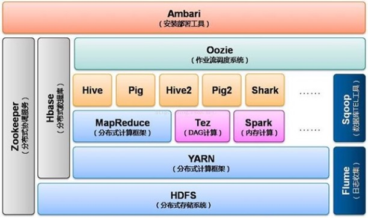

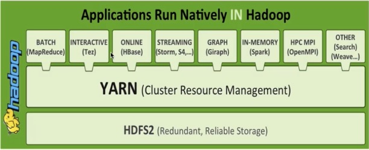


* 不同计算框架可以共享一个HDFS集群上的数据，享受整体的资源 
* XXX On YARN的好处:与其他计算框架共享集群资源，按资源需要分配，进而提高资源的利用率 
    * Spark On YARN 
## MapReduce1.x架构图 

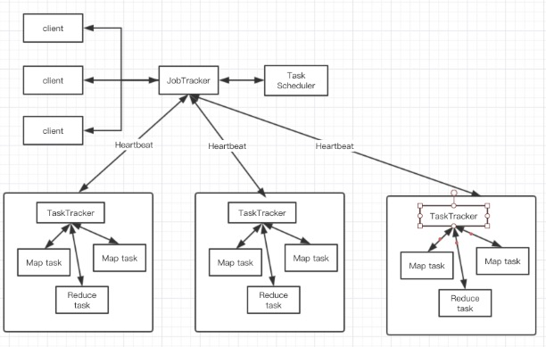


* 可以看出MapReduce1.x版本时架构为Master/Slaves架构 
* JobTracker:负责资源管理和作业调度 
* TaskTracker 
    * 定期向JobTracker汇报本节点的健康状况、资源使用情况、作业执行情况； 
    * 接受来自JobTracker的命令:启动任务/杀死任务 
# 概述 


* Yet Another Resource Negotiator 
* 通用的资源管理系统 
* 为上层应用提供了统一的资源管理和调度 
## 架构图 

>YARN的基本思想是将资源管理和作业调度/监视的功能拆分为单独的守护进程，因此需要一个全局的 ResourceManager (RM)和每个应用程序的ApplicationMaster(AM)，应用程序可以是单个作业也可以是一组作业。 

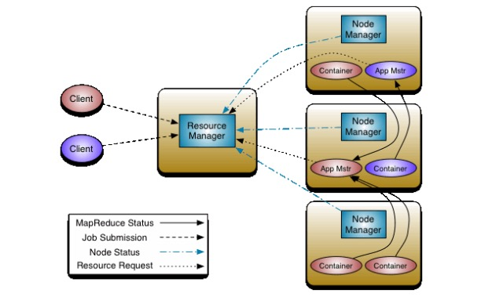

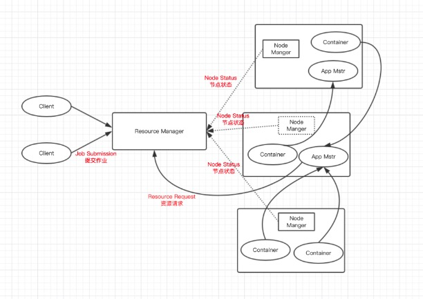

### ResourceManger 

>RM是一个全局的资源管理器，集群只有一个，负责整个系统的资源管理和分配，包括处理客户端请求、启动/监控APP master、监控nodemanager、资源的分配与调度。它主要由两个组件构成：调度器（Scheduler）和应用程序管理器（Applications Manager，ASM) 

* 整个集群同一时间提供服务的RM只有一个，负责集群资源的统一管理和调度，实际上支持HA 
* 处理客户端的请求：提交一个作业、杀死一个作业 
* 监控NM，一旦某个NM挂了，那么该NM上运行的任务需要告知AM来处理 
### ApplicationMaster 

* 负责从调度程序中协商适当的资源容器，跟踪其状态并监视进度 
* 每一个应用程序对应一个:MapReduce、Spark类似应用程序，负责应用程序的管理 
* 为应用程序向RM申请资源(core、memory)，分配给内部task 
* 需要与NM通信:启动/停止task，task是运行在container，其实AM也是运行在container里面 
### NodeManager 

* 每台机器的框架代理，整个集群中有多个，负责自己本身节点资源管理和使用 
* 定时向RM汇报本节点的资源使用情况 
* 接受并处理来自RM的各种命令:启动Container 
* 处理来自AM的命令 
* 负责自身单个节点的资源管理 
### Container 

* 封装来CPU、Memory等 资源的一个容器 
* 是一个任务运行环境的抽象 
### Client 

* 提交作业 
* 查看作业的运行进度 
* 杀死作业 


# 作业提交机制

* Job对象的submit方法。
* waitForCompletion方法，用于提交以前没有提交过的作业，并等待它的完成，成功返回true，失败返回false

## Yarn工作机制


## 作业提交过程

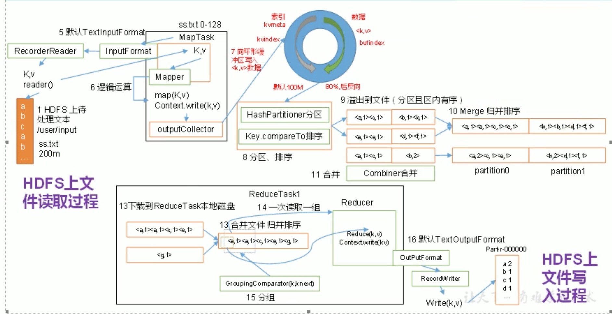

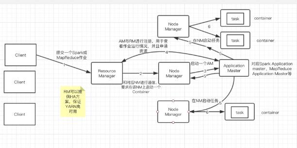

### 源码解析流程

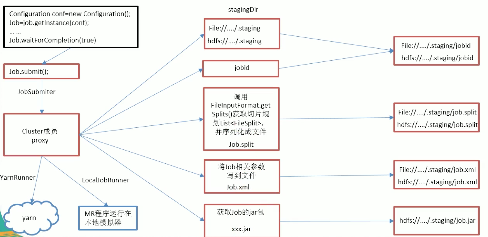

## 作业的初始化

```
YARN的RM收到调用它的submitApplication()消息后,将请求传递给YARN调度器，调度器分配一个容器，然后RM在NM的管理下在容器中启动AM的进程。
MapReduce作业的AM是一个Java程序，主类是MRAppMaster。
AM决定如何构造MapReudce作业的各个任务，如果作业很小就选择和自己一个JVM上有哪些，与在一个节点上顺序运行这些任务相比，当AM判断在新的容器中分配和运行任务的开销大于并行运行它们的开销，就会发生这一情况。这样的作业称为uberized，或者uber任务运行。
```

### 设置多个reduce任务

* 通过-D mapreduce.job.reduces属性设置
* job.setNumReduceTasks()设置

### 那些作业是小作业

* 默认情况下，小作业是少于10个mapper且只有1个reducer且输入大小小于一个HDFS块的作业(通过设置mapreducer.job.ubertask.maxmaps、mapreduce.job.ubertask.maxreduces和mapreduce.job.ybertask.maxbytes来修改默认值)
* 启动Uber任务的具体方法是-D mapreduce.job.ubertask.enable设置为true

## 任务的管理

### 任务内存分配

```
map任务必须在reduce的排序节点能够启动前完成，当5%的map任务已经完成时，reduce任务的请求才会发出。
reduce任务能够在集群中任意位置运行，但是map任务的请求有着数据本地化局限，这是YARN所关注的，在理想情况下，任务是数据本地化的，意味着任务的分片驻留在同一个节点上运行。可选的情况下，任务可能是机架本地化的，即和分片同一个机架而非同一个节点上。有一任务既不是数据本地化也不是机架本地化，它们会从别的机架，而不是运行所在的机架上获取自己的数据。
默认情况下每个map和reduce任务都分配到1024MB的内存和一个虚拟的内核，这些只可以在每个作业的基础上进行配置，分配通过4个属性来设置 mapreduce.map.memory.mb、mapreduce.reduce.memory.mb、mapreduce.map.cpu.vcores和mapredu ce.reduce.cpu.vcoresp.memory.mb
```

### 任务的执行

```
一旦AM的ResourceScheduler为任务分配一个特定节点上的容器，AM就通过与NM通信来启动容器，该任务由主类为Yarnchild的一个Java程序执行。在它运行任务之前，首先将任务需要的资源本地化，包括作业的配置、JAR文件和所有来自分布式缓冲的文件。最后运行map和reduce任务。
YarnChild在指定的JVM中运行，因此用户定义的map或reduce函数中的任何缺陷不会影响到NM
每个任务都能够执行搭建(setup)或者提交(commit)动作，它们和任务本身在同一个jvm中运行，并由作业的OutputCommitter确定，对于基于文件的作业，提交动作将任务输出由临时位置搬到最终位置。
```

### 作业的完成

```
当AM收到作业的最后一个任务已完成通知后，便会把作业的状态设置为"成功"，然后在Job轮询状态时，能够知道任务已完成成功，于告知用户，然后从waitForCompletion方法返回。Job的统计信息和计数值也在此时输出到控制台。
如果AM有相应设置，也会发送一个HTTP作业通知，希望收到回调指令的客户端通过mapreduce.job.end-notification.url属性来进行这项设置。
最后作业完成时，AM和任务容器清理其工作状态，OutputCommitter的commitJob方法会被调用。作业信息由作业历史服务器存档，以便日后用户需要时可以查询。
```

# 作业运行失败

>实际情况中，用户代码错误问题，进程崩溃，机器过着，使用Hadoop的好处之一就是它可以处理此类故障并让你能够成功完成作业。我们需要考虑如下组件的失败：job、am、nm和rm

## 任务运行失败

### map和reduce任务错误

* 任务JVM会在退出之前向父am发送错误报告。错误报告最后被记入用户日志。am将此次任务尝试标记为failed，并释放容器以便资源可以为其他任务使用。
* 对于Streaming任务，如果Streaming进程以非零退出代码退出，则标记为fail，这种行为由stream.non.zero.exit.is.failure属性来控制

### 任务JVM突然退出

* 由于JVM软件缺陷而导致MapReduce用户代码由于特殊原因造成JVM退出，这种情况下，NM会注意到进程已经退出，并通知AM将此任务尝试标记为失败

### 任务挂起的处理方式

* AM注意到有一段时间没有收到进度的更新，便会将任务标记为失败，在此之后，任务JVM进程将被自动杀死。任务被认为失败的超时间隔通常为10分钟，可以以作业为基础(或以集群为基础)进行设置，对应的属性为`mapreduce.task.timeout`，单位为毫秒。
* 超时(timeout)设置为0将关闭超时判定，所以长时间运行的任务永远不会标记为失败，这种情况下，被挂起的任务永远不会释放它的容器并随时间的推移降低整个集群的效率。
* AM被告知一个任务尝试失败后，将重新调度该任务的执行，AM会试图避免以前失败过的NM上重新调度该任务，此外，如果一个任务失败4次，将不会再重试。这个阈值通过`mapreduce.map.maxattempts`或`mapreduce.reduce.maxattempts`来控制。
* 不触发作业失败的情况下运行任务失败的最大百分比，针对map任务和reduce任务设置`mapreduce.map.failures.maxpercent`和`mapreduce.reduce.failures.maxpercent`来设置

## AM运行失败

```
YARN中的应用程序在运行失败的时候会由几次重试机会，就像MapReduce的任务在硬件或网络故障时要进行几次重试一样。运行MRAppMaster的最多重试次数根据`mapreduce.am.max-attempts`属性控制，默认是2，即重试2次。
YARN对集群上运行的YARN application master的最大重试次数加了限制，单个应用程序不可以超过的这个限制，该限制由`yarn.resourcemanager.am.max-attempts`属性设置，默认为2.
```

### 恢复过程

```
AM向RM发送周期性的心跳，当AM失败时，RM将检测到该失败并在一个新的容器(由NM)中开始一个新的master实例。对于MapreduceAM，它将使用作业历史来恢复失败的应用程序所运行任务的状态，使其不必重新运行。默认情况下恢复功能是开启的，但是可以通过设置`yarn.app.mapreduce.am.job.recovery.enable`为false来关闭。
```

### 轮询进度报告过程

```
Mapreduce客户端向AM轮询进度报告，但是如果它的AM运行失败，客户端就需要定位新的实例。在作业初始化期间，客户端向RM询问并缓存AM的地址，使其每次需要向AM查询时不必重载RM。如果AM运行失败，客户端就会在发出状态更新请求时经历超时，这时客户端会折回RM请求新的AM的地址。这个过程对用户透明。
```

## 节点管理器运行失败

```
如果NM由于崩溃或运行非常缓慢而失败，就会停止向RM发送心跳信息(或发送频率很低)。如果10分钟内(通过属性`yarn.resourcemanager.nm.liveness-monitor.expiry-interval-ms`设置，以毫秒为单位)没有收到一条心跳信息，RM将会通知停止发送心跳的NM，并且将其从自己的节点池中移除以调度启用容器。
在失败的的NM上运行的所有任务或者AM都将以上述方式进行恢复，对于曾经在失败的NM上运行且成功的任务，如果属于未完成的作业，那么AM会安排它们重新运行。因为这些任务中间输出可能会存在失败的NM的本地文件系统中，可能无法被reduce任务访问。
```

### NM失败次数过高

* 该NM将可能被拉黑，即使NM自己并没有失败过。
* AM管理黑名单，对MapReduce，如果一个NM上有超过是那个任务失败，AM就尽量将任务调度到不同的节点上。
* 用户可以通过作业属性`mapreduce.job.maxtaskfailures.per.tracker`设置该阈值

## 资源管理器运行失败

* RM失败是严重的问题，没有RM，作业和任务容器将无法启动。在默认的配置中，RM存在单点故障，这是由于机器失败的情况下，所有运行的任务都失败且不能被恢复。

### HA方案

* 双机热备配置，运行一对RM，所有运行中的应用程序的信息存储在一个高可用的状态存储区中(由Zookeeper或HDFS备份)，这样备份机可以恢复出失败的主RM的关键状态。NM信息没有存储在状态存储区中，因为当NM方法它们的一个心跳信息时，NM的信息就能以相当快的速度被新的RM重构。


* 当RM启动后，它从状态存储区中读取应用程序的信息，然后集群中运行的所有应用程序重启AM，这个行为不被计为失败的应用程序重试(所以不会计入`yarn.resourcemanager.am.max-attempts`)，这是因为应用程序并不是因为程序的错误代码而失败，而是系统强行终止的。实际情况中，AM重启不是MR程序的问题，因为它们是恢复已完成的任务的工作。
* RM从备机到主机的切换是由故障转移控制器处理的，默认的故障转移控制器是自动工作的，使用Zookeeper的leader选举机制以保证同一时刻只有一个masterRM。不同于HDFS的高可用性的实现，故障转移控制器不必是一个独立进程，为了配置方便，默认情况下嵌入在RM中。故障转移也可以手动处理。
* 对应RM的故障转移，客户端和节点管理器也需要进行配置，它们以轮询方式试图链接每一个RM，直到找到MasterRM。如果MasterRM故障，再次尝试链接SlaveRM直到其变成MasterRM

# 资源调度器

## FIFO调度器

* 按照达到时间排序，先到先服务

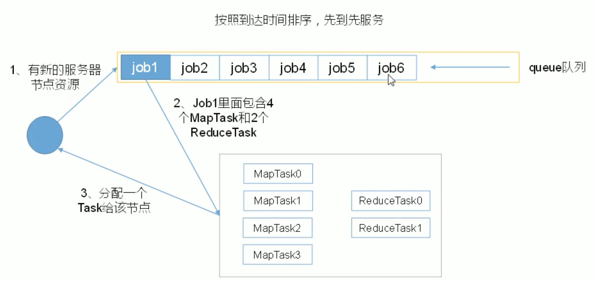

## 容量调度器

* 支持并发运行Job

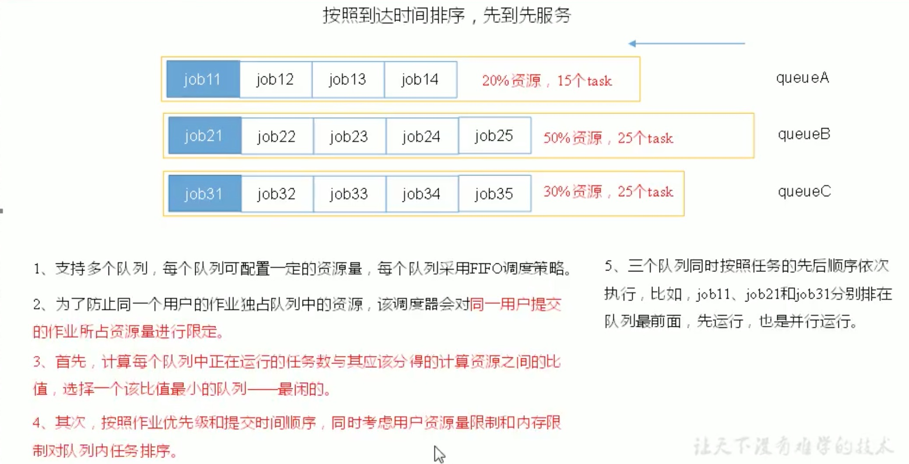

## FAIR调度器

* 按照缺额排序，缺额大者优先。

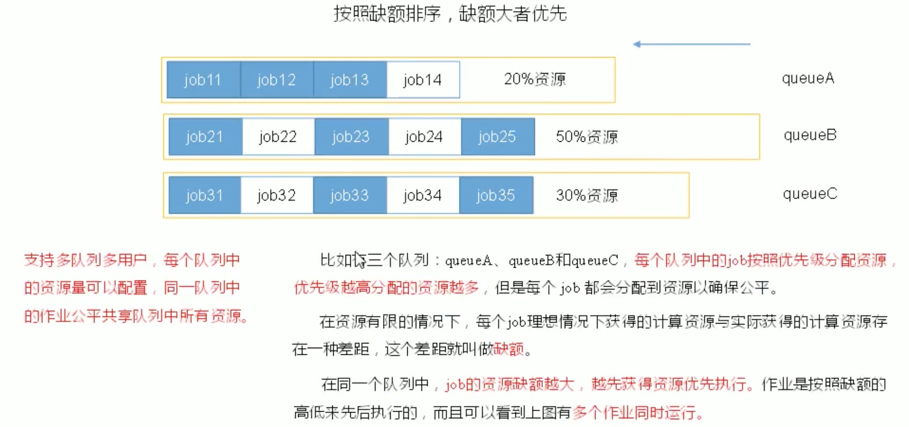

# 任务的执行

## 任务执行环境

## 推测执行

* `作业完成时间取决于最慢的任务完成时间`。

* Mapreduce模型会将一个Job拆分成多个Task，当一个Task运行比预期慢时，它会尽量检测，`并启动另一个相同的Task作为备份`。这就是所谓的任务的推测执行。

#### 推测执行的前提

* 每个Task只有一个备份任务
* 当前Job已完成的Task必须不小于0.05
* 开启推测执行参数设置。mapred-site.xml文件中默认是打开的。
  * `mapreduce.map.speculative` 默认值:`true`
  * `mapreduce.reduce.speculative` 默认值: true
  * `yarn.app.mapreduce.am.job.speculator.class` 默认值:`org.apache.hadoop.mapreduce.v2.app.speculate.DefaultSpeculator` Speculator类实现推测执行策略
  * `yarn.app.mapreduce.am.job.estimator.class` 默认:`org.apache.hadoop.mapreduce.v2.app.speculate.LegacyTaskRuntimeEstimator` Speculator实例使用的TaskRuntimeEstimator的实现，提供任务运行时间的估计值。

#### 不能启用推测执行机制的情况

* 任务间存在严重的负载倾斜。
* 特殊任务，比如任务向数据库写数据。

#### 推测执行算法原理

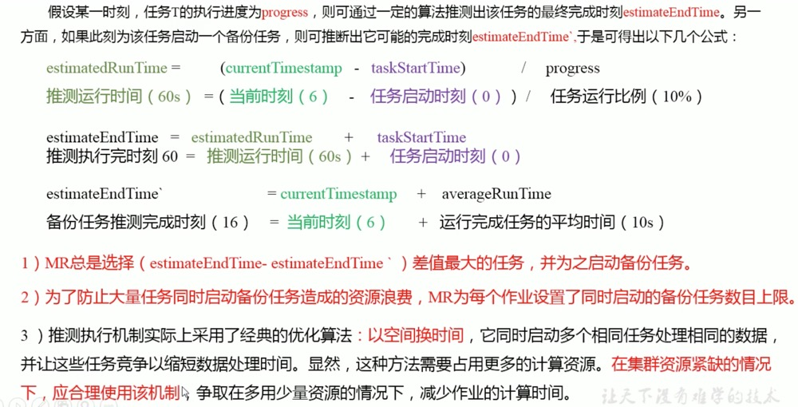

## 关于OutputCommitters

```
MapReduce使用一个提交协议来确保作业和任务都完全成功或失败。这个行为通过该对作业使用OutputCommitte来实现。通过OutputFormat.getOutputCommitter获取，默认为FileOutputCommitter。
```

### setupJob方法

```
作业运行前调用，通常用于初始化操作，当OutputCommitter设置为FileOutputCommitter时，该方法创建最终的输出目录${mapreduce.output.fileoutputformat.outputdir},并且为任务创建一个临时的工作空间，_temporary,作为最终目录的子目录
```

### commitJob方法

```
默认基于文件的视线中，用于删除临时的工作空间并在输出目录中创建一个名为_SUCCESS的隐藏的标志文件，以此告知文件系统的客户端该作业成功完成，如果不成功，就通过状态对象调用abortJob，意味这该作业是否失败或者终止。默认实现中，将删除作业的临时空间。
```

### setupTask方法

```
默认不做任何事情，因为所需的临时文件在任务运行时已经创建
```

# 环境搭建 

>通过设置一些参数并运行ResourceManager守护进程和NodeManager守护进程，可以在YARN上以伪分布式模式运行MapReduce作业。 
## 参数配置 

```xml
1.配置mapreduce运行环境etc/hadoop/mapred-site.xml 
<configuration> 
    <property> 
        <name>mapreduce.framework.name</name> 
        <value>yarn</value> 
    </property> 
    <property> 
        <name>mapreduce.application.classpath</name> 
 <value>$HADOOP_MAPRED_HOME/share/hadoop/mapreduce/*:$HADOOP_MAPRED_HOME/share/hadoop/mapreduce/lib/*</value> 
    </property> 
</configuration> 
2.etc/hadoop/yarn-site.xml  
# 节点管理辅助服务，一个以逗号分隔的列表的服务，服务名称只能包含a-za-z0-9_不能以数字开头。 
<configuration> 
    <property> 
        <name>yarn.nodemanager.aux-services</name> 
        <value>mapreduce_shuffle</value> 
    </property> 
#  环境变量白名单 
    <property> 
        <name>yarn.nodemanager.env-whitelist</name> 
        <value>JAVA_HOME,HADOOP_COMMON_HOME,HADOOP_HDFS_HOME,HADOOP_CONF_DIR,CLASSPATH_PREPEND_DISTCACHE,HADOOP_YARN_HOME,HADOOP_MAPRED_HOME</value> 
    </property> 
</configuration> 
3.启动YARN相关进程 
   sbin/start-yarn.sh 
4.验证 
   jps 
   http://hadoop:8088 
5.停止YARN相关的进程 
   sbin/start-yarn.sh 
```
# 配置详解 

配置文档: 

[https://hadoop.apache.org/docs/r3.2.1/hadoop-yarn/hadoop-yarn-site/NodeManager.html](https://hadoop.apache.org/docs/r3.2.1/hadoop-yarn/hadoop-yarn-site/NodeManager.html)

## ResourceManager和NodeManager配置 

```
# 配置位置文件路径 
etc/hadoop/yarn-site.xml  
```
|**参数** |**值** |**说明** |
|:----|:----|:----|
|yarn.acl.enable |true / false |允许ACLs?默认 false. |
|yarn.admin.acl |Admin ACL |在集群上设置adminis。 ACLs are of for comma-separated-usersspacecomma-separated-groups.默认是指定值为*表示任何人。特别的是空格表示皆无权限。 |
|yarn.log-aggregation-enable |false |Configuration to enable or disable log aggregation <br>配置是否允许日志聚合。 <br>|

## ResourceManager配置 

|**参数** |**值** |**说明** |
|:----|:----|:----|:----|
|yarn.resourcemanager.address |ResourceManager host:port 用于客户端任务提交. |如果设置host:port ，将覆盖yarn.resourcemanager.hostname. <br>host:port主机名。 |
|yarn.resourcemanager.scheduler.address |ResourceManager host:port 用于应用管理者向调度程序获取资源。 |如果设置host:port ，将覆盖yarn.resourcemanager.hostname主机名 |
|yarn.resourcemanager.resource-tracker.address |ResourceManager host:port 用于NodeManagers. |如果设置 *host:port* ，将覆盖yarn.resourcemanager.hostname的主机名设置。 |
|yarn.resourcemanager.admin.address |ResourceManager host:port 用于管理命令。 |如果设置 *host:port* ，将覆盖yarn.resourcemanager.hostname主机名的设置 |
|yarn.resourcemanager.webapp.address |ResourceManager web-ui host:port. |如果设置 *host:port* ，将覆盖yarn.resourcemanager.hostname主机名的设置 |
|yarn.resourcemanager.hostname |ResourceManager host. |可设置为代替所有yarn.resourcemanager* address 资源的主机单一主机名。其结果默认端口为ResourceManager组件。 |
|yarn.resourcemanager.scheduler.class |ResourceManager 调度类. |Capacity调度 (推荐), Fair调度 (也推荐),或Fifo调度.使用完全限定类名,如 org.apache.hadoop.yarn.server.resourcemanager.scheduler.fair.FairScheduler. |
|yarn.scheduler.minimum-allocation-mb |在 Resource Manager上为每个请求的容器分配的最小内存. |In MBs |
|yarn.scheduler.maximum-allocation-mb |在Resource Manager上为每个请求的容器分配的最大内存 |In MBs |
|yarn.resourcemanager.nodes.include-path / yarn.resourcemanager.nodes.exclude-path |允许/摒弃的nodeManagers列表 |如果必要，可使用这些文件来控制允许的NodeManagers列表 |

## NodeManager配置 

|**参数** |**值** |**说明** |
|:----|:----|:----|
|yarn.nodemanager.resource.memory-mb |用于给定的NodeManager的资源，即可用的物理内存、内存容量。 |用于运行容器的NodeManager上的全部可用资源定义。 |
|yarn.nodemanager.vmem-pmem-ratio |任务可使用的虚拟内存的最大比率，可能超过物理内存限制。 |每个任务的虚拟内存使用可能超过其物理内存限制。NodeManager上的任务所使用的虚拟内存总量可能会超过其物理内存使用量。 |
|yarn.nodemanager.local-dirs |写中间数据的本地文件系统以逗号分隔的路径列表。 |多个路径帮助扩展磁盘i/o。 |
|yarn.nodemanager.log-dirs |写日志的本地文件系统以逗号分隔的路径列表 |多个路径帮助扩展磁盘i/o。 |
|yarn.nodemanager.log.retain-seconds |10800 |默认时间(以秒为单位)保留NodeManager上的日志文件，仅适用于禁用日志聚合的情况。 |
|yarn.nodemanager.remote-app-log-dir |/logs |在应用程序完成时移动应用程序日志的HDFS目录。需要设置相应的权限。仅适用于启用日志聚合的情况 |
|yarn.nodemanager.remote-app-log-dir-suffix |logs |后缀附加到远程日志目录。日志将聚合到${yarn.nodemanager.remote-app-log-dir}/${user}/${thisParam}仅适用于启用日志聚合的情况 |
|yarn.nodemanager.aux-services |mapreduce_shuffle |Shuffle service that needs to be set for Map Reduce applications. <br>需要被设置Shuffle服务的Map Reduce应用程序 |
|yarn.nodemanager.env-whitelist |环境变量通过 <br>从NodeManagers的容器继承的环境属性 |对于mapreduce应用程序，除了默认值hadoop op_mapred_home应该被添加外。属性值还有JAVA_HOME HADOOP_COMMON_HOME、HADOOP_HDFS_HOME HADOOP_CONF_DIR,CLASSPATH_PREPEND_DISTCACHE,HADOOP_YARN_HOME HADOOP_MAPRED_HOME |

# MapReduce作业提交至YARN运行 

```
# 包地址 
/home/hadoop/hadoop-2.6.0-cdh5.7.0/hadoop-mapreduce-examples-2.6.0-cdh5.7.0.jar 
# 运行mapreduce作业至yarn 
hadoop jar jarname pi 2 3 
```
