# KafkaProducer流程分析 

## 生产者发送消息的过程

- Kafka 会将发送消息包装为 ProducerRecord 对象， ProducerRecord 对象包含了目标主题和要发送的内容，同时还可以指定键和分区。在发送 ProducerRecord 对象前，生产者会先把键和值对象序列化成字节数组，这样它们才能够在网络上传输。
- 接下来，数据被传给分区器。如果之前已经在 ProducerRecord 对象里指定了分区，那么分区器就不会再做任何事情。如果没有指定分区 ，那么分区器会根据 ProducerRecord 对象的键来选择一个分区，紧接着，这条记录被添加到一个记录批次里，这个批次里的所有消息会被发送到相同的主题和分区上。有一个独立的线程负责把这些记录批次发送到相应的 broker 上。
- 服务器在收到这些消息时会返回一个响应。如果消息成功写入 Kafka，就返回一个 RecordMetaData 对象，它包含了主题和分区信息，以及记录在分区里的偏移量。如果写入失败，则会返回一个错误。生产者在收到错误之后会尝试重新发送消息，如果达到指定的重试次数后还没有成功，则直接抛出异常，不再重试。

<div align="center">  </div>

## KafkaProducer流程图 

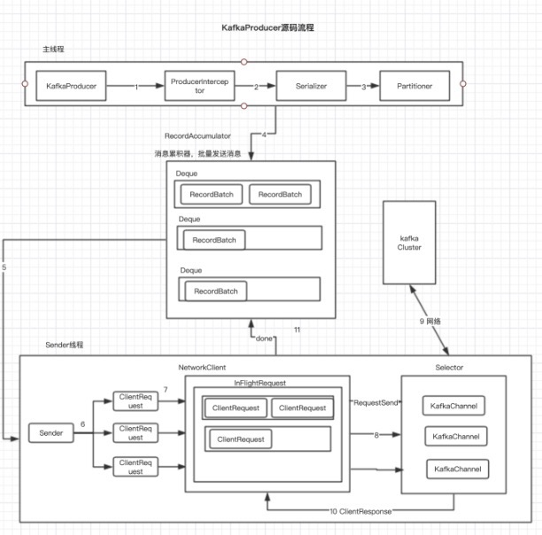

```plain
# 源码KafkaProducer send流程 
① ProducerInterceptor对消息进行拦截。 
② Serializer对消息的key和value进行序列化。 
③ Partitioner为消息选择合适的Partition。 
④ RecordAccumulator收集消息，实现批量发送。 
⑤ Sender从RecordAccumulator获取消息。 
⑥ 构造ClientRequest。 
⑦ 将ClientRequest交给NetworkClient，准备发送。 
⑧ NetworkClient将请求放入KafkaChannel的缓存。 
⑨ 执行网络I/O，发送请求。 
⑨ 收到响应，调用ClientRequest的回调函数。 
⑪ 调用RecordBatch的回调函数，最终调用每个消息上注册的回调函数。 
```

* 此处涉及`两个线程`协同工作， 主线程首先`将业务数据封装成ProducerRecord对象，之后调用send()方法将消息放入Recordaccumulator (消息收集器，可以理解为主线程和Sender线程之间的缓冲区)中暂存。` 
* Sender线程`负责将消息信息构成请求，并最终执行网络I/O的线程，它从RecordAccumulator中取出消息并批量发送出去。` 需要注意的是， KafkaProducer是`线程安全的，多个线程间可以共享使用同一个KafkaProducer对象 。` 
## KafkaProducer API 


* 实现Producer接口,主要包含四个API 
```java
send()方法：发送消息，实际是将消息放入RecordAccumulator暂存，等待发送。 
/** 
 * 刷新操作，等到RecordAccumulator中所有消息发送完成，在刷新完成之前会阻塞调用的线程。 
 * 刷新生产者的所有累积记录。阻塞直到所有发送完成。 
 */ 
public void flush(); 
/** 
 * 在KafkaProducer中维护了一个Metadata对象用于存储Kafka集群的元数据，Metadata中的元数据会定期更新。 
 * partitionsFor()方法负责从Metadata中获取指定Topic中的分区信息。 
 */ 
public List<PartitionInfo> partitionsFor(String topic); 
/** 
 * 关闭这个生产者。设置close标志，等待RecordAccumulator中的消息清空，关闭Sender线程。 
 * Close this producer 
 */ 
public void close(); 
```
## send()方法 

### 时序图 

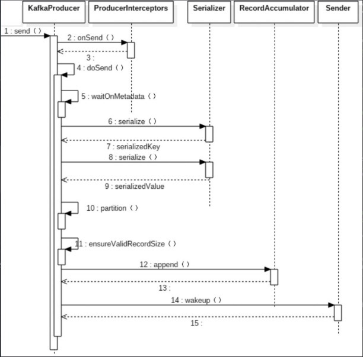

```java
# 核心onSend方法 
private Future<RecordMetadata> doSend(ProducerRecord<K, V> record, Callback callback) { 
    TopicPartition tp = null; 
    try { 
        //首先确保该主题的元数据可用 
        // first make sure the metadata for the topic is available 
        long waitedOnMetadataMs = waitOnMetadata(record.topic(), this.maxBlockTimeMs); 
        long remainingWaitMs = Math.max(0, this.maxBlockTimeMs - waitedOnMetadataMs); 
        byte[] serializedKey; 
        try { 
            //序列化key 
            serializedKey = keySerializer.serialize(record.topic(), record.key()); 
        } catch (ClassCastException cce) { 
            throw new SerializationException("Can't convert key of class " + record.key().getClass().getName() + 
                    " to class " + producerConfig.getClass(ProducerConfig.KEY_SERIALIZER_CLASS_CONFIG).getName() + 
                    " specified in key.serializer"); 
        } 
        byte[] serializedValue; 
        try { 
            //序列化value 
            serializedValue = valueSerializer.serialize(record.topic(), record.value()); 
        } catch (ClassCastException cce) { 
            throw new SerializationException("Can't convert value of class " + record.value().getClass().getName() + 
                    " to class " + producerConfig.getClass(ProducerConfig.VALUE_SERIALIZER_CLASS_CONFIG).getName() + 
                    " specified in value.serializer"); 
        } 
        //基于key 分区 
        int partition = partition(record, serializedKey, serializedValue, metadata.fetch()); 
        //序列化后大小 
        int serializedSize = Records.LOG_OVERHEAD + Record.recordSize(serializedKey, serializedValue); 
        //校验大小是否超过配置，max.request.size和buffer.memory 
        ensureValidRecordSize(serializedSize); 
        //得到TopicPartition 
        tp = new TopicPartition(record.topic(), partition); 
        //如果记录没有时间戳就新生成 
        long timestamp = record.timestamp() == null ? time.milliseconds() : record.timestamp(); 
        log.trace("Sending record {} with callback {} to topic {} partition {}", record, callback, record.topic(), partition); 
        // producer callback will make sure to call both 'callback' and interceptor callback 
        //得到回调方法 
        Callback interceptCallback = this.interceptors == null ? callback : new InterceptorCallback<>(callback, this.interceptors, tp); 
        //积累到积累类机器中 
        RecordAccumulator.RecordAppendResult result = accumulator.append(tp, timestamp, serializedKey, serializedValue, interceptCallback, remainingWaitMs); 
        //如果batchIsFull或者新的batch已经创建，唤醒sender线程 
        if (result.batchIsFull || result.newBatchCreated) { 
            log.trace("Waking up the sender since topic {} partition {} is either full or getting a new batch", record.topic(), partition); 
            this.sender.wakeup(); 
        } 
        //然后结果的future 
        return result.future; 
        // handling exceptions and record the errors; 
        // for API exceptions return them in the future, 
        // for other exceptions throw directly 
    } catch (ApiException e) { 
        log.debug("Exception occurred during message send:", e); 
        if (callback != null) 
            callback.onCompletion(null, e); 
        this.errors.record(); 
        if (this.interceptors != null) 
            this.interceptors.onSendError(record, tp, e); 
        return new FutureFailure(e); 
    } catch (InterruptedException e) { 
        this.errors.record(); 
        if (this.interceptors != null) 
            this.interceptors.onSendError(record, tp, e); 
        throw new InterruptException(e); 
    } catch (BufferExhaustedException e) { 
        this.errors.record(); 
        this.metrics.sensor("buffer-exhausted-records").record(); 
        if (this.interceptors != null) 
            this.interceptors.onSendError(record, tp, e); 
        throw e; 
    } catch (KafkaException e) { 
        this.errors.record(); 
        if (this.interceptors != null) 
            this.interceptors.onSendError(record, tp, e); 
        throw e; 
    } catch (Exception e) { 
        // we notify interceptor about all exceptions, since onSend is called before anything else in this method 
        if (this.interceptors != null) 
            this.interceptors.onSendError(record, tp, e); 
        throw e; 
    } 
} 
```
## ProducerInterceptors&ProducerInterceptor 


* ProducerInterceptors是一个Producerinterceptor集合， 其onSend方法、onAcknowledgement方法、onSendError方法，实际上是循环调用其封装的ProducerInterceptor集合的对应方法 。 

* Producerinterceptor对象可以在消息发送前对其进行拦截或改变，也可以先于用户的Callback，对ACK响应进行预处理。 
### 自定义拦截器 

```java
public class MessageInterceptor implements ProducerInterceptor<String, String> { 
    @Override 
    public ProducerRecord<String, String> onSend(ProducerRecord<String, String> record) { 
        record = new ProducerRecord<>(record.topic(), record.partition(), record.timestamp(), record.key(), 
                record.value() + "interceptor", record.headers()); 
        return record; 
    } 
    @Override 
    public void onAcknowledgement(RecordMetadata metadata, Exception exception) { 
        if (metadata != null && "test".equals(metadata.topic()) 
                && metadata.partition() == 0) { 
            // 对于正常返回，Topic为test且分区编号为0的消息的返回信息进行输出 
            System.out.println(metadata.toString()); 
        } 
    } 
    @Override 
    public void close() { 
    } 
    @Override 
    public void configure(Map<String, ?> configs) { 
    } 
} 
```
## 集群元数据 


* KafkaProducer使用Node、TopicPartition、PartitionInfo 
### Node 


* 表示集群中的一个节点，Node记录这个节点的host、ip、port等信息 
### TopicPartition 


* 表示某个Topic的一个分区，其中的topic字段是Topic的名称，partition字段则此分区在Topic中的分区编号(ID)。 
### PartitionInfo 


* 表示一个分区的详细信息。其中topic字段和partition字段的含义与TopicPartition中的相同，除此之外，leader字段记录了Leader副本所在节点的id，replica字段记录了全部副本所在节点信息，inSyncReplicas字段记录了ISR集合中所有副本所在的节点信息。 
# RecordAccumulator分析 


* KafkaProducer可以有同步和异步两种方式发送消息 ，其实两者的底层实现相同，都是通过异步方式实现的。主线程 调用KafkaProducer.send()方法发送消息的时候，先将消息放到RecordAccumulator中暂存 ，然后主线程就可以从send()方法中返回了，此时消息并没有真正地发送给Kafka，而是缓存在了RecordAccumulator中。 之后， 业务线程通过KafkaProducer.send()方法不断向RecordAccumulator追加消息 ， 当达到一定的条件，会唤醒Sender线程发送RecordAccumulator中的消息 。 
```java
public final class RecordAccumulator { 
    private static final Logger log = LoggerFactory.getLogger(RecordAccumulator.class); 
    //是否已经关闭 
    private volatile boolean closed; 
    //刷新进行中 
    private final AtomicInteger flushesInProgress; 
    //累加进行中 
    private final AtomicInteger appendsInProgress; 
    //每一批消息发送给sender线程的大小 
    private final int batchSize; 
    //压缩类型 
    private final CompressionType compression; 
    //超过lingerMs时发送给sender线程 
    private final long lingerMs; 
    //每次重试需要等到的时间 
    private final long retryBackoffMs; 
    //剩余为发送消息 
    private final BufferPool free; 
    private final Time time; 
    //批量消息 
    private final ConcurrentMap<TopicPartition, Deque<RecordBatch>> batches; 
    //不完整批量消息 
    private final IncompleteRecordBatches incomplete; 
    // The following variables are only accessed by the sender thread, so we don't need to protect them. 
    // 以下变量仅由发送方线程访问，因此我们不需要保护它们。 
    private final Set<TopicPartition> muted; 
    private int drainIndex; 
```
## MemoryRecords 


* MemoryRecords 是最底层存放消息的地方，表示多个消息的集合，其中使用Java NIO ByteBuffer来保存消息数据，Compressor用于对ByteBuffer中的消息进行压缩 ，以及其他控制字段。 
## RecordBatch 


* 每个RecordBatch封装一个MemoryRecords对象 
```java
//记录总数 
public int recordCount = 0; 
//最大记录大小 
public int maxRecordSize = 0; 
//重试次数 
public volatile int attempts = 0; 
//创建时间 
public final long createdMs; 
//耗尽时间 
public long drainedMs; 
//最后的重试时间 
public long lastAttemptMs; 
//只想用来存储数据的MemoryRecords对象 
public final MemoryRecords records; 
//当前RecordBatch中缓存的消息都会发向此TopicPartition 
public final TopicPartition topicPartition; 
//生产者请求结果 
public final ProduceRequestResult produceFuture; 
//最后累加时间 
public long lastAppendTime; 
//thunk对象集合 
private final List<Thunk> thunks; 
//记录某消息在recordBatch中的偏移量 
private long offsetCounter = 0L; 
//是否正在重试 
private boolean retry; 
```
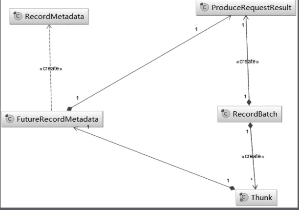

## BufferPool 


* ByteBuffer的创建和释放是比较消耗资源的，为了实现内存的高效利用，因此提供BufferPool来实现对ByteBuffer的服用。 
## RecordAccumulator 

### append方法逻辑 


1. 首先在batches集合中查找TopicPartition对应的Deque，查找不到，则创建新的Deque，并添加到batches集合中。 
2. 对Deque加锁（使用synchronized关键字加锁）。 
3. 调用tryAppend()方法，尝试向Deque中最后一个RecordBatch追加Record。 
4. synchronized块结束，自动解锁。 
5. 追加成功，则返回RecordAppendResult（其中封装了ProduceRequestResult）。 
6. 追加失败，则尝试从BufferPool中申请新的ByteBuffer。 
7. 对Deque加锁（使用synchronized关键字加锁），再次尝试第3步。 
8. 追加成功，则返回；失败，则使用第5步得到的ByteBuffer创建RecordBatch。 
9. 将Record追加到新建的RecordBatch中，并将新建的RecordBatch追加到对应的Deque尾部。 
10. 将新建的RecordBatch追加到incomplete集合。 
11. synchronized块结束，自动解锁。 
12. 返回RecordAppendResult，RecordAppendResult会中的字段会作为唤醒Sender线程的条件。 
### tryAppend 


* 会查找batches集合中对应队列的最后一个RecordBatch对象，并调用其tryAppend()完成消息追加。 


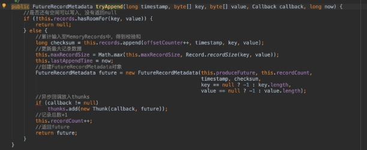


### ready 

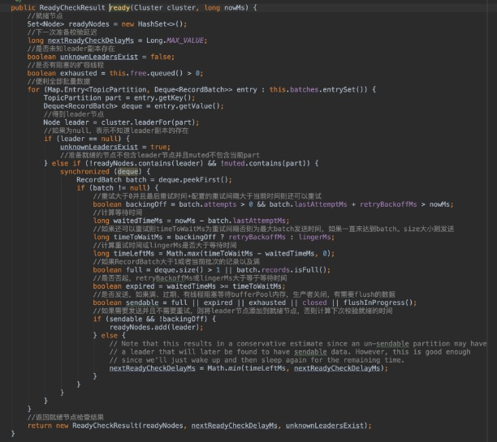

### drain 

```plain
Node集合获取要发送的消息，返回Map＜Integer, List＜RecordBatch＞＞集合，key是NodeId，value是待发送的RecordBatch集合。drain方法也是由Sender线程调用的。drain()方法的核心逻辑是进行映射的转换：将RecordAccumulator记录的TopicPartition-＞RecordBatch集合的映射，转换成了NodeId-＞RecordBatch集合的映射。为什么需要这次转换呢？在网络I/O层面，生产者是面向Node节点发送消息数据，它只建立到Node的连接并发送数据，并不关心这些数据属于哪个TopicPartition；而在调用KafkaProducer的上层业务逻辑中，则是按照TopicPartition的方式产生数据，它只关心发送到哪个TopicPartition，并不关心这些TopicPartition在哪个Node节点上。在下文介绍到Sender线程的时候会发现，它每次向每个Node节点至多发送一个ClientRequest请求，其中封装了追加到此Node节点上多个分区的消息，待请求到达服务端后，由Kafka对请求进行解析。 
```
```java
public Map<Integer, List<RecordBatch>> drain(Cluster cluster, 
                                             Set<Node> nodes, 
                                             int maxSize, 
                                             long now) { 
    if (nodes.isEmpty()) 
        return Collections.emptyMap(); 
    //转换后的数据，key nodeid value 发送的数据 
    Map<Integer, List<RecordBatch>> batches = new HashMap<>(); 
    //遍历就绪节点 
    for (Node node : nodes) { 
        int size = 0; 
        //根据node id得到分区相关信息集合 
        List<PartitionInfo> parts = cluster.partitionsForNode(node.id()); 
        //就绪发送数据 
        List<RecordBatch> ready = new ArrayList<>(); 
        /* to make starvation less likely this loop doesn't start at 0 */ 
        //使饥饿的可能性降低，该循环不会从0开始 
        //drainIndex 是batches的下标，记录上次发送停止时的位置，下次继续从此位置开始发送 
        int start = drainIndex = drainIndex % parts.size(); 
        do { 
            PartitionInfo part = parts.get(drainIndex); 
            //创建TopicPartition 
            TopicPartition tp = new TopicPartition(part.topic(), part.partition()); 
            // Only proceed if the partition has no in-flight batches. 只处理这个分区没有在发送中批次 
            if (!muted.contains(tp)) { 
                //获得发往该分区的RecordBatch 
                Deque<RecordBatch> deque = getDeque(new TopicPartition(part.topic(), part.partition())); 
                if (deque != null) { 
                    synchronized (deque) { 
                        //得到第一个RecordBatch 
                        RecordBatch first = deque.peekFirst(); 
                        if (first != null) { 
                            //是否还需要重试 
                            boolean backoff = first.attempts > 0 && first.lastAttemptMs + retryBackoffMs > now; 
                            // Only drain the batch if it is not during backoff period. 
                            //如果不需要重试发送 
                            if (!backoff) { 
                                //size+bytebuffer的大小如果大于最大大小并且就绪不为空 
                                if (size + first.records.sizeInBytes() > maxSize && !ready.isEmpty()) { 
                                    // there is a rare case that a single batch size is larger than the request size due 
                                    // to compression; in this case we will still eventually send this batch in a single 
                                    // request 
                                    //数据量已满，结束循环，一般是一个请求的大小 
                                    break; 
                                } else { 
                                    RecordBatch batch = deque.pollFirst(); 
                                    //“关闭Compressor及底层输出流，并将MemoryRecords设置为只读” 
                                    batch.records.close(); 
                                    //计算size大小 
                                    size += batch.records.sizeInBytes(); 
                                    ready.add(batch); 
                                    batch.drainedMs = now; 
                                } 
                            } 
                        } 
                    } 
                } 
            } 
            //更新drainIndex 
            this.drainIndex = (this.drainIndex + 1) % parts.size(); 
            //如果start！=drainIndex 
        } while (start != drainIndex); 
        batches.put(node.id(), ready); 
    } 
    return batches; 
} 
```
# Sneder分析 

## Sender线程的流程 

```plain
首先，它根据RecordAccumulator的缓存情况，筛选出可以向哪些Node节点发送消息，即上一节介绍的RecordAccumulator.ready()方法；然后，根据生产者与各个节点的连接情况（由NetworkClient管理），过滤Node节点；之后，生成相应的请求，这里要特别注意的是，每个Node节点只生成一个请求；最后，调用NetWorkClient将请求发送出去。 
```


### Sender线程run方法时序图 

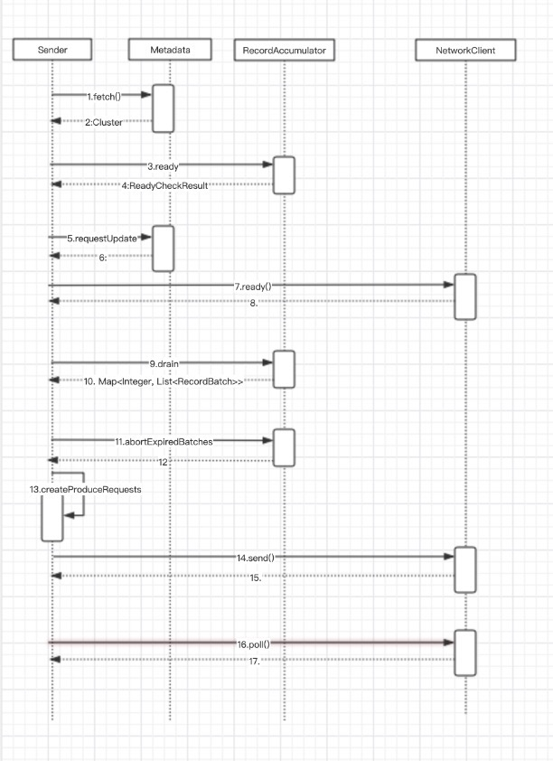

（1）从 Metadata获取Kafka集群元数据 。 

（2）调用RecordAccumulator.ready()方法，根据 RecordAccumulator的缓存情况，选出可以向哪些Node节点发送消息，返回ReadyCheckResult对象 。 

（3）如果 ReadyCheckResult中标识有unknownLeadersExist，则调用Metadata的requestUpdate方法，标记需要更新Kafka的集群信息 。 

（4） 针对ReadyCheckResult中readyNodes集合，循环调用NetworkClient.ready()方法，目的是检查网络I/O方面是否符合发送消息的条件，不符合条件的Node将会从readyNodes集合中删除 。 

（5）针对经过步骤4处理后的readyNodes集合， 调用RecordAccumulator.drain()方法，获取待发送的消息集合 。 

（6）调用RecordAccumulator.abortExpiredBatches()方法 处理RecordAccumulator中超时的消息 。其代码逻辑是， 遍历RecordAccumulator中保存的全部RecordBatch，调用RecordBatch.maybeExpire()方法进行处理。如果已超时，则调用RecordBatch.done()方法，其中会触发自定义Callback，并将RecordBatch从队列中移除，释放ByteBuffer空间 。 

（7）调用Sender.createProduceRequests()方法 将待发送的消息封装成ClientRequest 。 

（8）调用NetWorkClient.send()方法， 将ClientRequest写入KafkaChannel的send字段 。 

（9）调用NetWorkClient.poll()方法， 将KafkaChannel.send字段中保存的ClientRequest发送出去，同时，还会处理服务端发回的响应、处理超时的请求、调用用户自定义Callback等 。 

## 创建请求 


* Protocol类 中可以查看Kafka底层的请求和响应格式，请求和响应有多个版本。 
### 生产者向服务端追加消息 


* 请求为Producer Request(Version:2) 


* 响应为Producer Response(Version:2) 

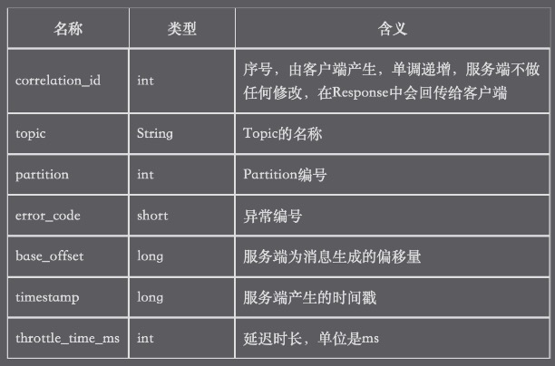

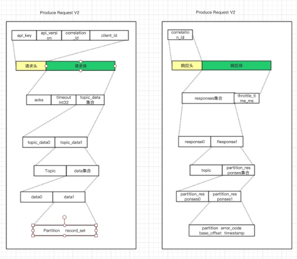

### createProduceRequests() 


* Sender.createProduceRequests()方法的功能是将 待发送的消息封装成ClientRequest 。不管一个Node对应有多少个RecordBatch，也不管这些RecordBatch是发给几个分区的， 每个Node至多生成一个ClientRequest对象 . 
```java
1. 将一个NodeId对应的RecordBatch集合，重新整理为produceRecordsByPartition（Map＜TopicPartition, ByteBuffer＞）和recordsByPartition（Map＜TopicPartition, RecordBatch＞）两个集合。 
2.建RequestSend，RequestSend是真正通过网络I/O发送的对象，其格式符合上面描述的Produce Request(Version:2)协议，其中有效负载就是produceRecordsByPartition中的数据。 
3.创建RequestCompletionHandler作为回调对象。 
4.将RequestSend对象和RequestCompletionHandler对象封装进ClientRequest对象中，并将其返回. 
```
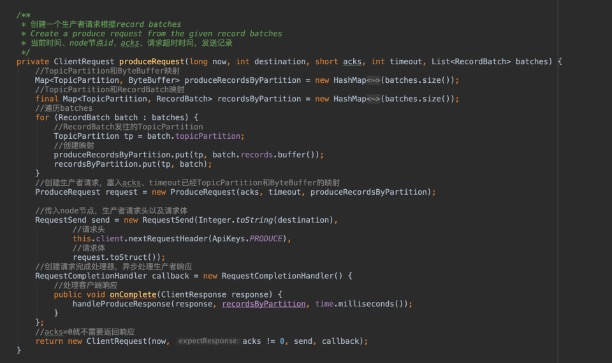

## KSelector 

### NetworkClient的结构 


* Selector的类型不是nio的，而是 org.apache.kafka.common.network.Selector，为了方便区分和描述，将其简称为KSelect 。KSelector 使用NIO异步非阻塞模式实现网络I/O操作，KSelector使用一个单独的线程可以管理多条网络连接上的连接、读、写等操作 。 
### KSelector属性 

```java
//java.nio.channels.Selector类型，用来监听网络IO事件 
private final java.nio.channels.Selector nioSelector; 
//HashMap＜String, KafkaChannel＞类型，维护了NodeId与KafkaChannel之间的映射关系， 
// 表示生产者客户端与各个Node之间的网络连接。KafkaChannel是在SocketChannel上的又 
// 一层封装 
private final Map<String, KafkaChannel> channels; 
//记录已经完全发送出去的请求 
private final List<Send> completedSends; 
//记录已经完全接收到的请求 
private final List<NetworkReceive> completedReceives; 
//暂存一次OP_READ事件处理过程中读取到的全部请求。当一次OP_READ事件处理完成之后，会将stagedReceives集合中的 
//请求保存到completedReceives中 
private final Map<KafkaChannel, Deque<NetworkReceive>> stagedReceives; 
// 
private final Set<SelectionKey> immediatelyConnectedKeys; 
//记录poll过程断开的连接和新建立的连接 
private final List<String> disconnected; 
private final List<String> connected; 
//记录向那些NODE发送的请求失败了 
private final List<String> failedSends; 
private final Time time; 
private final SelectorMetrics sensors; 
private final String metricGrpPrefix; 
private final Map<String, String> metricTags; 
private final ChannelBuilder channelBuilder; 
//“LinkedHashMap类型，用来记录各个连接的使用情况，并据此关闭空闲时间超过connectionsMaxIdleNanos的连接。” 
private final Map<String, Long> lruConnections; 
private final long connectionsMaxIdleNanos; 
private final int maxReceiveSize; 
private final boolean metricsPerConnection; 
private long currentTimeNanos; 
private long nextIdleCloseCheckTime; 
```
### connect方法 

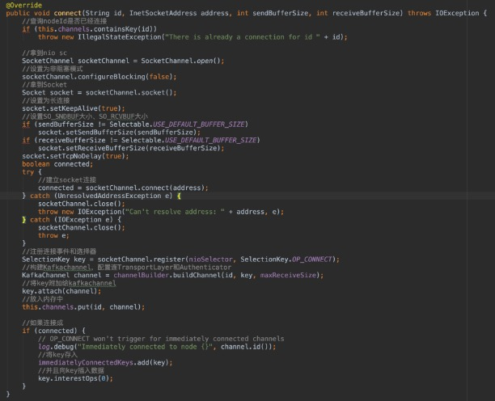

### send方法 


* KSelector.send()方法是将 之前创建的RequestSend对象缓存到KafkaChannel的send字段中 ， 并开始关注此连接的OP_WRITE事件，并没有发生网络I/O。在下次调用KSelector.poll()时，才会将RequestSend对象发送出去。 如果此KafkaChannel的send字段上还保存着一个未完全发送成功的RequestSend请求，为防止覆盖数据，则会抛出异常。也就是说，每个 KafkaChannel一次poll过程中只能发送一个Send请求 。 
## InFlightRequests 

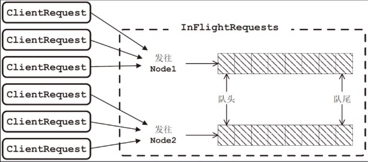

```java
/** 
* The set of requests which have been sent or are being sent but haven't yet received a response 
* 缓存已发完成发送但是未收到响应的ClientRequest 
*/ 
final class InFlightRequests { 
//最大InFlightRequests连接数量 
private final int maxInFlightRequestsPerConnection; 
//缓存完成发送的ClientRequest  NodeId:Deque<ClientRequest> 
private final Map<String, Deque<ClientRequest>> requests = new HashMap<String, Deque<ClientRequest>>(); 
public InFlightRequests(int maxInFlightRequestsPerConnection) { 
this.maxInFlightRequestsPerConnection = maxInFlightRequestsPerConnection; 
} 
/** 
* 添加至requests中 
* Add the given request to the queue for the connection it was directed to 
*/ 
public void add(ClientRequest request) { 
Deque<ClientRequest> reqs = this.requests.get(request.request().destination()); 
if (reqs == null) { 
reqs = new ArrayDeque<>(); 
this.requests.put(request.request().destination(), reqs); 
} 
//在头部加入 
reqs.addFirst(request); 
} 
/** 
* Get the request queue for the given node 
* 根据给定的node得到请求队列 
*/ 
private Deque<ClientRequest> requestQueue(String node) { 
Deque<ClientRequest> reqs = requests.get(node); 
if (reqs == null || reqs.isEmpty()) 
throw new IllegalStateException("Response from server for which there are no in-flight requests."); 
return reqs; 
} 
/** 
* 得到最后的请求 
* Get the oldest request (the one that that will be completed next) for the given node 
*/ 
public ClientRequest completeNext(String node) { 
return requestQueue(node).pollLast(); 
} 
/** 
* 得到给定节点的最后ClientRequest，不移除 
* Get the last request we sent to the given node (but don't remove it from the queue) 
* @param node The node id 
*/ 
public ClientRequest lastSent(String node) { 
return requestQueue(node).peekFirst(); 
} 
/** 
* Complete the last request that was sent to a particular node. 
* @param node The node the request was sent to 
* @return The request 
*/ 
public ClientRequest completeLastSent(String node) { 
return requestQueue(node).pollFirst(); 
} 
/** 
* Can we send more requests to this node? 
* 这个节点是否还能发送 
* @param node Node in question 
* @return true iff we have no requests still being sent to the given node 
*/ 
public boolean canSendMore(String node) { 
Deque<ClientRequest> queue = requests.get(node); 
return queue == null || queue.isEmpty() || 
(queue.peekFirst().request().completed() && queue.size() < this.maxInFlightRequestsPerConnection); 
} 
/** 
* Return the number of inflight requests directed at the given node 
* @param node The node 
* @return The request count. 
*/ 
public int inFlightRequestCount(String node) { 
Deque<ClientRequest> queue = requests.get(node); 
return queue == null ? 0 : queue.size(); 
} 
/** 
* Count all in-flight requests for all nodes 
*/ 
public int inFlightRequestCount() { 
int total = 0; 
for (Deque<ClientRequest> deque : this.requests.values()) 
total += deque.size(); 
return total; 
} 
/** 
* Clear out all the in-flight requests for the given node and return them 
* 
* @param node The node 
* @return All the in-flight requests for that node that have been removed 
*/ 
public Iterable<ClientRequest> clearAll(String node) { 
Deque<ClientRequest> reqs = requests.get(node); 
if (reqs == null) { 
return Collections.emptyList(); 
} else { 
return requests.remove(node); 
} 
} 
/** 
* Returns a list of nodes with pending inflight request, that need to be timed out 
* 返回鸡诶单的集合等待的inflight request, 
* @param now current time in milliseconds 
* @param requestTimeout max time to wait for the request to be completed 
* @return list of nodes 
*/ 
public List<String> getNodesWithTimedOutRequests(long now, int requestTimeout) { 
List<String> nodeIds = new LinkedList<String>(); 
for (String nodeId : requests.keySet()) { 
//如果该队列还有request 
if (inFlightRequestCount(nodeId) > 0) { 
ClientRequest request = requests.get(nodeId).peekLast(); 
long timeSinceSend = now - request.sendTimeMs(); 
//得到超时请求的节点 
if (timeSinceSend > requestTimeout) { 
nodeIds.add(nodeId); 
} 
} 
} 
return nodeIds; 
} 
} 
```
## MetadataUpdate 


* ManualMetadataUpdater是哥空实现，DefaultMetadataUpdater是模式实现 
    * metadata 
### MetadataRequest请求 

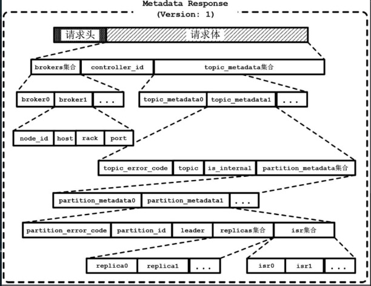

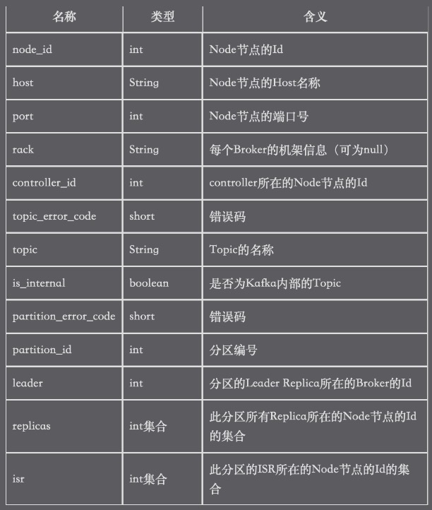

## NetworkClinet 


* connectionStates管理所有连接的状态，底层是一个Map可以是NodeId，value是NodeConnectionState对象 

