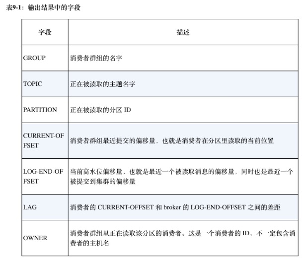
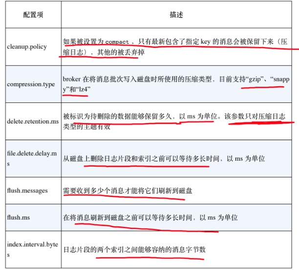
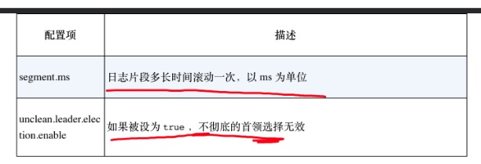
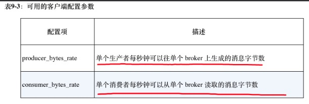

# topic操作 

## 创建主题 


* 创建topic需要三个参数 
    * topic名称 
    * 复制系数:topic副本数 
    * 分区:topic的分区数量 
```shell
kafka-topics.sh --bootstrap-servers <broker host> --create --topic <string> --replication-factor <integer> --partitions <integer> 
--disable-rack-aware不需要基于机架信息的分配策略 
--if-not--exists 即使topic以及存在也不会抛出重复创建topic的错误 
```
## 增加分区 


* 使用--if-exists可以使得topic不存在的错误被忽略，不建议使用 
```shell
# 将分区修改为16个 
kafka-topics.sh --bootstrap-servers localhost:9092 --alter --topic my_topic --partition 16 
```

* 无法减少topic的分区，因为一旦删除了分区那么分区里的数据也会被删除，导致数据不一致 
## 删除topic 


* 如果一个topic不再使用只要它存在在集群里，就会占用一定数量的磁盘空间和文件举句柄。删除不使用的topic可以释放被占用的资源。将broker的delete.topic.enable设置为true，然后使用--delete参数 
```shell
kafka-topics.sh --bootstrap-servers localhost:9092 --detele --topic my_topic 
```
## 列出集群中的所有主题 

```shell
kafka-topics.sh --bootstrap-servers localhost:9092 --list 
```
## 列出topic详细信息 

```shell
kafka-topics.sh --bootstrap-servers localhost:9092 --describe 
```

* 使用--topics-with-overrides参数可以找出所有包含覆盖配置的topic， 只列出与集群不一样配置的topic 
* 使用--under-replicated-partitions参数可以列出所有包含不同步副本的分区 。 
* 使用--unavailable-partitions参数可以列出所有没有leader副本的分区 ，这些分区以及处于离线状态，对于生产者和消费者不可用。 
# 消费者组操作 

## 列出并描述消费者组 


* --list 
* --new-consumer 
```shell
kafka-consumer-groups.sh --bootstrap-server localhost:9092,localhost:9093,localhost:9094 --list 
```

* --describe --group查看指定消费者组详细信息 
```shell
kafka-consumer-groups.sh --bootstrap-server localhost:9092,localhost:9093,localhost:9094 --describe --group foo 
```


## 删除群组 


* 旧版本支持删除群组，从Zookeeper中删移除整个群组，包含所有已保存的offset，执行该操作前必须关闭所有消费者。 
```shell
kafka-consumer-groups.sh --zookeeper loclahost:2182,localhost:2193,localhost:2184 --delete --group testgroup 
```

* 删除单个topic的offset 
```shell
kafka-consumer-groups.sh --zookeeper loclahost:2182,localhost:2193,localhost:2184 --group testgroup --topic my-topic 
```
## 偏移量管理 

### 导出offset 

```shell
kafka-run-class.sh kafka.tools.ExportZkOffsets --zkconnect localhost:2182 --group testgroup --output-file offsets 
```
### 导入offset 

```shell
kafka-run-class.sh kafka.tools.ImportZkOffsets --zkconnect localhost:2182 --group testgroup --input-file offsets 
```
# 动态配置变更 

## 覆盖topic的默认配置 


* 配置格式 
```shell
kafka-configs.sh --bootstrap-server loclahost:9092 --alter --entity-type topics --entity-name <topic name> --add-config <key>=<value>[,<key>=<value>...] 
```

* 可用的topic配置参数 







* 修改配置 
```plain
kafka-configs.sh --bootstrap-server localhost:9092 --alter --entity-type topics --entity-name learing-kafka --add-config message.timestamp.type=LogAppendTime 
```
## 覆盖客户端的默认配置 


* 对于Kafka客户端来说， 只能覆盖生产者配额和消费者配额参数。这两个都是以字节为单位，表示客户端在每个broker上的生产速率和消费速率 。 
* 如果集群有5个broker，生产者的配额为10MB/s，它总共的速率为50MB/s。 

* 为kafka客户端设置客户端id. 
### 更改配置格式如下 

```plain
kafka-configs.sh --bootstrap-server loclahost:9092 --alter --entity-type clients --entity-name <client ID> --add-config <key>=<value>[,<key>=<value>...] 
```


## 列出被覆盖的配置 


* 只能显示topic的覆盖配置 
```plain
kafka-configs.sh --bootstrap-server loclahost:9092 --describe --entity-type topics --entity-name <topic NAME> 
```
## 移除被覆盖的配置 


* --alter和--delete-config来删除被覆盖的配置 
```plain
kafka-configs.sh --bootstrap-server loclahost:9092 --alter  --entity-type topics --entity-name <topic NAME> --delete-config <config KEY> 
```
# 分区管理 


* Kafka提供两个脚本管理分区 
    * 用于重新选举leaqder 
    * 用于将分区分配给broker 
## 首选的首领选举 


* Kafka会将副本清单里的第一个同步副本选择为leader副本，但是关闭并重启broker之后，并不会自动恢复原先的leader身份。 
### 自动首领再均衡 


* broker又一个配置可用于启动自动首领再均衡，自动均衡会带来严重的性能问题，会造成客户端流量长时间停顿。 
### 手动触发选举 

```shell
kafka-leader-election.sh --bootstrap-server localhost:9092 --election-type PREFERRED --all-topic-partitions 
```
## 修改分区副本 

### 以下场景需要修改分区副本 


* topic分区在整个集群里不均衡分布造成里集群负载的不均衡 
* broker离线造成分区不同步 
* 新加入的broker需要从集群里获得负载 
### kafka-reassign-partitions.sh 


* 根据broker清单和topic清单生成一组迁移步骤 
* 指定这些迁移步骤 
* 可选，使用生成的迁移步骤验证分区重分配的进度和完成情况。 
#### 编写topic清单 

```json
{ 
  "topics": [ 
    { 
      "topic": "learing-kafka" 
    }, 
    { 
      "topic": "learning-kafka" 
    } 
  ], 
  "version": 1 
} 
```

* 为这两个topic生成迁移步骤 
```json
# 将这些topic迁移到broker1和broker2上 
 kafka-reassign-partitions.sh --zookeeper localhost:2182  --generate -topics-to-move-json-file topics.json --broker-list 1,2 
当前分区副本分配 Current partition replica assignment 
{"version":1,"partitions":[{"topic":"learing-kafka","partition":0,"replicas":[2],"log_dirs":["any"]},{"topic":"learning-kafka","partition":0,"replicas":[2],"log_dirs":["any"]}]} 

建议分区副本分区 Proposed partition reassignment configuration 
{"version":1,"partitions":[{"topic":"learing-kafka","partition":0,"replicas":[0],"log_dirs":["any"]},{"topic":"learning-kafka","partition":0,"replicas":[0],"log_dirs":["any"]}]} 
```

* 将当前保存到一个json文件用于备份，建议分区用于执行 
#### 指定修改分区副本 

```json
kafka-reassign-partitions.sh --zookeeper localhost:2182 --execute --reassignment-json-file reassign.json 
Current partition replica assignment 

{"version":1,"partitions":[{"topic":"learing-kafka","partition":0,"replicas":[2],"log_dirs":["any"]},{"topic":"learning-kafka","partition":0,"replicas":[2],"log_dirs":["any"]}]} 

Save this to use as the --reassignment-json-file option during rollback 
Successfully started reassignment of partitions. 
```

* 该命令 会将指定分区的副本重新分配到新的broker上。集群控制器通过为每个分区添加新副本实现重新分配(增加复制系数)。新的副本将从分区的leader那里复制所有数据，根据分区大小的不同，复制过程可能需要花些时间，因为数据是通过网络复制到新副本的。在复制完成后，控制器将旧副本从副本清单里移除 。 
#### 验证分配情况 

```plain
kafka-reassign-partitions.sh --zookeeper localhost:2182  --verify --reassignment-json-file reassign.json 
Status of partition reassignment: 
Reassignment of partition learing-kafka-0 completed successfully 
Reassignment of partition learning-kafka-0 completed successfully 
```
### 分批重分配 


* 分区重分配对集群的性能影响较大，会引起内存页缓冲发生变化，并占用额外的网络和磁盘资源。将重分配过程拆分成多个小步骤可以将这种影响降到最低。 
## 修改复制系数 

### 将复制系数改为2 

```json
{ 
  "topics": [ 
    { 
      "topic": "learing-kafka", 
      "partition": 0, 
      "replicas": [ 
      	1, 
      	2 
      ] 
    } 
  ], 
  "version": 1 
} 
```
## 转储日志片段 


* 当存在“毒药”消息时，消费者无法消费，可以使用kafka-run-class.sh 
```plain
kafka-run-class.sh kafka.tools.DumpLogSegments --files xxxx.log 
```
### 校验索引文件 

```plain
kafka-run-class.sh kafka.tools.DumpLogSegments --files 00000000000000000331.index 00000000000000000331.log --index-sanity-check 
Dumping 00000000000000000331.index 
00000000000000000331.index passed sanity check. 
```
## 副本验证 


* 分区复制的原理与消费者客户端类型： follower broker定期将上一个offset到当前offset之间的数据复制到磁盘上。如果复制停止并重启，它会从上一个checkpoint继续复制。如果之前复制的日志片段被删除，follower不会做任何补偿 。 
* 可以使用 kafka-replica-verification.sh来验证集群分区副本的一致性 。它会从指定分区的副本上获取消息，并检查所有副本是否具有相同的消息。 
### 副本验证对集群的影响 


* 副本验证会对集群造成影响，因为它需要读取所有的消息，读取的过程是并行的，所以使用需要注意。 
```plain
# 对lea开头的topic进行校验 
kafka-replica-verification.sh --broker-list localhost:9092,localhost:9093,localhost:9094 --topic-white-list 'lea.*' 
```
# 消费和生产 

## 控制台消费者 


* kafka-console-consumer.sh提供一种从一个或多个topic上读取消息的方式。 
* --formatter CLASSNAME:指定消息格式化器的类名，用于解码消息，默认值为kafka.tools.DefaultFormatter 
* --from-beginning:指定从最旧的offset开始读取数据，否则就从最新的offset开始读取 
* --max-message NUM：指定在退出之前最多读取num个消息 
* --partition NUM：指定只读取ID为NUM的分区 
### 消息格式化器 

#### kafka.tools.LoggingMessageFormatter 


* 将消息输出到日志，而不是输出到标准的输出设备。日志级别为INFO，包含时间戳、键和值 
#### kafka.tools.ChecksumMessageFormatter 


* 只打印消息校验和 
#### kafka.tools.NoOpMessageFormatter 


* 读取消息但不打印消息 
#### kafka.tools.DefaultMessageFormatter 


* 可以通过--property将配置传递 
