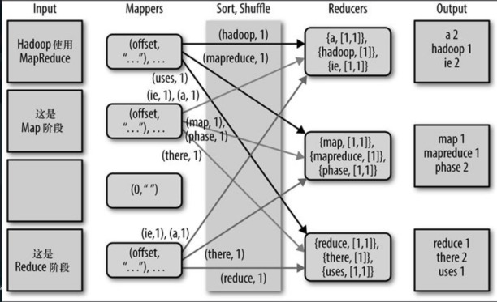
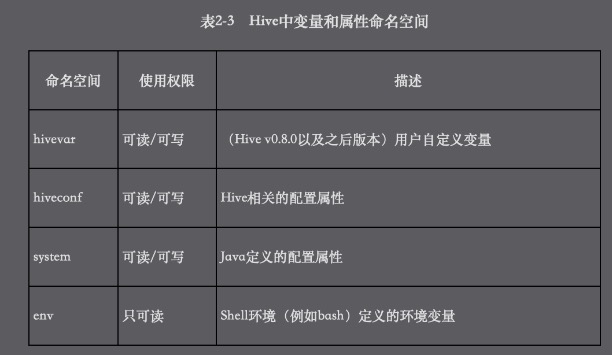

# 概述 


* Hive不支持记录级别的更新、插入或者删除操作。 
* Hive不支持事务，因为Hadoop是面向批处理的系统，并且MR任务启动过程速度慢，因此Hive查询延迟严重。 
* Hive不支持OLTP(联机事务处理)实时要求高，而是一个OLAP(联机分析技术)工具。 
# Hadoop和MapReduce概述 

## MapReduce 


* MR是一种计算引擎，该模型可将大型数据处理任务分解成很多单个的、可以在服务器集群中并行执行的任务。 
* MR分为map过程和reduce过程，一个map操作可会将集合中的元素从一种形式转换成另一种形式。在这种情况下，输入的k-v会被转换成0到多个k-v对输出。 
* 某个键的所有k-v都会被分发到同一个reduce操作中。确切的说这个键和键锁对应的所有值都会传递给同一个Reducer。reduce的过程的目的是将值的集合转换成一个值，或者转换成另一个集合。 
### wordCount流程图 




# Hadoop生态系统中的hive 

## Hive架构图 


* 命令和查询都会进入到Driver(驱动模块)，通过该模块对输入进行解析变异。 
* Metastore(元数据)存储是一个独立的关系型数据库，Hive会在其中保存表的scheme和其他系统元数据。 
# 基础操作 

## Hive内部是什么 


* 主要有三部分，1是Java代码，2是shell可执行脚本，3是其他组件入Thrift服务提供了可远程访问其他进程的功能，也提供使用JDBC和ODBC访问Hive的功能。 
* 所有hive都需要一个metastoreservice(元数据服务)，hive使用这个服务来存储表模式信息和其他元数据信息。 
* Hive会使用关系型数据库存储这些表模式信息和元数据信息，通常情况下使用一个关系型数据库中的表来存储这些信息。 默认情况下，Hive会使用内置的Derby SQL服务器，其可以提供有限的、单进程的存储服务 。 
## 启动Hive 

```plain
hive 
# 如果使用derby SQL数据库，会在当前工作目录下生成一个metastore_db目录，这个目录是启动Hive会话时由Derby创建的。 
```
### 配置本地配置 

```xml
<?xml version="1.0"?> 
<?xml-stylesheet type="text/xsl" href="configuration.xsl"?> 
<configuration> 
　<property> 
　　<name>hive.metastore.warehouse.dir</name> 
　　<value>/home/me/hive/warehouse</value> 
　　<description> 
    设置本地warehouse的位置 
　　　Local or HDFS directory where Hive keeps table contents. 
　　</description> 
　</property> 
　<property> 
　　<name>hive.metastore.local</name> 
　　<value>true</value> 
　　<description> 
    使用本地模式 
　　　Use false if a production metastore server is used. 
　　</description> 
　</property> 
# 设置derby的metastore_db的固定位置，这样可以解决每次启动hive会话时创建一个新的metastore 
　<property> 
　　　<name>javax.jdo.option.ConnectionURL</name> 
　　　<value>jdbc:derby:;databaseName=/home/me/hive/metastore_db;create=true</value> 
　　　<description> 
　　　The JDBC connection URL. 
　　</description> 
　</property> 
</configuration> 
```
### 分布式配置 


* metastore存储来表的模式和分区信息等元数据信息，用户在执行入`create table`或`alter`等命令时会指定这些信息。因为多用户和系统可能需要并发访问元数据存储，所以默认的内置数据库并不适用于生产环境。 
#### 配置Mysql作为metastore 

```xml
<?xml version="1.0"?> 
<?xml-stylesheet type="text/xsl" href="configuration.xsl"?> 
<configuration> 
　<property> 
　　<name>javax.jdo.option.ConnectionURL</name> 
　　<value>jdbc:mysql://db1.mydomain.pvt/hive_db?createDatabaseIfNotExist=true</value> 
　</property> 
　　<property> 
　　<name>javax.jdo.option.ConnectionDriverName</name> 
　　<value>com.mysql.jdbc.Driver</value> 
　</property> 
　<property> 
　　<name>javax.jdo.option.ConnectionUserName</name> 
　　<value>database_user</value> 
　</property> 
　<property> 
　　<name>javax.jdo.option.ConnectionPassword</name> 
　　<value>database_pass</value> 
　</property> 
</configuration> 
```

* 将mysql驱动放入hive的lib目录下 
* `$HIVE_HOME/scripts/metastore/upgrade/mysql`找到对应版本的`scheme.sql` 
## Hive命令 

### hive支持的服务 


### Cli服务 

```shell
# 查看cli选项 
hive --h--service cli 
# 变量和属性 
--define key=value实际上和--hivevar key=value是等价的。二者都可以让用户在命令行定义用户自定义变量以便在Hive脚本中引用，来满足不同情况的执行 
```


```shell
# 在hive-shell中使用 
set evn:HOME; 
# 打印hivevar，hiveconf，system和env中的变量 
set; 
# 还会打印Hadoop中所定义的所有属性 
set -v; 
# 定义变量 
hive --define foo=bar 
hive --hivevar foo=bar4; 
# 查看foo变量 
set hivevar:foo; 
# 修改变量 
set hivevar:foo=bar2; 
# 使用变量${hivevar:foo}或${foo} 
create table toss1(i int,${hivevar:foo} string); 
create table toss2(i int,${foo} string); 
```
#### hiveconf 

```shell
# 使用hiveconf 
hive --hiveconf hive.cli.print.current.db=true 
# 查看属性 
set hive.cli.print.current.db; 
# 修改属性 
set hiveconf:hive.cli.print.current.db=false; 
set hive.cli.print.current.db=false; 
# hive v0.8.0支持新增属性 
hive --hiveconf y=5; 
# 获取hiveconf值 
${hiveconf:y} 
```
#### system 

```shell
# 查看user.name 
set system:user.name; 
# 设置user.name 
set system:user.name=yourusername; 
```
#### hive -e属性 

```shell
# -e执行sql 
hive -e "select * from mytable limit 3"; 
# 静默模式，去掉OK和其他无关输出信息 
hive -S "select * from mytable limit 3" > /tmp/myquery 
# 模糊查询相关属性 
hive -S -e "set"|grep warehouse 
```
#### 从文件中执行Hive查询 

```shell
hive -f /path/query.hql 
```
#### hiverc文件 

```shell
# hive在启动时会首先home目录下寻找名为.hiverc的文件 
hive -i 
# 在Home目录下编写.hiverc文件 
ADD JAR /path/test.jar 
set hive.cli.print.current.db=true; 
```
#### 执行shell命令 

```shell
!  /bin/echo "what up dog"; 
```
#### 使用Hadoop命令 

```shell
dfs -ls -R /; 
## 显示字段名称 
set hive.cli.print.header=true; 
```
