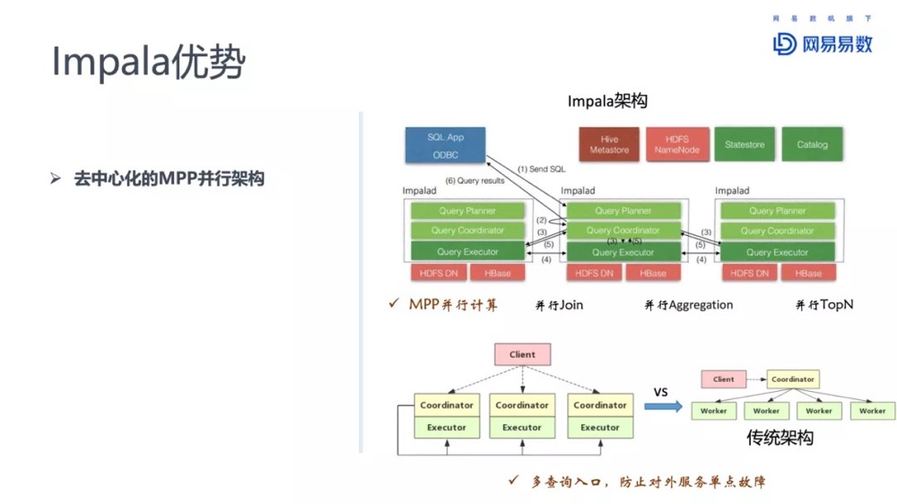
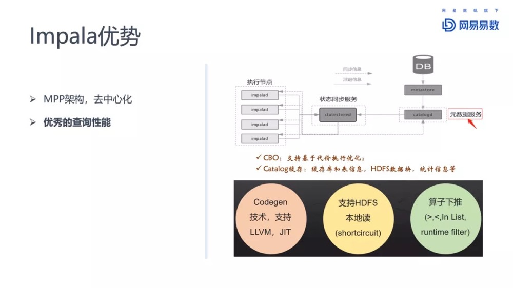

# 概述

## 特点

* 提供对HDFS、HBase、Kudu数据的高性能、低延迟的交互式SQL查询性能。
* 基于Hive，使用内存计算，兼顾数据仓库、基有实时、批处理、多并发的有点，是PB级大数据实时查询分析引擎。

## 适用场景


## 优缺点

### 优点

* MPP架构，去中心化，完全兼容HiIVE元数据,结合kudu实时数仓
* 基于内存运行，不需要把中间结果写入磁盘，省掉了大量的I/O开销。
* 无需转换为MR，直接访问存储在HDFS、HBASE和Kudu中的数据进行作业，速度快。
* 使用了支持Data Locality的I/O调度机制，尽可能将数据和计算分配到同一台机器上进行，减少了网络开销。
* 支持各种文件格式，如TEXTFILE、SEQUENCEFILE、RCFile、Parquet。
* 可以访问hive的metastore，对hive数据支持做数据分析。

#### MPP并行架构



#### 查询性能



### 缺点

* 对内存依赖大，且完全依赖于Hive。
* 分区超过1万，性能严重下降。
* 只能读取文本文件，不能直接读取自定义二进制文件。
* 每当新的记录/文件被添加到HDFS中的数据目录中，该表需要被刷新。
* 链接一个Coordinator失败后无法故障转移到其他可用的Corrdinator

## Impala的架构


* Impalad
  * 接收client的请求、Query执行并返回给中心协调节点；
  * 子节点上的守护进程，负责向statestore保持通信，汇报工作。
  * Impala还区别于其他MPP架构的引擎的一点，是Impala有多个Coordinator和Executor，多个Coordinator可以同时对外提供服务。多Coordinator的架构设计让Impala可以有效防范单点故障的出现。
* Catalog
  * 分发表的元数据信息到各个impalad中；
  * 接收来自statestore的所有请求。
* Statestore
  * 负责收集分布在集群中各个impalad进程的资源信息、各节点健康状态，同步节点信息。
  * 负责query的协调调度。

# Impala操作

## Impala外部Shell

```shell
[root@cm-master shell]#  impala-shell -h
Options:
  -h, --help            show this help message and exit
  -i IMPALAD, --impalad=IMPALAD
                        <host:port> of impalad to connect to
                        [default: cm-master:21000]
  -q QUERY, --query=QUERY
                        Execute a query without the shell [default: none]
  -f QUERY_FILE, --query_file=QUERY_FILE
                        Execute the queries in the query file, delimited by ;
                        [default: none]
  -o OUTPUT_FILE, --output_file=OUTPUT_FILE
                        If set, query results are written to the given file.
                        Results from multiple semicolon-terminated queries
                        will be appended to the same file [default: none]
  -B, --delimited       Output rows in delimited mode [default: False]
  --print_header        Print column names in delimited mode when pretty-
                        printed. [default: False]
  --output_delimiter=OUTPUT_DELIMITER
                        Field delimiter to use for output in delimited mode
                        [default: \t]
  -p, --show_profiles   Always display query profiles after execution
                        [default: False]
  --quiet               Disable verbose output [default: False]
  -v, --version         Print version information [default: False]
  -c, --ignore_query_failure
                        Continue on query failure [default: False]
  -r, --refresh_after_connect
                        Refresh Impala catalog after connecting
                        [default: False]
  -d DEFAULT_DB, --database=DEFAULT_DB
                        Issues a use database command on startup
                        [default: none]
  -u USER, --user=USER  User to authenticate with. [default: root]
  --ssl                 Connect to Impala via SSL-secured connection
                        [default: False]
  --var=KEYVAL          Define variable(s) to be used within the Impala
                        session. [default: none]
```

## Impala内部Shell

| 选项                      | 描述                                                         |
| :------------------------ | :----------------------------------------------------------- |
| help                      | 显示帮助信息                                                 |
| explain <sql>             | 显示执行计划                                                 |
| profile (查询完成后执行） | 查询最近一次查询的底层信息                                   |
| shell <shell>             | 不退出impala-shell执行shell命令                              |
| version                   | 显示impala-shell和impala的版本信息                           |
| connect                   | 连接impalad主机，默认端口21000（同于impala-shell -i），如 connect hadoop103; |
| refresh <tablename>       | 增量刷新元数据库                                             |
| invalidate metadata       | 全量刷新元数据库（慎用）（同于 impala-shell -r）             |
| history                   | 历史命令                                                     |

### 进入内部shell

```shell
# 进入外部shell
impala-shell

# 进入内部shell
help方式查看
```

# Impala的数据类型

| Hive数据类型 | Impala数据类型 | 长度                                                 |
| ------------ | -------------- | ---------------------------------------------------- |
| TINYINT      | TINYINT        | 1byte有符号整数                                      |
| SMALINT      | SMALINT        | 2byte有符号整数                                      |
| INT          | INT            | 4byte有符号整数                                      |
| BIGINT       | BIGINT         | 8byte有符号整数                                      |
| BOOLEAN      | BOOLEAN        | 布尔类型，true或者false                              |
| FLOAT        | FLOAT          | 单精度浮点数                                         |
| DOUBLE       | DOUBLE         | 双精度浮点数                                         |
| STRING       | STRING         | 字符系列。可以指定字符集。可以使用单引号或者双引号。 |
| TIMESTAMP    | TIMESTAMP      | 时间类型                                             |
| BINARY       | 不支持         | 字节数组                                             |

* Impala虽然支持`array`、`map`、`struct`复杂数据类型，但是并不完全支持，一般处理方法，将复杂类型转化为基本类型，从hive中创表。

# 存储和压缩

## 支持的存储压缩

| 文件格式     | 压缩编码                     | Impala是否可直接创建                                         | 是否可直接插入                                               |
| ------------ | ---------------------------- | ------------------------------------------------------------ | ------------------------------------------------------------ |
| Parquet      | Snappy（默认）, GZIP;        | Yes                                                          | 支持：CREATE TABLE, INSERT, 查询                             |
| TextFile     | LZO，gzip，bzip2，snappy     | Yes. 不指定 STORED AS 子句的 CREATE TABLE 语句，默认的文件格式就是未压缩文本 | 支持：CREATE TABLE, INSERT, 查询。如果使用 LZO 压缩，则必须在 Hive 中创建表和加载数据 |
| RCFile       | Snappy, GZIP, deflate, BZIP2 | Yes.                                                         | 支持CREATE，查询，在 Hive 中加载数据                         |
| SequenceFile | Snappy, GZIP, deflate, BZIP2 | Yes.                                                         | 支持：CREATE TABLE, INSERT, 查询。需设置<br />修改参数:<br /> ALLOW_UNSUPPORTED_FORMATS=true |

* impala不支持ORC格式

# 性能优化

* 尽量将StateStore和Catalog单独部署到同一个节点上，使其能正常通信。
* 通过对Impala Daemon内存限制(默认256MB)及StateStore工作线程数，来提供Impala的执行效率。
* 防止小文件、选择合适的文件存储格式、使用分区。
* 使用compute stats进行表信息搜集，当一个内容表或分区明显变化，重新计算统计相关数据表或分区。
* io优化
  * 避免整个数据发送到客户端
  * 条件过滤
  * limit子句
  * 尽量少用全量元数据刷新

