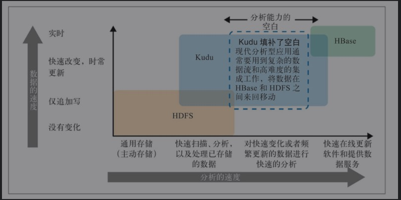
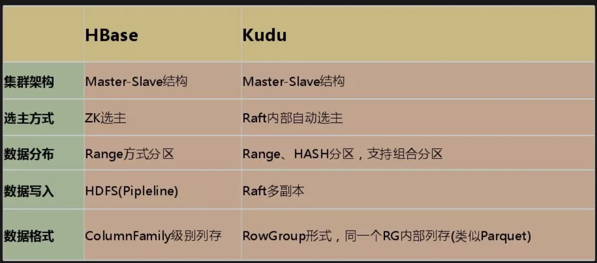
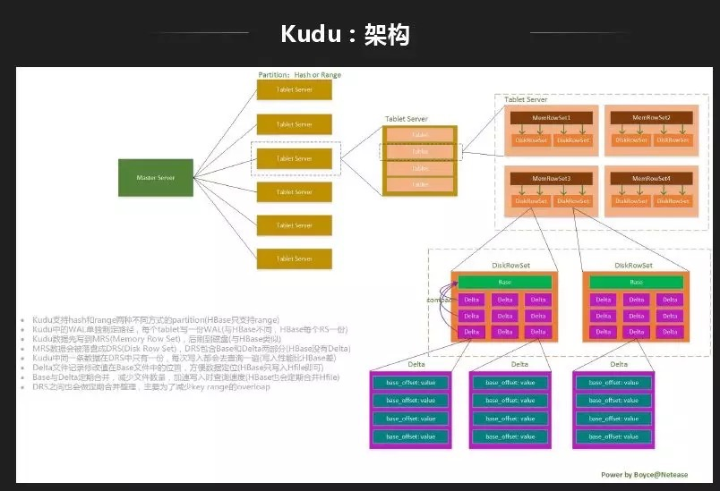
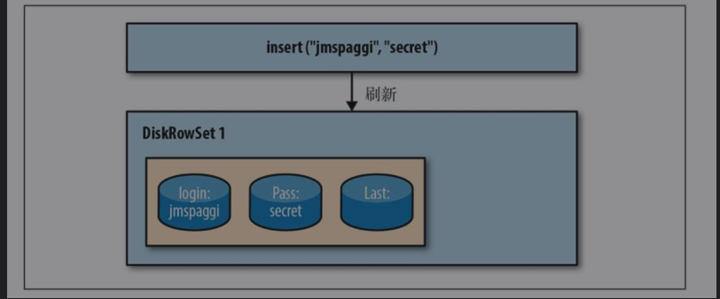
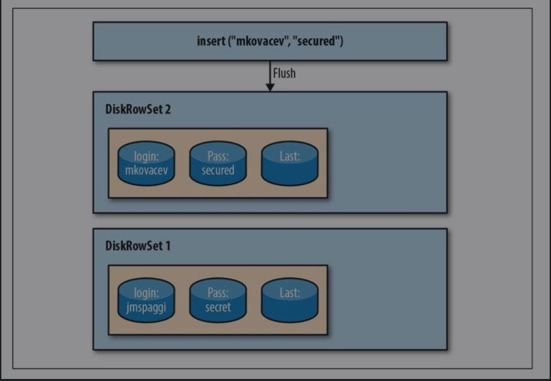
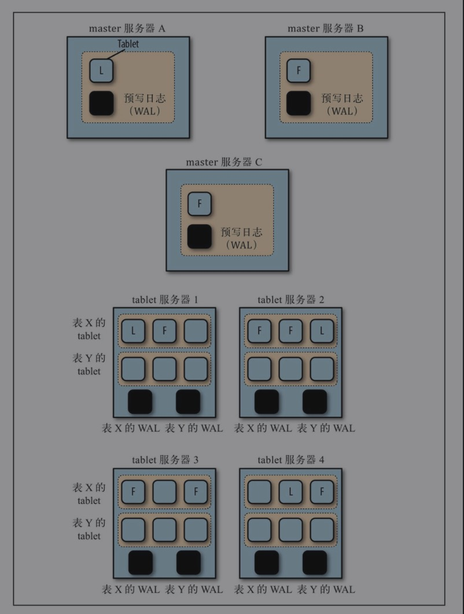

# 概述

* Kudu是Apache hadoop平台的列式存储管理引擎。Kudu拥有Hadoop生态系统应用程序的共同技术属性:它运行在商用硬件上，具有水平伸缩能力，支持高可用性操作。

## 特点

* 快速处理OLAP负载。
* 与MapReduce，Spark和其他Hadoop生态系统组件集成。
* 与Apache Impala的紧密集成，使其成为使用HDFS与Apache Parquet的一个好的、可变的替代方案。
* 强大但灵活的一致性模型，允许你根据每个请求选择一致性需求，包括严格可序列化一致性选项。
* 强大的性能，可以同时运行顺序和随机的工作负载。
* 易于维护和管理。
* 高可用，tablet servers和Master使用Raft Consensus算法，该算法确保只要有超过半数的副本可用，tablet就可以读写。例如，如果3个副本中的2个或5个副本中的3个可用，那么tablet就是可用的。
* 结构化数据模型。

### 和HDFS、HBASE的区别





* HDFS是一个仅支持追加写的文件系统，对于需要顺序扫描大规模数据的存储引擎而言，它是表现最好的。
* Hbase支持实时随机读/写，以及OLTP应用需要的其他特性，HBase适合那种在线、实时、高并发，其中大多数操作都是随机读/写或短扫描的环境。


### Kudu的高层设计

* 运行用户尽可能快的扫描数据，达到在HDFS中扫描原始文件速度的两倍。
* 运行用户已经可能快地执行随机读/写，响应大约为1ms
* 以高可用、容错、持久的方式实现以上这些目标。

### 缺点

* Kudu因为支持update，在内存&磁盘上数据的存储采用Base+Delta形式，Base记录几本的数据，Delta记录修改的数据，所以数据读取时需要同时读取Base+Delta两部分数据。
* 通过Impala查询性能与Parquet比有不小差距
* 整个集群做的不够完善，缺乏像HBase这种Region的Split&Merge功能

## Kudu-Impala集成功能

* CREATE/ALTER/DROP TABLE
  * impala支持使用Kudu作为持久层创建、修改和删除表。
* INSERT
  * 数据可以使用与其他Impala表相同的语法插入到Impala中的Kudu表中，就像那些使用HDFS或HBase持久化的表一样。
* UPDATE/DELETE
  * Impala支持Upadte和DELETE SQL命令修改已经存在的数据在Kudu表中一行一行或一批一批。
* Flexible Partitioning(灵活分区)
  * 与Hive中的表分区类似，Kudu允许您通过hash或范围动态地将表预分割为预定义数量的tablet，以便在集群中均匀地分发写操作和查询。可以按任意数量的主键列、任意数量的散列和可选的分隔行列表进行分区。
* 并行扫描
  * 为了在现代硬件上实现可能的最高性能，Impala使用的Kudu客户端在多个tablet上并行扫描。
* 高性能查询
* 需要开启Hive的metastore服务。

## 架构图




* 与HDFS和Hbase相似，Kudu使用单个的Master节点，用来管理集群的元数据，并且使用任意数量的Tablet Server(类似于Hbase的RegionServer角色)节点来存储实际数据。可以部署HA Master来提高容错能力。

## 概念和术语

### Columnar Data Store

* Kudu是一个列式存储引擎，一个列式数据存储引擎将数据存储在强类型的列。

### Read Efficiency

* 为了分析查询，你可以读取单独的列，或一部分列，当忽略其他列时，这意味着您可以在读取磁盘上最小数量的块的同时完成查询。作为行式存储，如果你只需要返回一部分的列的数据的话，你需要读取一整行的数据。

### Data Compression

* 因为给定的列只包含一种数据类型，所以基于模式的压缩比在基于行的解决方案中使用的混合数据类型的压缩效率高几个数量级。结合从列读取数据的效率，压缩允许您在完成查询的同时从磁盘读取更少的块。

### Table

* Table是存储数据的Kudu格式。一个Table有一个schema和一个完全有序的主键。一个表被分割成称为tablet的段。

### Tablet

* 是kudu表的`数据水平分区`，一个表可以划分成为多个tablet（类似hbase region）
* 每个tablet存储着一定连续range的数据(key)，且tablet两两之间的range不会重叠。
* 一个tablet是一个表的连续端，类似于其他存储引擎的一个分区。给定的tablet可以在多个tablet servers上存在副本，在任意给定的时间点其中一个副本被认为是Leader Tablet。任何副本都可以进行读和写操作，这需要服务于tablet的一组tablet服务器达成一致。

### Tablet Server从角色

* 相当于HDFS的DataNode和Hbase的RegionServer的混合体，tablet server的作用是执行所有与数据相关的操作：存储、访问、编码、压缩、compaction和复制。
* tablet server存储向kudu client提供tablet服务。对于给定的tablet，一个tablet server充当其leader，其他副本作为这个tablet的follower。只有leader能够提供写请求，leader和follower可以提供读服务。一个tablet server可以服务多个tablet，一个tablet可以由多个tablet server提供服务。
* Kudu最多支持300个tablet server，但是为了最高的稳定性，比建议tablet server超过100个
* 建议每个tablet server最多包含2000个tablet（包含副本）
* 建议每个table在每个tablet server上最多包含60个tablet（包含副本）
* 建议每个tablet server最多在磁盘上存储8 TB的数据。服务器上所有磁盘的容量之和可以超过8 TB，并且可以和HDFS共享。但是，我们建议Kudu的数据不要超过8TB。
* 为了获得对大事实表的最优扫描性能，建议保持一个tablet对应一个CPU核的比例。不要将被复制的表计算在内，应该只考虑Leader tablet的数量。对于小维度的表，可以只分配几个tablet。

### Master

* 存储表名、列名、列类型和数据位置之类的元数据，以及状态之类的信息，比如正在被创建、运行等。
* master持有全部的tablet，tablet server和catalog table和其他元数据在这个集群中。在任意时间只能存在一个master.如果当前leader断开链接，会有新的master通过raft算法选举产生。
* master还可以协调客户端的元数据操作，例如当创建一张新表时，客户端内部发送这个请求到master，master会将新表的元数据写入到catalog table中，并且协调在tablet servers创建tablets的过程。
* 全部的master的数据都存储在`一个tablet`中，可以将数据复制到全部的slave master中。
* tablet server的心跳通过固定间隔发送到master(默认是1秒一次)

### **Raft Consensus Algorithm**

* kudu使用[Raft consensus algorithm](https://raft.github.io/)作为状态容错和一致性，对常规的tablets和master data都是适用。通过Raft，一个tablet的多个副本选出一个leader，负责接受并复制写入到follower副本的操作。一旦在大多数副本中都保留了写操作，便会向客户端确认。 给定的一组N个副本（通常3个或5个）能够接受最多（N-1）/ 2个错误副本的写入。

### catalog table

* 一个catalog table是kudu的核心位置，它存储的信息关于table和tablets。这个catalog table可能不能被直接读取或者写入。相反，只能通过在客户端API中公开的元数据操作来访问它。
* 一个catalog table存储元数据的俩个分类
  * tables
    * table schema，locations，states
  * tablets
    * 当tablet server的每个tablet都有副本时，存储的是一组已经存在的tablets的state，开始和结束的key。

### logical replication

* Kudu复制操作，不是磁盘上的数据。这被称为逻辑复制，而不是物理复制。
* 这有几个优点：
  * 虽然插入和更新确实通过网络传输数据，但删除不需要移动任何数据。删除操作被发送到每个tablet服务器，服务器在本地执行删除操作。
  * 物理操作，例如压缩，不需要在网络上传输Kudu中的数据。这与使用HDFS的存储系统不同，在HDFS中，块需要通过网络传输，以实现所需的副本数量。
  * Tablet不需要在同一时间或同一时间表上执行压缩，或者在物理存储层上保持同步。这减少了所有tablet server同时经历高延迟的机会，因为紧凑或沉重的写负载。

## 写入与更新

### 写入操作步骤

1. 写操作被提交到一个tablet的Write Ahead Log（WAL）
2. 把插入操作添加到MemRowSet中。
3. 当MemRowSet满了之后，就被刷新(flushed)到磁盘，成为DiskRowSet

#### MemRowSet

* 每次Kudu收到新数据时，这份数据存储的地方成为MemRowSet，类似于一个临时的写缓冲区，当MemRowSet满时，就被刷新到磁盘。

#### 对表的首次插入



#### 插入已经存在的记录



## Kudu中的概念和机制

### 热点

* 当大部分的读写操作都落到同一个服务器上时，就会产生所谓的热点问题，如果想达到数据完美的分布，让所有读写请求均匀的分配在集群的所有节点上。

#### 设计表考虑的问题

* 读操作的访问模式（吞吐率和延迟）
* 写操作的访问模式（吞吐率和延迟）
* 存储开销（压缩比）

### 分区

* kudu支持范围分区和哈希分区

## 使用场景

* 流输入接近实时可用性
* 具有广泛变化的访问模式的时间序列应用
* 预测模型
* 将Kudu中的数据与旧版系统结合

# Kudu安装

## Docker安装

### 环境要求

* 4 CPUs
* 6GB Memory
* 50GB DIsk

### 创建docker-compose.yaml

```yaml
version: "3"
services:
  kudu-master-1:
    image: apache/kudu:latest
    ports:
      - "7051"
      - "8051"
    command: ["master"]
    environment:
      - KUDU_MASTERS=kudu-master-1,kudu-master-2,kudu-master-3
  kudu-master-2:
    image: apache/kudu:latest
    ports:
      - "7051"
      - "8051"
    command: ["master"]
    environment:
      - KUDU_MASTERS=kudu-master-1,kudu-master-2,kudu-master-3
  kudu-master-3:
    image: apache/kudu:latest
    ports:
      - "7051"
      - "8051"
    command: ["master"]
    environment:
      - KUDU_MASTERS=kudu-master-1,kudu-master-2,kudu-master-3
  kudu-tserver:
    image: apache/kudu:latest
    depends_on:
      - kudu-master-1
      - kudu-master-2
      - kudu-master-3
    ports:
      - "7050"
      - "8050"
    command: ["tserver"]
    environment:
      - KUDU_MASTERS=kudu-master-1,kudu-master-2,kudu-master-3
    deploy:
      replicas: 3
```

* docker-compose up -d

### 访问Web-UI

* hadoop:8050

### 校验集群健康状态

```shell
# 进入容器
docker exec -it $(docker ps -aqf "name=kudu-master-1") /bin/bash
# 校验集群健康状态
kudu cluster ksck kudu-master-1:7051,kudu-master-2:7151,kudu-master-3:7251
# 配置KUDU用户名
export KUDU_USER_NAME=kudu
kudu cluster ksck localhost:7051,localhost:7151,localhost:7251
```

## 服务器安装

### 环境要求

#### 硬件

* 一个或多个服务器运行Kudu master，如果需要高可用最好3个master
* 如果开启tablet的副本机制，最好需要3个tablet server
* ntp 时间同步
* JDK1.8

## 根据操作系统

[安装文档](https://kudu.apache.org/docs/installation.html#osx_from_source)

## WebUI地址

### master server

```
http://＜your-host＞:8051
```

### Tablet server

```
http://＜your-host＞:8050
```

### 通用可查看的信息

* Log(日志):UI上限制了最后一部分日志，以及服务器上日志的存储目录。
* Memory(内存):包括分项列出的内存详细使用情况以及总的内存情况，查看该信息后，能了解那些地方使用了内存。
* Metric(指标):一个API端点，提供许多JSON格式的指标，容易用JSON解析器获得想要的指标。
* RPC(Remote Procedure Call):以JSON格式列出正在运行的和采样的RPC调用
* Thread（线程）：一个线程的视图，展示了这些线程占用的CPU以及累积的I/O-wait量。线程是分成若干个线程组的，这样可以轻松地对其进行向下钻取（drill down）操作。
* Flag:在服务器启动时指定的所有标志。这是一个验证你的更改是否生效以及查看默认设置的好方法。

### MasterUI信息

* master:查看当前当选的leader以及环境中master服务器列表
* table:一个所有table的列表
* tablet server:所有以及主持的tablet server列表、其通用表识符(或者uuid)，以及RPC和HTTP地址信息。

### Tablet server UI信息

* Dashboard：提供一个视图，列出当前正在tablet服务器上运行的扫描、事务和维护操作。
* Tablet:这个tablet server管理的所有tablet(副本)的列表。

# Kudu的管理

## master服务器

* 一个集群包括3个master服务器，这些master服务器通过raft协议选举出来一个leader，半数之上的master认为某个master可以成为leader即可。
* master服务器的数目必须是奇数，最多可以有（n-1）/2个服务器发生故障而程序仍然能提供服务。当多于（n-1）/2个服务器发生故障时，master的服务将不能继续，这样服务对集群来说就不再可用。
* master服务器维护用户所创建的所有表的元数据或目录信息，Kudu创建一个系统目录表以处理在Kudu中创建的各种对象的元数据，该表设计为一个分区，因此也只有一个tablet。

### 系统目录表

* 由entry_trype、entry_id和metadata三列组成，目录管理器将此表加载到内存中，并且构造3个哈希表以快速查找目录信息。
* 目录信息是紧凑的，并且由于仅包含元数据而不包含真实的用户数据，会一直比较小，也不需要占用大量的内存和CPU资源。

### master高层架构

* 3个master服务器每个master会有一个tablet存储系统目录表的元数据，这些tablet会有一个leader，其他为tablet则为follower会复制master的数据，每个master服务器上都有一个预写日志。
* 每个单独的kudu表会创建一个单独的预写日志(WAL)并存放在每个tablet server上。



## tablet server

* 一个表会被分解成若干个tablet，每个tablet会在多个tablet server上复制，这样table就被分散到各个节点上。多个tablet副本会有一个tablet副本为leader副本，其他副本为follower。

### table server数量规划

```shell
# 参数含义
d = 120TB //以Parquet格式存储的数据集大小
k = 8TB //预计每个table服务器的最大磁盘容量
p = 25% //预留的额外开销比例
r = 3 //table复制因子

# table server计算共识
t=(d/(k*(1-p)))*r
t=(120/(8*(1-0.25)))*3
t=20个table server
```

## 预写日志

### 概述

* 每次对表所做的修改，都会导致对tablet和其副本的修改，也会在tablet的预写日志(WAL)中写入一条条目(entry)。
* WAL是一个仅支持追加写的日志，磁盘只需要能高速地执行顺序写入即可，但是master服务器和tablet server的每个tablet还有自己的日志，如果有多个表要写入，从磁盘角度看，对WAL的写操作则更像是一个随机写模式。
* 每个WAL日志段默认大小为8MB，最少要有1个，最多有80个。最大值是可变的，当其他节点的副本正在重启或已经下线，leader tablet可能会继续接受写入。

## 复制策略

* 如果一个tablet server出现故障，副本的数量可能会从三个减少到两个，Kudu将迅速修复这些tablet。

### 3-4-3策略

* 第一种策略：如果一个tablet服务器出现故障，在剔除该失败的副本之前，Kudu将先添加替换的副本，然后再剔除失败的副本。

### 3-2-3策略

* 第二种策略：会先立即剔除失败的副本，然后添加新的副本。然而，对于那种定期下线然后重新上线的系统，这样做会造成节点重新上线后要经过很长一段时间才能重新成为集群的成员。
* 其中的一个tablet服务器经历的故障是不可恢复的；否则，Kudu将在新的主机上创建新的tablet副本，如果失败的tablet服务器恢复，也不会造成任何损害，这时候新创建的副本将被取消。

#### 存在的问题

* 失败的tablet服务器的所有tablet都会被立即剔除，导致系统花大力气才能让新的副本上线。

## 数据存储部署

### Hadoop集群的数据文件存储

* NameNode的fsimage文件、edits文件
* HiveMetastore数据库
* HDFS JournalNode的共享edits文件
* Zookeeper日志
* Kudu master服务器的数据
* Kudi master服务器的WAL

### 部署问题

* 每个HDFS DataNode上部署Kudu的数据节点，这些能够水平扩展的服务器也用于Hadoop生态系统的各种服务，统称为：工作节点。
* HDFS的数据存储和Kudu的数据存储可以放在同一个文件系统和设备卷上，例如/disk1/dfs、/disk1/tserver,这样HDFS和Kudu都能很容易自动这个驱动器剩余容量，HDFS会重新再均衡(Rebalance)。
* 当需要对静态数据做加密处理的话，HDFS Transpartent Encryption来配置HDFS，而Kudu目前依赖于设备级别的全盘加密技术对静态数据加密，需要使用不同的驱动器。

## Kudu命令行接口

[官方文档](https://kudu.apache.org/docs/command_line_tools_reference.html)

* 这里建议查看官方文档，写的非常详细，需要时可以当成工具书一样使用。

## 管理tablet server

### 添加tablet server

#### 安装kudu和kudu-tserver

```shell
sudo yum -y install kudu
sudo yum -y install kudu-tserver 
```

#### 添加kudu server配置

```shell
vim /etc/kudu/conf/tserver.gflagfile

# 添加tserver的hostname:port
--tserver_master_addrs=ip-172-31-48-12.ec2.internal:7051

# 启动tablet server
sudu systemctl start kudu-server
```

#### tablet server日志

* 通过webUi或者直接查看kudu-tserver.INFO日志

### 删除tablet server

* 主要是decommission(解除运行)，然后删除这个节点上和Kudu相关的软件包

#### decommission步骤

1. 将这个table server的所有副本复制到另一个活动的tablet server，并确保所有被复制的副本都加入了Raft一致性协议。
2. 删除这个talet服务器上的所有副本
3. 停止这个tablet服务器
4. 删除tablet服务器的可执行文件

* 为了确保在执行decommission操作时tablet服务器上没有创建新的tablet，你需要确保在删除时不执行新的DDL操作。

[kudu配置不执行DDL操作](https://kudu.apache.org/docs/configuration.html)

## 基本的性能调优

### 性能调优关注点

* 分配给Kudu的内存量
* 使用适当的分区策略
* 维护管理器的线程数量

### Kudu的内存限制

```
# 生产环境中，刚开始可以设置在24GB到32GB
--memory_limit_hard_bytes
```

### 维护管理器的线程

* 执行各种任务的后台线程，会做各种工作，比如将数据从内存刷新到磁盘，从而进行内存管理(把记录从行存储格式的内存切换到列存储格式的磁盘)，还能提高整体的读性能或释放磁盘空间。
* 基于行的数据很容易写，因为写一行只需要做很少的处理。基于行意味着该行中的数据与另一行中的数据无关。
* 因此，它是一种适合写操作的非常快速的格式。基于列的数据更难快速地写入，因为它需要做更多的处理来将某一行转化成列格式。
* 因此，基于列的数据集在读取时更快。当Kudu将数据保存在内存中等待将其刷新到磁盘时，数据是以写优化的行格式存储的。但是，在维护管理器的线程将其刷新到磁盘后，就会转换为列格式存储，以便适合聚合读取类型的查询。

```
--maintenance_manager_num_threads
```

### 避免耗尽磁盘空间

```
--fs_data_dirs_reserved_bytes
--fs_wal_dir_reserved_bytes

这些参数默认值是1%，也就是在数据目录和WAL目录的文件系统上保留磁盘空间的1%，用于非Kudu的使用，一开始将这些值设置为接近5%的范围比较合适。
```

### 容忍磁盘故障

* Tablet server可以容忍磁盘故障，但是如果WAL和tablet元数据的磁盘发生故障，则tablet服务器会挂掉。
* tablet的数据会被分开存储在各个tablet server的多个磁盘上，默认为3个磁盘，这样可以保证tablet server的可靠性。

```
# 控制特定tablet副本的目标数据目录数
--fs_target_data_dirs_per_tablet
```


## Spark Kudu

### spark-sql方式

```shell
spark-sql --packages org.apache.kudu:kudu-spark2_2.11:1.10.0
```

### spark api方式

* 引入依赖

```
kudu-spark2_scala.version
kudu-client
```

* 创建df

```scala
 def main(args: Array[String]): Unit = {
    val spark: SparkSession = SparkSession.builder()
      .appName("kudu-adhoc")
      .master("local[8]")
      .getOrCreate()

    // 创建kudu df
    //    val kuduDf: DataFrame = spark.read.options(Map("kudu.master" -> "192.168.6.50:7051,192.168.6.52:7051,192.168.6.51:7051",
    //      "kudu.table" -> "test_kud")).format("kudu").load

    // 创建kudu执行上下文
    val kuduContext: KuduContext = new KuduContext("192.168.6.50:7051,192.168.6.52:7051,192.168.6.51:7051",
      spark.sparkContext)

    // create kudu table
    val schemaList: util.List[ColumnSchema] = Lists.newArrayList(new ColumnSchema.ColumnSchemaBuilder("key", Type.INT32)
      .key(true)
      .wireType(DataType.INT32)
      .comment("key用于分区,主键").build(),
      new ColumnSchema.ColumnSchemaBuilder("name", Type.STRING)
        .nullable(true)
        .comment("名称")
        .build())
    val schema: Schema = new Schema(schemaList)
    val tableOptions: CreateTableOptions = new CreateTableOptions()
      .setNumReplicas(3)
      .addHashPartitions(Lists.newArrayList("key"), 3)


    kuduContext.deleteTable(kuduTableName)

    val kuduTable: KuduTable = kuduContext.createTable(kuduTableName, schema, tableOptions)

    logInfo(s"create table ${kuduTable.getSchema.toString}")


    logInfo(s"$kuduTableName 是否存在 ${kuduContext.tableExists(kuduTableName)}")


    import spark.implicits._

    // 插入数据
    val kuduDF: DataFrame = spark.sparkContext.makeRDD(Seq((1, "hsm"), (2, "zhangsan")))
      .toDF("key", "name")

    // insert
    kuduContext.insertRows(kuduDF, kuduTableName,
      new KuduWriteOptions(true, true, true, true))

    spark.close()
  }
```

## Kudu表备份和恢复

### 备份

* 要备份一个或多个Kudu表，可以使用KuduBackup Spark作业。 第一次为表运行作业时，将运行完整备份。 其他运行将执行增量备份，该增量备份将仅包含自初始完整备份以来已更改的行。 通过将`--forceFull`标志传递给备份作业，可以随时强制执行一组新的完全备份。
* `--rootPath`:备份数据输出的根路径，接受任何spark兼容的路径
* `--kuduMasterAddresses`:kudu master地址
* `<table>`:备份表列表

```shell
# 备份表Spark任务
spark-submit --class org.apache.kudu.backup.KuduBackup kudu-backup2_2.11-1.10.0.jar \
  --kuduMasterAddresses master1-host,master-2-host,master-3-host \
  --rootPath hdfs:///kudu-backups \
  foo bar
```

### 恢复

* `--rootPath`:备份数据输出的根路径，接受任何spark兼容的路径
* `--kuduMasterAddresses`:kudu master地址
* `--createTables`:如果为`true`，恢复时会创建这些表，如果目标表存在设置为false
* `--tableSuffix`:如果设置，则将后缀添加到还原的表名称中。 仅在createTables为true时使用。
* `--timestampMs`:UNIX时间戳（以毫秒为单位），用于定义选择还原候选者时要使用的最新时间。 默认值：System.currentTimeMillis（）
* `<table>`:备份表列表

```shell
# 恢复备份表
spark-submit --class org.apache.kudu.backup.KuduRestore kudu-backup2_2.11-1.10.0.jar \
  --kuduMasterAddresses master1-host,master-2-host,master-3-host \
  --rootPath hdfs:///kudu-backups \
  foo bar
```

### 备份工具

* `list`:列出rootPath中的备份。
* `clean`:清理rootPath中旧的备份数据

```shell
java -cp $(hadoop classpath):kudu-backup-tools-1.10.0.jar org.apache.kudu.backup.KuduBackupCLI --help
```

### 备份目录结构

```
/<rootPath>/<tableId>-<tableName>/<backup-id>/
   .kudu-metadata.json
   part-*.<format>
```

