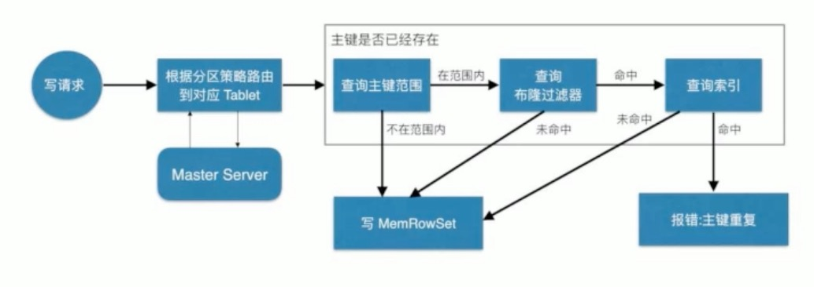
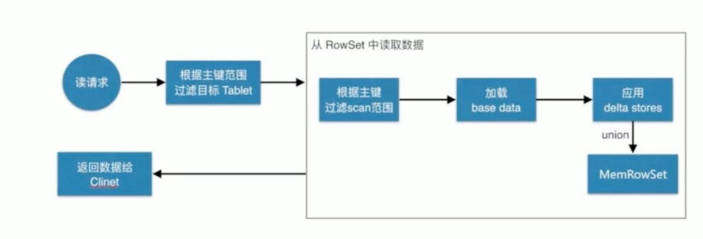

# Kudu存储原理

* RowSet包含一个MemRowSet及若干个DiskRowSet，DiskRowSet中包含一个BloomFile、Ad_hoc Index、BaseData、DeltaMem及若干个RedoFile和UndoFile。
* `MemRowSet`:用于`新数据insert及已在MemRowSet中的数据的更新`，一个MemRowSet写满后会将数据刷到磁盘形成若干个DiskRowSet。默认是1G或者120S溢写阈值。
* `DiskRowSet`:用于`老数据的变更`,后台定期对DiskRowSet做compaction，以删除没用的数据及合并历史数据，减少查询过程中的IO开销。
* `BloomFile`:根据一个DiskRowSet中的key生成一个bloom filter，用于`快速模糊定位某一个key是否在DiskRowSet`中，用于compaction和MemRowSet溢写DiskRowSet使用。
* `Ad_hoc Index`:是主键的索引，用于`定位key在DiskRowSet中的具体哪个偏移位置`。
* `BaseData`是MemRowSet flush下来的数据，按列存储，按主键排序。
* `UndoFile`是基于BaseData之后时间的变更记录，通过在BaseData上apply UndoFile中的记录，可获得历史数据。
* `RedoFile`是基于BaseData之后时间的变更记录，通过在BaseData上apply RedoFile中的记录，可获得较新数据一般指已经提交的数据。
* `DeltaMem`用于`DiskRowSet`中数据的变更，先写到内存中，写满后flush到磁盘形成RedoFile，RedoFile主要是溢写到磁盘的数据变更记录。

## Redo与Undo

* REDO与UNDO与关系型数据库中的REDO与UNDO类似(在关系型数据库中，REDO日志记录了更新后的数据，可以用来恢复尚未写入Data File的已成功事务更新的数据。而UNDO日志用来记录事务更新之前的数据，可以用来在事务失败时进行回滚)

## MemRowSets和DiskRowSets

* `MemRowSets`可以对比为HBase的`MemStore`，`DiskRowSets`可以理解为HBase的`HFile`。
* `MemRowSets`中的数据被Flush到磁盘之后，形成`DiskRowSets`。`DiskRowSets`中的数据，按照32MB大小为单位，按序划分成一个个的`DiskRowSet`。DiskRowSet中的数据按照`Column`进行组织，与Parquet类似。
* 每一个`Column`的数据被存储在一个相邻的数据区域，这个区域进一步被细分为一个个的小的Page单元，与HBase File中的Block类似，对每个Column Page可采用一些Encoding算法，及Compression算法。
* DiskRowSet是不可修改的，DiskRowSet分为base data和delta stores。base data负责存储`基础数据`，delta stores负责存储`base data中的变更数据`,最终再flush到redofile中。

### DiskRowSet底层存储模型

* 数据从MemRowSet刷到磁盘后形成了一份DiskRowSet(只包含base data)，每分DiskRowSet在`内存中都会有一个对应的DeltaMemStore`，负责记录此DiskRowSet后续的数据变更(更新、删除)。
* DeltaMemStore内部维护了一个B树索引，映射到每个row_offset对应得数据变更。DeltaMemStore数据增长到一定程度后转化成二进制文件存储到磁盘，形成一个DeltaFile，随着base data对应数据的不断变更，DeltaFile逐渐增长。

## tablet发现过程

* 当创建Kudu客户端时，会从master server上获取tablet位置信息，然后直接与服务于该tablet的tablet server进行连接，以此来操作对应的tablet。
* 为了优化读取与写入路径，`客户端将保留该信息的本地缓存(类似于Hbase中的Client，也会缓存RegionServer的地址)`，以防止他们在每个请求时都需要查询主机的tablet位置信息。客户端缓存会存在缓存过时的问题，并且当写入被发送到不再是tablet leader的tablet server时，则将被拒绝。然后客户端将通过`查询master server发现新leader的位置来更新其缓存`。

## 写数据流程

* 当client请求写数据时，`先根据主键从Master Server中获取要访问的目标Tablets，然后到依次对应的Tablet获取数据。`Kudu表存在主键约束需要进行主键是否存在的判断，这里可以通过底层的`BloomFilter`和`adHocIndex`结构来判断。一个Tablet中存在很多个`RowSets`，为了提高性能`尽可能减少要减少扫描的RowSets数量`。
* 通过每个RowSet中记录的`主键的(最大最小)范围`，过滤掉一批不存在目标主键的RowSets，然后在根据RowSet中的`BloomFilter`，过滤掉确定不存在目标主键的RowSets，再通过RowSets中的B树索引`adhocIndex`，精确定位目标主键是否存储。
* 如果主键已经存在，则报错(键重复)，否则就进行写数据(写MemRowSet)

## 读数据流程

* 先根据要扫描数据的主键范围,定位到目标的Tablets，然后读取Tablets中的RowSets。在读取每个RowSet时，先根据主键过滤要scan范围，然后加载范围内的`base data`，再找到对应的`delta stores`，apply所有变更，最后`union`上MemRowSet中的数据，返回数据给Client。

## 更新数据流出

* 数据更新的核心是定位到待更新的位置，定位到具体位置后，然后将变更写到对应的delta store中

# Kudu伸扩容

