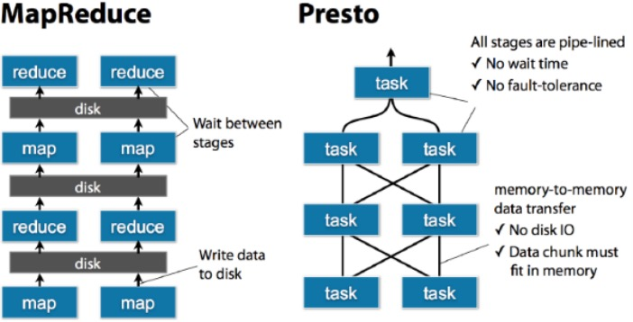

# 概念

## 特点

* Presto是一个开源的分布式SQL查询引擎，数据量支持GB到PB字节，主要用来处理秒级查询的场景，Presto不是OLTP数据库，而是一个OLAP数据库

## 架构

## 优缺点

### Presto和MapReduce的区别

### 优点

* 基于内存运算，减少硬盘IO，和中间结果存储，计算更快
* 能够连接多个数据源，跨数据源连表查，如果从Hive查询大量网站访客记录，然后从Mysql中匹配出设备信息。

### 缺点

* Presto能够处理PB级别的数据，但是Presto不是把PB级别的数据放在内存中计算，而是根据场景，如Count，AVG等聚合运算，是边读数据边计算，再清内存，再读数据再计算，这种消耗的内存不高。`但是连表查，就可能产生大量的临时数据，因此速度会变慢，反而Hive此时更擅长。`

# Presto优化

## 合理设置分区

* 与Hive类似，Presto会根据元数据信息读取分区数据，合理的分区能减少Presto数据读取量，提升查询性能。

## 使用列式存储

* Presto对ORC文件读取做了特定优化，因此在Hive中创建Presto使用的表时，建议采用ORC格式存储，相同与Parquet，Presto对ORC支持更好。

## 使用压缩

* 数据压缩可以减少节点间数据传输对IO带宽压力，对于即席查询需要快速解压，建议使用Snappy压缩。

