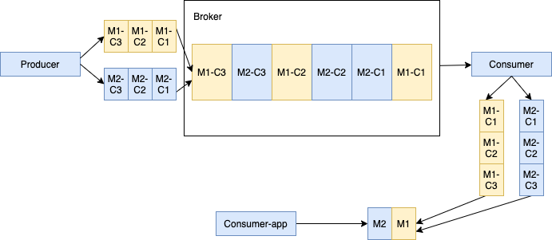

# 快速使用
## 本地安装Pulsar
* 单机模式pulsar需要pulsar broker、必要的zookeeper和BookKeeper组件

### 下载二进制包
```shell
wget https://archive.apache.org/dist/pulsar/pulsar-2.8.0/apache-pulsar-2.8.0-bin.tar.gz
tar xvfz apache-pulsar-2.8.0-bin.tar.gz
cd apache-pulsar-2.8.0
```

#### 安装分层存储携带程序

```shell
wget https://archive.apache.org/dist/pulsar/pulsar-2.8.0/apache-pulsar-offloaders-2.8.0-bin.tar.gz
# 解压目录拷贝至pulsar/offloaders
mv apache-pulsar-offloaders-2.8.0/offloaders offloaders
```

### 启动单机模式Pulsar
```shell
bin/pulsar standalone
```

### 使用单机模式Pulsar

#### Consume消息
```shell
bin/pulsar-client consume my-topic -s "first-subscription"
```

#### Produce消息
```shell
bin/pulsar-client produce my-topic --messages "hello-pulsar"
```

### 终止单机模式Pulsar
* Ctrl+C终止单机模式Pulsar的运行

## Docker里配置单机Pulsar
### docker中启动Pulsar
```shell
docker run -it -p 6650:6650  -p 8080:8080 --mount source=pulsardata,target=/pulsar/data --mount source=pulsarconf,target=/pulsar/conf apachepulsar/pulsar:2.8.0 bin/pulsar standalone
```
### 在Docker中运行Pulsar

* pulsar://localhost:6650
* http://localhost:8080

### 获取topic数据
```shell
curl http://localhost:8080/admin/v2/persistent/public/default/my-topic/stats | python -m json.tool
```

# 概述和架构
## Pulsar特性
* 单实例原声支持多个集群，可跨机房在集群间无缝地完成消息复制。
* 极低的发布延迟和端到端延迟。
* 可无缝扩展到超过1百万个topic。
* 支持多种订阅模式（独占订阅、共享订阅、故障转移订阅）
* 通过Apache BookKeeper提供的持久化消息存储机制保证消息传递
    * 由轻量级的 serverless 计算框架 Pulsar Functions 实现流原生的数据处理。
    * 基于 Pulsar Functions 的 serverless connector 框架 Pulsar IO 使得数据更易移入、移出 Apache Pulsar。
    * 分层式存储可在数据陈旧时，将数据从热存储卸载到冷/长期存储（如S3、GCS）中。

## 消息
* Pulsar采用发布-订阅的设计模式（pub-sub），producers发布消息到topic，consumers订阅这些topic处理消费消息并且当处理完毕时发送ack到broker。

### 消息格式

| 组件                 | 说明                                                         |
| :------------------- | :----------------------------------------------------------- |
| Value / data payload | 消息所承载的数据。 尽管消息数据也可以符合数据 [schemas](https://pulsar.apache.org/docs/zh-CN/next/schema-get-started)，但所有 Pulsar 消息都包含原始字节。 |
| Key                  | 消息可以选择用键进行标记，这在 [topic 压缩](https://pulsar.apache.org/docs/zh-CN/next/concepts-topic-compaction) 等操作很有用。 |
| Properties           | 用户自定义属性的键值对（可选）。                             |
| Producer 名称        | 生成消息的 producer 的名称。 如果不指定，则使用默认名称      |
| Sequence ID          | 每个 Pulsar 消息都存储在其主题上的有序序列中。消息的序列 ID 是其在该序列中的顺序。 |
| Publish time         | 消息发布的时间戳，由 producer 自动添加。                     |
| Event time           | 应用程序可以附加到消息的时间戳（可选）， 例如处理消息的时间。 如果没有明确设置，则消息的事件时间为 `0`。 |
| TypedMessageBuilder  | 用于构造消息。 您可以使用 `TypedMessageBuilder` 设置消息的键值对属性。 在设置 `TypedMessageBuilder` 时，最佳的选择是将 key 设置为字符串。 如果将 key 设置为其他类型（例如，AVRO 对象），则 key 会以字节形式发送，这时 consumer 就很难使用了。 |

### 消息配置

* Message 默认最大可携带 5 MB 数据。

```properties
# broker.conf 消息的最大大小(字节数)。
maxMessageSize=5242880
# bookkeeper.conf
nettyMaxFrameSizeBytes=5253120
```

### Producer

* producer是连接topic的程序将消息发布到一个Pulsar broker上。

#### 发送模式

| 发送模式  | 说明                                                         |
| :-------- | ------------------------------------------------------------ |
| Sync send | Producer 将在发送每条消息后等待 broker 的确认。 如果未收到确认，则 producer 将认为发送失败。 |
| 异步发送  | Producer 将把消息放于阻塞队列中，并立即返回 然后，客户端将在后台将消息发送给 broker。 如果队列已满([最大大小可配置](https://pulsar.apache.org/docs/zh-CN/next/reference-configuration#broker))，则调用 API 时，producer 可能会立即被阻止或失败，具体取决于传递给 producer 的参数。 |

#### 访问模式

* 对于producer来说topic上可以有不同的访问模式
  * Exclusive:默认的配置是仅有一个producer可以在topic上发布消息
  * WaitForExclusive:如果已经有一个生产者连接了主题，生产者创建过程被挂起(而不是超时) 直到这个生产者获得了 `Exclusive` 访问权限。

#### 压缩策略

* LZ4
* ZLIB
* ZSTD
* SNAPPY

#### 批量处理

* 当批量处理启用时，producer 会在`单个请求中积累并发送一批消息`。 批量处理的量大小由`最大消息数`和`最大发布延迟`定义。 因此，积压数量是分批处理的总数，而不是信息总数。
* Pulsar将批次被跟踪并存储为单个单元，而不是单个消息。 Consumer 将批量处理的消息拆分成单个消息。 但即使启用了批量处理，也始终将计划中的消息(通过 `deliverAt` 或者 `deliverAfter` 进行配置) 作为单个消息发送。当consumer确认了一个批的所有消息才算确认。Broker 维护批量索引的确认状态并跟踪每批索引的确认状态，以避免向 consumer 发送已确认的消息（端到端一致性）。默认情况下，禁用批处理索引确认（acknowledgmentAtBatchIndexLevelEnabled=false）。 您可以通过在代理端将knowledgeAtBatchIndexLevelEnabled 参数设置为true 来启用批量索引确认。启用批量索引确认将会导致更多内存开销。

#### 分块

* batch消息和分块不能同时开启，分块仅支持持久化的topic，分块仅支持独占和故障转移订阅模式。
* 当启用分块(chunking) 时(`chunkingEnabled=true`) ，如果消息大小大于允许的最大发布有效载荷大小，则 producer 将原始消息分割成分块的消息，并将它们与块状的元数据一起单独和按顺序发布到 broker。 在 broker 中，分块的消息将和普通的消息以相同的方式存储在 Managed Ledger 上。 唯一的区别是，consumer 需要缓冲分块消息，并在收集完所有分块消息后将其合并成真正的消息。 Managed Ledger 上的分块消息可以和普通消息交织在一起。 如果 producer 未能发布消息的所有分块，则当 consumer 未能在过期时间(expire time) 内接收所有分块时，consumer 可以过期未完成的分块。 默认情况下，过期时间设置为1小时。
* Consumer 会缓存收到的块状消息，直到收到消息的所有分块为止。 然后 consumer 将分块的消息拼接在一起，并将它们放入接收器队列中。 客户端从接收器队列中消费消息。 一旦 consumer 使用整个大消息并确认，consumer 就会在内部发送与该大消息关联的所有分块消息的确认。设置`maxPendingChunkedMessage`参数当达到阈值时，consumer通过静默确认未分块的消息或通过将其标记为未确认，要求broker稍后重新发送这些消息。

##### 处理一个producer和一个订阅consumer 的分块消息

* 如下图所示，当生产者向主题发送一批大的分块消息和普通的非分块消息时。 假设生产者发送的消息为 M1，M1 有三个分块 M1-C1，M1-C2 和 M1-C3。 这个 broker 在其管理的ledger里面保存所有的三个块消息，然后以相同的顺序分发给消费者（独占/灾备模式）。 消费者将在内存缓存所有的块消息，直到收到所有的消息块。将这些消息合并成为原始的消息M1，发送给处理进程。


##### 多个producer到一个consumer的分块消息

* 当多个生产者发布块消息到单个主题，这个 Broker 在同一个 Ledger 里面保存来自不同生产者的所有块消息。 如下所示，生产者1发布的消息 M1，M1 由 M1-C1, M1-C2 和 M1-C3 三个块组成。 生产者2发布的消息 M2，M2 由 M2-C1, M2-C2 和 M2-C3 三个块组成。 这些特定消息的所有分块是顺序排列的，但是其在 ledger 里面可能不是连续的。 这种方式会给消费者带来一定的内存负担。因为消费者会为每个大消息在内存开辟一块缓冲区，以便将所有的块消息合并为原始的大消息。



### Consumer

* Consumer 向 broker 发送消息流获取申请（[flow permit request](https://pulsar.apache.org/docs/zh-CN/next/develop-binary-protocol#flow-control)）以获取消息。 在 Consumer 端有一个队列，用于接收从 broker 推送来的消息。 你能够通过[`receiverQueueSize`](https://pulsar.apache.org/docs/zh-CN/next/client-libraries-java#configure-consumer)参数配置队列的长度 (队列的默认长度是`1000`) 每当 `consumer.receive()` 被调用一次，就从缓冲区（buffer）获取一条消息。

#### 接收模式

* consumer支持sync和async的方式从broker中接收数据

| 发送模式 | 说明                                                         |
| :------- | :----------------------------------------------------------- |
| 同步接收 | 同步模式，在收到消息之前都是被阻塞的。                       |
| 异步接收 | 异步接收模式会立即返回一个 future 值（如 Java 中的 [`CompletableFuture`](http://www.baeldung.com/java-completablefuture)），一旦收到新的消息就立刻完成。 |

#### 监听

* pulsar java client提供一个`MessageListener`接口，可以通过实现接口一旦接收到消息，`received`方法将被调用，这里类似于RocketMQ

#### 确认

* consumer发送一个ack请求到broker后这条消息被消费成功，被消费的消息将会被永久的存储，只有在所有订阅用户确认后才能删除。

* 可以通过以下两种方式之一确认消息：

  * 单独的ack。通过单独的确认，消费者确认每条消息并向broker发送确认请求。共享订阅模式，消息都是单条确认模式。

  ```java
  consumer.acknowledge(msg);
  ```

  * 累计的ack。使用累积ack，使用者只确认它接收到的最后一条消息。流中直到(包括)所提供消息的所有消息都不会被重新传递给该消费者。

  ```java
  consumer.acknowledgeCumulative(msg);
  ```

#### 取消确认

* 在独占消费模式和灾备订阅模式中，消费者仅仅只能对收到的最后一条消息进行取消确认。

```java
consumer.negativeAcknowledge(msg);
```

#### 死信topic

* 当一些消息不能成功消费，在此机制中，无法使用的消息存储在单独的主题中，称为死信主题。您可以决定如何处理死信主题中的消息。默认死信topic名称，<topicname>-<subscriptionname>-DLQ

```java
Consumer<byte[]> consumer = pulsarClient.newConsumer(Schema.BYTES)
              .topic(topic)
              .subscriptionName("my-subscription")
              .subscriptionType(SubscriptionType.Shared)
              .deadLetterPolicy(DeadLetterPolicy.builder()
                    .maxRedeliverCount(maxRedeliveryCount)
                    .deadLetterTopic("your-topic-name")
                    .build())
              .subscribe();
```

* 死信消息依赖于消息的重放，消息重放是由于ack超时和取消ack导致。

#### 延时重试topic

* 很多在线的业务系统，由于业务逻辑处理出现异常，消息一般需要被重新消费。 若需要允许延时重新消费失败的消息，你可以配置生产者同时发送消息到业务主题和重试主题，并允许消费者自动重试消费。 配置了允许消费者自动重试。如果消息没有被消费成功，它将被保存到重试主题当中。并在指定延时时间后，自动重新消费重试主题里面的消费失败消息。

```java
Consumer<byte[]> consumer = pulsarClient.newConsumer(Schema.BYTES)
                .topic(topic)
                .subscriptionName("my-subscription")
                .subscriptionType(SubscriptionType.Shared)
                .enableRetry(true)
                .receiverQueueSize(100)
                .deadLetterPolicy(DeadLetterPolicy.builder()
                        .maxRedeliverCount(maxRedeliveryCount)
                        .retryLetterTopic("persistent://my-property/my-ns/my-subscription-custom-Retry")
                        .build())
                .subscriptionInitialPosition(SubscriptionInitialPosition.Earliest)
                .subscribe();
# 延时重试
consumer.reconsumeLater(msg,3,TimeUnit.SECONDS);
```

### Topic

* 一个topic由一下组成

```
{persistent|non-persistent}://tenant/namespace/topic
```

| Topic名称组成         | 说明                                                         |
| :-------------------- | :----------------------------------------------------------- |
| `持久化` / `非持久化` | 用来标识 topic 的类型。 Pulsar 支持两种主题类型：[持久化](https://pulsar.apache.org/docs/zh-CN/next/concepts-architecture-overview#persistent-storage)和[非持久化](https://pulsar.apache.org/docs/zh-CN/next/concepts-messaging/#non-persistent-topics)。 主题默认是持久化类型，如果不特殊指定主题类型，那主题就是持久化的。 对于持久化的主题，所有的消息都会被持久化的保存到磁盘当中(如果 broker 不是单机模式，消息会被持久化到多块磁盘)，而非持久化的主题的数据不会被保存到磁盘里面。 |
| `租户`                | 实例中的主题租户。租户是 Pulsar 多租户的基本要素，租户是可以跨越多个集群的。 |
| `命名空间`            | 将相关联的 topic 作为一个组来管理，是管理 Topic 的基本单元。 大多数对 topic 的管理都是对[命名空间](https://pulsar.apache.org/docs/zh-CN/next/concepts-messaging/#namespaces)的一项配置。 每个租户里面可以有一个或者多个命名空间。 |
| `topic`               | 主题名称是主题命名结构的最后一个部分，主题名字在 Pulsar 实例当中没有特殊意义。 |

* 如果客户端指定了不存在的topic消费消息，pulsar会自动使用该主题命在该命名空间下创建个同名主题，例如：`my-topic`的名称为`persistent://my-tenant/my-namespace/my-topic`

### 命名空间

* 命名空间是租户内部逻辑上的命名术语。 可以通过[admin API](https://pulsar.apache.org/docs/zh-CN/next/admin-api-namespaces#create)在租户下创建多个命名空间。 例如，包含多个应用程序的租户可以为每个应用程序创建单独的命名空间。 Namespace使得程序可以以层级的方式创建和管理topic Topic`my-tenant/app1` ，它的namespace是`app1`这个应用，对应的租户是 `my-tenant`。 你可以在namespace下创建任意数量的[topic](https://pulsar.apache.org/docs/zh-CN/next/concepts-messaging/#topics)。

#### 订阅

* 订阅是命名好的配置规则，指导消息如何投递给消费者。 Pulsar 中有四种订阅模式: [独占](https://pulsar.apache.org/docs/zh-CN/next/concepts-messaging/#exclusive)，[共享](https://pulsar.apache.org/docs/zh-CN/next/concepts-messaging/#shared)，[灾备](https://pulsar.apache.org/docs/zh-CN/next/concepts-messaging/#failover)和[key共享](https://pulsar.apache.org/docs/zh-CN/next/concepts-messaging/#key_shared) 下图展示了这三种模式：


