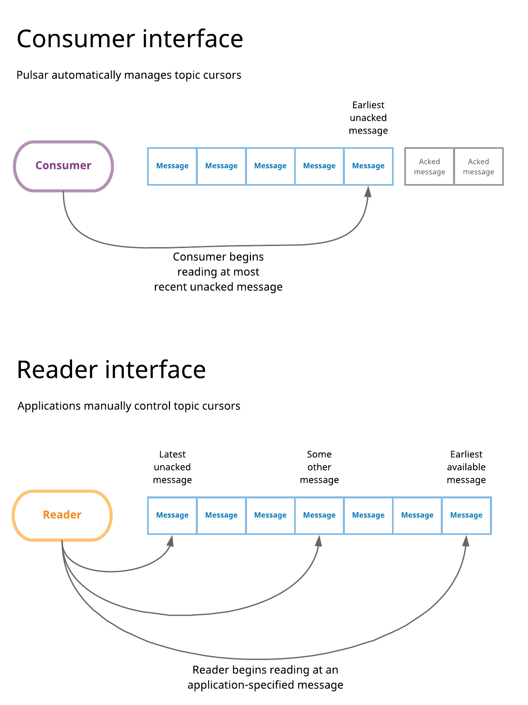

# Pulsar客户端
## 客户端设置步骤
1. 客户端将尝试通过向服务器（Broker）发送 HTTP 查找请求，来确定主题（Topic）所在的服务器（Broker）。 客户端通过查询 ZooKeeper 中 (缓存) 的元数据，来确定这条消息的 topic 在哪个 broker 上，如果该 topic 不在任何一个 broker 上，则把这个 topic 分配在负载最少的 broker 上。
2. 当客户端获取了broker的地址之后，将会创建一个TCP连接 (或复用连接池中的连接) 并且进行鉴权。 客户端和broker通过该连接交换基于自定义协议的二进制命令。 同时，客户端会向broker发送一条命令用以在broker上创建生产者/消费者，该命令将会在验证授权策略后生效。

## Reader接口

* 默认创建一个新订阅消费会定位在topic的末尾处，如果消费者使用已经存在的订阅来链接topic时，将从订阅内最早的未确认消息开始读取。消费者接口是基于消息确认机制来自动管理订阅游标位置。Pulsar 的 **reader 接口**允许应用程序手动管理游标。 当您使用 reader 连接到 topic 而不是连接到消费者时，需要指定 reader 在连接到该 topic 时开始读取*哪条消息*。 当连接到一个 topic 时，reader 接口支持的开始位置包括：
  - Topic 中**最早**的可用消息
  - Topic 中**最新**的可用消息
  - 在最早和最新之间的其他消息。 如果你选择此选项，则需要明确提供消息 ID。 你的应用程序将需要提前“知道”这个消息 ID，可能要从持久化存储或缓存中获取。
* Reader 接口内部是作为一个使用独占、非持久化订阅的被随机命名的一个消费者来实现的。与订阅或消费者不同， readers 在性质上是非持久性的，不会阻止某一主题中的数据被删除。所以***强烈\***建议配置[数据保留时间](https://pulsar.apache.org/docs/zh-CN/next/cookbooks-retention-expiry)这个选项。 如果主题没有配置足够长的消息保留时间，就会出现消息还没有被 Reader 读取就被删除的情况。 这将导致 reader 读取不到这条消息。 为主题配置数据保留时间，就可以保证 reader 可以在一定时间内可以获取到该消息。
* 请注意 reader 可能会有一个 "backlog"，但是该指标只是为了让用户了解到 reader 背后的运行情况，但是在进行任何积压配额计算是都不会考虑该因素。



### 从最早开始消费

```java
import org.apache.pulsar.client.api.Message;
import org.apache.pulsar.client.api.MessageId;
import org.apache.pulsar.client.api.Reader;

// Create a reader on a topic and for a specific message (and onward)
Reader<byte[]> reader = pulsarClient.newReader()
    .topic("reader-api-test")
    .startMessageId(MessageId.earliest)
    .create();

while (true) {
    Message message = reader.readNext();

    // Process the message
}
```

### 从可用消息处开始消费

```java
Reader<byte[]> reader = pulsarClient.newReader()
    .topic(topic)
    .startMessageId(MessageId.latest)
    .create();
```

### 从最早和最新消息直接读取

```java
byte[] msgIdBytes = // Some byte array
MessageId id = MessageId.fromByteArray(msgIdBytes);
Reader<byte[]> reader = pulsarClient.newReader()
    .topic(topic)
    .startMessageId(id)
    .create();
```

# 消息压缩

* 消息数据高度可扩展的[持久存储](https://pulsar.apache.org/docs/zh-CN/next/concepts-architecture-overview#persistent-storage)，是Pulsar构建的主要目标。 Pulsar的topic让你可以持久存储所有你所需要的未被确认消息，同时保留了消息的顺序。 主题上生产的*所有*未被确认/未被处理的消息，Pulsar会默认存储。 在很多Pulsar的使用案例中，在topic累积大量的未被确认的消息是有必要的。但对于Pulsar的consumer来说，在完整的消息log中回退，将变得非常耗时。
* 某些情况下，consumer并不需要完整的topic日志。 他们可能只需要几个值来构造一个更 "浅" 的日志图像, 也许仅仅只是最新的值。 对于这种应用场景，Pulsar提供了 **topic压缩**. 当你在topic上执行压缩，Pulsar会遍历topic的backlog然后把遥远*模糊*已经有了更新的消息移除。例如，它遍历一个以key为基础的topic，只留下关联到key上最新的消息。
* pulsar的topic压缩特性
  * 运行通过topic日志更快地后退
  * 仅使用持久化topic
  * 当backlog达到一定大小时，可以被自动触发，或者通过命令行手动触发。
  * 在概念上和操作上与[ retention和expiry ](https://pulsar.apache.org/docs/zh-CN/next/concepts-messaging#message-retention-and-expiry)是不同的。 但是，在topic压缩中，还是*会*尊重retention。 如果retention已经从topic的backlog中移除了消息，那么此条消息在压缩的topic账簿上也是无法被读取的。

## Topic压缩的工作原理

* 通过命令行触发topic压缩，pulsar将会从头到尾迭代整个topic，对于它碰到的每个key，压缩程序将会只保留这个key最近的事件。之后，broker将会创建一个新的BookKeeper ledger然后开始对topic消息进行二次迭代。对于每条消息，如果key匹配到它的最新事件，key的数据内容，消息ID，元数据将会被写入最新创建的ledger。 如果key并没有匹配到最新的消息，消息将被跳过。 如果给定的消息，value是空的，它将被跳过并且视为删除。 在本topic第二次迭代结束时，新创建的BookKeeper ledger将被关闭，并将两个内容写入元数据 ：BookKeeper ledger的ID及最新被压缩的消息的ID（这被称为topic的**压缩层位**）。 写入元数据后，压缩就完成了。
* 启用读取压缩功能的客户端（consumer和reader），将会尝试从topic中读取消息，或者：
  - 像从正常的主题那样读取（如果消息的ID大于等于压缩层位），或
  - 从压缩层位的开始读取（如果消息ID小于压缩层位）

# Pulsar Schema

## Schema Registry

* Pulsar使用内置Schema Registry,发消息需要指定schema通过client.newProducer(JSONSchema.of(User.class))指定。
* 使用schema创建producer时，不需要讲消息转换成字节数组，pulsar scehma会在后台执行操作。

## Schema演化

* 为了满足新的业务要求，需要不断更新 schemas，这种更新就叫做 **schema 演化**。Schema 的任何变化都会影响到下游 consumers。 Schema 演化确保了下游 consumers 能够无缝地处理以旧 schemas 和以新 schemas 编码的数据。

### Pulsar对schema演化提供的支持

1. 当 producer/consumer/ Reader连接到 broker 时，broker 会部署由 `schemaRegistryCompatibilityCheckers` 配置的 schema 兼容性检查器来进行 schema 兼容性检查。

   Schema 兼容性检查器是每个 schema 类型都有的实例。

   目前，Avro 和 JSON 有自己的兼容性检查器，所有其他 schema 类型共享默认兼容性检查器，而此默认检查器禁用 schema 演化。

2. Producer/consumer/ reader将其客户端 `SchemaInfo` 发送到 broker。

3. Broker 知道 schema 类型，并找到此类型的 schema 兼容性检查器。

4. Broker 使用检查器，以兼容性检查策略来检查 `SchemaInfo` 是否与 topic 的最新 schema 兼容。

   目前，兼容性检查策略是在命名空间级别配置的，适用于命名空间中的所有 topics。

# 事务

## 幂等Producer的局限性

* 使用Pulsar幂等生产者可以避免数据丢失或重复，但它不为跨多个分区的写入提供保证。

* 在Pulsar中，最高级别的消息传递保证是使用 [幂等生产者](https://pulsar.apache.org/docs/en/next/concepts-messaging/#producer-idempotency) 在单个分区上使用恰好一次语义，即每条消息只持久化一次，不会丢失和重复。 然而，这种解决办法有一些限制：

  - 由于`单调递增的序列ID`，该方案仅适用于单个分区和单个生产者会话内（即生产一条消息），`因此向一个或多个分区生产多条消息时没有原子性`。

    在这种情况下，如果在产生和接收消息的过程中出现一些故障（例如，client/broker/bookie崩溃、网络故障等），消息会被重新处理和重新投递，这可能会导致数据丢失或数据重复：

    - 对于生产者：如果生产者重试发送消息，有些消息会被多次持久化；如果生产者不重试发送消息，一些消息会被持久化一次，而其他消息会丢失。
    - 对于消费者：由于消费者不知道代理是否收到消息，因此消费者可能不会重试发送 ack，从而导致其收到重复的消息。

* 消费者需要依赖更多的机制来确认（ack）消息一次。

## 运行原理

### 事务协调器

* 事务协调器(TC)是运行在 Pulsar Broker 中的一个模块。
  - 它维护事务的整个生命周期，并防止事务进入错误状态。
  - 它处理事务超时，并确保事务在事务超时后中止。

### 事务日志

* 所有事务元数据都保存在事务日志中。 事务日志由` Pulsar 主题`记录。 如果事务协调器崩溃，它可以从事务日志恢复事务元数据，事务日志存储事务状态而不是事务实际消息。

### 事务缓存

* 向事务内的主题分区生成的消息存储在该主题分区的事务缓冲区（TB）中。 在提交事务之前，事务缓冲区中的消息对消费者不可见。 当事务中止时，事务缓冲区中的消息将被丢弃。
* 事务缓冲区将所有正在进行和中止的事务存储在内存中。 所有消息都发送到实际的分区 Pulsar 主题。 提交事务后，事务缓冲区中的消息对消费者具体化（可见）。 事务中止时，事务缓冲区中的消息将被丢弃。

### 事务ID

* 事务ID（TxnID）标识Pulsar中的唯一事务。 事务 ID 长度是 128-bit。 最高 16 位保留给事务协调器的 ID，其余位用于每个事务协调器中单调递增的数字。 使用 TxnID 很容易定位事务崩溃。

### 待确认状态

* 挂起确认状态在事务完成之前维护事务中的消息确认。 如果消息处于挂起确认状态，则在该消息从挂起确认状态中移除之前，其他事务无法确认该消息。
* 挂起的确认状态被保留到挂起的确认日志中(cursor ledger)。 新启动的broker可以从挂起的确认日志中恢复状态，以确保状态确认不会丢失。

### 数据流

* [事务数据流](https://pulsar.apache.org/docs/zh-CN/next/txn-how/)

