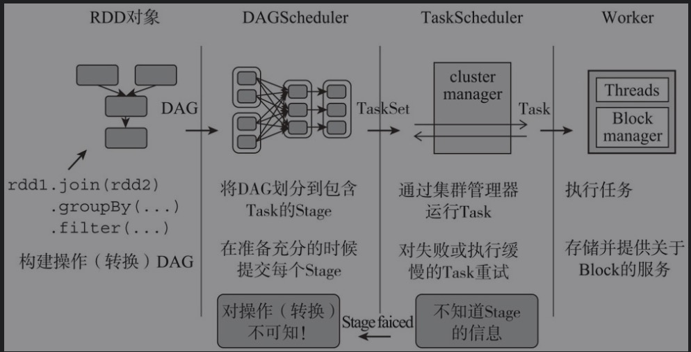
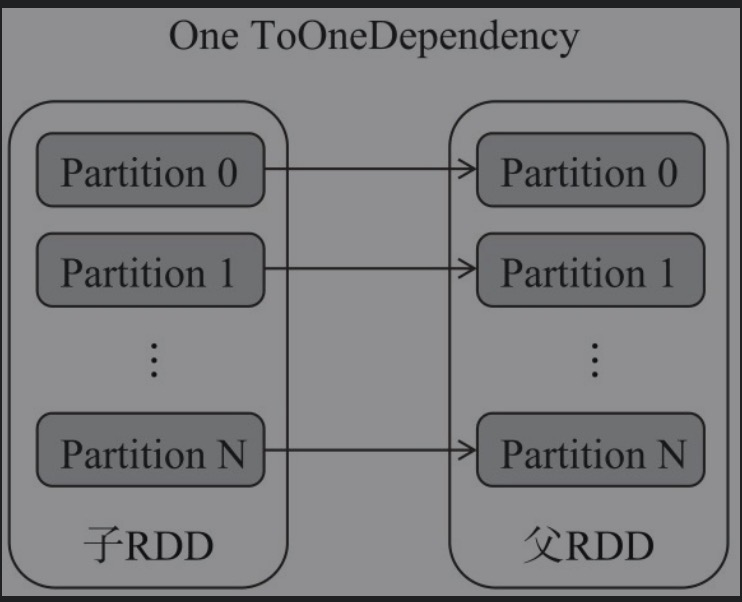
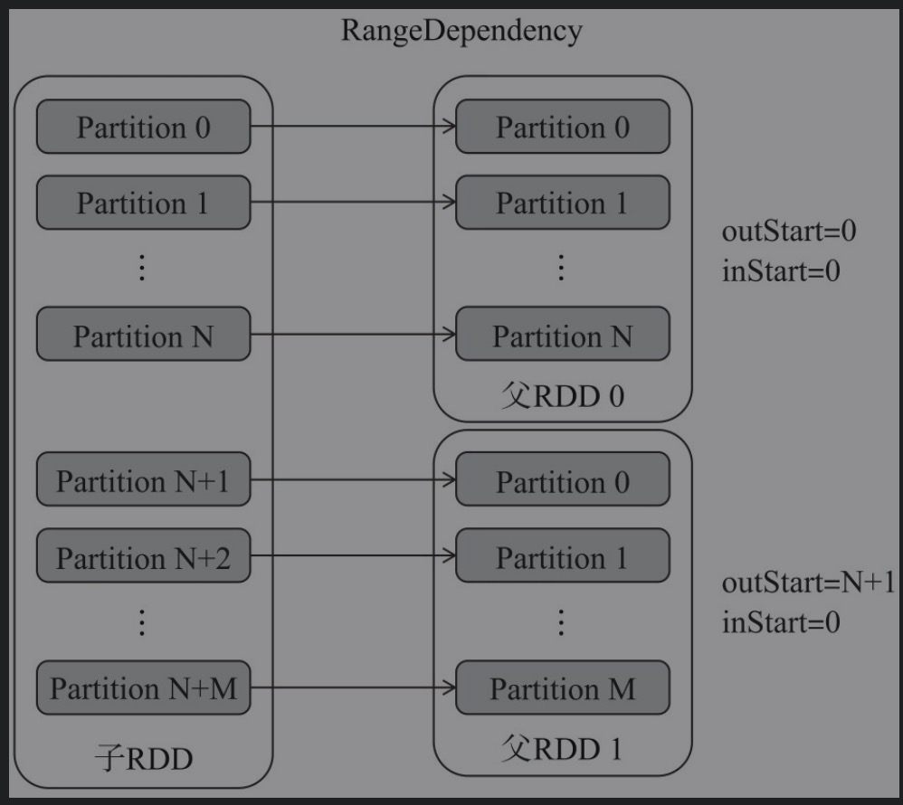
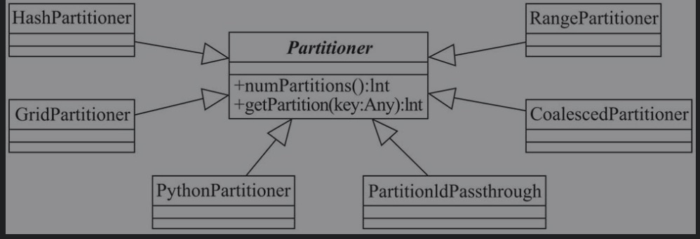

# 调度系统概述

## 主要工作流程



1. build operator DAG：用户提交的Job将首先被转换为一系列RDD并通过RDD之间的依赖关系构建DAG，然后将RDD构成的DAG提交到调度系统。
2. split graph into stages of tasks:DAGScheduler负责接收由RDD构成的DAG，将一系列RDD划分到不同的Stage。根据Stage的不同类型（目前有ResultStage和Shuffle MapStage两种），给Stage中未完成的Partition创建不同类型的Task（目前有ResultTask和ShuffleMapTask两种）。每个Stage将因为未完成Partition的多少，创建零到多个Task。DAGScheduler最后将每个Stage中的Task以任务集合（TaskSet）的形式提交给Task Scheduler继续处理。
3. launch tasks via cluster manager：使用集群管理器（clustermanager）分配资源与任务调度，对于失败的任务还会有一定的重试与容错机制。TaskScheduler负责从DAGScheduler接 收TaskSet，创 建TaskSetManager对TaskSet进 行 管 理，并 将 此TaskSetManager添加到调度池中，最后将对Task的调度交给调度后端接口（SchedulerBackend）处理。SchedulerBackend首先申请TaskScheduler，按照Task调度算法（目前有FIFO和FAIR两种）对调度池中的所有TaskSetManager进行排序，然后对TaskSet按照最大本地性原则分配资源，最后在各个分配的节点上运行TaskSet中的Task。
4. execute tasks：执行任务，并将任务中间结果和最终结果存入存储体系。

# RDD详解

* RDD（Resilient Distributed Datasets，弹性分布式数据集）代表可并行操作元素的不可变分区集合。

## RDD的特点

### 数据处理模型

* RDD是一个`容错的、并行的数据结构，可以控制将数据存储到磁盘或内存，能够获取数据的分区。`RDD提供了一组类似于Scala的操作，比如map、flatMap、filter、reduceByKey、join、mapPartitions等，这些操作实际是对RDD进行转换（transformation）。此外，RDD还提供了collect、foreach、count、reduce、countByKey等操作完成数据计算的动作（action）。
* 通常数据处理的模型包括迭代计算、关系查询、MapReduce、流式处理等。Hadoop使用MapReduce模型，Storm采用流式模型，Spark使用了全部模型。

### 依赖划分原则

* 一个RDD包含多个分区，每个分区实际是一个数据集合的片段。在构建DAG的过程中，会讲RDD串联起来，每个RDD都有其依赖项（最顶级RDD的依赖是空列表），这些依赖分为窄依赖（即NarrowDependency）和Shuffle依赖（即ShuffleDependency，也称为宽依赖）两种。
* NarrowDependency会被划分到同一个Stage中，这样它们就能以管道的方式迭代执行。ShuffleDependency由于所依赖的分区Task不止一个，所以往往需要跨节点传输数据。从容灾角度讲，它们恢复计算结果的方式不同。NarrowDependency只需要重新执行父RDD的丢失分区的计算即可恢复，而ShuffleDependency则需要考虑恢复所有父RDD的丢失分区。

### 数据处理效率

* RDD的计算过程允许在多个节点并发执行。如果数据量很大，可以适当增加分区数量，这种根据硬件条件对并发任务数量的控制，能更好地利用各种资源，也能有效提高Spark的数据处理效率。

### 容错处理

* 传统数据库往往采用日志记录来容灾容错，数据恢复都依赖于重新执行日志。Hadoop为了避免单机故障概率较高的问题，通常将数据备份到其他机器容灾。
* 由于所有备份机器同时出故障的概率比单机故障概率低很多，所以在发生宕机等问题时能够从备份机读取数据。RDD本身是一个不可变的（Scala中称为immutable）数据集，当某个Worker节点上的Task失败时，可以利用DAG重新调度计算这些失败的Task（执行已成功的Task可以从CheckPoint（检查点）中读取，而不用重新计算）。在流式计算的场景中，Spark需要记录日志和CheckPoint，以便利用CheckPoint和日志对数据恢复。

## RDD实现分析

### RDD类属性

* _sc:SparkContext
* deps:DEpendency的序列，用于存储当前RDD的依赖
* partitioner:当前RDD的分区计算器。
* id:当前RDD的唯一身份标识。
* name:RDD的名称
* partitions_:存储当前RDD的所有分区的数组
* creationSite:创建当前RDD的用户代码
* scope:当前RDD的操作作用域
* checkpointData:当前RDD的检查点数据
* checkpointAllMarkedAncestors：是否对所有标记了需要保存检查点的祖先保存检查点。
* doCheckpointCalled:是否已经调用了doCheckpoint方法设置检查点。此属性可以阻止对RDD多次设置检查点。

### 模版方法

#### compute

* 对RDD的分区进行计算,采用模版方法，不同的RDD类型有不同的compute模型。

```scala
def compute(split: Partition, context: TaskContext): Iterator[T]
```

#### getPartitions

* 获取当前RDD的所有分区。

```scala
protected def getPartitions: Array[Partition]
```

#### getDependencies

* 获取当前RDD的所有依赖

```scala
 protected def getDependencies: Seq[Dependency[_]] = deps
```

#### getPreferredLocations

* 获取某一分区的偏好位置

```scala
protected def getPreferredLocations(split: Partition): Seq[String] = Nil
```

### 通用方法

#### partitions

```scala
final def partitions: Array[Partition] = {
    // 先从CheckPoint查找->partitions_->getPartitions
    checkpointRDD.map((_: CheckpointRDD[T]).partitions).getOrElse {
      // 如果partitions_为null，double check
      if (partitions_ == null) {
        stateLock.synchronized {
          if (partitions_ == null) {
            // 拿到分区
            partitions_ = getPartitions
            partitions_.zipWithIndex.foreach { case (partition, index) =>
              require(partition.index == index,
                s"partitions($index).partition == ${partition.index}, but it should equal $index")
            }
          }
        }
      }
      partitions_
    }
  }
```

####  preferredLocations

```scala
  final def preferredLocations(split: Partition): Seq[String] = {
    // 先从checkpoint中查找偏好location，如果不存在再去getPreferredLocations()方法
    checkpointRDD.map(_.getPreferredLocations(split)).getOrElse {
      getPreferredLocations(split)
    }
  }
```

#### dependencies

```scala
 final def dependencies: Seq[Dependency[_]] = {
    //1. 先从checkpoint中查找，获取CheckpointRDD放入OneToOneDependency列表，如果chckpoint找不到
    //2.dependencies_属性
    //3.getDependencies方法
    checkpointRDD.map((r: CheckpointRDD[T]) => List(new OneToOneDependency(r))).getOrElse {
      if (dependencies_ == null) {
        stateLock.synchronized {
          if (dependencies_ == null) {
            dependencies_ = getDependencies
          }
        }
      }
      dependencies_
    }
  }
```

####  context

```scala
def context: SparkContext = sc
```

#### getNarrowAncestors

```scala
/**
   * 返回给定RDD是仅通过狭窄的依赖关系的顺序与它的祖先。 该遍历使用DFS给定的RDD的依赖关系树，但仍保持在返回的RDDS没有顺序。
   * Return the ancestors of the given RDD that are related to it only through a sequence of
   * narrow dependencies. This traverses the given RDD's dependency tree using DFS, but maintains
   * no ordering on the RDDs returned.
   */
  private[spark] def getNarrowAncestors: Seq[RDD[_]] = {
    // 窄依赖RDD的祖先集合
    val ancestors = new mutable.HashSet[RDD[_]]
    // 偏方法
    def visit(rdd: RDD[_]): Unit = {
      // 变量rdd的依赖，筛选出来窄依赖
      val narrowDependencies = rdd.dependencies.filter(_.isInstanceOf[NarrowDependency[_]])
      // 获取窄依赖的父RDD
      val narrowParents = narrowDependencies.map(_.rdd)
      // 判断祖先是否包含该RDD
      val narrowParentsNotVisited = narrowParents.filterNot(ancestors.contains)
      // 将祖先添加到集合，并且DFS方式回溯搜索祖先的祖先
      narrowParentsNotVisited.foreach { parent =>
        ancestors.add(parent)
        visit(parent)
      }
    }

    // 调用查询组件方法
    visit(this)

    // In case there is a cycle, do not include the root itself
    // 移除当前RDD进入组件集合
    ancestors.filterNot(_ == this).toSeq
  }
```

## RDD依赖

### 窄依赖

* RDD与上游RDD的分区是一对一的关系

```scala
abstract class NarrowDependency[T](_rdd: RDD[T]) extends Dependency[T] {
  /**
   * 根据子分区id获取其父亲分区id，可以由多个父亲分区id
   * Get the parent partitions for a child partition.
   * @param partitionId a partition of the child RDD
   * @return the partitions of the parent RDD that the child partition depends upon
   */
  def getParents(partitionId: Int): Seq[Int]

  /**
   * 上游RDD
   * @return
   */
  override def rdd: RDD[T] = _rdd
}
```

#### OneToOneDependency

* NarrowDependency的实现之一，RDD和上游RDD分区一对一的实现

```scala
class OneToOneDependency[T](rdd: RDD[T]) extends NarrowDependency[T](rdd) {
  override def getParents(partitionId: Int): List[Int] = List(partitionId)
}
```



#### RangeDependency

```scala
/**
 * :: DeveloperApi ::
 * Represents a one-to-one dependency between ranges of partitions in the parent and child RDDs.
 * @param rdd the parent RDD
 * @param inStart the start of the range in the parent RDD 父RDD中range的开始
 * @param outStart the start of the range in the child RDD 子RDD中range的开始
 * @param length the length of the range range的长度
 */
@DeveloperApi
class RangeDependency[T](rdd: RDD[T], inStart: Int, outStart: Int, length: Int)
  extends NarrowDependency[T](rdd) {

  override def getParents(partitionId: Int): List[Int] = {
    if (partitionId >= outStart && partitionId < outStart + length) {
      List(partitionId - outStart + inStart)
    } else {
      Nil
    }
  }
}
```



#### PruneDependency

```scala
private[spark] class PruneDependency[T](rdd: RDD[T], partitionFilterFunc: Int => Boolean)
  extends NarrowDependency[T](rdd) {

  @transient
  val partitions: Array[Partition] = rdd.partitions
    .filter(s => partitionFilterFunc(s.index)).zipWithIndex
    .map { case(split, idx) => new PartitionPruningRDDPartition(idx, split) : Partition }

  override def getParents(partitionId: Int): List[Int] = {
    List(partitions(partitionId).asInstanceOf[PartitionPruningRDDPartition].parentSplit.index)
  }
}
```

### 宽依赖

* RDD与上游RDD的分区如果不是一对一关系，或者RDD的分区依赖于上游RDD的多个分区，这种依赖就是宽依赖(Shuffle依赖)

```scala
/**
 * :: DeveloperApi ::
 * Represents a dependency on the output of a shuffle stage. Note that in the case of shuffle,
 * the RDD is transient since we don't need it on the executor side.
 *
 * @param _rdd the parent RDD 父RDD
 * @param partitioner partitioner used to partition the shuffle output 分区器，用于对shuffle输出进行分区
 * @param serializer [[org.apache.spark.serializer.Serializer Serializer]] to use. If not set
 *                   explicitly then the default serializer, as specified by `spark.serializer`
 *                   config option, will be used.
 * @param keyOrdering key ordering for RDD's shuffles 排序的key
 * @param aggregator map/reduce-side aggregator for RDD's shuffle rdd的shuffle是map端或者reduce端聚合
 * @param mapSideCombine whether to perform partial aggregation (also known as map-side combine) 是否在map端进行预计算
 */
@DeveloperApi
class ShuffleDependency[K: ClassTag, V: ClassTag, C: ClassTag](
    @transient private val _rdd: RDD[_ <: Product2[K, V]],
    val partitioner: Partitioner,
    val serializer: Serializer = SparkEnv.get.serializer,
    val keyOrdering: Option[Ordering[K]] = None,
    val aggregator: Option[Aggregator[K, V, C]] = None,
    val mapSideCombine: Boolean = false)
  extends Dependency[Product2[K, V]] {

  // 如果设置map端预算，判断aggregator是否定义
  if (mapSideCombine) {
    require(aggregator.isDefined, "Map-side combine without Aggregator specified!")
  }
  // 判断rdd
  override def rdd: RDD[Product2[K, V]] = _rdd.asInstanceOf[RDD[Product2[K, V]]]

  // rdd的key的全类名
  private[spark] val keyClassName: String = reflect.classTag[K].runtimeClass.getName
  // rdd的value的全类名
  private[spark] val valueClassName: String = reflect.classTag[V].runtimeClass.getName
  // Note: It's possible that the combiner class tag is null, if the combineByKey
  // methods in PairRDDFunctions are used instead of combineByKeyWithClassTag.
  // 预计算函数的全类名
  private[spark] val combinerClassName: Option[String] =
    Option(reflect.classTag[C]).map(_.runtimeClass.getName)

  // shuffleId
  val shuffleId: Int = _rdd.context.newShuffleId()

  // shuffle处理器，向shuffleManager注册
  val shuffleHandle: ShuffleHandle = _rdd.context.env.shuffleManager.registerShuffle(
    shuffleId, _rdd.partitions.length, this)

  // 注册shuffle的contextCleaner，用于清理shuffle中间结果
  _rdd.sparkContext.cleaner.foreach(_.registerShuffleForCleanup(this))
}
```

## Partitioner

* ShuffleDependency的partitioner属性的类型是Partitioner，抽象类Partitioner定义了分区计算器的接口规范，ShuffleDependency的分区取决于Partitioner的具体实现。

```scala
abstract class Partitioner extends Serializable {
  // 分区总数量
  def numPartitions: Int
  // 根据key获取对应的分区
  def getPartition(key: Any): Int
}
```



### 默认分区器

```scala
def defaultPartitioner(rdd: RDD[_], others: RDD[_]*): Partitioner = {
    // 将可变参数放入到一个Seq中
    val rdds: Seq[RDD[_]] = (Seq(rdd) ++ others)
    // 筛选出不存在分区的RDD
    val hasPartitioner: Seq[RDD[_]] = rdds.filter(_.partitioner.exists(_.numPartitions > 0))

    // 获取最大分区的RDD
    val hasMaxPartitioner: Option[RDD[_]] = if (hasPartitioner.nonEmpty) {
      Some(hasPartitioner.maxBy(_.partitions.length))
    } else {
      None
    }

    // 得到默认分区数量，如果spark.default.parallelism存在则为他，否则为传入rdd中的最大分区数
    val defaultNumPartitions: Int = if (rdd.context.conf.contains("spark.default.parallelism")) {
      rdd.context.defaultParallelism
    } else {
      rdds.map(_.partitions.length).max
    }

    // If the existing max partitioner is an eligible one, or its partitions number is larger
    // than the default number of partitions, use the existing partitioner.
    // 如果存在最大分区器，并且是合格的分区程序，或者默认分区数量小雨最大分区器的分区数，则返回最大分区的分区器，否则默认为Hash分区器，并且分区个数为"spark.default.parallelism"
    if (hasMaxPartitioner.nonEmpty && (isEligiblePartitioner(hasMaxPartitioner.get, rdds) ||
        defaultNumPartitions < hasMaxPartitioner.get.getNumPartitions)) {
      hasMaxPartitioner.get.partitioner.get
    } else {
      new HashPartitioner(defaultNumPartitions)
    }
  }
```

### HashPartitioner

```scala
class HashPartitioner(partitions: Int) extends Partitioner {
  require(partitions >= 0, s"Number of partitions ($partitions) cannot be negative.")

  def numPartitions: Int = partitions

  def getPartition(key: Any): Int = key match {
    case null => 0
      // 获取key的hashcode和分区数的非负数取余为分区数
    case _ => Utils.nonNegativeMod(key.hashCode, numPartitions)
  }

  override def equals(other: Any): Boolean = other match {
    case h: HashPartitioner =>
      h.numPartitions == numPartitions
    case _ =>
      false
  }

  override def hashCode: Int = numPartitions
}
```

### RangePartitioner

```scala
/**
 * A [[org.apache.spark.Partitioner]] that partitions sortable records by range into roughly
 * equal ranges. The ranges are determined by sampling the content of the RDD passed in.
 *
 * @note The actual number of partitions created by the RangePartitioner might not be the same
 * as the `partitions` parameter, in the case where the number of sampled records is less than
 * the value of `partitions`.
 */
```

## RDDInfo

### 相关属性

```scala
class RDDInfo(
    val id: Int, //rdd id
    var name: String, // rdd name
    val numPartitions: Int, // rdd partition num
    var storageLevel: StorageLevel, //存储级别
    val parentIds: Seq[Int], //  父RDDid集合
    val callSite: String = "", // RDD的用户调用栈信息
    val scope: Option[RDDOperationScope] = None) // rdd的操作范围。scope的类型为RDDOperationScope，每一个RDD都有一个RDDOperationScope。RDDOperationScope与Stage或Job之间并无特殊关系，一个RDDOperationScope可以存在于一个Stage内，也可以跨越多个Job。
  extends Ordered[RDDInfo] {

  // 缓存的分区数量
  var numCachedPartitions = 0
  // 使用的内存大小
  var memSize = 0L
  // 使用的磁盘大小
  var diskSize = 0L
  // block存储在外部的大小
  var externalBlockStoreSize = 0L
```

### 相关方法

#### isCached

```scala
 // 是否已经缓存
  def isCached: Boolean = (memSize + diskSize > 0) && numCachedPartitions > 0
```

#### compare

```scala
# 比较传入的rdd和当前rdd的大小关系,用于排序
override def compare(that: RDDInfo): Int = {
    this.id - that.id
  }
```

#### fromRDD

```scala
 def fromRdd(rdd: RDD[_]): RDDInfo = {
    // rddName
    val rddName = Option(rdd.name).getOrElse(Utils.getFormattedClassName(rdd))
    // 父RDDid集合
    val parentIds = rdd.dependencies.map(_.rdd.id)
    // rdd调用栈
    val callsiteLongForm = Option(SparkEnv.get)
      .map(_.conf.get(EVENT_LOG_CALLSITE_LONG_FORM))
      .getOrElse(false)

    val callSite = if (callsiteLongForm) {
      rdd.creationSite.longForm
    } else {
      rdd.creationSite.shortForm
    }
    new RDDInfo(rdd.id, rddName, rdd.partitions.length,
      rdd.getStorageLevel, parentIds, callSite, rdd.scope)
  }
```

# Stage详解

* DAGScheduler将Job的RDD划分到不同的Stage，并构建这些Stage的依赖关系。这样可以使没有依赖关系的Stage并行执行，并保证有依赖关系的Stage顺序执行。

```scala
 * @param id Unique stage ID 唯一的stage ID
 * @param rdd RDD that this stage runs on: for a shuffle map stage, it's the RDD we run map tasks
 *   on, while for a result stage, it's the target RDD that we ran an action on
 * @param numTasks Total number of tasks in stage; result stages in particular may not need to
 *   compute all partitions, e.g. for first(), lookup(), and take().
 * @param parents List of stages that this stage depends on (through shuffle dependencies). stage依赖
 * @param firstJobId ID of the first job this stage was part of, for FIFO scheduling. 第一个job的id作为这个stage的一部分
 * @param callSite Location in the user program associated with this stage: either where the target
 *   RDD was created, for a shuffle map stage, or where the action for a result stage was called.
 */
private[scheduler] abstract class Stage(
    val id: Int,
    val rdd: RDD[_],
    val numTasks: Int,
    val parents: List[Stage],
    val firstJobId: Int,
    val callSite: CallSite)
  extends Logging {

  // rdd分区数量
  val numPartitions = rdd.partitions.length

  /** Set of jobs that this stage belongs to. */
  // jobId集合
  val jobIds = new HashSet[Int]

  /** The ID to use for the next new attempt for this stage. */
  // 下次重试id
  private var nextAttemptId: Int = 0

  // stage name
  val name: String = callSite.shortForm
  // stage详情
  val details: String = callSite.longForm

  /**
   * 返回最近一次Stage尝试的StageInfo，即返回_latestInfo。
   * Pointer to the [[StageInfo]] object for the most recent attempt. This needs to be initialized
   * here, before any attempts have actually been created, because the DAGScheduler uses this
   * StageInfo to tell SparkListeners when a job starts (which happens before any stage attempts
   * have been created).
   */
  private var _latestInfo: StageInfo = StageInfo.fromStage(this, nextAttemptId)

  /**
   * 失败的attemptId集合
   * Set of stage attempt IDs that have failed. We keep track of these failures in order to avoid
   * endless retries if a stage keeps failing.
   * We keep track of each attempt ID that has failed to avoid recording duplicate failures if
   * multiple tasks from the same stage attempt fail (SPARK-5945).
   */
  val failedAttemptIds = new HashSet[Int]
```

* makeNewStageAttempt

```scala
/**
   * 通过使用新的attempt ID创建一个新的StageInfo，为这个阶段创建一个新的attempt
   */
  /** Creates a new attempt for this stage by creating a new StageInfo with a new attempt ID. */
  def makeNewStageAttempt(
      numPartitionsToCompute: Int,
      taskLocalityPreferences: Seq[Seq[TaskLocation]] = Seq.empty): Unit = {
    val metrics = new TaskMetrics
    // 注册度量
    metrics.register(rdd.sparkContext)
    // 得到最后一次访问Stage的StageInfo信息
    _latestInfo = StageInfo.fromStage(
      this, nextAttemptId, Some(numPartitionsToCompute), metrics, taskLocalityPreferences)
    nextAttemptId += 1
  }
```

## ResultStage实现

```scala
/**
 *
 * @param id Unique stage ID 唯一的stage ID
 * @param rdd RDD that this stage runs on: for a shuffle map stage, it's the RDD we run map tasks
 *   on, while for a result stage, it's the target RDD that we ran an action on
 * @param func  即对RDD的分区进行计算的函数。
 * @param partitions 由RDD的哥哥分区的索引组成的数组
 * @param parents List of stages that this stage depends on (through shuffle dependencies). stage依赖
 * @param firstJobId ID of the first job this stage was part of, for FIFO scheduling. 第一个job的id作为这个stage的一部分
 * @param callSite Location in the user program associated with this stage: either where the target
 *   RDD was created, for a shuffle map stage, or where the action for a result stage was called.
 */
private[spark] class ResultStage(
    id: Int,
    rdd: RDD[_],
    val func: (TaskContext, Iterator[_]) => _,
    val partitions: Array[Int],
    parents: List[Stage],
    firstJobId: Int,
    callSite: CallSite)
  extends Stage(id, rdd, partitions.length, parents, firstJobId, callSite) {

  /**
   * result stage的活跃job 如果job已经完成将会为空
   * The active job for this result stage. Will be empty if the job has already finished
   * 例如这个任务被取消
   * (e.g., because the job was cancelled).
   */
  private[this] var _activeJob: Option[ActiveJob] = None

  /**
   * 活跃job
   * @return
   */
  def activeJob: Option[ActiveJob] = _activeJob

  // 设置活跃job
  def setActiveJob(job: ActiveJob): Unit = {
    _activeJob = Option(job)
  }

  // 移除当前活跃job
  def removeActiveJob(): Unit = {
    _activeJob = None
  }

  /**
   * 返回丢失分区id集合的seq
   * Returns the sequence of partition ids that are missing (i.e. needs to be computed).
   *
   * This can only be called when there is an active job.
   */
  override def findMissingPartitions(): Seq[Int] = {
    // 获取当前活跃job
    val job = activeJob.get
    // 筛选出没有完成的分区
    (0 until job.numPartitions).filter(id => !job.finished(id))
  }

  override def toString: String = "ResultStage " + id
}
```

## ShuffleMapStage实现

* ShuffleMapStage是DAG调度流程的中间Stage，他可以包括一个到多个ShuffleMap-Task，这些Task用于生产Shuffle的数据。

```scala
/**
 *
 * @param id Unique stage ID 唯一的stage ID
 * @param rdd RDD that this stage runs on: for a shuffle map stage, it's the RDD we run map tasks
 *   on, while for a result stage, it's the target RDD that we ran an action on
 * @param numTasks Total number of tasks in stage; result stages in particular may not need to
 *   compute all partitions, e.g. for first(), lookup(), and take().
 * @param parents List of stages that this stage depends on (through shuffle dependencies). stage依赖
 * @param firstJobId ID of the first job this stage was part of, for FIFO scheduling. 第一个job的id作为这个stage的一部分
 * @param callSite Location in the user program associated with this stage: either where the target
 *   RDD was created, for a shuffle map stage, or where the action for a result stage was called.
 * @param shuffleDep shuffle依赖
 * @param mapOutputTrackerMaster map端输出中间数据追中器Master
 */
private[spark] class ShuffleMapStage(
    id: Int,
    rdd: RDD[_],
    numTasks: Int,
    parents: List[Stage],
    firstJobId: Int,
    callSite: CallSite,
    val shuffleDep: ShuffleDependency[_, _, _],
    mapOutputTrackerMaster: MapOutputTrackerMaster)
  extends Stage(id, rdd, numTasks, parents, firstJobId, callSite) {

  // map阶段job集合
  private[this] var _mapStageJobs: List[ActiveJob] = Nil

  /**
   * 暂停的分区集合
   *
   * 要么尚未计算，或者被计算在此后已失去了执行程序，它，所以应该重新计算。 此变量用于由DAGScheduler以确定何时阶段已完成。 在该阶段，无论是积极的尝试或较早尝试这一阶段可能会导致paritition IDS任务成功摆脱pendingPartitions删除。 其结果是，这个变量可以是与在TaskSetManager挂起任务的阶段主动尝试不一致（这里存储分区将始终是分区的一个子集，该TaskSetManager自以为待定）。
   * Partitions that either haven't yet been computed, or that were computed on an executor
   * that has since been lost, so should be re-computed.  This variable is used by the
   * DAGScheduler to determine when a stage has completed. Task successes in both the active
   * attempt for the stage or in earlier attempts for this stage can cause paritition ids to get
   * removed from pendingPartitions. As a result, this variable may be inconsistent with the pending
   * tasks in the TaskSetManager for the active attempt for the stage (the partitions stored here
   * will always be a subset of the partitions that the TaskSetManager thinks are pending).
   */
  val pendingPartitions = new HashSet[Int]

  override def toString: String = "ShuffleMapStage " + id

  /**
   * Returns the list of active jobs,
   * i.e. map-stage jobs that were submitted to execute this stage independently (if any).
   */
  def mapStageJobs: Seq[ActiveJob] = _mapStageJobs

  /** Adds the job to the active job list. */
  def addActiveJob(job: ActiveJob): Unit = {
    _mapStageJobs = job :: _mapStageJobs
  }

  /** Removes the job from the active job list. */
  def removeActiveJob(job: ActiveJob): Unit = {
    _mapStageJobs = _mapStageJobs.filter(_ != job)
  }

  /**
   * Number of partitions that have shuffle outputs.
   * When this reaches [[numPartitions]], this map stage is ready.
   */
  def numAvailableOutputs: Int = mapOutputTrackerMaster.getNumAvailableOutputs(shuffleDep.shuffleId)

  /**
   * Returns true if the map stage is ready, i.e. all partitions have shuffle outputs.
   */
  def isAvailable: Boolean = numAvailableOutputs == numPartitions

  /** Returns the sequence of partition ids that are missing (i.e. needs to be computed). */
  override def findMissingPartitions(): Seq[Int] = {
    mapOutputTrackerMaster
      // 查询计算完成的分区
      .findMissingPartitions(shuffleDep.shuffleId)
      .getOrElse(0 until numPartitions)
  }
}
```

## StageInfo

```scala
class StageInfo(
    val stageId: Int,
    @deprecated("Use attemptNumber instead", "2.3.0") val attemptId: Int,
    val name: String,
    val numTasks: Int, //当前Stage的task数量
    val rddInfos: Seq[RDDInfo], // rddInfo集合
    val parentIds: Seq[Int], //父Stage集合
    val details: String,//详细线程栈信息
    val taskMetrics: TaskMetrics = null,
    private[spark] val taskLocalityPreferences: Seq[Seq[TaskLocation]] = Seq.empty) {
  /** When this stage was submitted from the DAGScheduler to a TaskScheduler. */
  // DAGScheduler将当前Stage提交给TaskScheduler的时间。
  var submissionTime: Option[Long] = None
  /** Time when all tasks in the stage completed or when the stage was cancelled. */
  // 当前Stage中的所有Task完成的时间（即Stage完成的时间）或者Stage被取消的时间。
  var completionTime: Option[Long] = None
  /** If the stage failed, the reason why. */
  // 失败的原因
  var failureReason: Option[String] = None

  /**
   * Terminal values of accumulables updated during this stage, including all the user-defined
   * accumulators.
   */
    // 存储了所有聚合器计算的最终值。
  val accumulables = HashMap[Long, AccumulableInfo]()

  def stageFailed(reason: String) {
    failureReason = Some(reason)
    completionTime = Some(System.currentTimeMillis)
  }

  def attemptNumber(): Int = attemptId

  private[spark] def getStatusString: String = {
    if (completionTime.isDefined) {
      if (failureReason.isDefined) {
        "failed"
      } else {
        "succeeded"
      }
    } else {
      "running"
    }
  }
}

private[spark] object StageInfo {
  /**
   * Construct a StageInfo from a Stage.
   *
   * Each Stage is associated with one or many RDDs, with the boundary of a Stage marked by
   * shuffle dependencies. Therefore, all ancestor RDDs related to this Stage's RDD through a
   * sequence of narrow dependencies should also be associated with this Stage.
   */
  def fromStage(
      stage: Stage,
      attemptId: Int,
      numTasks: Option[Int] = None,
      taskMetrics: TaskMetrics = null,
      taskLocalityPreferences: Seq[Seq[TaskLocation]] = Seq.empty
    ): StageInfo = {
    val ancestorRddInfos = stage.rdd.getNarrowAncestors.map(RDDInfo.fromRdd)
    val rddInfos = Seq(RDDInfo.fromRdd(stage.rdd)) ++ ancestorRddInfos
    new StageInfo(
      stage.id,
      attemptId,
      stage.name,
      numTasks.getOrElse(stage.numTasks),
      rddInfos,
      stage.parents.map(_.id),
      stage.details,
      taskMetrics,
      taskLocalityPreferences)
  }
}
```

