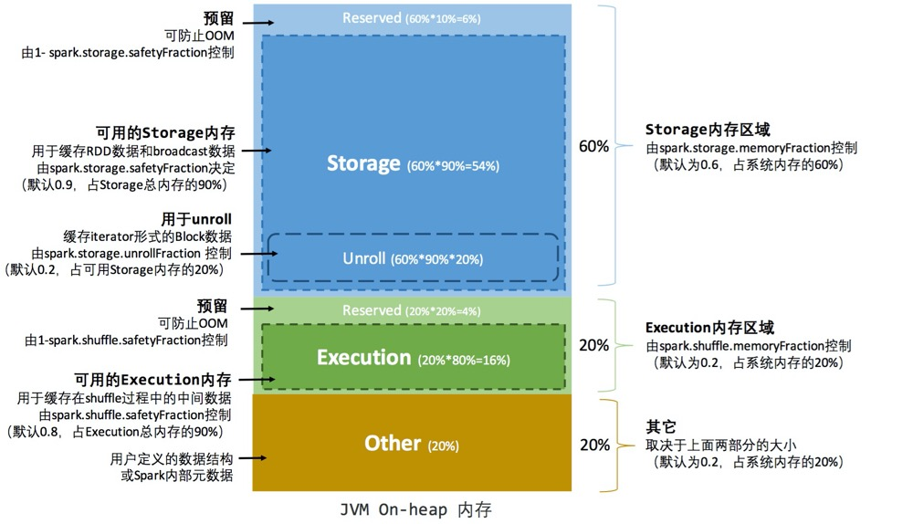
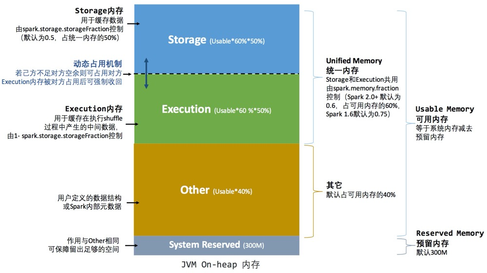
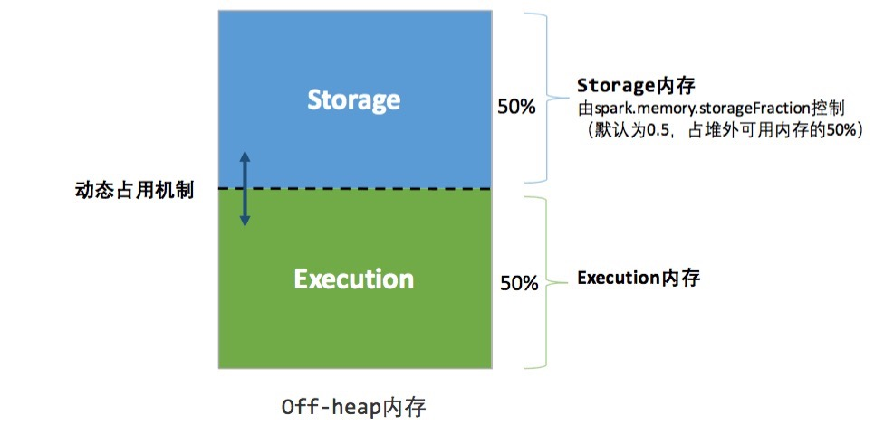
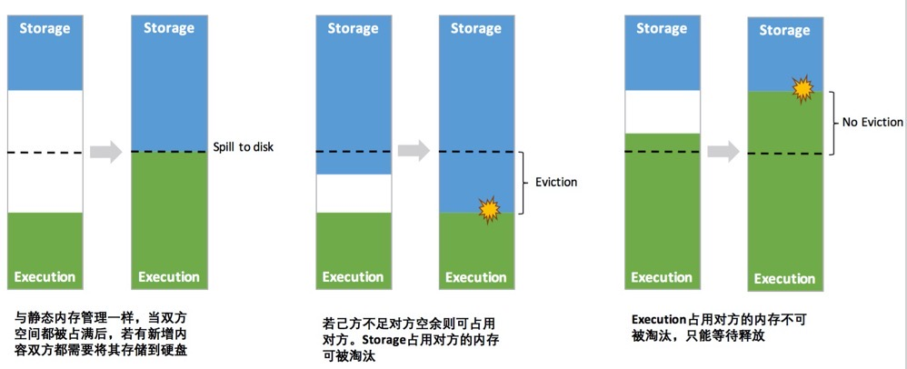
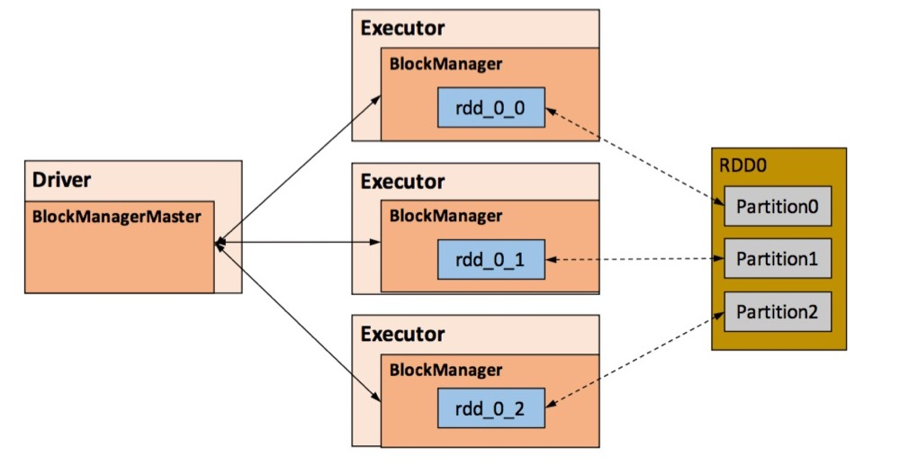
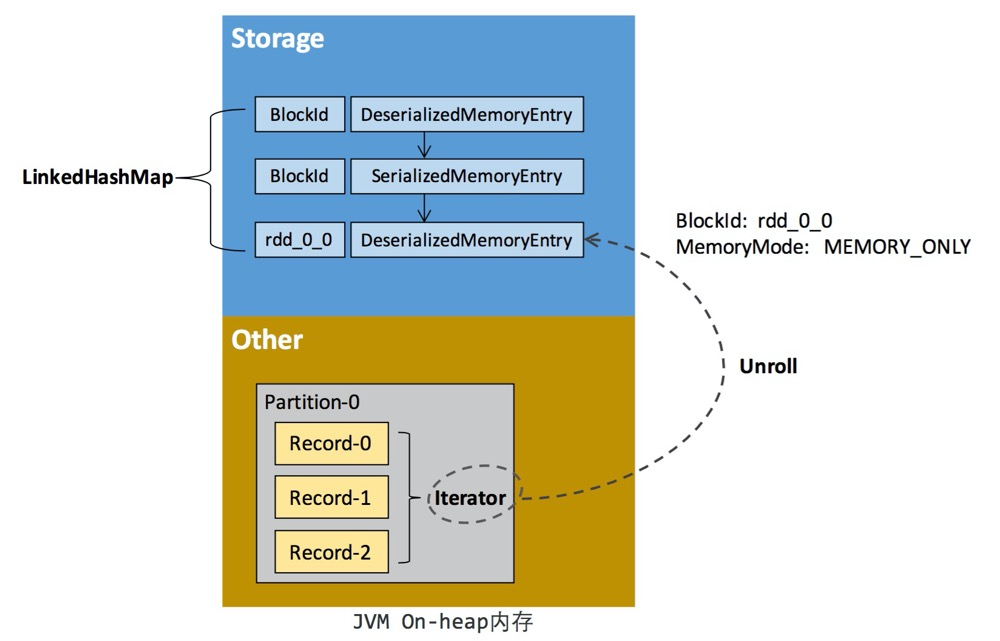

[Spark内存管理详解](https://www.ibm.com/developerworks/cn/analytics/library/ba-cn-apache-spark-memory-management/index.html)

# Driver和Executor

* Driver为主控进程，负责创建Spark上下文，提交Spark作业(Job)，并将作业转化为计算任务(Task)，在各个Executor进程间协调任务的调度。
* Executor负责计算逻辑，上报自身状态给ApplicationMaster，计算结果返回给Driver，为持久化RDD提供功能。

# 堆内和堆外内存规划

* 作为JVM进程，**Executor的内存管理建立在JVM的内存管理上，Spark堆JVM的堆内(On-heap)空间进行了更为详细的分配，以充分利用内存。** Spark也引入了堆外(Off-heap)内存，使之可以直接在工作节点的系统内存中开辟空间，进一步优化了内存的使用。

* **堆内内存受到JVM统一管理，堆外内存是直接向操作系统进行内存的申请和释放。**


## 堆内内存 

* 堆内内存大小，由Spark应用程序启动时通过指定**--executor-memory**或**spark.executor.memory**参数配置。Executor内运行的并发任务共享JVM堆内内存，**这些任务在缓存RDD数据和广播(Broadcast)数据时占用的内存被规划为存储(Storage)内存**，**这些任务在执行Shuffle时占用的内存被规划为执行(Execution)内存，剩余部分不做特殊规划，那些Spark内部的对象实例，或者用户定义的Spark应用程序中的对象实例，均占用剩余空间。**不同的内存管理方式，三个部分占用的内存空间是不同的。

### 规划式管理

* Spark会在申请后和释放前记录这些内存

### 申请内存流程

1. Spark在代码new一个对象实例
2. 对象实例会去堆内存申请空间，并且创建对象，然后将引用返回到栈上。
3. Spark保存该对象的引用，记录该对象占用的内存。

### 释放内存

1. Spark记录该对象释放的内存，删除对象引用。
2. 此时会等待JVM的GC回收该对象在堆上占用的内存。

### OOM存在的原因

>   JVM 的对象可以以序列化的方式存储，序列化的过程是将对象转换为二进制字节流，本质上可以理解为将非连续空间的链式存储转化为连续空间或块存储，在访问时则需要进行序列化的逆过程——反序列化，将字节流转化为对象，序列化的方式可以节省存储空间，但增加了存储和读取时候的计算开销。
>    Spark 中序列化的对象，由于是字节流的形式，其占用的内存大小可直接计算，而对于非序列化的对象，其占用的内存是通过周期性地采样近似估算而得，即并不是每次新增的数据项都会计算一次占用的内存大小，这种方法降低了时间开销但是有可能误差较大，导致某一时刻的实际内存有可能远远超出预期。此外，在被 Spark 标记为释放的对象实例，很有可能在实际上并没有被 JVM 回收，导致实际可用的内存小于 Spark 记录的可用内存。所以 Spark 并不能准确记录实际可用的堆内内存，从而也就无法完全避免内存溢出（OOM, Out of Memory）的异常。
>
>   虽然不能精准控制堆内内存的申请和释放，但 Spark 通过对存储内存和执行内存各自独立的规划管理，可以决定是否要在存储内存里缓存新的 RDD，以及是否为新的任务分配执行内存，在一定程度上可以提升内存的利用率，减少异常的出现。

## 堆外内存

* 为了进一步优化shuffle时排序的效率，引入堆外内存可以直接在工作节点的系统内存中开辟空间，存储经过序列化的二进制数据。将内存对象分配在Jvm的堆以外的内存，这些内存直接受操作系统管理，从而减少JVM GC堆应用的影响。
* 默认情况下不启用堆外内存不启用，通过配置**spark.memory.offHeap.enabled**参数启用，由**spark.memory.offHeap.size**参数设定堆外空间的大小。除了没有other空间，堆外内存与堆内内存划分方式相同，所有运行中的并发任务共享存储。

## 内存管理接口

```scala
/**
 *  一个抽象内存管理器，用于强制执行和存储之间共享内存。
  *  execution memory用于shuffle，join，sort和aggregations的完成。
  *  storage memory用于缓存和广播内部的数据在集群中传递
  * 每个JVM都存在一个MemoryManager
 */
private[spark] abstract class MemoryManager(
    conf: SparkConf, //Spark配置
    numCores: Int, // 具体核数
    onHeapStorageMemory: Long,  //堆内Storage memory
    onHeapExecutionMemory: Long) //堆内 execution memory
```

### 主要方法

```scala
//申请存储内存
def acquireStorageMemory(blockId: BlockId, numBytes: Long, memoryMode: MemoryMode): Boolean
//申请展开内存
def acquireUnrollMemory(blockId: BlockId, numBytes: Long, memoryMode: MemoryMode): Boolean
//申请执行内存
def acquireExecutionMemory(numBytes: Long, taskAttemptId: Long, memoryMode: MemoryMode): Long
//释放存储内存
def releaseStorageMemory(numBytes: Long, memoryMode: MemoryMode): Unit
//释放执行内存
def releaseExecutionMemory(numBytes: Long, taskAttemptId: Long, memoryMode: MemoryMode): Unit
//释放展开内存
def releaseUnrollMemory(numBytes: Long, memoryMode: MemoryMode): Unit
```

* 这里的MemoryMode就是使用cache需要指定的内存模式，根据这个参数决定是堆内操作还是堆外操作。

# 内存空间分配

## 静态内存管理

* 早期采用的方式，**存储内存、执行内存和其他内存的大小是固定的，用户可以指定相关配置**



```text
可用的存储内存 = systemMaxMemory * spark.storage.memoryFraction * spark.storage.safetyFraction
可用的执行内存 = systemMaxMemory * spark.shuffle.memoryFraction * spark.shuffle.safetyFraction

其中 systemMaxMemory 取决于当前 JVM 堆内内存的大小，最后可用的执行内存或者存储内存要在此基础上与各自的 memoryFraction 参数和 safetyFraction 参数相乘得出。上述计算公式中的两个 safetyFraction 参数，其意义在于在逻辑上预留出 1-safetyFraction 这么一块保险区域，降低因实际内存超出当前预设范围而导致 OOM 的风险（对于非序列化对象的内存采样估算会产生误差）。值得注意的是，这个预留的保险区域仅仅是一种逻辑上的规划，在具体使用时 Spark 并没有区别对待，和"其它内存"一样交给了 JVM 去管理。
```

## 堆外内存管理

* 堆外的空间分配较为简单，只有存储内存和执行内存。用的执行内存和存储内存占用的空间大小直接由参数 **spark.memory.storageFraction** 决定，由于堆外内存占用的空间可以被精确计算，所以无需再设定保险区域。


* 静态内存管理机制实现起来较为简单，但如果用户不熟悉 Spark 的存储机制，或没有根据具体的数据规模和计算任务或做相应的配置，很容易造成"一半海水，一半火焰"的局面，即存储内存和执行内存中的一方剩余大量的空间，而另一方却早早被占满，不得不淘汰或移出旧的内容以存储新的内容。由于新的内存管理机制的出现，这种方式目前已经很少有开发者使用，出于兼容旧版本的应用程序的目的，Spark 仍然保留了它的实现。

## 统一内存管理



### 统一内存堆外管理



### 动态内存管理

其中最重要的优化在于**动态占用机制**，其规则如下：

- 设定基本的存储内存和执行内存区域（**spark.storage.storageFraction** 参数），该设定确定了双方各自拥有的空间的范围
- 双方的空间都不足时，则存储到硬盘；若己方空间不足而对方空余时，可借用对方的空间;（存储空间不足是指不足以放下一个完整的 Block）
- 执行内存的空间被对方占用后，可让对方将占用的部分转存到硬盘，然后"归还"借用的空间
- 存储内存的空间被对方占用后，无法让对方"归还"，因为需要考虑 Shuffle 过程中的很多因素，实现起来较为复杂



# Storage内存管理

## RDD的持久化机制

* RDD是Spark最基本的数据抽象，是只读的分区记录(Partition)集合，**只能基于在稳定存储中的数据集上创建，或者其他RDD上转换产生新的RDD。**转换后的RDD和旧的RDD存在依赖关系，构成了"血统(Lineage)"。凭借血统，Spark 保证了每一个 RDD 都可以被重新恢复。但 RDD 的**所有转换都是惰性的，即只有当一个返回结果给 Driver 的行动（Action）发生时，Spark 才会创建任务读取 RDD，然后真正触发转换的执行**。
* Task 在启动之初读取一个分区时，会先判断这个分区是否已经被持久化，如果没有则需要检查 Checkpoint 或按照血统重新计算。所以如果一个 RDD 上要执行多次行动，可以在第一次行动中使用 persist 或 cache 方法，在内存或磁盘中持久化或缓存这个 RDD，从而在后面的行动时提升计算速度。事实上，cache 方法是使用默认的 MEMORY_ONLY 的存储级别将 RDD 持久化到内存，故缓存是一种特殊的持久化。 **堆内和堆外存储内存的设计，便可以对缓存** **RDD** **时使用的内存做统一的规划和管理** 
* RDD 的持久化由 **Spark 的 Storage 模块** [7] 负责，实现了 **RDD 与物理存储的解耦合**。Storage 模块**负责管理 Spark 在计算过程中产生的数据，将那些在内存或磁盘、在本地或远程存取数据的功能封装了起来**。在具体实现时 **Driver 端和 Executor 端的 Storage 模块构成了主从式的架构**，即 **Driver 端的 BlockManager 为 Master，Executor 端的 BlockManager 为 Slave**。Storage 模块在逻辑上以 **Block 为基本存储单位，RDD 的每个 Partition 经过处理后唯一对应一个 Block**（BlockId 的格式为 rdd_RDD-ID_PARTITION-ID ）。**Master 负责整个 Spark 应用程序的 Block 的元数据信息的管理和维护，而 Slave 需要将 Block 的更新等状态上报到 Master，同时接收 Master 的命令，例如新增或删除一个 RDD**。



### 存储级别

```scala
 case "NONE" => NONE
    case "DISK_ONLY" => DISK_ONLY
    case "DISK_ONLY_2" => DISK_ONLY_2
    case "MEMORY_ONLY" => MEMORY_ONLY
    case "MEMORY_ONLY_2" => MEMORY_ONLY_2
    case "MEMORY_ONLY_SER" => MEMORY_ONLY_SER
    case "MEMORY_ONLY_SER_2" => MEMORY_ONLY_SER_2
    case "MEMORY_AND_DISK" => MEMORY_AND_DISK
    case "MEMORY_AND_DISK_2" => MEMORY_AND_DISK_2
    case "MEMORY_AND_DISK_SER" => MEMORY_AND_DISK_SER
    case "MEMORY_AND_DISK_SER_2" => MEMORY_AND_DISK_SER_2
    case "OFF_HEAP" => OFF_HEAP
```

* 存储级别从disk、memory、offheap三个维度定义了RDD的Partition(Block)的存储方式：
  * 存储位置:磁盘/堆内内存/堆外内存。
  * 存储形式：Block 缓存到存储内存后，是否为非序列化的形式。如 MEMORY_ONLY 是非序列化方式存储，OFF_HEAP 是序列化方式存储。
  * 副本数量：大于 1 时需要远程冗余备份到其他节点。如 DISK_ONLY_2 需要远程备份 1 个副本。

## RDD缓存的过程

* RDD **在缓存到存储内存之前**，**Partition 中的数据一般以迭代器（[Iterator](http://www.scala-lang.org/docu/files/collections-api/collections_43.html)）的数据结构来访问**，这是 Scala 语言中一种遍历数据集合的方法。通过 Iterator 可以**获取分区中每一条序列化或者非序列化的数据项(Record)**，这些 Record 的对象实例在逻辑上占用了 **JVM 堆内内存的 other 部分的空间**，**同一 Partition 的不同 Record 的空间并不连续。**
* 读取Other区Iterator的Record后，**Partition 被转换成 Block，Record 在堆内或堆外存储内存中占用一块连续的空间。**将**Partition由不连续的存储空间转换为连续存储空间的过程，Spark称之为"展开"（Unroll）**。**Block 有序列化和非序列化**两种存储格式，具体以哪种方式取决于**该 RDD 的存储级别**。非**序列化的 Block 以一种 DeserializedMemoryEntry 的数据结构定义，用一个数组存储所有的对象实例，序列化的 Block 则以 SerializedMemoryEntry的数据结构定义，用字节缓冲区（ByteBuffer）来存储二进制数据**。每个 Executor 的 **Storage 模块用一个链式 Map 结构（LinkedHashMap）来管理堆内和堆外存储内存中所有的 Block 对象的实例**，对这个 LinkedHashMap 新增和删除间接记录了内存的申请和释放，同时也是为了LinkedHashMap自带的LRU特性。
* 因为**不能保证存储空间可以一次容纳 Iterator 中的所有数据，当前的计算任务在 Unroll 时要向 MemoryManager 申请足够的 Unroll 空间来临时占位，空间不足则 Unroll 失败，空间足够时可以继续进行。**对于**序列化的 Partition，其所需的 Unroll 空间可以直接累加计算，一次申请。**而**非序列化的 Partition 则要在遍历 Record 的过程中依次申请，即每读取一条 Record，采样估算其所需的 Unroll 空间并进行申请，空间不足时可以中断，释放已占用的 Unroll 空间。**如果最终 Unroll 成功，**当前 Partition 所占用的 Unroll 空间被转换为正常的缓存 RDD 的存储空间。**

**Spark Unroll**



## 淘汰和落盘

* 由于同一个 Executor 的所有的计算任务共享有限的存储内存空间，当有新的 Block 需要缓存但是剩余空间不足且无法动态占用时，**就要对 LinkedHashMap 中的旧 Block 进行淘汰（Eviction  LRU特性）**，而被淘汰的 Block 如果其存储级别中同时包含存储到磁盘的要求，则要对其进行落盘（Drop），否则直接删除该 Block。

**存储内存的淘汰规则为：**

- 被淘汰的旧 Block 要与新 Block 的 MemoryMode 相同，即同属于堆外或堆内内存
- 新旧 Block 不能属于同一个 RDD，避免循环淘汰
- 旧 Block 所属 RDD 不能处于被读状态，避免引发一致性问题
- 遍历 LinkedHashMap 中 Block，按照最近最少使用（LRU）的顺序淘汰，直到满足新 Block 所需的空间。其中 LRU 是 LinkedHashMap 的特性。

落盘的流程则比较简单，如果其存储级别符合**_useDisk** 为 true 的条件，再根据其**_deserialized** 判断是否是非序列化的形式，若是则对其进行序列化，最后将数据存储到磁盘，在 Storage 模块中更新其信息。

# Execution内存管理

## 多任务间内存分配

Executor 内运行的任务同样**共享执行内存**，Spark 用一个 HashMap 结构保存了任务到内存耗费的映射。**每个任务可占用的执行内存大小的范围为 1/2N ~ 1/N，其中 N 为当前 Executor 内正在运行的任务的个数。每个任务在启动之时，要向 MemoryManager 请求申请最少为 1/2N 的执行内存，如果不能被满足要求则该任务被阻塞，直到有其他任务释放了足够的执行内存，该任务才可以被唤醒。**

## Shuffle的内存占用

执行内存主要用来`存储任务在执行 Shuffle 时占用的内存`，Shuffle 是`按照一定规则对 RDD 数据重新分区的过程`，主要来看 Shuffle 的`Write 和 Read`两阶段对执行内存的使用：

### Shuffle Write

1. 若在map端选择`普通的排序方式`，会采用`ExternalSorter进行外排`，在内存中存储数据时主要占用`堆内`执行空间。
2. 若在map端选择 `Tungsten的排序方式`，则采用`ShuffleExternalSorter`直接对`以序列化形式存储的数据排序`，在内存中存储数据时可以占用`堆外或堆内`执行空间，取决于用户`是否开启了堆外内存以及堆外执行内存是否足够`。

### Shuffle Read

1. 在对reduce端的数据进行`聚合`时，要将数据交给`Aggregator`处理，在内存中存储数据时占用`堆内`执行空间。
2. 如果需要进行`最终结果排序`，则要将再次将数据交给`ExternalSorter处理，占用堆内执行空间`。

> 在`ExternalSorter和Aggregator`中，Spark 会使用一种叫 **AppendOnlyMap** 的`哈希表在堆内执行内存中存储数据`，但在 Shuffle 过程中所有数据并不能都保存到该哈希表中，**当这个哈希表占用的内存会进行周期性地采样估算，当其大到一定程度，无法再从 MemoryManager 申请到新的执行内存时，Spark 就会将其全部内容存储到磁盘文件中，这个过程被称为溢存(Spill)，溢存到磁盘的文件最后会被归并(Merge)。**
>
> Shuffle Write 阶段中用到的 `Tungsten` 是 Databricks 公司提出的对 Spark 优化内存和 CPU 使用的计划，解决了一些 JVM 在性能上的`限制和弊端`。Spark 会根据 `Shuffle 的情况来自动选择是否采用 Tungsten 排序`。
>
> **Tungsten排序**
>
> Tungsten 采用的`页式内存管理机制`建立在 MemoryManager 之上，即 Tungsten 对执行内存的使用进行了一步的抽象，这样在 Shuffle 过程中无需关心数据具体存储在堆内还是堆外。每个`内存页用一个 MemoryBlock 来定义`，并用 `Object obj 和 long offset `这两个变量统一标识一个内存页在系统内存中的地址。堆内的 MemoryBlock 是以 long 型数组的形式分配的内存，其` obj 的值为是这个数组的对象引用，offset 是 long 型数组的在 JVM 中的初始偏移地址`，两者配合使用可以定位这个数组在`堆内的绝对地址`；堆外的 MemoryBlock 是直接申请到的`内存块`，其 obj 为 null，offset 是这个内存块在系统内存中的 `64 位绝对地址`。Spark 用 MemoryBlock 巧妙地将堆内和堆外内存页统一抽象封装，并用页表(pageTable)管理每个 Task 申请到的内存页。
>
> Tungsten 页式管理下的所有内存用 64 位的逻辑地址表示，由页号和页内偏移量组成：
>
> - 页号：占 13 位，唯一标识一个内存页，Spark 在申请内存页之前要先申请空闲页号。
> - 页内偏移量：占 51 位，是在使用内存页存储数据时，数据在页内的偏移地址。
>
> 有了统一的寻址方式，Spark 可以用 64 位逻辑地址的指针定位到`堆内或堆外的内存`，整个 Shuffle Write 排序的过程只需要对`指针进行排序`，并且无需反序列化，整个过程非常高效，对于内存访问效率和 CPU 使用效率带来了明显的提升.
>
> Spark 的存储内存和执行内存有着截然不同的管理方式：对于存储内存来说，Spark 用一个 LinkedHashMap 来集中管理所有的 Block，Block 由需要缓存的 RDD 的 Partition 转化而成；而对于执行内存，Spark 用 AppendOnlyMap 来存储 Shuffle 过程中的数据，在 Tungsten 排序中甚至抽象成为页式内存管理，开辟了全新的 JVM 内存管理机制。


