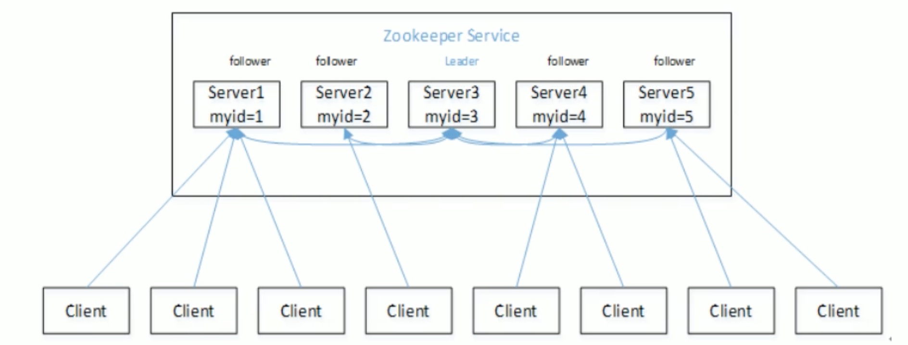
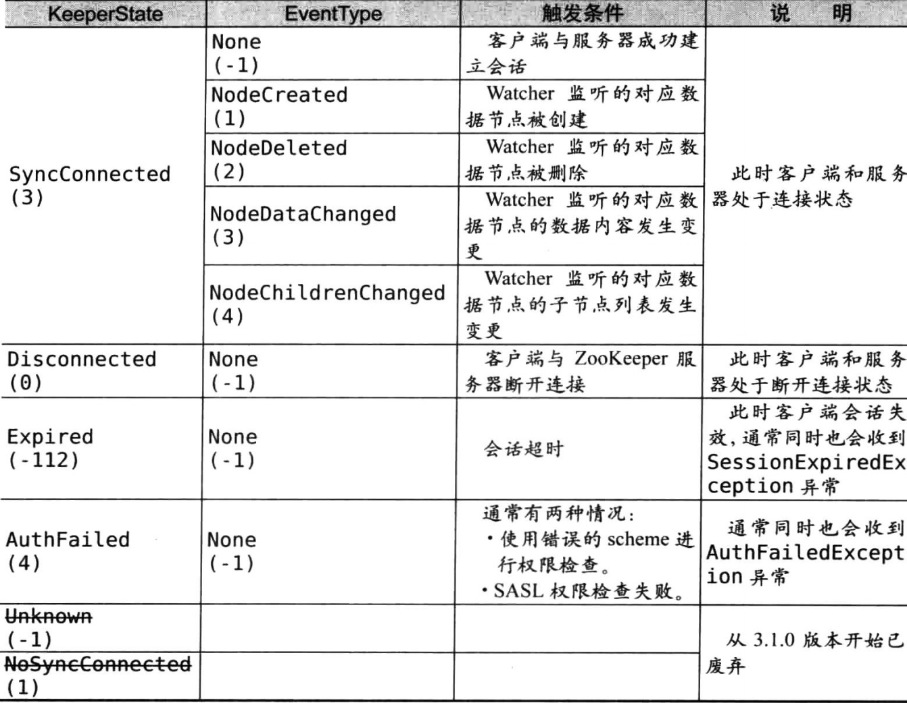
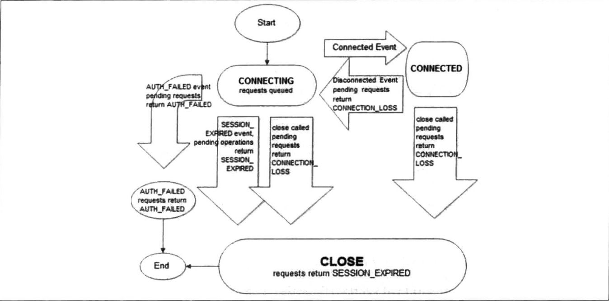
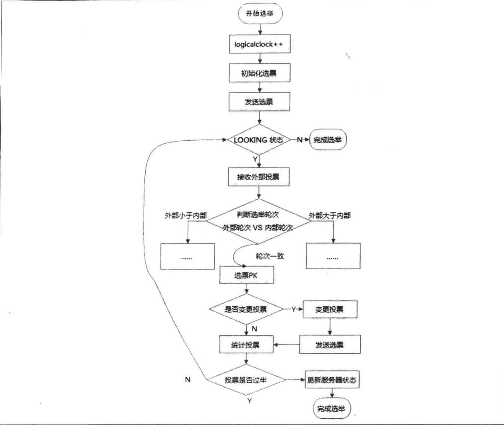

# TZookeeper入门

## Zookeeper基本概念

### 集群角色

* Zookeeper使用Leader、Follower、Observer三种橘色，所有机器通过Leader选举过程来选定一台称为"Leader"的机器，Leader服务提供读和写服务。
* Follower和Observer都可以提供读服务，但是Observer不参与选举过程，也不参与写操作的"过半写成功"策略。

### 会话(Session)

* Zookeeper中一个客户端连接是指客户端和服务器之间的一个TCP长连接。Session的sessionTimeout时来设置客户端会话的超时时间，如果客户端由于网络原因断开链接在sessionTimeout时间内重新链接之前创建的会话仍然有效。

### 数据节点(ZNode)

* Zookeeper将所有数据存在内存中，数据模型是一棵树(Znode tree)，由"/"进行分割的路径就是一个Znode，每个Znode可以保存自己的数据内容，同时和一些列属性信息。
* Znode分为持久节点和临时节点，并且俩个类型的节点还有个属性,"SEQUENTIAL"标示是否为顺序节点。

### 版本

* Znode会维护一个Stat的数据结构，其记录了Znode的是那个数据版本分别为:version(当前ZNode的版本)、cversion(当前Znode子节点的版本)、aversion(当前Znode的ACL版本)

### Watcher

* Zookeeper运行用户在指定节点上注册一些Watcher，并且在一些特定事件触发的时候，Zookeeper服务端会将事件通知到感兴趣的客户端上去。

### ACL

* Zookeeker采用ACL策略进行权限控制，类似于UNIX文件系统的权限控制
  * CREATE:创建子节点的权限
  * READ:获取节点数据和子节点列表的权限
  * WRITE:更新节点数据的权限
  * DELETE:删除子节点的权限
  * ADMIN:设置节点ACL的权限

## Zookeeper工作机制


## Zookeeper特点

* 一致性：数据一致性，数据按照顺序分批入库。
* 原子性： 事务要么成功要么失败，不会局部化（不会有部分状态不一致）。
* 单一视图： 客户端连接集群中的任意zk节点，数据都是一致的。
* 可靠性：每次对zk的操作状态都会保存在服务端。
* 实时性：客户端可以读取到zk服务端的最新数据。
* Zookeeper:一个Leader多个Follower以及ObServer。
* 集群中只要有半数以上节点存活Zookeeper集群就可以正常服务，多副本概念。
* 全局数据一致，基于ZAB原子广播协议，每个Server保存一份相同的数据副本，Client连接到那个Server，数据一致。
* 更新请求顺序执行，来自同一个client的更新请求按其发送顺序依次执行。

### 数据结构

* 按照树形结构存储数据，与Unix文件系统类似，每个节点称为一个Znode，每个Znode默认能够存储1MB的数据，每个ZNode都可以`通过其路径唯一标识`，也可以有子节点。
* 每个节点分为临时节点和永久节点，临时节点在客户端断开后消失
* 每一个zk节点都有各自的版本号，可以通过命令行来显示节点信息每当节点数据发生变化，那么该节点的版本号会累加（乐观锁）
* 删除/修改过时节点，版本号不匹配则会报错
* 每个zk节点存储的数据不宜过大，几k即可
* 节点可以设置权限acl，可以通过权限来限制用户的访问

### Znode数据结构

#### Stat结构体

 **状态信息、版本、权限相关**

| 状态属性       | 说明                                                         |
| -------------- | :----------------------------------------------------------- |
| czxit          | 节点创建时的 zxid                                            |
| mzxid          | 节点最新一次更新发生时的 zxid                                |
| ctime          | 节点创建时的时间戳.                                          |
| mtime          | 节点最新一次更新发生时的时间戳.                              |
| dataVersion    | 节点数据的更新次数.                                          |
| cversion       | 其子节点的更新次数                                           |
| aclVersion     | 节点 ACL(授权信息)的更新次数.                                |
| ephemeralOwner | 如果该节点为 ephemeral 节点, ephemeralOwner 值表示与该节点绑定的 session id. 如果该节点不是ephemeral节点, ephemeralOwner 值为 0. 至于什么是 ephemeral节点 |
| **dataLength** | 节点数据的字节数. |
| **numChildren** | 子节点个数 |

## Zookeeper参数解读

### tickTime

* 默认为200，通信心跳数，ZK服务器与客户端心跳时间，单位毫秒。ZK使用的基本时间，`服务器之间或客户端与服务器之间维持心跳的时间间隔`,每个tickTime时间就会发送一个心跳。
* 用于心跳机制，并设置最小的session超时时间为两倍心跳时间。(session的最小超时时间是2 * tickTime)

### initLimit

* 默认为10，LF初始通信时间，集群中的follower跟随者与Leader领导者服务器之间`初始化连接时`能容忍的最多心跳数(tickTime数量)，用它来限定集群中的Zookeeper服务器连接到Leader的时限，默认为(initLimit*tickTime=10 * 2s=20s)

### syncLimit

* 默认为5，LF同步通信时间，`集群中Leader与Follower之间的最大响应时间单位`,假如响应超过了syncLimit * tickTime，Leader认为Follower死掉，从服务器列表中删除Follower。

### dataDir

* 主要用于保存Zookeeper中的数据。

### clientPort

* 监听客户端连接的端口。

# Zookeeper内部原理

## 选举机制

* `半数机制:集群中半数以上集群存货，集群可用。所有Zookeeper适合安装奇数台服务器`。
* Zookeeper虽然在配置文件中没有指定`Master和Slave`。但是Zookeeper工作时是有一个节点为Leader，其他则为Follower，Leader是通过内部的选举机制临时产生的。



* 服务器1启动，此时只有它一台服务器启动了，它发出去的报文没有任何响应，所以它的选举状态一直是LOOKING状态。
* 服务器2启动，它与最开始启动的服务器1进行通信，互相交换自己的选举结果，由于两者都没有历史数据，所以id值较大的服务器2胜出，`但是由于没有达到超过半数以上的因此还需要等待其他服务器`。
* 服务器3启动后，服务器1、2都将票投给myid最大的服务器索引服务器3成为Leader，后续来的服务器都是Follower节点。

## 节点类型

* 临时节点(Ephemeral):客户端和服务端断开连接后，创建的节点自己删除。
  * 临时顺序编号节点，ZNode也是按顺序增加，只不过断开连接后节点会被删除。
* 持久节点(Persistent):客户端和服务器端断开连接后，创建的节点不删除。
  * 持久化顺序节点，创建的ZNode会有一个顺序标识，znode名称会附加一个值，是一个单调递增的计数器，由父节点维护。

## 监听器原理

### 原理详解

* 首先由一个main线程
* main线程中创建Zookeeper客户端，这时会创建两个线程，一个负责网络连接通信(connect)一个负责监听(listener)
* 通过connect线程将主持的监听事件发送给Zookeeper
* 在Zookeeper的注册监听器列表中将注册的监听事件添加到列表中
* Zookeeper监听到有数据或路径变化，就会将这个消息发送给listener线程
* listener线程内部调用process方法


## 写数据流程


# Zookeeper技术内幕

## 节点特性

### 节点类型

#### 持久节点(PERSISTENT)

* 一直存在在Zookeeper服务器上，直到有删除操作来主动清除这个节点。

#### 临时节点(EPHEMERAL)

* 生命周期与客户端的会话绑定在一起，如果客户端会话失败，这个临时节点会被自动清除。

#### 顺序节点(SEQUENTIAL)

* 每个父节点都会为它的第一级子节点维护一份顺序，用于记录下每个子节点创建的先后顺序，基于这个顺序特性，在创建子节点的时候，可以设置这个标记，创建这个节点的过程中，Zookeeper会自动为给定节点名加上一个数字后缀，作为一个新的、完整的节点名。
* 数字后缀的上限是整型的最大值。

### 状态信息

* 状态Stat包含的如下属性
  * czxid:即Created ZXID，表示该数据节点被创建时的事务ID
  * mzxid:即Modified ZXID，表示该节点最后一次被更新时的事务ID
  * ctime:即Created Time，表示节点被创建的时间
  * mtime:即Modified Time，表示该节点最后一次被更新的时间
  * version:即数据节点的版本号。
  * cversion:子节点的版本号
  * aversion:节点的ACL版本号
  * ephemeralOwner:创建该临时节点的会话的SessionId，如果该节点时持久节点，这个属性为0
  * dataLength:数据内容的长度
  * numChildren:当前节点的子节点的个数
  * pzxid:表示该节点的子节点列表最后一次被修改时的事务ID。只有子节点列表变更了才会变更pzxid，子节点内容变更不会影响pzxid

## Version

* Zookeeper在修改操作基于"CAS"乐观锁解决并发问题。

## Watcher数据变更的通知

* Zookeeper提供的一种分布式数据的发布/订阅功能，Zookeeper客户端会向服务端注册一个Watcher监听，当服务端的一些指定事件触发了这个Watcher，就会向指定客户端发送一个事件通知来实现分布式的通知功能。


* Zookeeper的Watcher机制主要包含客户端线程、客户端WatchManager和Zookeeper服务器。当Zookeeper服务器端触发Watcher事件后，会向客户端发送通知，客户端现场从WatchManager中取出对应的Watcher对象来执行回调逻辑。

### Watcher通知状态与数据类型



### 工作机制

* 总的分为三个过程:客户端注册Watcher、服务端处理Watcher和客户端回调Watcher。

### 特性

* 一次性
  * 无论服务端还是客户端，一旦一个Watcher被触发，Zookeeper都会将其从相应的存储中移除。
* 客户端串行执行
  * 客户端Watcher回调的过程是一个串行同步的过程，为了保证顺序。
* 轻量
  * WatchedEvent是Zookeeper整个watcher通知机制的最小通知单元，该数据包含通知状态、事件类型和节点路径。客户端向服务端注册Watcher时，并不是把Watcher对象传递到服务器，而是在客户端请求中使用boolean类型属性进行标记，同时服务端仅仅保存了当前连接的ServerCnxn对象。

# Zookeeper会话

## 会话状态

* 包含CONNECTING、CONNECTED、RECONNECTING、RECONNECTED、CLOSE等状态。
* 一旦客户端创建Zookeeper对象，客户端状态就变成CONNECTING，同时客户端开始从上述服务器列表中逐个选取IP地址尝试进行网络链接，直到成功链接服务器，然后客户端状态变更为CONNECTED。
* 伴随着网络断开或其他原因，客户端与服务器之间的连接会出现断开的情况，这时候Zookeeper客户端会自动重连，客户端的状态回变更为CONNECTING，直到连接上服务器状态再变为CONNECTED。



## 会话创建

### Session

* Zookeeper的一个会话实体，主要包含以下4个基本属性
  * sessionID:会话ID，用来唯一标识一个会话，每次客户端创建新会话的时候，Zookeeper会为其分配一个全局唯一的sessionID。
  * TimeOut:会话超时时间，客户端在构造Zookeeper实例时可以指定sessionTimeout参数来指定会话的超时时间，客户端会向服务端发送这个超时时间后，服务器会根据自己的超时时间限制最终确定会话的超时时间。
  * TickTIme:下次会话超时时间点。
  * isClosing:标记一个会话是否已经被关闭。

## 会话管理

### 分桶策略

* SessionTracker主要负责会话管理，使用的方式时“分桶策略”来管理会话，将类似的会话放在同一区块中进行管理，以便于Zookeeper对会话进行不同区块的隔离处理以及同一区块的统一管理。


# Leader选举

## 服务器启动时期的Leader选举

1. 每个Server会发出一个投票

```
初始情况下对于Server1和Server2来说，都会将自己作为Leader服务器来进行投票，每次投票包含的基本的元素包括:所推举的服务器的myid和ZXID，我们以(myid、ZXID)的形式来表示。初始化阶段无论是Server1还是Sever2都投给自己，即Server1的投票为(1,0)，Server2的投票为(2,0),然后各自将这个投票发送给集群的其他所有机器。
```

2. 接收来自各个服务器的投票

```
每个服务器都会接收来自服其他服务器的投票，集群中的每个服务器在接收到投票后，首先会判断该投票的有效性，包括检测是否是本轮投票、是否来自LOOKING状态的服务器。
```

3. 处理投票

```
在接收到来自其他服务器的投票后，针对每一个投票，服务器都需要将别人的投票和自己的投票进行PK，如下

1.优先检查ZXID。ZXID比较大的服务器优先作为Leader
2.如果ZXID相同的话，那么就比较myid，myid比较大的作为Leader服务器
```

4. 统计投票

```
每次投票后，服务器都会统计所有投票，判断是否已经有过半的机器接收到相同的投票信息。对于Server1和Server2来说，都统计出集群中已经有俩台机器接收了(2,0)这个投票信息。
```

5. 改变服务器状态

```
一旦确定了Leader，每个服务器就会更新自己的状态；如果是Follower，那么就变更为FOLLOWING，如果是Leader，那么就变更为LEADERING。
```

## 服务器运行期间的Leader选举

* 在Zookeeper集群正常运行过程中，一旦选出一个Leader，那么所有服务器的集群角色一般不会再发生变化，Leader服务器将一直作为集群的Leader，即使集群中有非Leader集群挂了或是有新机器加入集群也不会影响Leader。但是一旦Leader机器挂掉了，整个集群就无法对外提供服务，而是进行新一轮的Leader选举。

1. 变更状态

```jinja2
当Leader挂了后，余下的非Observer服务器都会将自己的服务器状态变更为LOOKING，然后开始进入Leader选举流程。
```

2. 每个Server会发出一个投票

```
这个过程中，需要生成投票信息(myid,ZXID)。因为是运行期间，因此每个服务器上的ZXID可能不同，假定Server1的ZXID为123，而Server3的ZXID为122，在第一轮投票中，Server1和Server2都会投自己，即分别产生投票(1,123)和(3,122)，然后各自将这个投票发给集群中所有机器。
```

3. 接收来自各个服务器的投票
4. 处理投票

```
对于投票的处理，因为Server1的ZXID的123，所以Server1会成为新的Leader

1.优先检查ZXID。ZXID比较大的服务器优先作为Leader
2.如果ZXID相同的话，那么就比较myid，myid比较大的作为Leader服务器
```

5. 统计投票
6. 改变服务器状态

## Leader选举的算法分析

* Zookeeper提供三种Leader选举算法，分别为LeaderElection、UDP版本的FastLeaderElection和TCP版本的FastLeaderElection，可以通过配置文件zoo.cfg中用electionAlg属性来指定，分别使用数字0～3表示。0代表LeaderElection，1代表UDP版本的FastLeaderElection的非授权模式，2代表UDP版本的FastLeaderElection授权模式，3代表TCP版本的FastLeaderElection。从3.4.0后ZK废弃了0，1，2这三种算法。

### 术语解释

#### SID:服务器ID

* SID是一个数字，用来唯一标识一台Zookeeper集群中的机器，每台机器不能重复，和myid的值一致。

#### ZXID:事务ID

* ZXID是一个事务ID，用来唯一表示一次服务器状态的变更，在某一个时刻，集群中每台机器的ZXID值不一定全部一致，这和Zookeeper服务器对于客户端“更新请求”的处理逻辑有关。

#### Vote：投票

* Leader选举必须通过投票来实现，当集群中的机器发现自己无法检测到Leader机器的时候，就会开始尝试进行投票。

#### Quorum:过半数机器数

* 是Zookeeper集群中过半的机器数，如果集群中总的机器数是n的话，可以通过:`quorum=(n/2+1)`来计算

### 变更投票

* 集群中的每台机器发出自己的投票后，也会接收到来自集群中其他机器的投票。每台机器都会根据一定的规则，来处理收到的其他机器的投票，并一次来决定是否需要变更自己的投票。
* vote_sid:接收到的投票所推举Leader服务器的SID
* vote_zxid:接收到的投票所推举Leader服务器的ZXID
* self_sid:当前服务器自己的SID
* self_zxid:当前服务器自己的ZXID

#### 变更规则

1. 如果vote_sid大于self_zxid，就认可当前收到的投票，并再次将该投票发送出去
2. 如果vote_zxid小于self_zxid，不做变更
3. 如果vote_zxid等于self_zxid，比较sid，如果vote_sid大于self_sid，变更该投票，并在此发送出去
4. 如果vote_zxid等于self_zxid，比较sid，如果vote_sid小于self_sid，不做变更


## Leader选举的实现细节

### 服务器状态

* LOOKING:寻找Leader状态，当前服务器处于该状态时，它会认为集群中没有Leader，因此需要进入Leader选举流程。
* FOLLOWING:跟随者状态
* LEADING :领导者状态
* OBSERVING:观察者状态

### 投票数据结构

```java
public class Vote{
    private final int version;
    private final long id;
    private final long zxid;
    private final long electionEpoch;
    private final long peerEpoch;
    private final ServerState state;
}
```



# 服务器角色介绍

* 在Zookeeper集群中分别有Leader、Follower和Observer三种类型的服务器角色。

## Leader

* Leader服务器是整个Zookeeper集群工作机制中的核心，主要工作如下
  1. 事务请求的唯一调度和处理者，保证集群事务处理的顺序性
  2. 集群内部各服务器的调度者

### 请求处理链

* Zookeeper使用责任链模式来处理每一个客户端请求，每一个服务器启动的时候，都会进行请求处理链的初始化。


* PrepRequestProcessor是Leader服务器的请求预处理器，也是Leader服务器的第一个请求处理器，在Zk中，会将改变服务器状态的请求称为“事务请求”，该处理器就是识别当前请求是否事务请求，对于事务请求该处理器会做一系列预处理操作，如创建请求事务投、事务体、会话检查等
* ProposalRequestProcessor处理器是Leader服务器的事务投票处理器，也是Leader服务器事务处理流程的发起者，对于非事务请求，ProposalRequestProcessor会直接将请求流转到CommitProcessor处理器，对于事务请求，除了将请求交给CommitProcessor处理器外，还会根据请求类型创建对应的`Proposal`提议，并发送给所有的Follower服务器来发起一次集群内的事务投票。
* SyncRequestProcessor是事务日志记录处理器，该处理器主要用来将事务请求记录到事务日志文件中去，同时还会触发Zookeeper进行数据快照。
* AckRequestProcessor处理器是Leader特有的处理器，主要负责在SyncRequestProcess完成事务日志记录后，向Proposal的投票收集器发送ACK反馈，以通知投票收集器当前服务器已经完成了对该Proposal的事务日志记录。
* CommitProcessor是事务提交处理器，对于非事务请求，该处理器会直接将其交付给下一级处理器进行处理，对于事务请求，会等待集群内针对Proposal的投票直到该Proposal可被提交。
* ToBeCommitProcessor中有一个toBeApplied队列用来存储已经被CommitProcessor处理过的可被提交的Proposal，然后逐个将请求交付给FinalRequestProcessor进行处理，等其处理完毕在从toBeApplied队列中移除
* FinalRequestProcessor主要进行客户端请求返回之前的收尾工作，包括创建客户端请求的响应；针对事务请求，该处理器会负责将事务应用到内存数据库中。

### LearnrHandler

* 为了保持整个集群中的实时通信，同时为了确保可以控制所有的Follower/Observer服务器，Leader会为每一个Follower/Observer建立一个TCP长链接，同时会为每个Follower/Observer创建一个LearnerHandler实体，其是集群中Leader服务器的管理器，主要负责Follower/Observer和Leader服务器之间的网络通信，包括数据同步、请求转发和Proposal提议的投票等。

## Follower

* 处理客户端非事务请求，转发事务请求到Leader服务器
* 参与事务请求Proposal的投票
* 参与Leader选举投票


* FollowerRequestProcessor主要是识别当前请求是否为事务请求，如果是则转发到Leader服务器。
* SendAckRequestProcessor主要是在完成事务日志记录后，向Leader服务器发送ACK消息表明自身完成了事务日志的记录工作。和Leader的AckRequestProcessor的区别是，Leader上的处理器是Leader本地的完成的ACK是一个本地操作。

## Observer

* Observer是ZK3.3.0版本引入的一个全新的服务器角色，主要作用是观察ZK集群的最新状态并将这些同步过来，和Follower的原理基本相同，对于非事务请求转发到Leader，并且不参与任何形式的投票包括Leader选举和事务请求Proposal的投票。


