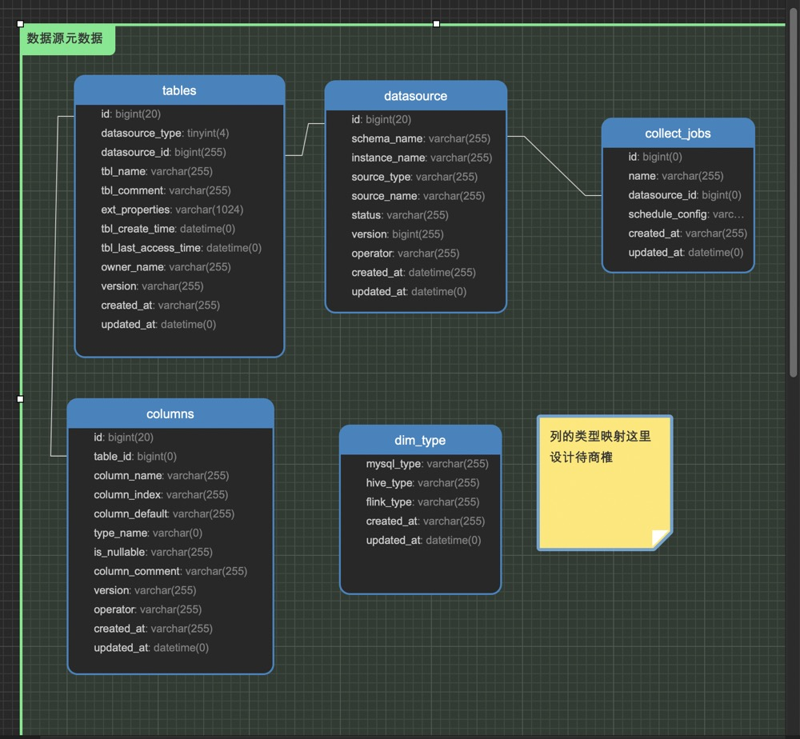

# thoth

## Description

* Thoth是古埃及神话智慧之神的含义，对于forchange来说thoth就是数据部门的大数据元数据管理平台的含义，它包含技术元数据(数据源元数据、ETL元数据、数据血缘关系等等)和业务元数据(业务边界、指标口径等等)。


## Table Design

### DataSource



## MetaData Collector

### DataSource Metadata Collector

* 数据源元数据采集器，采集Hive、Pg、Mysql等数据源元数据采集，提供定时和实时元数据采集。

#### Hive元数据采集

##### 定时数据采集任务

**Table信息采集**

* SQL

```sql
-- 采集单个schema下全部table元数据
SELECT
	tbls1.TBL_NAME tbl_name,
	tbls1.TBL_TYPE tbl_type,
	tbls1.CREATE_TIME tbl_create_time,
	tbls1.LAST_ACCESS_TIME tbl_last_access_time,
	tbls1.`OWNER` owner_name,
	sds1.NUM_BUCKETS num_buckets,
	sds1.LOCATION location,
	sds1.IS_COMPRESSED is_compressed,
	sds1.INPUT_FORMAT input_format,
	sds1.OUTPUT_FORMAT output_format,
	p.PKEY_NAME partition_field,
	p.PKEY_TYPE partition_type,
	p.PKEY_COMMENT partition_comment
FROM
	hivemeta.tbls tbls1
	JOIN hivemeta.dbs dbs1 ON tbls1.DB_ID = dbs1.DB_ID 
	AND dbs1.NAME = "for_ods"
	JOIN hivemeta.sds sds1 ON sds1.SD_ID = tbls1.SD_ID
	JOIN hivemeta.partition_keys p ON p.TBL_ID = tbls1.TBL_ID
	
--	采集单个schema的某个table的元数据
SELECT
	tbls1.TBL_NAME tbl_name,
	tbls1.TBL_TYPE tbl_type,
	tbls1.CREATE_TIME tbl_create_time,
	tbls1.LAST_ACCESS_TIME tbl_last_access_time,
	tbls1.`OWNER` owner_name,
	sds1.NUM_BUCKETS num_buckets,
	sds1.LOCATION location,
	sds1.IS_COMPRESSED is_compressed,
	sds1.INPUT_FORMAT input_format,
	sds1.OUTPUT_FORMAT output_format,
	p.PKEY_NAME partition_field,
	p.PKEY_TYPE partition_type,
	p.PKEY_COMMENT partition_comment
FROM
	hivemeta.tbls tbls1
	JOIN hivemeta.dbs dbs1 ON tbls1.DB_ID = dbs1.DB_ID 
	AND dbs1.NAME = "for_ods"
	AND tbls1.TBL_NAME="ods_aww_2005_external_group_chat_t"
	JOIN hivemeta.sds sds1 ON sds1.SD_ID = tbls1.SD_ID
	JOIN hivemeta.partition_keys p ON p.TBL_ID = tbls1.TBL_ID
```

* 处理逻辑
  * 根据DataSource的配置获取SchemaName，调用上述SQL拉取HiveTable相关元数据信息
  * 循环遍历hive table元数据信息构建Table对象，查询当前tableName在table表中`最大版本`对象，`如果最大版本不存在`，则直接将构建的Table对象插入table表。并且内存中维护instanceName+schemaName+tableName的Hash值和tableId的映射。
  * 如果存在最大版本，比较table表中的相关属性(tableName、扩展属性、OwnerName、lastAccessTime、creationTime)，如果该信息发生变化，则替换最大版本Table相关属性，并且将version+1，重新插入`instanceSchemaTableNameAndIdMap`内存映射。

**Column信息采集**

* SQL

```sql
SELECT
	tbls1.TBL_NAME tbl_name,
	cv2.INTEGER_IDX column_index,
	cv2.COMMENT column_comment,
	cv2.TYPE_NAME type_name,
	cv2.COLUMN_NAME column_name
FROM
	hivemeta.tbls tbls1
	JOIN hivemeta.dbs dbs1 ON tbls1.DB_ID = dbs1.DB_ID 
	AND dbs1.NAME = "for_ods"
	JOIN hivemeta.sds sds1 ON sds1.SD_ID = tbls1.SD_ID
	JOIN hivemeta.columns_v2 cv2 ON sds1.CD_ID = cv2.CD_ID
```

* 处理逻辑
  * 根据schemaName调用上述SQL获取其他全部的表名和列信息
  * 从`instanceSchemaTableNameAndIdMap`根据instance、schema、table的名称获取tableId(最大版本的)，如果tableId不存在则更新table表元数据。
  * 根据tableId和columnName获取已经存在的Column，如果不存在则直接将现有的column元数据插入columns表，并且刷新`tableIdAndColumnsMap`缓存。
  * 如果`tableIdAndColumnsMap`存在该Column，则比较内存中的column和新查询出来的column信息，如果不相同则新插入一条新的column记录，其版本号+1。

#### MySQL元数据采集

