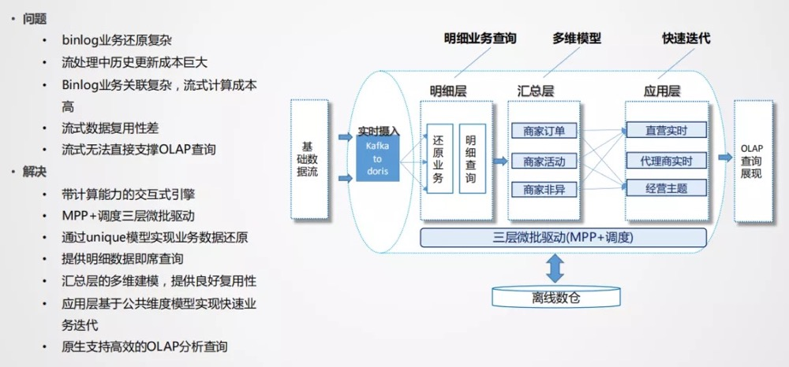

# 概述

## 建设目的

**解决由于传统数据仓库数据时效性低解决不了的问题**

* 面向主题的
* 集成的
* 相对稳定的
* 处理上一次批处理流程到当前的数据

## 实时数仓架构

### Lambda架构


### Kappa架构


### 实时OLAP架构



# 流式Join

## 纬表join

### 将纬度表加载到内存关联

#### 方案1

* 通过flink的RichFlatMapFunction的open方法，一次性将纬度表的数据全部加载到内存中，后续在每条流的消息去内存中关联。
* 优点是实现简单，但是仅支持小数据量纬度表，更新纬度表需要重启任务
* 适用于纬度表小、变更频率低、对变更及时性要求低。

#### 方案2

* 通过Distributed Cache分发本地纬度表文件到task manager后加载到内存关联
* 使用env.registerCachedFile注册文件
* 实现RichFuntion在oepn方法中通过RuntimeContext获取cache文件，解析和使用文件数据
* 适用于纬度表小、变更频率低、对变更及时性要求低。

#### 方案3

* 理论外部缓存来存储维度表，在将外部缓存维度表加载到内存中使用
* 纬度更新反馈到结果有延迟，一般是从外部缓存倒入内存的延迟问题

### 广播维度表

* 实现方式
  * 将维度表数据发送到kafka作为广播原始流S1
  * 定义状态描述符MapStateDescripitor。调用S1.broadcast，获取broadCastStream S2
  * 调用非广播流S3.connect(S2)，得到BroadcastConnectedStream S2
  * 在KeyedBroadcastProcessFunction/BroadcastProcessFunction实现关联处理逻辑，并作为参数调用S4.process()
* 优点:纬度变更可即时更新到结果
* 缺点:数据保存在内存中，支持维度表数据量较小
* 适用于实时感知维度变更，维度数据可以转换为实时流的场景

### Temporal Table

* 适用于changelog流，存储各个时态数据的变化


### 维度表join方案对比


## 双流Join

### Join-Regular join

```sql
# 双流join
SELECT * FROM Orders INNER JOIN Product ON Orders.productId=Product.id
```

* 仅支持有界流和等号连接

### join-Interval join

* 限定join的时间窗口，对超出时间范围的数据清理，避免保留全量State，支持processing time和event time

```sql
SELECT *
FROM Orders o,
	Shipments s
WHERE
	o.id=s.orderId
	AND s.shiptime BETWEEN o.ordertime
	AND o.ordertime + INTERVAL '4' HOUR
```

### join-Window join

* 将两个流中有相同key和处在相同window的元素做join


