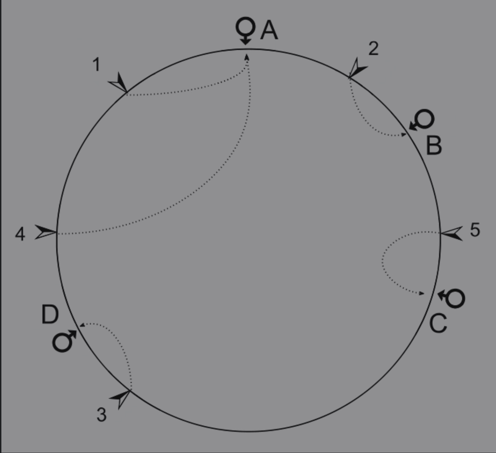

# 基础设施

## 微服务

* 分布式服务调用，使用服务注册发现方式进行RPC/GRPC服务调用

## 服务治理

* 对多个微服务进行治理，统一管理各个微服务。

## 监控报警系统

* Prometheus配合Grafana使用，通过Pushgateway、Prometheus即 AlertManager配置监控报警系统。

# 分布式数据库

## 概述

* OLTP 分布式数据库划分为 SQL 数据库（关系型）、NoSQL数据库（非关系型）、NewSQL 数据库三类。

## 分布式数据库技术

### ACID理论
* 原子性：其强调事务的整体性和不可分割性，系统不会处于一个不可预测的中间状态。对于事务中包含的多个操作，系统在执行过程中要么完成全部操作并进行提交，要么全部操作都失败后，系统回滚到上一个一致性状态。
*  一致性：在事务的发起、运行和结束的全流程中，数据库的完整性约束没有被破坏，因为数据库状态更迭的基本单位是事务。
* 隔离性：其主要用于数据库事务的并发控制，系统需要保证多个并发执行的事务不会相互影响，从而防止数据不一致现象的发生。从具体实践来看，事务隔离又可以分为未提交读（Read-Uncommitted）、提交读（Read-Committed）、可重复读（Repeatable-Read）和串行化（Serializable）这四个级别，每个级别所蕴含的物理意义各不相同。
* 持久性：事务的成功提交意味着当前事务生命周期的结束，事务所做的任何修改都会被持久化地存储在数据库当中，即使系统遭遇故障，这些数据更新也不应丢失。

### 数据分片策略

**需要考虑一下一些因素来决定数据分片的策略**

* 数据分布的均匀程度。
* 元数据管理的复杂程度（有无状态）。
* 路由规则的复杂程度（计算开销）。
* 弹性伸缩的灵活度（当数据规模和访问负载变更时）。
* 数据的迁移成本（当物理节点的可用性和数量变更时）。

#### 哈希取模分片策略

* 哈希取模分片是通过对数据的某个特征进行哈希值计算来建立与节点的映射关系的，根据节点数量和哈希算法做出节点数和哈希的映射。

#### 一致性哈希分片策略

* 比较完美地解决了哈希取模分片策略中由于节点变更所导致的数据大量迁移的问题，一致性哈希通过对物理节点和数据按照同样的方式进行散列，从而把它们较为均匀地分布到同一个哈希环上。经过散列之后，环上的数据可以被离它最近的下游物理节点所管理，任何物理节点的变更都只影响相邻的数据分片，而其他数据分片和物理节点的映射关系可以保持不变。
* 举例来说，如果图5-3中的节点 C 发生故障，那么 5号数据分片将被节点 D 所管理，其他数据分片均保持不变。值得说明的是，对于有状态的系统，该映射关系的变更需要配合物理数据的迁移来同步进行。此外，系统需要有多个数据副本来提升自身的可用性。

* 一致性哈希分片虽然较好地解决了大规模数据迁移的问题，但是它在负载均衡上并不完美，因为只有相邻的物理节点才能分担数据存储和访问流量的压力。在实际工程实践中，系统可以通过引入虚拟节点的方式来解决负载均衡的问题。

#### 连续区域分片策略（range分片）

* 在键顺序上具有相邻关系的数据会被分配到同一个物理节点上。当有数据增删操作发生时，该策略会进行分片分裂和分片合并等操作，从而使系统恢复到负载均衡的状态。当系统再次达到负载均衡的状态后，新的映射关系等元数据也会被持久化地存储作为请求路由的依据。该策略虽然在应对数据负载变更时显得比较复杂，但是在应对物理节点变更时却有着较大的优势，因为系统只需要重新迁移一小部分的数据分片。

### 数据复制策略

#### 异步复制

* 在数据异步复制策略下，写请求落盘到主节点后会立即返回，随后的数据复制操作通常借助日志回放机制来异步更新到其他数据副本上

#### 同步复制

* 数据同步复制指的是写请求需要等待所有的节点完成数据落盘后才会被应答，而无论数据复制操作是由客户端发起的还是由主节点发起的。同步复制可以有效地避免数据不一致的问题，但是它也会增大请求的响应延迟，特别是在副本数目较多且副本间的物理距离较远的情况下，延迟现象是比较明显的。

### Gossip协议

* Gossip 协议也叫流言协议，它基于去中心化的点对点消息传递机制，通常用于故障探测、成员组网和数据复制等场合。
* 该协议的运转流程从某些种子节点开始，它们随机选择一些周围节点进行消息的散播，接收到消息的节点会继续重复该过程直至消息全网扩散。可见，该协议具有和主从类型的协议完全不同的特性。由于Gossip 协议的整个运行过程需要一段时间才能收敛，而且它至多只能保证消息的最终一致性，因此系统设计人员需要充分考虑该协议的适用场合

#### 特点

##### 好处

* 简单：该协议在理论和工程实践上都较为简单，易于理解和运维。
* 可扩展性：集群可以支持几乎任意形式的扩缩容操作。
* 去中心化：在该协议里，所有节点都是对等的，因此系统具有天然的去中心化特性。
* 健壮性：任意数量的节点故障都不会影响消息的传播。

##### 缺陷

* 消息延迟：消息的全网扩散需要经历多个轮次，这样的传播方式会带来不可避免的消息延迟现象，因此它不适合对实时性有较高要求的场景。
* 消息冗余：在消息传播路径上不相邻的节点之间无法进行直接通信，因此系统不可避免地存在消息重复发送的情况。
*  弱一致性：最终一致性是该协议能够达到的最好结果，但是在极端情况下这一点也是不能保证的。

### 分布式一致性协议

