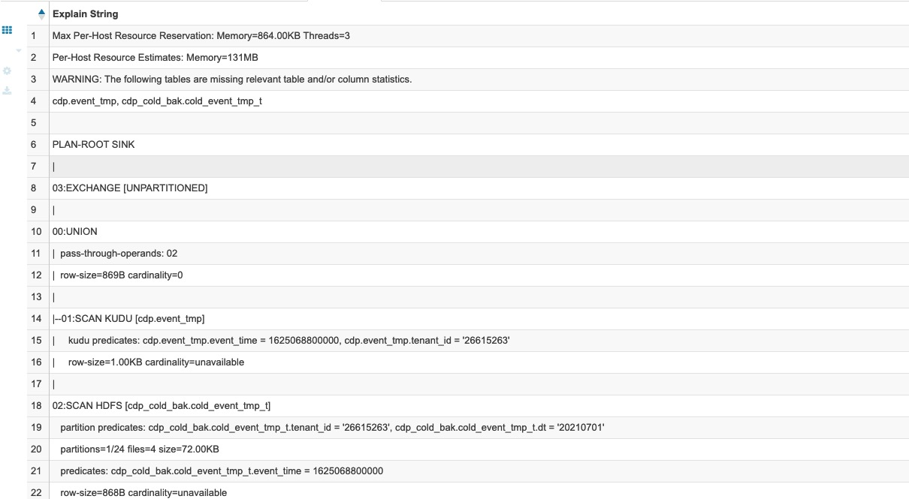

# 概览

## 核心逻辑

* 动态获取当月第一天年月日(yyyy-MM-dd)和上个月月第一天年月日(yyyy-MM-dd)，根据时间范围去kudu拉取数据，将数据根据**特定时间分区**按照动态分区方式写入hive中。
* 数据导入hive后根据**时间分区范围**统计hive写入数据个数，对比kudu该时间范围内个数和导入hive个数是否一致，不一致则冷备失败。
* 如果数据导入成功，则会向Kudu表向后添加一个新分区，并且删除当前时间范围的分区，两步操作是一致性操作，要么都成功，要么都失败。

## 核心流程图


## 核心代码

```scala
 /**
   * 统一处理冷备数据
   * @param coldTableName 冷备表名
   * @param rangeKey      冷备range分区key
   * @param startDate     range分区key起始值
   * @param endDate       range分区key终止值
   */
  override def handleColdBak(coldTableName: String, rangeKey: String, startDate: String, endDate: String): Unit = {
    super.handleColdBak(coldTableName, rangeKey, startDate, endDate)
    val kuduTmpView: String = s"ods_kudu_${coldTableName}_v"
    val coldJobSqlKey: String = s"cold_${coldTableName}_job"
    val coldDdlSqlKey: String = s"cold_${coldTableName}_ddl"
    val hiveTableName = s"""cold_${coldTableName}_t"""
    initColdHiveTable(coldDdlSqlKey, hiveTableName)
    kuduRepository.read(coldTableName).where($"deleted" equalTo Constants.NOT_DELETED)
      .createOrReplaceTempView(kuduTmpView)
    var coldJobSql: String = LoadConfigUtils.getConfig(coldJobSqlKey)
    if (StringUtils.isEmpty(startDate) || StringUtils.isEmpty(endDate)) {
      throw new RuntimeException("分区key开始日期或结束日期不能为空!")
    }
    val startTs: String = DateUtils.getTimestamp(startDate)
    val endTs: String = DateUtils.getTimestamp(endDate)
    coldJobSql = buildDateFilterSql(coldJobSql, startTs, "%startTs")
    coldJobSql = buildDateFilterSql(coldJobSql, endTs, "%endTs")

    val coldData: DataFrame = spark.sql(coldJobSql)

    val coldDataCount: Long = coldData.count()
    coldData.cache()
    val sinkDatabaseTableName: String = s"${Constants.COLD_BAK_DATABASE_NAME}.$hiveTableName"
    LOG.info(s"insert cold data to hiveTable:$sinkDatabaseTableName")
    hiveRepository.insert(coldData, SaveMode.Overwrite, sinkDatabaseTableName)

    val startTsLong: Long = startTs.toLong / 1000
    val endTsLong: Long = endTs.toLong / 1000
    val hiveColdDataCount: Long = hiveRepository.read(sinkDatabaseTableName)
      .where($"dt" >= from_unixtime(lit(startTsLong), "yyyyMMdd"))
      .where($"dt" < from_unixtime(lit(endTsLong), "yyyyMMdd")).count()
    if (coldDataCount != hiveColdDataCount) {
      throw new RuntimeException(String.format("hive备份数据不等于kudu冷备数据，请重新执行当月冷备数据，startDate:%s endDate:%s", startDate,
        endDate))
    }
    LOG.info(s"startDate:${startDate} endDate:${endDate}备份数据:${coldDataCount}")
    coldData.unpersist()
    // 添加分区
    val lastRangeKeyTs: Long = kuduUtils.getLastRangePartition(coldTableName, rangeKey)
    val nextMonthRangeKeyTs: String = DateUtils.getTimestampPlusMonth(lastRangeKeyTs, 1)
    try {
      val isAddPartition: Boolean = kuduUtils.alterRangePartition(isAdd = true, coldTableName, rangeKey,
        lastRangeKeyTs + "", nextMonthRangeKeyTs)
      if (!isAddPartition) {
        throw new RuntimeException("kudu热备数据分区删除异常!")
      }
      // 删除range分区
      val isDeletePartition: Boolean = kuduUtils.alterRangePartition(isAdd = false, coldTableName, rangeKey, startTs,
        endTs)
      if (!isDeletePartition) {
        throw new RuntimeException("kudu冷备数据分区删除异常!")
      }
    } catch {
      case e: Exception =>
        LOG.error("操作分区:lower:{} upper:{}异常,e", lastRangeKeyTs, nextMonthRangeKeyTs, e)
    }
  }

  /**
   * 构建日期过滤sql
   *
   * @param sql  原始sql
   * @param ts   日期毫秒
   * @param rule 规则
   * @return
   */
  private def buildDateFilterSql(sql: String, ts: String, rule: String): String = {
    sql.replace(rule, ts)
  }

  /**
   * 初始化冷备hive表
   *
   * @param coldDdlSqlKey 冷备sql配置key
   * @param hiveTableName 冷备hive表名
   */
  private def initColdHiveTable(coldDdlSqlKey: String, hiveTableName: String): Unit = {
    val coldDdlSql: String = LoadConfigUtils.getConfig(coldDdlSqlKey)
    LOG.info(s"create table ${hiveTableName}")
    hiveRepository.createTableIfAbsent(Constants.COLD_BAK_DATABASE_NAME, hiveTableName, coldDdlSql)
  }
```

# 冷热视图

## 视图创建

```sql
create view ods_event_tmp_v as
    select id,
           tenant_id,
           event_id,
           event_time,
           id,
           create_time,
           update_time,
           attr1,
           attr2,
           attr3,
           attr4,
           attr5,
           attr6,
           attr7,
           attr8,
           attr9,
           attr10,
           attr11,
           attr12,
           attr13,
           attr14,
           attr15,
           attr16,
           attr17,
           attr18,
           attr19,
           attr20,
           attr21,
           attr22,
           attr23,
           attr24,
           attr25,
           attr26,
           attr27,
           attr28,
           attr29,
           attr30,
           attr31,
           attr32,
           attr33,
           attr34,
           attr35,
           attr36,
           attr37,
           attr38,
           attr39,
           attr40,
           attr41,
           attr42,
           attr43,
           attr44,
           attr45,
           attr46,
           attr47,
           attr48,
           attr49,
           attr50,
           attr51,
           attr52,
           attr53,
           attr54,
           attr55,
           attr56,
           attr57,
           attr58,
           attr59,
           attr60,
           attr61,
           attr62,
           attr63,
           attr64,
           attr65,
           attr66,
           attr67,
           attr68,
           attr69,
           attr70,
           attr71,
           attr72,
           attr73,
           attr74,
           attr75,
           attr76,
           attr77,
           attr78,
           attr79,
           attr80,
           attr81,
           attr82,
           attr83,
           attr84,
           attr85,
           attr86,
           attr87,
           attr88,
           attr89,
           attr90,
           attr91,
           attr92,
           attr93,
           attr94,
           attr95,
           attr96,
           attr97,
           attr98,
           attr99,
           attr100,
           deleted,
           delete_time,
           -- impala存在时区问题，使用该函数指定对应时区
           FROM_TIMESTAMP(from_utc_timestamp(from_unixtime(CAST(event_time / 1000 AS BIGINT)), 'Asia/Shanghai'),'yyyyMMdd') as dt
    from cdp.event_tmp
    union all
    select id,
           tenant_id,
           event_id,
           event_time,
           id,
           create_time,
           update_time,
           attr1,
           attr2,
           attr3,
           attr4,
           attr5,
           attr6,
           attr7,
           attr8,
           attr9,
           attr10,
           attr11,
           attr12,
           attr13,
           attr14,
           attr15,
           attr16,
           attr17,
           attr18,
           attr19,
           attr20,
           attr21,
           attr22,
           attr23,
           attr24,
           attr25,
           attr26,
           attr27,
           attr28,
           attr29,
           attr30,
           attr31,
           attr32,
           attr33,
           attr34,
           attr35,
           attr36,
           attr37,
           attr38,
           attr39,
           attr40,
           attr41,
           attr42,
           attr43,
           attr44,
           attr45,
           attr46,
           attr47,
           attr48,
           attr49,
           attr50,
           attr51,
           attr52,
           attr53,
           attr54,
           attr55,
           attr56,
           attr57,
           attr58,
           attr59,
           attr60,
           attr61,
           attr62,
           attr63,
           attr64,
           attr65,
           attr66,
           attr67,
           attr68,
           attr69,
           attr70,
           attr71,
           attr72,
           attr73,
           attr74,
           attr75,
           attr76,
           attr77,
           attr78,
           attr79,
           attr80,
           attr81,
           attr82,
           attr83,
           attr84,
           attr85,
           attr86,
           attr87,
           attr88,
           attr89,
           attr90,
           attr91,
           attr92,
           attr93,
           attr94,
           attr95,
           attr96,
           attr97,
           attr98,
           attr99,
           attr100,
           deleted,
           delete_time,
           dt
    from cdp_cold_bak.cold_event_tmp_t;
```

## 执行计划分析

```sql
explain SELECT * FROM ods_event_tmp_v where tenant_id='26615263' and  dt='20210701'
```



