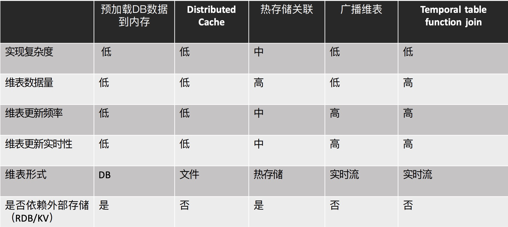

# 概述

## 建设目的

**解决由于传统数据仓库数据时效性低解决不了的问题**

* 面向主题的、可集成、相对稳定的数据仓库
* 处理上一次批处理流程到当前的数据，增量数据处理
* Flink 的流批一体 SQL 能够实现计算层全量增量开发一体化的体验，但无法解决存储层割裂的问题。流式存储中的数据很难对其进行查询分析，而批式存储中数据的时效性又比较差。因此，我们认为下一阶段 Flink 社区新的机会点就在于继续提升一体化体验，通过流批一体 SQL + 流批一体存储构建一体化体验的流式数仓。

## 实时数仓架构

### Lambda架构


### Kappa架构


### 实时OLAP架构


# 流式Join

## 维表join

### 将维度表加载到内存关联

#### 方案1 内存Cache

```java
				StreamExecutionEnvironment env = FlinkEnvUtils.getStreamEnv();
        DataStreamSource<Integer> primaryKeySource = env.fromElements(1, 2, 3, 4);
        primaryKeySource.map(new RichMapFunction<Integer, String>() {
            private final Map<Integer, String> localCache = Maps.newHashMap();

            @Override
            public void open(Configuration parameters) throws Exception {
                super.open(parameters);
                // 加载维度表数据
                localCache.put(1, "spark");
                localCache.put(2, "flink");
                localCache.put(3, "hadoop");
                localCache.put(4, "hudi");
            }

            @Override
            public String map(Integer key) throws Exception {
              	// 根据key关联维度表数据
                String name = localCache.getOrDefault(key, "NA");
                return key + ":" + name;
            }
        }).print("data:");
        env.execute();
```

* 通过flink的RichFlatMapFunction的`open`方法，一次性将维度表的数据全部加载到内存中，后续在每条流的消息去内存中关联。
* 优点是实现简单，但是仅支持小数据量维度表，更新维度表需要重启任务
* **适用于维度表小、变更频率低、对变更及时性要求低。**

#### 方案2 Distributed Cache

```java
        StreamExecutionEnvironment env = FlinkEnvUtils.getStreamEnv();
        // 注册分布式cache文件
        env.registerCachedFile("/Users/huangshimin/Documents/study/flink-learn/flink-1.13-study/data/users.csv",
                "users");
        env.fromElements(1, 2, 3)
                .map(new RichMapFunction<Integer, String>() {
                    private final Map<Integer, String> distributedCacheMap = Maps.newHashMap();

                    @Override
                    public void open(Configuration parameters) throws Exception {
                        // 解析加载distributedCache文件
                        super.open(parameters);
                        DistributedCache distributedCache = getRuntimeContext().getDistributedCache();
                        File userFile = distributedCache.getFile("users");
                        CSVFormat csvFormat = CSVFormat.DEFAULT.withRecordSeparator(",");
                        FileReader fileReader = new FileReader(userFile);
                        //创建CSVParser对象
                        CSVParser parser = new CSVParser(fileReader, csvFormat);
                        List<CSVRecord> records = parser.getRecords();
                        for (CSVRecord record : records) {
                            // 放入内存cache中
                            distributedCacheMap.put(Integer.parseInt(record.get(0)), record.get(1));
                        }
                    }

                    @Override
                    public String map(Integer key) throws Exception {
                        String name = distributedCacheMap.getOrDefault(key, "NA");
                        return key + ":" + name;
                    }
                }).print("data");
        env.execute();
```

* 通过Distributed Cache分发本地维度表文件到task manager后加载到内存关联
* 使用env.registerCachedFile注册文件
* 实现RichFuntion在open方法中通过RuntimeContext获取cache文件，解析和使用文件数据
* **适用于维度表小、变更频率低、对变更及时性要求低。**

#### 方案3 热缓存(Redis等)

```java
        StreamExecutionEnvironment env = FlinkEnvUtils.getStreamEnv();
        DataStreamSource<Integer> source = env.fromElements(1, 2, 3);
        source.map(new RichMapFunction<Integer, String>() {
            private Jedis jedis;
            @Override
            public void open(Configuration parameters) throws Exception {
                super.open(parameters);
                String host = parameters.getString(ConfigOptions.key("redis.host")
                        .stringType().noDefaultValue());
                int port = parameters.getInteger(ConfigOptions.key("redis.port")
                        .intType().noDefaultValue());
                String password = parameters.getString(ConfigOptions.key("redis.password")
                        .stringType().noDefaultValue());
                GenericObjectPoolConfig genericObjectPoolConfig = new GenericObjectPoolConfig();
                JedisPool jedisPool = new JedisPool(genericObjectPoolConfig, host, port, 1000, password);
                jedis = jedisPool.getResource();
            }

            @Override
            public String map(Integer key) throws Exception {
              // 流量小时这里可以拉取redis，流量大时可以配合ttl local cache缓解大量流量打到redis中
                String name = new String(jedis.get(key.toString().getBytes(StandardCharsets.UTF_8)),
                        StandardCharsets.UTF_8);
                return key + ":" + name;
            }
        }).print("data");
        env.execute();
```

* 理论外部缓存来存储维度表，在将外部缓存维度表加载到内存中使用
* 维度更新反馈到结果有延迟，一般是外部维度表数据更新后，正常数据流无法及时感知。
* **适用维度表大、变更频繁中、对变更及时性要求中。**

#### 方案4 Lookup Join(开启cache)

**相关参数:**

| 参数 | 是否必填 | 默认值 | 类型 | 描述 |
| :--- | :------- | :----- | :--- | :--- |
| lookup.cache                             | 可选 | NONE   | 枚举类型可选值: NONE, PARTIAL | 维表的缓存策略。 目前支持 NONE（不缓存）和 PARTIAL（只在外部数据库中查找数据时缓存）。 |
| lookup.cache.max-rows                    | 可选 | (none) | Integer                       | 维表缓存的最大行数，若超过该值，则最老的行记录将会过期。 使用该配置时 "lookup.cache" 必须设置为 "PARTIAL”。 |
| lookup.partial-cache.expire-after-write  | 可选 | (none) | Duration                      | 在记录写入缓存后该记录的最大保留时间。 使用该配置时 "lookup.cache" 必须设置为 "PARTIAL”。 |
| lookup.partial-cache.expire-after-access | 可选 | (none) | Duration                      | 在缓存中的记录被访问后该记录的最大保留时间。 使用该配置时 "lookup.cache" 必须设置为 "PARTIAL”。 |
| lookup.partial-cache.caching-missing-key | 可选 | true   | Boolean                       | 是否缓存维表中不存在的键，默认为true。 使用该配置时 "lookup.cache" 必须设置为 "PARTIAL”。 |
| lookup.max-retries                       | 可选 | 3      | Integer                       | 查询数据库失败的最大重试时间。                               |

```sql
CREATE TEMPORARY TABLE Customers (
  id INT,
  name STRING,
  country STRING,
  zip STRING
) WITH (
  'connector' = 'jdbc',
  'url' = 'jdbc:mysql://mysqlhost:3306/customerdb',
  'table-name' = 'customers',
  -- 开始lookup cache
  'lookup.cache'='PARTIAL',
-- 只缓存1000行数据
  'lookup.cache.max-rows'=1000,
  -- 在记录写入缓存后该记录的最大保留时间 1天
  'lookup.partial-cache.expire-after-write'='1d'
);

SELECT o.order_id, o.total, c.country, c.zip
FROM Orders AS o
-- FOR SYSTEM_TIME AS OF o.proc_time表示只读取当前时间最新的数据
  JOIN Customers FOR SYSTEM_TIME AS OF o.proc_time AS c
    ON o.customer_id = c.id;
```

* 配合Flink的LookupFunction特性支持的lookup join，配合对应参数可以做到实时读取维度表数据。
* 通过配置`lookup.cache`和`lookup.cache.max-rows`来决定维度表数据拉取时效性。
* **适用于维度表数据量中等、变更频繁、对变更及时性要求高。**

### 广播维度表

```java
        StreamExecutionEnvironment env = FlinkEnvUtils.getStreamEnv();
        KafkaSource<String> primaryKeySource = KafkaSource.<String>builder()
                .setBootstrapServers("localhost:9091")
                .setClientIdPrefix("source")
                .setValueOnlyDeserializer(new SimpleStringSchema())
                .setTopics("source_topic")
                .setUnbounded(OffsetsInitializer.earliest())
                .setGroupId("source_group_id")
                .build();

        KafkaSource<String> dimSource = KafkaSource.<String>builder()
                .setBootstrapServers("localhost:9091")
                .setClientIdPrefix("broadcast")
                .setValueOnlyDeserializer(new SimpleStringSchema())
                .setTopics("broadcast_topic")
                .setUnbounded(OffsetsInitializer.earliest())
                .setGroupId("broadcast_group_id")
                .build();
        // 定义广播MapStateDescriptor
        MapStateDescriptor<Integer, String> mapStateDescriptor = new MapStateDescriptor<>("broadcastState",
                TypeInformation.of(Integer.class), TypeInformation.of(String.class));

        BroadcastStream<Tuple2<Integer, String>> broadcastSource = env.fromSource(dimSource,
                        WatermarkStrategy.forBoundedOutOfOrderness(Duration.ofSeconds(5)),
                        "broadcastSource")
                .map(new MapFunction<String, Tuple2<Integer, String>>() {
                    @Override
                    public Tuple2<Integer, String> map(String value) throws Exception {
                        String[] split = value.split(",");
                        return Tuple2.of(Integer.parseInt(split[0]), split[1]);
                    }
                }).name("map_func").uid("map_uid")
                .broadcast(mapStateDescriptor);
        // 获取dimJoinSource
        BroadcastConnectedStream<String, Tuple2<Integer, String>> dimJoinSource = env.fromSource(primaryKeySource,
                        WatermarkStrategy.forBoundedOutOfOrderness(Duration.ofSeconds(5)),
                        "primaryKeySource")
                .connect(broadcastSource);
        // process dim join
        dimJoinSource.process(new BroadcastProcessFunction<String, Tuple2<Integer, String>, String>() {
            @Override
            public void processElement(String key,
                                       BroadcastProcessFunction<String, Tuple2<Integer, String>, String>.ReadOnlyContext readOnlyContext,
                                       Collector<String> collector) throws Exception {
                ReadOnlyBroadcastState<Integer, String> broadcastState =
                        readOnlyContext.getBroadcastState(mapStateDescriptor);
                // 从广播状态中根据key查询对应dim数据
                String value = broadcastState.get(Integer.parseInt(key));
                // 输出结果
                if (StringUtils.isNotEmpty(value)) {
                    collector.collect(key + ":" + value);
                }
            }

            @Override
            public void processBroadcastElement(Tuple2<Integer, String> dimSource,
                                                BroadcastProcessFunction<String, Tuple2<Integer, String>, String>.Context context,
                                                Collector<String> collector) throws Exception {
                // 将广播流数据放入广播状态中
                BroadcastState<Integer, String> broadcastState = context.getBroadcastState(mapStateDescriptor);
                broadcastState.put(dimSource.f0, dimSource.f1);
            }
        }).print("data");
        env.execute();
```

* 实现方式
  * 将维度表数据发送到kafka作为广播原始流dimSource
  * 定义状态描述符MapStateDescripitor。调用dimSource.broadcast，获取broadCastStream broadcastSource
  * 调用非广播流primaryKeySource.connect(broadcastSource)，得到BroadcastConnectedStream dimJoinSource
  * 在KeyedBroadcastProcessFunction/BroadcastProcessFunction实现关联处理逻辑，并作为参数调用dimJoinSource.process()
* **优点:维度变更可即时更新到结果**
* **缺点:数据保存在内存中，支持维度表数据量较小**
* **适用于实时感知维度变更，维度数据可以转换为实时流的场景**

### Temporal Table

```sql
SELECT
  SUM(amount * rate) AS amount
FROM
  orders,
  // 基于order_time的时间去查询rates表数据
  LATERAL TABLE (rates(order_time))
WHERE
  rates.currency = orders.currency
```

* 适用于changelog流，存储各个时态数据的变化，维流join时可以根据主表的时间去从表进行join


### 维度表join方案对比



- 基于对维度数据的数据量和更新频率和实时性来选择最合适的维度表join方案

## 双流Join

### Join-Regular join

```sql
# 双流join
SELECT * FROM Orders INNER JOIN Product ON Orders.productId=Product.id
```

* 仅支持有界流和等号连接，底层基于Flink的双流join，会将左表和右表的状态持续存储，配合Flink的`table.exec.state.ttl`控制左右表的状态存储时间。

### join-Interval join

* 限定join的时间窗口，对超出时间范围的数据清理，避免保留全量State，支持processing time和event time

```sql
SELECT *
FROM Orders o,
	Shipments s
WHERE
	o.id=s.orderId
	AND s.shiptime BETWEEN o.ordertime
	AND o.ordertime + INTERVAL '4' HOUR
```

### join-Window join

* 将两个流中有相同key和处在相同window的元素做join，这里支持滚动、滑动、会话窗口方式Join。


# 实时数仓问题解决

## 大State问题

* 可以在数据接入时通过`ROW_NUMBER`函数对数据流去重，然后再进行join。

```sql
-- 去重
create view view1
select *(
select *,row_number()over(partition by id order by proctime()desc) as rn from s1)
where rn =1;

create view view2
select *(
select *,row_number()over(partition by id order by proctime()desc) as rn from s2)
where rn =1;

insert into dwd_t
select view1.id,view2.name
view1 left outer join view2 on view1.id=view2.id
```

## 多流join优化

* 正常的Flink Regular Join存在大状态问题，为了防止Regular Join的左右表大状态问题，可以通过将多流通过union all合并，把数据错位拼接到一起，后面加一层Group By，相当于将Join关联转换成Group By

```sql
-- 基于flink regular join
select a.id as aid, a.name, b.id as bid, b.age
from a
         left join b on a.id = b.id;

-- 通过union all方式regular join大state问题
select aid, name, bid, age
from (select id as aid, name, '' as bid, '' as age
      from a
      union all
      select '' as aid, '' as name, id as bid, age
      from b)
where aid != ''
group by aid, name, bid, age;
```

## 回溯历史数据

* 采用批流混合的方式来完成状态复用，基于Flink流处理来处理实时消息流，基于Flink的批处理完成离线计算，通过两者的融合，在同一个任务里完成历史所有数据的计算。
* 将实时的流和存储在olap系统中的离线数据进行union all，完成消息的回溯

# 总结&QA

Flink作为近几年来比较流行的实时计算引擎，业界各个大厂也基于Flink做了关于实时数仓的各种探索，因此如果是基于Flink来构建企业级实时数仓也会有大量可背书的生产Case，这也使得Flink是目前实时数仓建设的第一技术选型。本文主要从各个实时数仓架构&多流Join&维流Join等方面介绍了实时建设的几个核心问题，希望大家可以从这些Case中了解到实时数仓建设的方法。